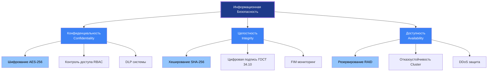
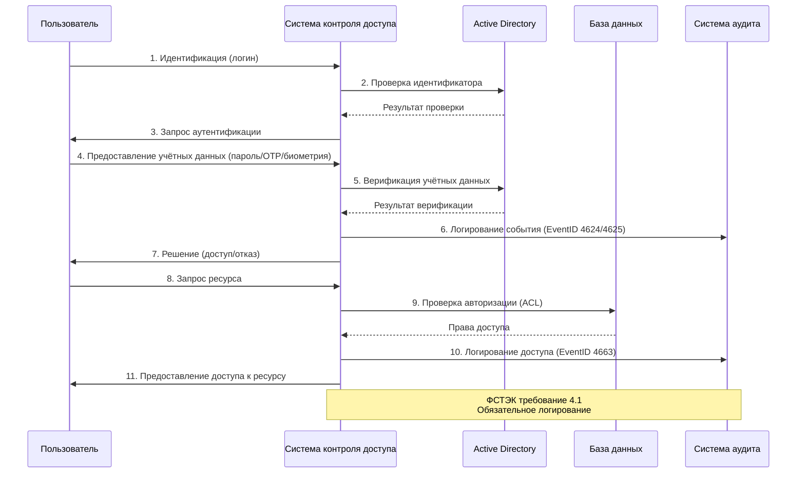

# 1. Основные определения (согласно ГОСТ и ISO)

| Термин                          | Определение                                                                                  | Нормативный документ                     | Примечание                       |
| ------------------------------- | -------------------------------------------------------------------------------------------- | ---------------------------------------- | -------------------------------- |
| **Информация**                  | Сведения (сообщения, данные) независимо от формы представления                               | ГОСТ 7.0-99, ISO 5127:2017               | Базовое понятие ИБ               |
| **Безопасность информации**     | Состояние защищённости, при котором обеспечены конфиденциальность, целостность и доступность | ISO/IEC 27001, ГОСТ Р ИСО/МЭК 27001-2021 | CIA-триада                       |
| **Информационная безопасность** | Комплекс организационно-технических мероприятий, обеспечивающих защиту информации            | 149-ФЗ «Об информации»                   | Системный подход                 |
| **Угроза безопасности**         | Совокупность условий и факторов, создающих опасность нарушения безопасности                  | ГОСТ Р 53114-2008                        | Источники: внешние/внутренние    |
| **Уязвимость**                  | Свойство системы, обусловливающее возможность реализации угроз                               | ISO/IEC 27005                            | CVE, CWE каталоги                |
| **Риск**                        | Сочетание вероятности нанесения ущерба и тяжести этого ущерба                                | ISO/IEC 27005, ГОСТ Р ИСО/МЭК 27005-2021 | Риск = Вероятность × Воздействие |
| **Инцидент ИБ**                 | Событие, которое может привести к нарушению безопасности информации                          | ГОСТ Р ИСО/МЭК 27001-2021                | Требует реагирования             |
| **Персональные данные**         | Любая информация, относящаяся к прямо или косвенно определённому физическому лицу            | 152-ФЗ ст. 3                             | Особый режим защиты              |

# 2. CIA-триада (базовые свойства информации)



## 2.1. Практическое применение CIA-триады (реальные кейсы)

| Свойство | Реальный кейс | Технические детали | Последствия | Меры защиты |
|----------|---------------|-------------------|-------------|-------------|
| **Конфиденциальность** | Equifax (2017) | CVE-2017-5632, Apache Struts, 147 млн записей | Штраф $700 млн, репутационный ущерб | Шифрование данных, WAF, регулярное обновление |
| **Целостность** | NotPetya (2017) | M.E.Doc обновление, EternalBlue, шифрование MFT | Ущерб > $10 млрд, Maersk $300 млн | Резервные копии 3-2-1, FIM, цифровая подпись |
| **Доступность** | GitHub DDoS (2018) | Memcached amplification, 1.35 Tbps, 8 минут | Простой сервиса, потеря доверия | Scrubbing centers, rate limiting, Anycast |
| **Конфиденциальность** | Yahoo (2014) | SQL injection, 500 млн учёток, MD5 хеши | Скидка $350 млн при продаже Verizon | MFA, хеширование Argon2, мониторинг утечек |
| **Целостность** | SolarWinds (2020) | Supply chain, Sunburst backdoor, 18000 организаций | Компрометация правительственных сетей | SBOM, проверка подписей, изоляция обновлений |

# 3. Процессы контроля доступа (по ФСТЭК)



## 3.1. Практическая реализация (PowerShell + ФСТЭК)

```powershell
#==============================================================================
# АУДИТ ПОЛИТИК ПАРОЛЕЙ В ACTIVE DIRECTORY (СОГЛАСНО ФСТЭК №21)
# Требования: Минимальная длина ≥8, История ≥5, Срок действия ≤90 дней
#==============================================================================

function Get-FSTECPasswordPolicy {
    [CmdletBinding()]
    param()
    
    Write-Host "=== АУДИТ ПОЛИТИК ПАРОЛЕЙ (ФСТЭК №21) ===" -ForegroundColor Cyan
    Write-Host "Дата проверки: $(Get-Date -Format 'dd.MM.yyyy HH:mm')" -ForegroundColor Gray
    Write-Host ""
    
    # Получение политик паролей домена
    $policy = Get-ADDefaultDomainPasswordPolicy
    
    # Проверка минимальной длины пароля (Требование ФСТЭК: ≥8 символов)
    Write-Host "[1/6] Минимальная длина пароля:" -ForegroundColor Yellow
    if ($policy.MinPasswordLength -ge 8) {
        Write-Host "  ✅ PASS: $($policy.MinPasswordLength) символов (требование: ≥8)" -ForegroundColor Green
    } else {
        Write-Host "  ❌ FAIL: $($policy.MinPasswordLength) символов (требование: ≥8)" -ForegroundColor Red
    }
    
    # Проверка истории паролей (Требование ФСТЭК: ≥5)
    Write-Host "[2/6] История паролей:" -ForegroundColor Yellow
    if ($policy.PasswordHistoryCount -ge 5) {
        Write-Host "  ✅ PASS: $($policy.PasswordHistoryCount) паролей (требование: ≥5)" -ForegroundColor Green
    } else {
        Write-Host "  ❌ FAIL: $($policy.PasswordHistoryCount) паролей (требование: ≥5)" -ForegroundColor Red
    }
    
    # Проверка максимального срока действия (Требование ФСТЭК: ≤90 дней)
    Write-Host "[3/6] Максимальный срок действия пароля:" -ForegroundColor Yellow
    $maxAgeDays = $policy.MaxPasswordAge.Days
    if ($maxAgeDays -le 90 -and $maxAgeDays -gt 0) {
        Write-Host "  ✅ PASS: $maxAgeDays дней (требование: ≤90)" -ForegroundColor Green
    } else {
        Write-Host "  ❌ FAIL: $maxAgeDays дней (требование: ≤90)" -ForegroundColor Red
    }
    
    # Проверка сложности пароля
    Write-Host "[4/6] Требование сложности пароля:" -ForegroundColor Yellow
    if ($policy.ComplexityEnabled) {
        Write-Host "  ✅ PASS: Сложность включена" -ForegroundColor Green
    } else {
        Write-Host "  ❌ FAIL: Сложность выключена" -ForegroundColor Red
    }
    
    # Проверка блокировки учётной записи
    Write-Host "[5/6] Порог блокировки учётной записи:" -ForegroundColor Yellow
    if ($policy.LockoutThreshold -ge 5 -and $policy.LockoutThreshold -le 10) {
        Write-Host "  ✅ PASS: $($policy.LockoutThreshold) попыток (рекомендация: 5-10)" -ForegroundColor Green
    } else {
        Write-Host "  ⚠️  WARNING: $($policy.LockoutThreshold) попыток (рекомендация: 5-10)" -ForegroundColor Yellow
    }
    
    # Проверка обратимого шифрования (должно быть отключено)
    Write-Host "[6/6] Обратимое шифрование паролей:" -ForegroundColor Yellow
    $reversible = Get-ADDomain | Select-Object -ExpandProperty DomainControllers | 
        Get-ADObject -Filter {ReversiblePasswordEncryptionEnabled -eq $true}
    if ($reversible) {
        Write-Host "  ❌ FAIL: Обратимое шифрование включено (КРИТИЧНО!)" -ForegroundColor Red
    } else {
        Write-Host "  ✅ PASS: Обратимое шифрование отключено" -ForegroundColor Green
    }
    
    Write-Host ""
    Write-Host "=== ОТЧЁТ СОХРАНЁН: $(Get-Date -Format 'yyyyMMdd_HHmmss')_PasswordAudit.txt ===" -ForegroundColor Cyan
}

# Поиск пользователей с нарушенными политиками
function Get-NonCompliantUsers {
    Write-Host "=== ПОИСК ПОЛЬЗОВАТЕЛЕЙ С НАРУШЕННЫМИ ПОЛИТИКАМИ ===" -ForegroundColor Cyan
    
    # Пользователи с паролями, которые не истекают
    Write-Host "`n[1] Пользователи с неменяемыми паролями:" -ForegroundColor Yellow
    Get-ADUser -Filter "PasswordNeverExpires -eq '$true'" -Properties PasswordNeverExpires | 
        Select-Object Name, Enabled, DistinguishedName | 
        Format-Table -AutoSize
    
    # Пользователи с пустыми паролями
    Write-Host "`n[2] Пользователи с пустыми паролями:" -ForegroundColor Yellow
    Search-ADAccount -PasswordNotRequired | 
        Select-Object Name, DistinguishedName | 
        Format-Table -AutoSize
    
    # Неактивные пользователи (>90 дней)
    Write-Host "`n[3] Неактивные пользователи (>90 дней):" -ForegroundColor Yellow
    Search-ADAccount -AccountInactive -TimeSpan 90.00:00:00 | 
        Select-Object Name, LastLogonDate, DistinguishedName | 
        Format-Table -AutoSize
}

# Выполнение аудита
Get-FSTECPasswordPolicy
Get-NonCompliantUsers
```

# 4. Вредоносные программы (классификация по ФСТЭК)

| Тип                    | Определение                                        | Пример                             | Технические индикаторы                       | Меры защиты                                            |
| ---------------------- | -------------------------------------------------- | ---------------------------------- | -------------------------------------------- | ------------------------------------------------------ |
| **Компьютерный вирус** | Программа, создающая копии и внедряющая их в файлы | ILOVEYOU (2000), Melissa           | Изменение файлов, автозапуск                 | Антивирус, контроль исполняемых файлов, AppLocker      |
| **Троян**              | Программа, маскирующаяся под легитимную            | Citadel (Target 2013), Emotet      | Скрытые процессы, C2-коммуникация            | EDR, песочница, мониторинг сети                        |
| **Ransomware**         | Программа, шифрующая данные для выкупа             | NotPetya (2017), WannaCry, LockBit | Шифрование файлов, требование выкупа         | Резервные копии 3-2-1, сегментация, FIM                |
| **Spyware**            | Программа для сбора конфиденциальной информации    | Keylogger, RedShell                | Кейлоггинг, скриншоты, микрофон              | DLP, мониторинг процессов, UEBA                        |
| **Rootkit**            | Программа, скрывающая своё присутствие             | Flame (2012), TDL4                 | Скрытие процессов, hooks ядра                | Целостность ядра, FIM, загрузка с доверенного носителя |
| **Worm**               | Самовоспроизводящаяся программа                    | Conficker, SQL Slammer             | Сетевое распространение, сканирование портов | Сегментация сети, патч-менеджмент                      |
| **Botnet**             | Сеть заражённых устройств                          | Mirai, Zeus                        | DDoS, спам, C2-коммуникация                  | IDS/IPS, мониторинг трафика, изоляция                  |

## 4.1. Практическое обнаружение вредоносных программ

```powershell
#==============================================================================
# ОБНАРУЖЕНИЕ ПРИЗНАКОВ ВРЕДОНОСНОЙ АКТИВНОСТИ (ФСТЭК ТРЕБОВАНИЕ 6.2)
#==============================================================================

function Get-MalwareIndicators {
    [CmdletBinding()]
    param()
    
    Write-Host "=== ПРОВЕРКА НА ПРИЗНАКИ ВРЕДОНОСНОЙ АКТИВНОСТИ ===" -ForegroundColor Cyan
    Write-Host "Дата: $(Get-Date -Format 'dd.MM.yyyy HH:mm')" -ForegroundColor Gray
    Write-Host ""
    
    # 1. Подозрительные процессы с высоким потреблением ресурсов
    Write-Host "[1/7] Подозрительные процессы (CPU >90% или Memory >500MB):" -ForegroundColor Yellow
    Get-Process | Where-Object {
        $_.CPU -gt 90 -or $_.WorkingSet -gt 500MB
    } | Select-Object Name, Id, CPU, @{Name='Memory(MB)';Expression={[math]::Round($_.WorkingSet/1MB,2)}} | 
        Format-Table -AutoSize
    
    # 2. Автозагрузка (признак персистентности)
    Write-Host "`n[2/7] Программы в автозагрузке:" -ForegroundColor Yellow
    Get-ItemProperty HKLM:\Software\Microsoft\Windows\CurrentVersion\Run | 
        Select-Object -ExpandProperty PSObject.Properties | 
        Where-Object {$_.Name -notlike 'PS*'} |
        Select-Object Name, Value | Format-Table -AutoSize
    
    Get-ItemProperty HKCU:\Software\Microsoft\Windows\CurrentVersion\Run | 
        Select-Object -ExpandProperty PSObject.Properties | 
        Where-Object {$_.Name -notlike 'PS*'} |
        Select-Object Name, Value | Format-Table -AutoSize
    
    # 3. Подозрительные сетевые подключения
    Write-Host "`n[3/7] Активные сетевые подключения (ESTABLISHED):" -ForegroundColor Yellow
    Get-NetTCPConnection | Where-Object {$_.State -eq 'Established'} | 
        Select-Object LocalAddress, LocalPort, RemoteAddress, RemotePort, State, OwningProcess | 
        Format-Table -AutoSize
    
    # 4. Подозрительные службы
    Write-Host "`n[4/7] Службы с подозрительными путями:" -ForegroundColor Yellow
    Get-Service | Where-Object {
        $_.PathName -like '*temp*' -or 
        $_.PathName -like '*appdata*' -or 
        $_.PathName -like '*users*'
    } | Select-Object Name, DisplayName, StartType, Status | Format-Table -AutoSize
    
    # 5. Подозрительные задания планировщика
    Write-Host "`n[5/7] Задания планировщика с PowerShell:" -ForegroundColor Yellow
    Get-ScheduledTask | Where-Object {
        $_.Actions.Execute -like '*powershell*' -or 
        $_.Actions.Execute -like '*cmd*'
    } | Select-Object TaskName, State, TaskPath | Format-Table -AutoSize
    
    # 6. Проверка хэшей критических файлов
    Write-Host "`n[6/7] Проверка целостности системных файлов:" -ForegroundColor Yellow
    $systemFiles = @(
        "C:\Windows\System32\cmd.exe",
        "C:\Windows\System32\powershell.exe",
        "C:\Windows\System32\svchost.exe"
    )
    
    foreach ($file in $systemFiles) {
        if (Test-Path $file) {
            $hash = Get-FileHash $file -Algorithm SHA256
            Write-Host "  $file : $($hash.Hash.Substring(0,16))..." -ForegroundColor Gray
        }
    }
    
    # 7. Проверка привилегированных групп
    Write-Host "`n[7/7] Члены группы Domain Admins:" -ForegroundColor Yellow
    Get-ADGroupMember "Domain Admins" -ErrorAction SilentlyContinue | 
        Select-Object Name, ObjectClass, DistinguishedName | 
        Format-Table -AutoSize
    
    Write-Host ""
    Write-Host "=== ПРОВЕРКА ЗАВЕРШЕНА ===" -ForegroundColor Green
}

Get-MalwareIndicators
```
## Список литературы 
1. Малюк А.А. — _Информационная безопасность: концептуальные и методологические основы защиты информации_. — М.: Горячая линия-Телеком.
2. Шаньгин В.Ф. — _Информационная безопасность компьютерных систем и сетей_. — М.: ФОРУМ.
3. Домарев В.В. — _Безопасность информационных технологий_. — М.: Диалог-МИФИ.
4. ГОСТ Р 50922-2006 — Защита информации. Основные термины и определения.
5. ГОСТ Р ИСО/МЭК 27000-2012 — Системы менеджмента информационной безопасности. Общий обзор.