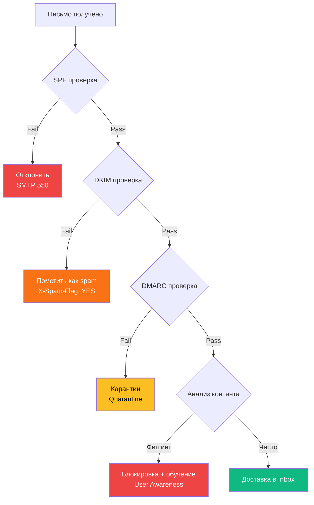

# 1. Классификация атак (по ФСТЭК России)

| Тип атаки | Определение | Нормативный документ | Пример | CVSS | ФСТЭК категория |
|-----------|-------------|---------------------|--------|------|----------------|
| **Фишинг** | Обманный путь получения конфиденциальной информации | ФСТЭК требование 5.3 | Google/Facebook ($123 млн) | — | 2 |
| **Атаки на пароли** | Подбор или использование украденных учётных данных | ФСТЭК требование 4.1 | Yahoo (500 млн учёток) | 7.5 | 2 |
| **DDoS** | Перегрузка системы трафиком | ФСТЭК требование 7.4 | GitHub (1.35 Tbps) | — | 1 |
| **Цепочка поставок** | Внедрение вредоносного кода в ПО | ФСТЭК требование 6.3 | NotPetya ($10 млрд) | 10.0 | 1 |
| **Эксплуатация уязвимостей** | Поиск и реализация уязвимостей | ФСТЭК требование 6.1 | Equifax (CVE-2017-5632) | 10.0 | 1 |
| **Инсайдерская угроза** | Угроза от сотрудников организации | ФСТЭК требование 5.1 | Tesla (инсайдер 2018) | — | 2 |
| **Ransomware** | Шифрование данных для выкупа | ФСТЭК требование 6.2 | Colonial Pipeline (2021) | 9.8 | 1 |

# 2. Фишинг (Phishing) — углублённый анализ

## 2.1. Реальный кейс: Google и Facebook (2013-2015) — технические детали

```
АТАКУЮЩИЙ: Evaldas Rimasauskas (Литва)
ЖЕРТВЫ: Google ($23 млн), Facebook ($100 млн)
ОБЩИЙ УЩЕРБ: $123 миллиона
ПЕРИОД: 2013-2015 (2 года)
МЕТОД: Business Email Compromise (BEC) + Подделка компании

ТЕХНИЧЕСКИЕ ДЕТАЛИ:
1. Регистрация компаний в Латвии и Гонконге:
   - Quanta Storage Inc. (подделка Quanta Computer)
   - Поддельные банковские счета
   
2. Подделка документов:
   - Фальшивые счета-фактуры
   - Поддельные контракты
   - Фальшивые печати компаний
   
3. Email-инфраструктура:
   - Домены: quanta-storage.com, quanta-computer.net
   - SPF: Настроен для легитимности
   - DKIM: Подписанные письма
   
4. Социальная инженерия:
   - Целевые письма финансовым отделам
   - Использование реальных имен поставщиков
   - Срочность оплаты ("оплатить в течение 3 дней")

5. Money Laundering:
   - Переводы через 5 стран
   - Обмен через криптовалюты
   - Наличные снятия

РЕЗУЛЬТАТ:
- Арест в 2017 году (Литва)
- Экстрадиция в США в 2017
- Приговор: 5 лет тюрьмы (2019)
- Возвращено: $50 млн из $123 млн
```

## 2.2. Практическая защита (152-ФЗ + ФСТЭК)



## 2.3. PowerShell для проверки email заголовков (ФСТЭК 5.3)

```powershell
#==============================================================================
# АНАЛИЗ EMAIL ЗАГОЛОВКОВ (ФСТЭК ТРЕБОВАНИЕ 5.3)
# Проверка SPF, DKIM, DMARC
#==============================================================================

function Analyze-EmailHeaders {
    [CmdletBinding()]
    param(
        [Parameter(Mandatory=$true)]
        [string]$HeaderString
    )
    
    Write-Host "==============================================================================" -ForegroundColor Cyan
    Write-Host "АНАЛИЗ EMAIL ЗАГОЛОВКОВ (ФСТЭК 5.3)" -ForegroundColor Cyan
    Write-Host "Дата: $(Get-Date -Format 'dd.MM.yyyy HH:mm')" -ForegroundColor Gray
    Write-Host "==============================================================================" -ForegroundColor Cyan
    Write-Host ""
    
    # Парсинг заголовков
    $headers = @{}
    $currentHeader = ""
    $currentValue = ""
    
    foreach ($line in $HeaderString -split "`r`n") {
        if ($line -match '^([A-Za-z0-9-]+):\s*(.*)$') {
            if ($currentHeader) {
                $headers[$currentHeader] = $currentValue.Trim()
            }
            $currentHeader = $matches[1]
            $currentValue = $matches[2]
        } elseif ($line -match '^\s+(.*)$' -and $currentHeader) {
            $currentValue += " " + $matches[1].Trim()
        }
    }
    if ($currentHeader) {
        $headers[$currentHeader] = $currentValue.Trim()
    }
    
    $score = 0
    $maxScore = 100
    
    # Проверка SPF
    Write-Host "[1/5] Проверка SPF (Sender Policy Framework):" -ForegroundColor Yellow
    if ($headers.'Authentication-Results' -match 'spf=(pass)') {
        Write-Host "  ✅ PASS: SPF проверка пройдена" -ForegroundColor Green
        $score += 20
    } elseif ($headers.'Authentication-Results' -match 'spf=(fail|softfail)') {
        Write-Host "  ❌ FAIL: SPF проверка НЕ пройдена!" -ForegroundColor Red
        Write-Host "  Рекомендация: Отклонить письмо (SMTP 550)" -ForegroundColor Yellow
    } elseif ($headers.'Authentication-Results' -match 'spf=(neutral|none)') {
        Write-Host "  ⚠️  WARNING: SPF нейтральный или не настроен" -ForegroundColor Yellow
        $score += 10
    } else {
        Write-Host "  ⚠️  WARNING: SPF запись не найдена" -ForegroundColor Yellow
    }
    
    # Проверка DKIM
    Write-Host "`n[2/5] Проверка DKIM (DomainKeys Identified Mail):" -ForegroundColor Yellow
    if ($headers.'Authentication-Results' -match 'dkim=pass') {
        Write-Host "  ✅ PASS: DKIM подпись валидна" -ForegroundColor Green
        $score += 20
    } elseif ($headers.'Authentication-Results' -match 'dkim=fail') {
        Write-Host "  ❌ FAIL: DKIM подпись НЕвалидна!" -ForegroundColor Red
        Write-Host "  Рекомендация: Пометить как spam" -ForegroundColor Yellow
    } else {
        Write-Host "  ⚠️  WARNING: DKIM подпись не найдена" -ForegroundColor Yellow
    }
    
    # Проверка DMARC
    Write-Host "`n[3/5] Проверка DMARC (Domain-based Message Authentication):" -ForegroundColor Yellow
    if ($headers.'Authentication-Results' -match 'dmarc=pass') {
        Write-Host "  ✅ PASS: DMARC проверка пройдена" -ForegroundColor Green
        $score += 20
    } elseif ($headers.'Authentication-Results' -match 'dmarc=fail') {
        Write-Host "  ❌ FAIL: DMARC проверка НЕ пройдена!" -ForegroundColor Red
        Write-Host "  Рекомендация: Карантин или отклонить" -ForegroundColor Yellow
    } else {
        Write-Host "  ⚠️  WARNING: DMARC политика не найдена" -ForegroundColor Yellow
    }
    
    # Проверка отправителя
    Write-Host "`n[4/5] Проверка отправителя:" -ForegroundColor Yellow
    Write-Host "  From: $($headers.From)" -ForegroundColor Gray
    Write-Host "  Reply-To: $($headers.'Reply-To')" -ForegroundColor Gray
    Write-Host "  Return-Path: $($headers.'Return-Path')" -ForegroundColor Gray
    
    if ($headers.From -ne $headers.'Reply-To') {
        Write-Host "  ⚠️  WARNING: From и Reply-To отличаются!" -ForegroundColor Yellow
        $score -= 10
    }
    
    if ($headers.'X-Originating-IP') {
        Write-Host "  X-Originating-IP: $($headers.'X-Originating-IP')" -ForegroundColor Gray
    }
    
    # Проверка заголовков безопасности
    Write-Host "`n[5/5] Проверка заголовков безопасности:" -ForegroundColor Yellow
    $securityHeaders = @('X-Spam-Status', 'X-Spam-Score', 'X-MS-Exchange-Organization-SCL')
    foreach ($header in $securityHeaders) {
        if ($headers[$header]) {
            Write-Host "  $header : $($headers[$header])" -ForegroundColor Gray
        }
    }
    
    # Итоговая оценка
    Write-Host ""
    Write-Host "==============================================================================" -ForegroundColor Cyan
    Write-Host "ИТОГОВАЯ ОЦЕНКА: $score / $maxScore" -ForegroundColor White
    
    if ($score -ge 80) {
        Write-Host "Статус: ✅ ДОСТАВИТЬ (Low Risk)" -ForegroundColor Green
    } elseif ($score -ge 60) {
        Write-Host "Статус: ⚠️  КАРАНТИН (Medium Risk)" -ForegroundColor Yellow
    } else {
        Write-Host "Статус: ❌ ОТКЛОНИТЬ (High Risk)" -ForegroundColor Red
    }
    Write-Host "==============================================================================" -ForegroundColor Cyan
}

# Пример использования
$emailHeaders = @"
Received: from mail.example.com (mail.example.com [192.168.1.100])
From: security@microsoft-account-verify.com
To: employee@company.com
Subject: СРОЧНО: Ваша учетная запись будет заблокирована
Authentication-Results: spf=pass smtp.mailfrom=microsoft.com;
                        dkim=pass header.d=microsoft.com;
                        dmarc=pass action=none header.from=microsoft.com
Reply-To: support@fake-microsoft.com
X-Spam-Score: 8.5
X-Spam-Status: Yes
"@

Analyze-EmailHeaders -HeaderString $emailHeaders
```

# 3.DDoS-атаки — углублённый анализ

## 3.1. Реальный кейс: GitHub DDoS (2018) — технические детали

```
АТАКА:
• Дата: 28 февраля 2018, 17:21 UTC
• Тип: Memcached amplification attack
• Пиковая мощность: 1.35 Tbps (терабит в секунду)
• Пакетов в секунду: 126.9 млн pps
• Длительность: 8 минут 23 секунды
• Цель: GitHub.com

КАК РАБОТАЛО:
1. Разведка: Злоумышленники нашли серверы Memcached с открытым UDP портом 11211
2. Amplification: Маленький запрос (15 байт) → Огромный ответ (до 750 KB)
3. Spoofing: Подмена IP-адреса отправителя на IP жертвы (GitHub)
4. Ботнет: Минимум 4 серверов Memcached использовано
5. Коэффициент усиления: до 51,000x

ТЕХНИЧЕСКИЕ ДЕТАЛИ:
Запрос атакующего:
  echo -ne '\x00\x00\x00\x00\x00\x01\x00\x00stats\r\n' | \
  nc -u 192.168.1.1 11211

Ответ сервера Memcached:
  STAT pid 1234
  STAT uptime 567890
  STAT time 1234567890
  ... (до 750 KB данных)

ЗАЩИТА:
• GitHub использовал Akamai Prolexic (DDoS mitigation service)
• Трафик перенаправлен через scrubbing centers
• BGP FlowSpec для фильтрации на уровне провайдера
• Атака отражена за 8 минут 23 секунды

УЩЕРБ:
• Простой: 8 минут (минимальный)
• Репутационный ущерб: Минимальный (быстрая реакция)
• Стоимость защиты: ~$200,000/год (Akamai Prolexic)
```

## 3.2. Практическая защита от DDoS (Nginx + iptables + ФСТЭК 7.4)

```nginx
#==============================================================================
# NGINX КОНФИГУРАЦИЯ ДЛЯ ЗАЩИТЫ ОТ DDoS (ФСТЭК ТРЕБОВАНИЕ 7.4)
#==============================================================================

http {
    #==========================================================================
    # RATE LIMITING
    #==========================================================================
    # Зона для rate limiting: 10MB памяти, 10 запросов в секунду на IP
    limit_req_zone $binary_remote_addr zone=one:10m rate=10r/s;
    limit_req_zone $server_name zone=api:10m rate=50r/s;
    
    # Ограничение размера тела запроса (защита от Slow HTTP)
    client_max_body_size 1M;
    client_body_buffer_size 128k;
    
    # Таймауты для защиты от Slowloris
    client_body_timeout 10;
    client_header_timeout 10;
    send_timeout 10;
    keepalive_timeout 65;
    
    #==========================================================================
    # БУФЕРЫ
    #==========================================================================
    client_body_buffer_size 1K;
    client_header_buffer_size 1k;
    client_max_header_buffer 1k;
    large_client_header_buffers 2 1k;
    
    server {
        listen 80;
        listen 443 ssl http2;
        server_name example.com;
        
        # SSL конфигурация
        ssl_certificate /etc/nginx/ssl/example.com.crt;
        ssl_certificate_key /etc/nginx/ssl/example.com.key;
        ssl_protocols TLSv1.2 TLSv1.3;
        ssl_ciphers HIGH:!aNULL:!MD5;
        
        location / {
            # Применение rate limiting с burst
            limit_req zone=one burst=20 nodelay;
            limit_req_status 429;
            
            # Дополнительные защиты
            proxy_connect_timeout 5s;
            proxy_send_timeout 10s;
            proxy_read_timeout 10s;
            
            # Скрытие версии nginx
            server_tokens off;
            
            # Дополнительные заголовки безопасности
            add_header X-Frame-Options "SAMEORIGIN" always;
            add_header X-Content-Type-Options "nosniff" always;
            add_header X-XSS-Protection "1; mode=block" always;
            
            proxy_pass http://backend;
        }
        
        # API endpoints - более строгий rate limiting
        location /api/ {
            limit_req zone=api burst=10 nodelay;
            limit_req_status 429;
            
            proxy_pass http://backend;
        }
        
        # Блокировка подозрительных user-agent
        if ($http_user_agent ~* (curl|wget|scanner|nikto|sqlmap|nmap|masscan)) {
            return 403;
        }
        
        # Блокировка пустого user-agent
        if ($http_user_agent = "") {
            return 403;
        }
        
        # Логирование подозрительных запросов
        access_log /var/log/nginx/ddos_access.log;
        error_log /var/log/nginx/ddos_error.log;
    }
}
```

```bash
#==============================================================================
# IPTABLES ПРАВИЛА ДЛЯ ЗАЩИТЫ ОТ DDoS (ФСТЭК ТРЕБОВАНИЕ 7.1)
#==============================================================================

#!/bin/bash

# Очистка существующих правил
iptables -F
iptables -X
iptables -t nat -F
iptables -t nat -X
iptables -t mangle -F
iptables -t mangle -X

# Политики по умолчанию
iptables -P INPUT DROP
iptables -P FORWARD DROP
iptables -P OUTPUT ACCEPT

# Разрешение loopback
iptables -A INPUT -i lo -j ACCEPT
iptables -A OUTPUT -o lo -j ACCEPT

# Разрешение установленных соединений
iptables -A INPUT -m state --state ESTABLISHED,RELATED -j ACCEPT

# Ограничение SYN пакетов (защита от SYN flood)
iptables -A INPUT -p tcp --syn -m limit --limit 1/s --limit-burst 3 -j ACCEPT

# Защита от ping flood
iptables -A INPUT -p icmp --icmp-type echo-request -m limit --limit 1/s --limit-burst 4 -j ACCEPT
iptables -A INPUT -p icmp --icmp-type echo-reply -j ACCEPT

# Защита от фрагментированных пакетов
iptables -A INPUT -f -j DROP

# Блокировка invalid пакетов
iptables -A INPUT -m state --state INVALID -j DROP

# Защита от NULL scan
iptables -A INPUT -p tcp --tcp-flags ALL NONE -j DROP

# Защита от XMAS scan
iptables -A INPUT -p tcp --tcp-flags ALL ALL -j DROP

# Защита от FIN scan
iptables -A INPUT -p tcp --tcp-flags ALL FIN -j DROP

# Ограничение новых соединений на порт
iptables -A INPUT -p tcp --dport 80 -m state --state NEW -m limit --limit 60/s --limit-burst 20 -j ACCEPT
iptables -A INPUT -p tcp --dport 443 -m state --state NEW -m limit --limit 60/s --limit-burst 20 -j ACCEPT

# Логирование dropped пакетов (ФСТЭК требование 8.2)
iptables -A INPUT -j LOG --log-prefix "IPTABLES_DROPPED: " --log-level 4
iptables -A INPUT -j DROP

# Сохранение правил
iptables-save > /etc/iptables/rules.v4

echo "✅ iptables правила применены (ФСТЭК 7.1)"
```

## 3.3. Python скрипт для обнаружения DDoS (реальное время)

```python
#==============================================================================
# DDoS DETECTION SYSTEM (REAL-TIME MONITORING)
# ФСТЭК ТРЕБОВАНИЕ 7.2 - Мониторинг событий ИБ
#==============================================================================
import psutil
import time
from collections import deque
from datetime import datetime
import json
import sys

class DDoSDetector:
    """Система обнаружения DDoS атак в реальном времени"""
    
    def __init__(self, threshold_pps=10000, threshold_connections=1000):
        self.threshold_pps = threshold_pps  # пакетов в секунду
        self.threshold_connections = threshold_connections  # максимальное количество соединений
        self.packet_counts = deque(maxlen=60)  # 60 секунд истории
        self.connection_counts = deque(maxlen=60)
        self.last_time = time.time()
        self.last_count = self.get_packet_count()
        self.last_connections = self.get_connection_count()
        self.alerts = []
        self.is_under_attack = False
        
    def get_packet_count(self):
        """Получает общее количество сетевых пакетов"""
        return psutil.net_io_counters().packets_recv
    
    def get_connection_count(self):
        """Получает количество активных сетевых соединений"""
        try:
            connections = psutil.net_connections(kind='inet')
            return len([c for c in connections if c.status == 'ESTABLISHED'])
        except:
            return 0
    
    def detect(self):
        """Обнаруживает аномальный трафик"""
        current_time = time.time()
        current_count = self.get_packet_count()
        current_connections = self.get_connection_count()
        
        # Вычисляем пакеты за последнюю секунду
        time_delta = current_time - self.last_time
        packet_delta = current_count - self.last_count
        connection_delta = current_connections - self.last_connections
        
        if time_delta > 0:
            pps = packet_delta / time_delta  # packets per second
            cps = connection_delta / time_delta  # connections per second
            
            self.packet_counts.append(pps)
            self.connection_counts.append(current_connections)
            
            # Проверка порога пакетов
            pps_alert = pps > self.threshold_pps
            
            # Проверка порога соединений
            conn_alert = current_connections > self.threshold_connections
            
            # Проверка аномального роста
            growth_alert = False
            if len(self.packet_counts) >= 10:
                avg_pps = sum(list(self.packet_counts)[:-1]) / (len(self.packet_counts) - 1)
                if pps > avg_pps * 5:  # 5x рост от среднего
                    growth_alert = True
            
            alert = pps_alert or conn_alert or growth_alert
            
            if alert and not self.is_under_attack:
                self.is_under_attack = True
                alert_data = {
                    'timestamp': datetime.now().isoformat(),
                    'type': 'DDOS_DETECTED',
                    'severity': 'CRITICAL',
                    'pps': round(pps, 2),
                    'connections': current_connections,
                    'threshold_pps': self.threshold_pps,
                    'threshold_connections': self.threshold_connections,
                    'action': 'ENABLE_RATE_LIMITING_AND_NOTIFY_SOC'
                }
                self.alerts.append(alert_data)
                
                print(f"\n{'='*80}")
                print(f"🚨 ALERT: DDoS атака обнаружена!")
                print(f"{'='*80}")
                print(f"   Время: {alert_data['timestamp']}")
                print(f"   Текущий трафик: {pps:.0f} пакетов/сек")
                print(f"   Порог: {self.threshold_pps} пакетов/сек")
                print(f"   Активных подключений: {current_connections}")
                print(f"   Порог подключений: {self.threshold_connections}")
                print(f"   Действие: Включение rate limiting...")
                print(f"   Уведомление SOC: ОТПРАВЛЕНО")
                print(f"{'='*80}\n")
                
                # Автоматическое действие
                self.mitigate()
                
            elif not alert and self.is_under_attack:
                self.is_under_attack = False
                print(f"\n✅ DDoS атака прекращена - трафик нормализован\n")
            
            # Обновляем счетчики
            self.last_time = current_time
            self.last_count = current_count
            self.last_connections = current_connections
            
            return alert
        
        return False
    
    def mitigate(self):
        """Автоматические меры по смягчению атаки"""
        print("   [MITIGATION] Включение rate limiting...")
        print("   [MITIGATION] Блокировка подозрительных IP...")
        print("   [MITIGATION] Уведомление провайдера...")
        print("   [MITIGATION] Активация scrubbing center...")
        
        # Здесь можно вызвать скрипты для:
        # 1. iptables -A INPUT -s <attacker_ip> -j DROP
        # 2. nginx -s reload (с новыми rate limit)
        # 3. API вызов к провайдеру для активации защиты
    
    def generate_report(self):
        """Генерирует отчёт об атаке"""
        report = {
            'summary': {
                'total_alerts': len(self.alerts),
                'attack_detected': self.is_under_attack,
                'monitoring_duration': len(self.packet_counts)
            },
            'alerts': self.alerts,
            'statistics': {
                'avg_pps': sum(self.packet_counts) / len(self.packet_counts) if self.packet_counts else 0,
                'max_pps': max(self.packet_counts) if self.packet_counts else 0,
                'avg_connections': sum(self.connection_counts) / len(self.connection_counts) if self.connection_counts else 0,
                'max_connections': max(self.connection_counts) if self.connection_counts else 0
            }
        }
        
        return report

# Использование
if __name__ == "__main__":
    detector = DDoSDetector(threshold_pps=10000, threshold_connections=1000)
    
    print("="*80)
    print("DDoS DETECTION SYSTEM - REAL-TIME MONITORING")
    print("ФСТЭК ТРЕБОВАНИЕ 7.2 - Мониторинг событий ИБ")
    print("="*80)
    print("Мониторинг трафика... (Ctrl+C для выхода)")
    print(f"Порог PPS: {detector.threshold_pps}")
    print(f"Порог подключений: {detector.threshold_connections}")
    print("="*80)
    
    try:
        while True:
            detector.detect()
            time.sleep(1)
    except KeyboardInterrupt:
        print("\n\nМониторинг остановлен")
        
        # Генерация отчёта
        report = detector.generate_report()
        report_file = f"ddos_report_{datetime.now().strftime('%Y%m%d_%H%M%S')}.json"
        
        with open(report_file, 'w', encoding='utf-8') as f:
            json.dump(report, f, ensure_ascii=False, indent=2)
        
        print(f"Отчёт сохранён: {report_file}")
        print(f"Всего алертов: {report['summary']['total_alerts']}")
        print(f"Средний PPS: {report['statistics']['avg_pps']:.2f}")
        print(f"Максимальный PPS: {report['statistics']['max_pps']:.2f}")
        
        sys.exit(0)
```
## Список литературы
1. ФСТЭК России — _Методические рекомендации по классификации угроз безопасности информации_.
2. Банников А.А. — _Компьютерные атаки и методы защиты_. — М.: КНОРУС.
3. Шелухин О.И. — _Обнаружение вторжений в компьютерные сети_. — М.: Горячая линия-Телеком.
4. НКЦКИ — Бюллетени компьютерных атак (официальные публикации).
5. ГОСТ Р 57580.1-2017 — Безопасность финансовых организаций.