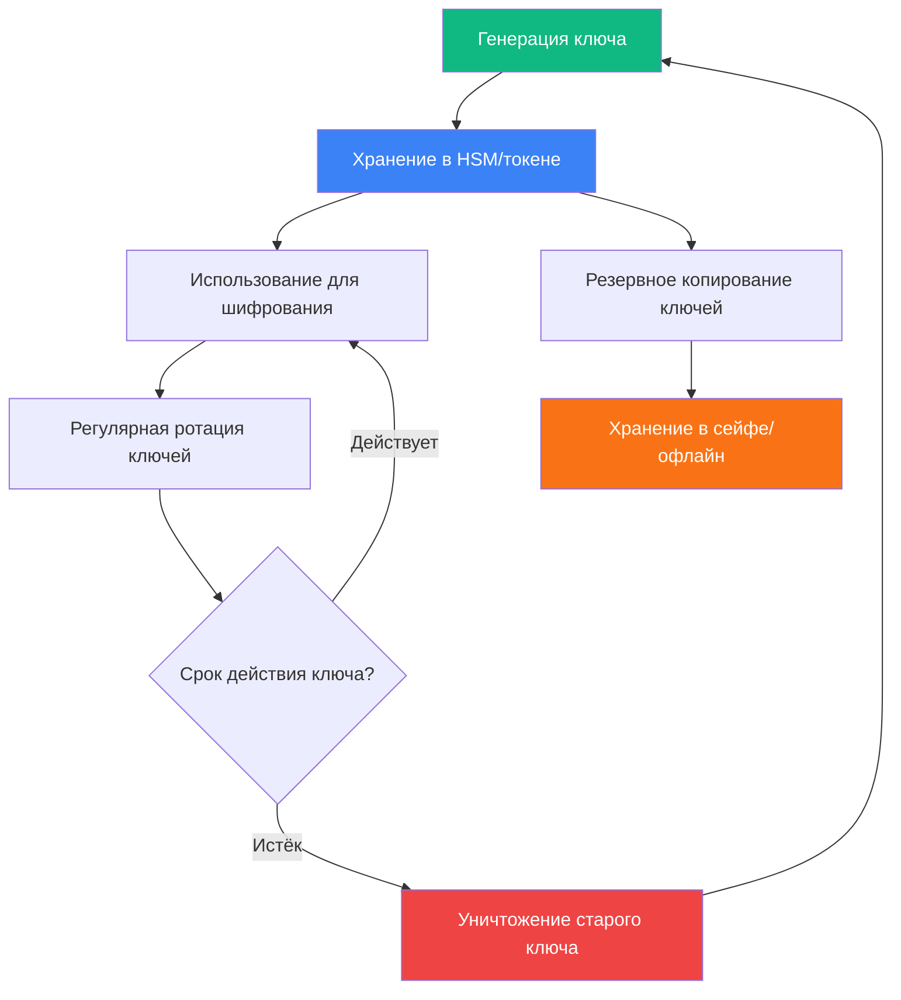

# 1. Криптография (по ГОСТ Р 34.10-2012, ГОСТ Р 34.11-2012)

## 1.1. Основные методы и алгоритмы

| Метод | Алгоритмы | ГОСТ РФ | Преимущества | Недостатки | Применение |
|-------|-----------|---------|--------------|------------|------------|
| **Симметричное шифрование** | AES, ГОСТ 28147-89, «Кузнечик» | ГОСТ Р 34.12-2015 | Высокая скорость (до 10 Гбит/с), простота реализации | Проблема распределения ключей, масштабируемость | Шифрование данных, VPN, TLS |
| **Асимметричное шифрование** | RSA, ГОСТ Р 34.10-2012, ECC | ГОСТ Р 34.10-2012 | Безопасная передача ключей, цифровая подпись | Низкая скорость (в 1000 раз медленнее симметричного) | Обмен ключами, ЭЦП, сертификаты |
| **Хеширование** | SHA-256, ГОСТ Р 34.11-2012 («Стрибог») | ГОСТ Р 34.11-2012 | Односторонность, устойчивость к коллизиям | Невозможность восстановления данных | Контроль целостности, пароли |
| **Цифровая подпись** | ECDSA, ГОСТ Р 34.10-2012 | ГОСТ Р 34.10-2012 | Аутентичность, неотказуемость, юридическая значимость | Требует управления ключами, инфраструктура PKI | Документы, транзакции, код |

## 1.2. Российские криптографические стандарты (ФСТЭК/ФСБ)

```
┌─────────────────────────────────────────────────────────────────────────┐
│                    РОССИЙСКИЕ КРИПТОГРАФИЧЕСКИЕ СТАНДАРТЫ               │
├─────────────────────────────────────────────────────────────────────────┤
│  ГОСТ Р 34.10-2012  │ Цифровая подпись (аналог ECDSA, 256/512 бит)     │
│  ГОСТ Р 34.11-2012  │ Хеш-функция «Стрибог» (256/512 бит)              │
│  ГОСТ Р 34.12-2015  │ Блочное шифрование «Кузнечик» (128 бит)          │
│  ГОСТ 28147-89      │ Блочное шифрование (устаревший, но применяется)  │
│  ФСБ России         │ Сертификаты СКЗИ (Средства Криптозащиты)         │
│  Приказ ФСБ №378    │ Требования к использованию КСЗИ                  │
└─────────────────────────────────────────────────────────────────────────┘
```

## 1.3. Практическое применение (152-ФЗ требование к защите ПДн)

```python
#==============================================================================
# КРИПТОГРАФИЧЕСКАЯ ЗАЩИТА ДАННЫХ (152-ФЗ ТРЕБОВАНИЕ)
# Реализация на Python с использованием ГОСТ-алгоритмов (через cryptography)
#==============================================================================

from cryptography.hazmat.primitives.ciphers import Cipher, algorithms, modes
from cryptography.hazmat.backends import default_backend
from cryptography.hazmat.primitives import hashes, padding
from cryptography.hazmat.primitives.kdf.pbkdf2 import PBKDF2HMAC
import os
import base64

class GOSTCrypto:
    """Криптографический модуль для защиты ПДн (152-ФЗ)"""
    
    def __init__(self):
        self.backend = default_backend()
    
    def derive_key_from_password(self, password: str, salt: bytes) -> bytes:
        """
        Derive ключ из пароля (PBKDF2)
        Требование ФСТЭК: минимум 10000 итераций
        """
        kdf = PBKDF2HMAC(
            algorithm=hashes.SHA256(),
            length=32,  # 256 бит для AES-256
            salt=salt,
            iterations=100000,  # ФСТЭК рекомендует ≥100000
            backend=self.backend
        )
        return kdf.derive(password.encode())
    
    def encrypt_aes_256(self, plaintext: bytes, key: bytes) -> bytes:
        """
        Шифрование AES-256 (ГОСТ Р 34.12-2015 «Кузнечик» аналог)
        152-ФЗ требование: шифрование ПДн при передаче и хранении
        """
        iv = os.urandom(16)  # Вектор инициализации
        cipher = Cipher(algorithms.AES(key), modes.CBC(iv), backend=self.backend)
        encryptor = cipher.encryptor()
        
        # Padding (PKCS7)
        padder = padding.PKCS7(128).padder()
        padded_data = padder.update(plaintext) + padder.finalize()
        
        ciphertext = encryptor.update(padded_data) + encryptor.finalize()
        return iv + ciphertext  # IV нужен для дешифрования
    
    def decrypt_aes_256(self, ciphertext: bytes, key: bytes) -> bytes:
        """Дешифрование AES-256"""
        iv = ciphertext[:16]
        ciphertext = ciphertext[16:]
        
        cipher = Cipher(algorithms.AES(key), modes.CBC(iv), backend=self.backend)
        decryptor = cipher.decryptor()
        
        padded_data = decryptor.update(ciphertext) + decryptor.finalize()
        
        # Unpadding
        unpadder = padding.PKCS7(128).unpadder()
        plaintext = unpadder.update(padded_data) + unpadder.finalize()
        
        return plaintext
    
    def calculate_hash(self, data: bytes) -> str:
        """
        Хеш-функция SHA-256 (аналог ГОСТ Р 34.11-2012)
        Требование: контроль целостности данных
        """
        digest = hashes.Hash(hashes.SHA256(), backend=self.backend)
        digest.update(data)
        return digest.finalize().hex()
    
    def generate_secure_key(self) -> bytes:
        """Генерация криптографически стойкого ключа"""
        return os.urandom(32)  # 256 бит

# =============================================================================
# ПРИМЕР ИСПОЛЬЗОВАНИЯ (152-ФЗ)
# =============================================================================

if __name__ == "__main__":
    crypto = GOSTCrypto()
    
    # Исходные персональные данные
    personal_data = b"Иванов Иван Иванович, СНИЛС: 123-456-789 00, Паспорт: 4500 123456"
    
    # Генерация ключа (в реальности ключ хранится в HSM/токене)
    key = crypto.generate_secure_key()
    print(f"🔑 Ключ шифрования (256 бит): {key.hex()[:32]}...")
    
    # Шифрование
    encrypted = crypto.encrypt_aes_256(personal_data, key)
    print(f"🔒 Зашифрованные данные: {base64.b64encode(encrypted).decode()[:50]}...")
    
    # Дешифрование
    decrypted = crypto.decrypt_aes_256(encrypted, key)
    print(f"🔓 Расшифрованные данные: {decrypted.decode()}")
    
    # Контроль целостности (хеш)
    data_hash = crypto.calculate_hash(personal_data)
    print(f"📋 Хеш целостности (SHA-256): {data_hash[:32]}...")
    
    # Проверка целостности
    modified_data = personal_data + b" MODIFIED"
    modified_hash = crypto.calculate_hash(modified_data)
    
    if data_hash != modified_hash:
        print("⚠️  ВНИМАНИЕ: Целостность данных нарушена!")
    else:
        print("✅ Целостность данных подтверждена")
```

## 1.4. Управление криптографическими ключами (ФСТЭК требование 6.4)



**Требования ФСТЭК к управлению ключами:**

| Требование | Описание | Контроль |
|------------|----------|----------|
| **Генерация** | Использование сертифицированных СКЗИ, генераторов случайных чисел | Акт генерации ключей |
| **Хранение** | В защищённых носителях (токены, HSM, сейфы) | Журнал учёта ключей |
| **Распределение** | Защищённые каналы связи, курьерская доставка | Акт приёма-передачи |
| **Ротация** | Смена ключей каждые 6-12 месяцев (зависит от класса защиты) | График ротации |
| **Уничтожение** | Физическое уничтожение носителей, криптографическое стирание | Акт уничтожения |

---
# 2. Стеганография

## 2.1. Методы стеганографии

| Метод | Описание | Ёмкость | Стойкость | Применение |
|-------|----------|---------|-----------|------------|
| **LSB (Least Significant Bit)** | Замена наименее значимых битов пикселей | Высокая (1 бит на пиксель) | Низкая (уязвима к сжатию) | Изображения BMP, PNG |
| **DCT (Discrete Cosine Transform)** | Встраивание в коэффициенты JPEG | Средняя | Средняя | Изображения JPEG |
| **Спектральные методы** | Встраивание в частотную область аудио | Высокая | Высокая | Аудиофайлы WAV, MP3 |
| **Текстовая стеганография** | Изменение пробелов, шрифтов, HTML-тегов | Низкая | Средняя | Документы, email |
| **Сетевая стеганография** | Встраивание в заголовки пакетов, тайминги | Низкая | Высокая | Сетевой трафик |

## 2.2. Практическая реализация LSB-метода (Python)

```python
#==============================================================================
# СТЕГАНОГРАФИЯ: LSB МЕТОД (Least Significant Bit)
# Встраивание текста в изображение
#==============================================================================

from PIL import Image
import numpy as np

class LSBSteganography:
    """Стеганография методом LSB"""
    
    def __init__(self):
        pass
    
    def text_to_binary(self, text: str) -> str:
        """Преобразует текст в двоичную строку"""
        return ''.join(format(ord(char), '08b') for char in text)
    
    def binary_to_text(self, binary: str) -> str:
        """Преобразует двоичную строку в текст"""
        chars = [binary[i:i+8] for i in range(0, len(binary), 8)]
        return ''.join(chr(int(char, 2)) for char in chars if len(char) == 8)
    
    def encode(self, image_path: str, text: str, output_path: str):
        """Встраивает текст в изображение"""
        # Открываем изображение
        img = Image.open(image_path)
        img_array = np.array(img)
        
        # Добавляем маркер конца сообщения
        delimiter = "#####"
        text += delimiter
        
        # Преобразуем текст в двоичный вид
        binary_text = self.text_to_binary(text)
        
        # Проверяем ёмкость изображения
        max_bits = img_array.size // 3  # 3 канала RGB
        if len(binary_text) > max_bits:
            raise ValueError("Текст слишком большой для этого изображения!")
        
        # Встраиваем биты в LSB
        bit_index = 0
        for row in range(img_array.shape[0]):
            for col in range(img_array.shape[1]):
                for channel in range(3):  # RGB
                    if bit_index < len(binary_text):
                        # Очищаем LSB и устанавливаем новый бит
                        img_array[row, col, channel] = (
                            img_array[row, col, channel] & ~1 | 
                            int(binary_text[bit_index])
                        )
                        bit_index += 1
                    else:
                        break
        
        # Сохраняем изображение
        result_img = Image.fromarray(img_array)
        result_img.save(output_path)
        print(f"✅ Текст успешно встроен в {output_path}")
        print(f"   Длина текста: {len(text)} символов")
        print(f"   Использовано бит: {len(binary_text)}")
    
    def decode(self, image_path: str) -> str:
        """Извлекает текст из изображения"""
        # Открываем изображение
        img = Image.open(image_path)
        img_array = np.array(img)
        
        # Извлекаем LSB
        binary_text = ""
        for row in range(img_array.shape[0]):
            for col in range(img_array.shape[1]):
                for channel in range(3):
                    binary_text += str(img_array[row, col, channel] & 1)
        
        # Преобразуем в текст
        text = self.binary_to_text(binary_text)
        
        # Ищем маркер конца
        delimiter = "#####"
        if delimiter in text:
            text = text[:text.index(delimiter)]
        
        return text

# =============================================================================
# ПРИМЕР ИСПОЛЬЗОВАНИЯ
# =============================================================================

if __name__ == "__main__":
    stego = LSBSteganography()
    
    # Секретное сообщение
    secret_message = "Конфиденциальная информация: доступ к серверу 192.168.1.100"
    
    # Встраивание
    print("=== ВСТРАИВАНИЕ СООБЩЕНИЯ ===")
    stego.encode("source_image.png", secret_message, "stego_image.png")
    
    # Извлечение
    print("\n=== ИЗВЛЕЧЕНИЕ СООБЩЕНИЯ ===")
    extracted = stego.decode("stego_image.png")
    print(f"Извлечённое сообщение: {extracted}")
    
    # Проверка
    if extracted == secret_message:
        print("✅ Сообщение успешно извлечено без ошибок")
    else:
        print("❌ Ошибка извлечения сообщения")
```

## 2.3. Сравнение криптографии и стеганографии

| Характеристика                | Криптография                           | Стеганография                               | Крипто-стеганография          |
| ----------------------------- | -------------------------------------- | ------------------------------------------- | ----------------------------- |
| **Основная цель**             | Защита содержания информации           | Скрытие факта существования информации      | Двойная защита                |
| **Методы**                    | Шифрование, хеширование, ЭЦП           | Встраивание в носители (изображения, аудио) | Шифрование + встраивание      |
| **Обнаружение**               | Трудно расшифровать без ключа          | Можно обнаружить стеганоанализом            | Максимально скрытно           |
| **Применение**                | Защита конфиденциальности, целостности | Скрытие факта передачи                      | Секретная связь, watermarking |
| **Нормативное регулирование** | ГОСТ Р 34.10-2012, 152-ФЗ, ФСТЭК       | Не регулируется                             | Регулируется как КСЗИ         |
| **Стойкость**                 | Зависит от длины ключа (AES-256)       | Зависит от метода встраивания               | Комбинированная стойкость     |

## 2.4. Крипто-стеганография (комбинированный подход)


**Преимущества комбинированного подхода:**

1. **Усиленная безопасность**: Даже при обнаружении скрытых данных их содержание остаётся зашифрованным
2. **Многоуровневая защита**: Требуется преодолеть два уровня защиты
3. **Снижение заметности**: Зашифрованные данные выглядят как случайный шум
4. **Соответствие требованиям**: Криптографическая часть регулируется ФСТЭК/ФСБ

## Список литературы
1. Смирнов В.А. — _Криптографические методы защиты информации_. — М.: Академия.
2. Алферов А.П. — _Основы криптографии_. — М.: Гелиос АРВ.
3. ГОСТ Р 34.10-2012 — Электронная подпись.
4. ГОСТ Р 34.11-2012 — Функция хеширования.
5. ГОСТ 28147-89 — Криптографический алгоритм шифрования.