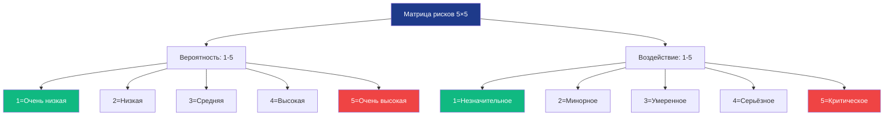
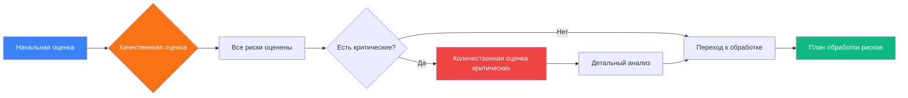
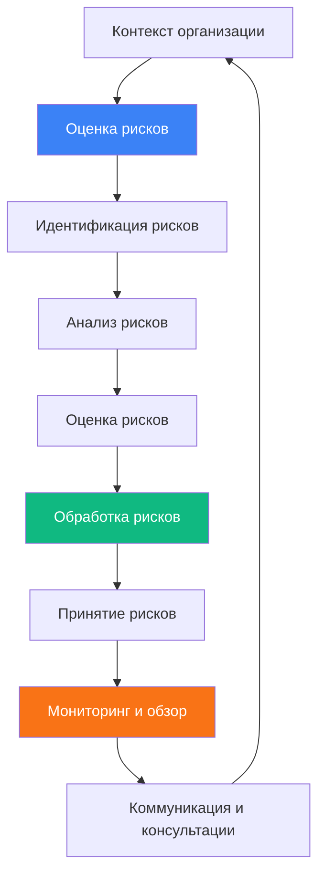

# 1. Основные понятия (ГОСТ Р ИСО/МЭК 27005-2021)

| Понятие | Определение | Нормативный документ | Формула/Метод |
|---------|-------------|---------------------|---------------|
| **Угроза** | Совокупность условий, создающих опасность нарушения безопасности | ГОСТ Р 53114-2008 | Классификация: внешние/внутренние |
| **Уязвимость** | Свойство системы, позволяющее реализовать угрозу | ISO/IEC 27005 | CVE, CWE каталоги |
| **Риск** | Вероятность × Воздействие | ГОСТ Р ИСО/МЭК 27005-2021 | Risk = P × I |
| **Уровень риска** | Низкий / Средний / Высокий / Критический | ФСТЭК приказ №17 | Матрица рисков |
| **Остаточный риск** | Риск после применения мер защиты | ISO/IEC 27005 | Risk_residual = Risk_initial - Controls |

# 2. Методы оценки рисков

## 2.1. Качественная оценка (матрица рисков)



**Матрица рисков (ФСТЭК приказ №17):**

| Вероятность ↓ \ Воздействие → | 1   | 2   | 3   | 4   | 5      |
| ----------------------------- | --- | --- | --- | --- | ------ |
| **5**                         | 5   | 10  | 15  | 20  | **25** |
| **4**                         | 4   | 8   | 12  | 16  | 20     |
| **3**                         | 3   | 6   | 9   | 12  | 15     |
| **2**                         | 2   | 4   | 6   | 8   | 10     |
| **1**                         | 1   | 2   | 3   | 4   | 5      |

**Уровни риска:**
- **1-5**: Низкий (зелёный) — принятие риска
- **6-10**: Средний (жёлтый) — смягчение риска
- **11-15**: Высокий (оранжевый) — приоритетное смягчение
- **16-25**: Критический (красный) — немедленное устранение

## 2.2. Количественная оценка (Монте-Карло симуляция)

```python
#==============================================================================
# КОЛИЧЕСТВЕННАЯ ОЦЕНКА РИСКОВ (МЕТОД МОНТЕ-КАРЛО)
# ГОСТ Р ИСО/МЭК 27005-2021
#==============================================================================

import numpy as np
import matplotlib.pyplot as plt

class RiskMonteCarlo:
    """Количественная оценка рисков методом Монте-Карло"""
    
    def __init__(self, iterations=10000):
        self.iterations = iterations
    
    def simulate_risk(self, probability_mean, probability_std, 
                     impact_mean, impact_std):
        """
        Симуляция риска
        probability: вероятность реализации угрозы (0-1)
        impact: финансовое воздействие (рубли)
        """
        # Генерация случайных значений (нормальное распределение)
        probabilities = np.random.normal(probability_mean, probability_std, 
                                        self.iterations)
        impacts = np.random.normal(impact_mean, impact_std, self.iterations)
        
        # Ограничение диапазонов
        probabilities = np.clip(probabilities, 0, 1)
        impacts = np.clip(impacts, 0, None)
        
        # Расчёт риска
        risks = probabilities * impacts
        
        return risks
    
    def analyze_results(self, risks):
        """Анализ результатов симуляции"""
        return {
            'mean_risk': np.mean(risks),
            'median_risk': np.median(risks),
            'std_risk': np.std(risks),
            'min_risk': np.min(risks),
            'max_risk': np.max(risks),
            'percentile_95': np.percentile(risks, 95),
            'percentile_99': np.percentile(risks, 99)
        }
    
    def generate_report(self, risks, scenario_name):
        """Генерация отчёта по оценке рисков"""
        stats = self.analyze_results(risks)
        
        report = f"""
================================================================================
ОТЧЁТ ПО КОЛИЧЕСТВЕННОЙ ОЦЕНКЕ РИСКОВ
Сценарий: {scenario_name}
Метод: Монте-Карло ({self.iterations} итераций)
================================================================================

СТАТИСТИКА РИСКА:
  Среднее значение:     {stats['mean_risk']:,.2f} руб.
  Медиана:              {stats['median_risk']:,.2f} руб.
  Стандартное отклонение: {stats['std_risk']:,.2f} руб.
  Минимум:              {stats['min_risk']:,.2f} руб.
  Максимум:             {stats['max_risk']:,.2f} руб.

ДОВЕРИТЕЛЬНЫЕ ИНТЕРВАЛЫ:
  95% уверенность:      ≤ {stats['percentile_95']:,.2f} руб.
  99% уверенность:      ≤ {stats['percentile_99']:,.2f} руб.

РЕКОМЕНДАЦИИ:
  - Если стоимость мер защиты < {stats['mean_risk']:,.2f} руб. → внедрять
  - Если стоимость мер защиты > {stats['percentile_95']:,.2f} руб. → принять риск
================================================================================
"""
        return report

# =============================================================================
# ПРИМЕР ИСПОЛЬЗОВАНИЯ
# =============================================================================

if __name__ == "__main__":
    simulator = RiskMonteCarlo(iterations=10000)
    
    # Сценарий: Утечка персональных данных (152-ФЗ)
    # Вероятность: 3% в год (0.03), стандартное отклонение 1%
    # Воздействие: 5 000 000 руб. (штрафы + репутация), отклонение 2 000 000
    
    print("=== ОЦЕНКА РИСКА: УТЕЧКА ПЕРСОНАЛЬНЫХ ДАННЫХ ===\n")
    
    risks = simulator.simulate_risk(
        probability_mean=0.03,
        probability_std=0.01,
        impact_mean=5000000,
        impact_std=2000000
    )
    
    report = simulator.generate_report(risks, "Утечка ПДн (152-ФЗ)")
    print(report)
    
    # Сравнение со стоимостью мер защиты
    security_controls_cost = 2000000  # Стоимость DLP + шифрование
    
    if security_controls_cost < simulator.analyze_results(risks)['mean_risk']:
        print(f"✅ РЕКОМЕНДАЦИЯ: Внедрить меры защиты ({security_controls_cost:,.0f} руб. < риска)")
    else:
        print(f"⚠️  РЕКОМЕНДАЦИЯ: Рассмотреть альтернативные меры или принять риск")
```

## 2.3. Смешанная оценка рисков



# 3. Управление угрозами (4 стратегии по ФСТЭК)

| Стратегия      | Описание                             | Пример                                                | Когда применять                                       | ФСТЭК требование   |
| -------------- | ------------------------------------ | ----------------------------------------------------- | ----------------------------------------------------- | ------------------ |
| **Устранение** | Полное устранение угрозы             | Удаление уязвимого сервиса, отключение функции        | Если технически возможно и экономически целесообразно | Приказ №17, п. 6.1 |
| **Смягчение**  | Снижение вероятности или воздействия | IPS, резервные копии, обучение, MFA                   | Для большинства рисков (80-90%)                       | Приказ №17, п. 6.2 |
| **Передача**   | Передача риска третьей стороне       | Страхование киберрисков, облачные SLA, аутсорсинг SOC | При высоких финансовых рисках                         | Приказ №17, п. 6.3 |
| **Принятие**   | Осознанное решение остаться с риском | Для низких рисков, где затраты > ущерба               | Когда стоимость защиты превышает возможный ущерб      | Приказ №17, п. 6.4 |

## 3.1. Практический пример выбора стратегии

```python
#==============================================================================
# ВЫБОР СТРАТЕГИИ УПРАВЛЕНИЯ РИСКАМИ (ФСТЭК)
#==============================================================================

class RiskTreatmentStrategy:
    """Выбор стратегии обработки рисков"""
    
    def __init__(self):
        self.strategies = {
            'AVOID': 'Устранение',
            'MITIGATE': 'Смягчение',
            'TRANSFER': 'Передача',
            'ACCEPT': 'Принятие'
        }
    
    def recommend_strategy(self, risk_level, control_cost, potential_loss, 
                          technical_feasibility):
        """
        Рекомендует стратегию на основе параметров
        risk_level: 1-25 (из матрицы рисков)
        control_cost: стоимость мер защиты (руб.)
        potential_loss: потенциальный ущерб (руб.)
        technical_feasibility: True/False (техническая возможность)
        """
        recommendations = []
        
        # Критический риск (16-25)
        if risk_level >= 16:
            if technical_feasibility:
                recommendations.append(('AVOID', 'Критический риск требует устранения'))
            recommendations.append(('MITIGATE', 'Обязательное смягчение до приемлемого уровня'))
        
        # Высокий риск (11-15)
        elif risk_level >= 11:
            if control_cost < potential_loss * 0.5:
                recommendations.append(('MITIGATE', 'Стоимость защиты < 50% ущерба'))
            else:
                recommendations.append(('TRANSFER', 'Рассмотреть страхование'))
        
        # Средний риск (6-10)
        elif risk_level >= 6:
            if control_cost < potential_loss * 0.3:
                recommendations.append(('MITIGATE', 'Экономически целесообразно'))
            else:
                recommendations.append(('ACCEPT', 'Принятие с мониторингом'))
        
        # Низкий риск (1-5)
        else:
            recommendations.append(('ACCEPT', 'Низкий риск, принятие'))
        
        return recommendations

# =============================================================================
# ПРИМЕР ИСПОЛЬЗОВАНИЯ
# =============================================================================

if __name__ == "__main__":
    advisor = RiskTreatmentStrategy()
    
    # Пример 1: Уязвимость в критическом сервисе
    print("=== СЦЕНАРИЙ 1: Уязвимость в критическом сервисе ===")
    strategy = advisor.recommend_strategy(
        risk_level=20,           # Критический
        control_cost=500000,     # 500 тыс. руб.
        potential_loss=10000000, # 10 млн руб.
        technical_feasibility=True
    )
    for strat, reason in strategy:
        print(f"  {advisor.strategies[strat]}: {reason}")
    
    print()
    
    # Пример 2: Устаревшее ПО в тестовой среде
    print("=== СЦЕНАРИЙ 2: Устаревшее ПО в тестовой среде ===")
    strategy = advisor.recommend_strategy(
        risk_level=4,            # Низкий
        control_cost=200000,     # 200 тыс. руб.
        potential_loss=100000,   # 100 тыс. руб.
        technical_feasibility=True
    )
    for strat, reason in strategy:
        print(f"  {advisor.strategies[strat]}: {reason}")
```

# 4. Рамки управления рисками

## 4.1. NIST CSF (5 функций)


**Детализация функций NIST CSF:**

| Функция | Категории | Примеры мер | ФСТЭК соответствие |
|---------|-----------|-------------|-------------------|
| **Identify** | Управление активами, оценка рисков, политика ИБ | Инвентаризация, оценка рисков, политики | Приказ №17, п. 1-3 |
| **Protect** | Контроль доступа, обучение, защита данных | MFA, шифрование, антивирус | Приказ №17, п. 4-6 |
| **Detect** | Мониторинг, обнаружение аномалий | SIEM, IDS, UEBA | Приказ №17, п. 7 |
| **Respond** | Планирование, коммуникация, анализ | Playbooks, SOC, IR-команда | Приказ №17, п. 8 |
| **Recover** | Восстановление, улучшения | Бэкапы, DRP, lessons learned | Приказ №17, п. 9 |

## 4.2. ISO/IEC 27005 (процесс управления рисками)


## Список литературы
1. ГОСТ Р ИСО/МЭК 27001-2021 — Системы менеджмента информационной безопасности. Требования.
2. ГОСТ Р ИСО/МЭК 27005-2010 — Управление рисками информационной безопасности.
3. ФСТЭК России — Методические рекомендации по оценке рисков ИБ.
4. Герасименко В.А. — _Управление рисками информационной безопасности_. — М.: Юрайт.
5. Банников А.А. — _Аудит информационной безопасности_.