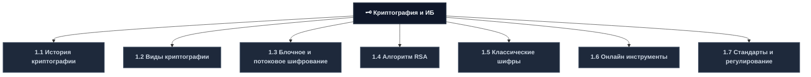
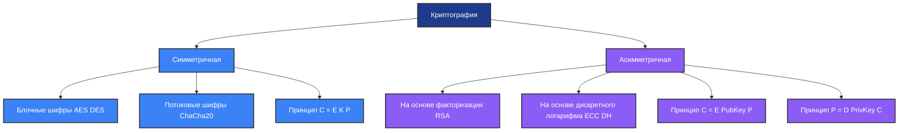
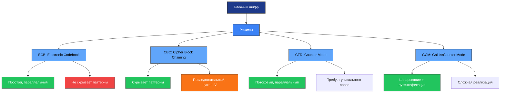
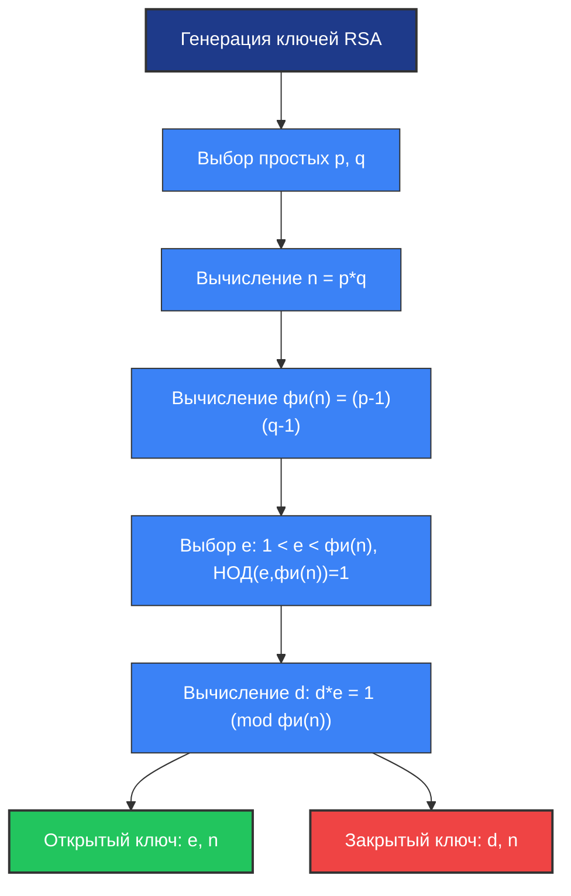
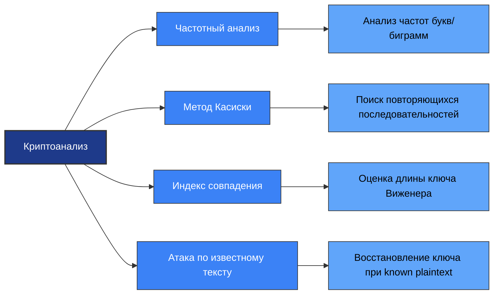
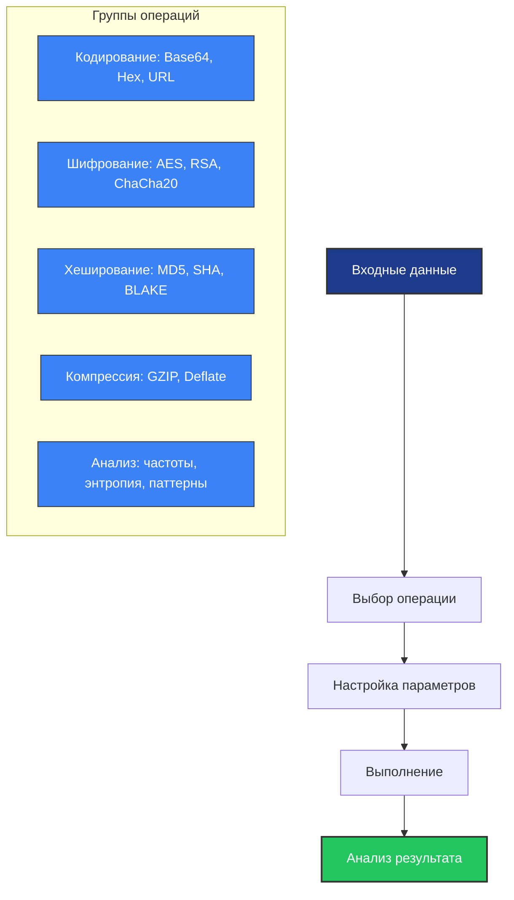
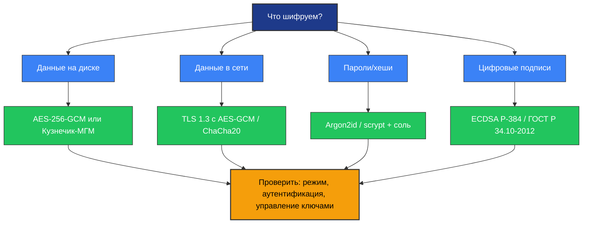

---
# 1.1 История криптографии
## Временная шкала развития криптографии

| Период | Регион | Ключевые события | Методы шифрования | Значение |
|--------|--------|-----------------|-------------------|----------|
| **3 тыс. до н.э.** | Древний Египет | Первые попытки скрытия информации | Иероглифические замены | Зарождение криптографии |
| **600 г. до н.э.** | Древний Израиль | Шифр Атбаш | Обратная замена алфавита | Первый документированный шифр |
| **V в. до н.э.** | Древняя Спарта | Сцитала | Транспозиция | Механическое шифрование |
| **II в. до н.э.** | Древний Рим | Шифр Цезаря | Моноалфавитная подстановка | Стандартизация методов |
| **IX в.** | Ближний Восток | Труды аль-Кинди | Частотный анализ | Научный подход к криптоанализу |
| **XV в.** | Европа | Квадрат Полибия, шифр Виженера | Полиалфавитные шифры | Повышение криптостойкости |
| **1918-1945** | Германия/Союзники | Энигма, Lorenz | Роторные машины | Электромеханическая эра |
| **1976-1977** | США | Диффи-Хеллман, RSA | Асимметричная криптография | Революция в ИБ |
| **1990-н.в.** | Глобально | AES, ECC, квантовая криптография | Математические алгоритмы | Современная криптография |
## Эволюция криптостойкости

---
# 1.2 Виды криптографии: симметричная и асимметричная
## Сравнительная матрица криптосистем

| Характеристика | Симметричная криптография | Асимметричная криптография |
|---------------|---------------------------|---------------------------|
| **Количество ключей** | Один общий ключ | Пара ключей (открытый + закрытый) |
| **Скорость шифрования** | Высокая (100+ МБ/с) | Низкая (10-100 КБ/с) |
| **Длина ключа** | 128-256 бит | 2048-4096 бит (RSA), 256-521 бит (ECC) |
| **Обмен ключами** | Требует защищённого канала | Не требует (открытый ключ публичен) |
| **Цифровые подписи** | Не поддерживает | Полная поддержка |
| **Масштабируемость** | Проблема: O(n²) ключей | Решение: O(n) ключей |
| **Вычислительная сложность** | Низкая (операции с битами) | Высокая (модульная арифметика) |
| **Типичное применение** | Шифрование данных, дисков | Обмен ключами, аутентификация |
## Математическая основа

## Алгоритмы и их характеристики

| Алгоритм | Тип | Длина ключа | Скорость | Безопасность | Применение |
|----------|-----|-------------|----------|--------------|-----------|
| **AES-256** | Симметричный, блочный | 256 бит | Очень высокая | Отличная | Файлы, диски, трафик |
| **ChaCha20** | Симметричный, потоковый | 256 бит | Очень высокая | Отличная | Мобильные устройства, TLS 1.3 |
| **RSA-2048** | Асимметричный | 2048 бит | Низкая | Хорошая | Обмен ключами, подписи |
| **ECC P-256** | Асимметричный | 256 бит | Средняя | Отличная | Мобильная криптография |
| **3DES** | Симметричный, блочный | 168 бит (эфф. 112) | Высокая | Устаревает | Наследие-системы |
| **Blowfish** | Симметричный, блочный | 32-448 бит | Высокая | Заменён на AES | Устаревшие приложения |

---
# 1.3 Блочное и потоковое шифрование
## Детальное сравнение

| Параметр | Блочный шифр | Потоковый шифр |
|----------|--------------|----------------|
| **Единица обработки** | Блок фиксированного размера (64/128/256 бит) | Бит или байт |
| **Режимы работы** | ECB, CBC, CFB, OFB, CTR, GCM | CFB, OFB, CTR (адаптированные) |
| **Параллелизация** | Возможна (кроме CBC) | Последовательная обработка |
| **Распространение ошибок** | Зависит от режима (в CBC — весь блок) | Только затронутый бит |
| **Выравнивание данных** | Требуется (padding) | Не требуется |
| **Типичная скорость** | 100-500 МБ/с (AES-NI) | 200-1000 МБ/с (ChaCha20) |
| **Использование памяти** | Низкое | Низкое |
| **Примеры** | AES, DES, 3DES, Blowfish | RC4, Salsa20, ChaCha20, A5/1 |
## Режимы работы блочных шифров

## Когда что использовать?

| Сценарий | Рекомендуемый тип | Обоснование |
|----------|------------------|-------------|
| Шифрование базы данных | Блочный (AES-CBC) | Детерминированность для индексации |
| Защита видеопотока | Потоковый (ChaCha20) | Низкая задержка, обработка в реальном времени |
| Шифрование файлов на диске | Блочный (AES-GCM) | Надёжность + аутентификация |
| Мобильное приложение | Потоковый (ChaCha20) | Энергоэффективность на слабых процессорах |
| Аппаратное ускорение | Блочный (AES-NI) | Использование инструкций процессора |

---
# 1.4 Алгоритм RSA и асимметричные системы
## Математическая основа RSA

## Процесс шифрования/расшифрования

| Этап | Формула | Пример (упрощённый) |
|------|---------|---------------------|
| **Генерация ключей** | | |
| Выбор p, q | p=61, q=53 | Простые числа |
| Вычисление n | n = p × q | n = 3233 |
| Вычисление φ(n) | φ(n) = (p-1)(q-1) | φ = 3120 |
| Выбор e | НОД(e, φ) = 1 | e = 17 |
| Вычисление d | d = e⁻¹ mod φ | d = 2753 |
| **Шифрование** | C = Mᵉ mod n | M=123 → C=123¹⁷ mod 3233 = 855 |
| **Расшифрование** | M = Cᵈ mod n | C=855 → M=855²⁷⁵³ mod 3233 = 123 |
## Криптостойкость и рекомендации

| Параметр | Минимум (2026) | Рекомендуется | Квантовая эра |
|----------|---------------|---------------|---------------|
| **Длина ключа RSA** | 2048 бит | 3072-4096 бит | Неустойчив |
| **Длина ключа ECC** | 256 бит (P-256) | 384-521 бит | Уязвим |
| **Хеш-функция** | SHA-256 | SHA-384/SHA-512 | SHA-3 |
| **Режим заполнения** | OAEP | OAEP + MGF1 | Пост-квантовые схемы |
## Угрозы для RSA

| Угроза | Описание | Условие реализации | Мера защиты |
|--------|----------|-------------------|-------------|
| Факторизация малого n | Перебор делителей модуля | n < 1024 бит | Использовать ключи ≥2048 бит |
| Атака на малую экспоненту | Восстановление сообщения при e=3 | Одно сообщение, малый текст | Использовать e=65537, OAEP |
| Атака по времени | Анализ времени выполнения операций | Доступ к устройству, много измерений | Постоянное время выполнения |
| Компрометация ГСЧ | Предсказуемые p, q | Слабый источник случайности | Аппаратный ГСЧ, сертификация |
| Квантовая атака (Шор) | Полиномиальная факторизация | Практический квантовый компьютер | Миграция на пост-квантовые алгоритмы |

---
# 1.5 Классические шифры и их анализ
## Каталог классических шифров

| Шифр | Год | Тип | Ключ | Криптостойкость | Метод взлома |
|------|-----|-----|------|-----------------|--------------|
| **Атбаш** | ~600 до н.э. | Моноалфавитная замена | Нет | Нулевая | Частотный анализ |
| **Сцитала** | ~500 до н.э. | Транспозиция | Радиус цилиндра | Нулевая | Перебор радиусов |
| **Квадрат Полибия** | ~200 до н.э. | Подстановка цифрами | Расположение в таблице | Низкая | Частотный анализ биграмм |
| **Шифр Цезаря** | ~50 до н.э. | Моноалфавитная замена | Сдвиг (1-25) | Нулевая | Brute-force (25 вариантов) |
| **Шифр Виженера** | 1553 | Полиалфавитная замена | Ключевое слово | Средняя | Метод Касиски, IC-анализ |
| **Шифр Плейфера** | 1854 | Биграммная подстановка | 5×5 матрица | Средняя | Анализ биграмм, known-plaintext |
| **Шифр ADFGVX** | 1918 | Комбинированный | Ключ + матрица | Хорошая (для своего времени) | Криптоанализ Первой мировой |

## Методы криптоанализа

## Индекс совпадения (теория)

**Формула:**  
`IC = Σ(fᵢ × (fᵢ - 1)) / (n × (n - 1))`

**Интерпретация:**
- Для случайного текста: IC ≈ 0.038 (англ.) / 0.045 (рус.)
- Для естественного языка: IC ≈ 0.067 (англ.) / 0.055 (рус.)
- Для шифра Виженера: средний IC по группам указывает на длину ключа

**Применение:**
1. Разбить шифротекст на группы по предполагаемой длине ключа
2. Вычислить IC для каждой группы
3. Длина ключа, при которой средний IC близок к значению для языка — вероятный кандидат
---
# 1.6 Инструменты и онлайн-ресурсы для криптографии
## Сравнение популярных инструментов

| Инструмент | Тип | Лицензия | Ключевые функции | Применение |
|-----------|-----|----------|-----------------|-----------|
| **CyberChef** | Онлайн | Открытый | 200+ операций, визуальный конвейер | Обучение, быстрый анализ |
| **dCode** | Онлайн | Открытый | 900+ инструментов, авто-детекция | Решение головоломок, криптоанализ |
| **OpenSSL** | CLI/Library | Open Source | Полноценная криптография, сертификаты | Продакшен, скрипты |
| **GnuPG** | CLI | GPL | PGP-шифрование, управление ключами | Защищённая почта, подписи |
| **Hashcat** | CLI | Open Source | Восстановление паролей, брутфорс | Пентест, аудит безопасности |
| **John the Ripper** | CLI | GPL | Аудит паролей, множественные форматы | Тестирование стойкости паролей |

### Архитектура работы с онлайн-инструментами

## Безопасность использования онлайн-инструментов

| Риск | Описание | Мера снижения |
|------|----------|--------------|
| Утечка данных | Ввод конфиденциальной информации в публичный сервис | Не использовать для реальных данных, только учебные примеры |
| Логирование операций | Сервис может сохранять историю запросов | Использовать режим инкогнито, очищать историю |
| Подмена результата | Злонамеренное искажение вывода | Перепроверять критичные результаты в другом инструменте |
| Зависимость от сервиса | Невозможность работы при недоступности | Иметь локальные альтернативы для базовых операций |

---
# 1.7 Стандарты и регулирование в криптографии
## Матрица стандартов и регуляторов

```mermaid
graph TD
    A[Стандарты криптографии] --> B[Международные]
    A --> C[Российские]
    A --> D[Отраслевые]
    
    B --> B1[FIPS 140-3<br/>Крипто-модули США]
    B --> B2[ISO/IEC 19790<br/>Безопасность крипто-модулей]
    B --> B3[NIST SP 800-57<br/>Управление ключами]
    B --> B4[RFC 8446<br/>TLS 1.3]
    
    C --> C1[ГОСТ Р 34.10-2012<br/>Электронная подпись]
    C --> C2[ГОСТ Р 34.11-2012<br/>Хеш-функция Стрибог]
    C --> C3[ГОСТ Р 34.12-2015<br/>Блочные шифры Кузнечик/Магма]
    C --> C4[Приказ ФСБ № 796<br/>Требования к СЗИ]
    
    D --> D1[PCI DSS<br/>Платёжные системы]
    D --> D2[ФСТЭК № 17/21/31<br/>ГИС/ПДн/КИИ]
    D --> D3[СТО БР ИББС<br/>Банковский сектор]
    
    style A fill:#1e3a8a,color:#ffffff,stroke:#333333,stroke-width:4px
    style B fill:#3b82f6,color:#ffffff,stroke:#333333,stroke-width:2px
    style C fill:#ef4444,color:#ffffff,stroke:#333333,stroke-width:2px
    style D fill:#10b981,color:#ffffff,stroke:#333333,stroke-width:2px
    style B1 fill:#60a5fa,color:#000000,stroke:#333333,stroke-width:1px
    style B2 fill:#60a5fa,color:#000000,stroke:#333333,stroke-width:1px
    style B3 fill:#60a5fa,color:#000000,stroke:#333333,stroke-width:1px
    style B4 fill:#60a5fa,color:#000000,stroke:#333333,stroke-width:1px
    style C1 fill:#f87171,color:#000000,stroke:#333333,stroke-width:1px
    style C2 fill:#f87171,color:#000000,stroke:#333333,stroke-width:1px
    style C3 fill:#f87171,color:#000000,stroke:#333333,stroke-width:1px
    style C4 fill:#f87171,color:#000000,stroke:#333333,stroke-width:1px
    style D1 fill:#34d399,color:#000000,stroke:#333333,stroke-width:1px
    style D2 fill:#34d399,color:#000000,stroke:#333333,stroke-width:1px
    style D3 fill:#34d399,color:#000000,stroke:#333333,stroke-width:1px
```

## Сравнение криптографических стандартов

| Стандарт | Регион | Алгоритмы | Длина ключа | Статус | Применение |
|----------|--------|-----------|-------------|--------|-----------|
| **FIPS 140-3** | США | AES, RSA, ECC, SHA-2/3 | 128-512 бит | Активен | Госорганы США, сертификация |
| **ГОСТ Р 34.10-2012** | РФ | ЭЦП на эллиптических кривых | 256/512 бит | Обязателен | Электронная подпись в РФ |
| **ГОСТ Р 34.12-2015** | РФ | Кузнечик (128 бит), Магма (64 бит) | 256 бит | Обязателен | Шифрование в ГИС, ПДн |
| **ISO/IEC 18033** | Международный | Множество алгоритмов | Зависит | Рекомендован | Международные проекты |
| **NIST Post-Quantum** | США | CRYSTALS-Kyber, Dilithium | Разная | В разработке | Защита от квантовых атак |
| **ETSI TS 103 523** | Европа | Гибридные схемы | Разная | Активен | 5G, IoT безопасность |
## Требования к криптозащите по уровням (ФСТЭК)

| Уровень защищённости | Тип данных | Требуемые алгоритмы | Сертификация |
|---------------------|-----------|-------------------|--------------|
| **УЗ-1** | Особо важные ПДн, ГИС 1 класса | ГОСТ + криптопровайдеры с СКЗИ | Обязательная аттестация |
| **УЗ-2** | Важные ПДн, ГИС 2 класса | ГОСТ или утверждённые аналоги | Аттестация или декларация |
| **УЗ-3** | ПДн общего характера | Стандартизированные алгоритмы | Уведомительный порядок |
| **УЗ-4** | Общедоступные ПДн | Базовые средства шифрования | Самодекларирование |

---
## 📚 Приложения и ресурсы

### Рекомендуемая литература

**Книги:**
- Шнайер Б. — Прикладная криптография. Протоколы, алгоритмы, исходные тексты
- Молдовян Н.А. — Криптография: от примитивов к синтезу стойких алгоритмов
- Ященко В.В. — Введение в криптографию
- ФСТЭК России — Методические документы по защите информации

**Онлайн-ресурсы:**
- Crypto101.io — Интерактивное введение в криптографию
- NIST Cryptographic Toolkit — Официальные стандарты и реализации
- ГОСТы на сайте Росстандарта — Тексты национальных стандартов
- CyberChef — Практические упражнения

**Инструменты:**
- OpenSSL / LibreSSL — Криптографические примитивы
- GnuPG — PGP-совместимое шифрование
- Python cryptography — Современная библиотека для разработчиков
- Hashcat / John the Ripper — Аудит паролей

## Шпаргалка: выбор алгоритма

