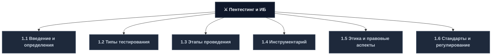
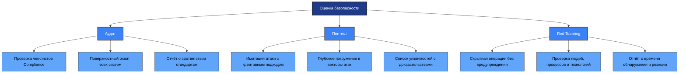
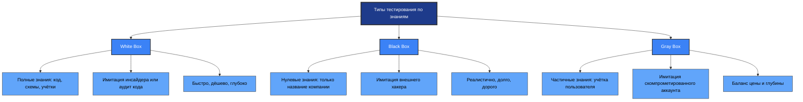
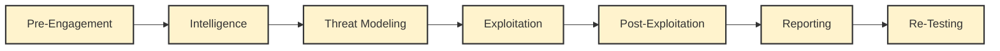
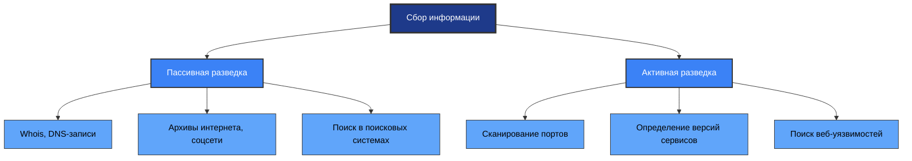
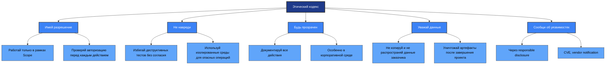
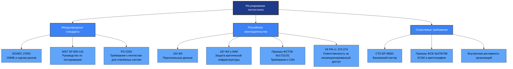
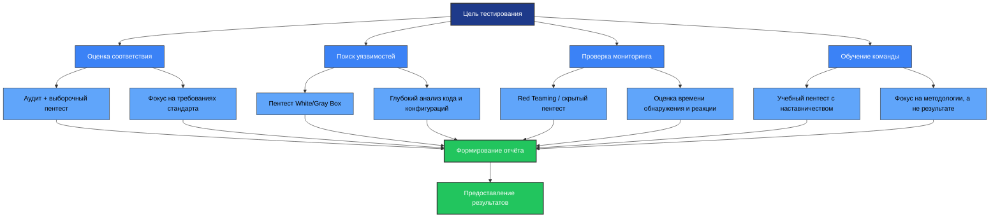

---
# 1.1 Введение в пентестинг и ключевые определения
## Определение пентестинга

**Penetration Testing (Пентест)** — это легализованная кибератака, метод оценки безопасности компьютерных систем, сетей или веб-приложений путём имитации действий реального злоумышленника с целью обнаружения уязвимостей до их эксплуатации преступниками.
## Философия и цели пентестинга

| Аспект | Описание | Практическое значение |
|--------|----------|---------------------|
| **Проактивность** | Выявление уязвимостей до инцидента | Предотвращение реальных атак |
| **Проверка гипотез** | Подтверждение эксплуатируемости уязвимостей в конкретной среде | Реалистичная оценка рисков |
| **Оценка ущерба** | Демонстрация бизнес-рисков (доступ к БД, утечка ПДн) | Обоснование инвестиций в ИБ |
| **Проверка мониторинга** | Оценка реакции SOC, IDS/IPS, WAF | Улучшение процессов обнаружения |
## Сравнение смежных дисциплин


## Детальное сравнение методологий

| Характеристика | Аудит (Audit) | Пентест (Pentest) | Red Teaming |
|---------------|--------------|------------------|-------------|
| **Подход** | Проверка чек-листов (Compliance) | Имитация атаки (Creative) | Скрытная операция (Stealth) |
| **Глубина** | Поверхностный охват всех систем | Глубокое погружение в векторы | Проверка людей и процессов |
| **Результат** | Отчёт о соответствии (ГОСТ/PCI) | Список уязвимостей и доказательства | Отчёт о времени обнаружения (MTTD) |
| **Ключевой вопрос** | «Соответствуем ли стандарту?» | «Можно ли украсть данные?» | «Заметит ли нас SOC?» |
| **Известность** | Сотрудникам известно | Известно админам | Не известно большинству |
| **Длительность** | 1-4 недели | 2-8 недель | 1-6 месяцев |
| **Стоимость** | Низкая-средняя | Средняя-высокая | Очень высокая |
## Глоссарий ключевых терминов

| Термин | Определение | Контекст использования |
|--------|------------|----------------------|
| **Payload** | Код, выполняемый на жертве (например, reverse shell) | Эксплуатация уязвимостей |
| **Exploit** | Скрипт, использующий уязвимость для получения доступа | Автоматизация атак |
| **Vulnerability** | Слабое место системы (ошибка конфигурации, баг кода) | Оценка рисков |
| **Zero-day** | Уязвимость, неизвестная вендору (патча нет) | Угрозы высшего уровня |
| **Privilege Escalation** | Повышение прав (User → Root/Admin) | Пост-эксплуатация |
| **Lateral Movement** | Перемещение внутри сети от хоста к хосту | APT-атаки |
| **CVSS** | Common Vulnerability Scoring System (оценка 0.0–10.0) | Приоритизация уязвимостей |
| **PoC** | Proof of Concept (доказательство концепции взлома) | Демонстрация уязвимости |
| **IOC** | Indicator of Compromise (индикатор компрометации) | Обнаружение инцидентов |
| **TTPs** | Tactics, Techniques, Procedures (тактики и техники) | Профилирование угроз |

---
# 1.2 Типы тестирования и классификация подходов
## Классификация по объёму знаний (Box Types)


## Детальное сравнение Box-типов

| Характеристика | White Box | Black Box | Gray Box |
|---------------|-----------|-----------|----------|
| **Уровень знаний** | Исходный код, архитектура, учётные данные | Только публичная информация | Частичный доступ (например, пользовательская учётка) |
| **Сценарий имитации** | Инсайдер, разработчик, аудит кода | Внешний злоумышленник | Скомпрометированный пользователь, APT |
| **Преимущества** | Глубокий анализ, быстрее, дешевле, полный охват | Реалистичная оценка внешней защиты, проверка мониторинга | Оптимальное соотношение цены и глубины |
| **Недостатки** | Не проверяет скрытность, может пропустить внешние векторы | Долго, дорого, возможен пропуск внутренних уязвимостей | Требует баланса в подготовке, сложнее планировать |
| **Инструменты** | Статические анализаторы (SAST), декомпиляторы | OSINT, сканеры портов, брутфорс | Комбинация обоих подходов |
| **Применение** | Аудит кода, проверка новых функций, обучение | Оценка периметра, проверка SOC, соответствие | Тестирование веб-приложений, внутренней сети |
## Классификация по объекту тестирования

| Тип | Описание | Ключевые риски | Типичные уязвимости |
|-----|----------|---------------|-------------------|
| **Web Application** | Сайты, API, веб-сервисы | Компрометация данных, выполнение кода | SQLi, XSS, IDOR, RCE, CSRF |
| **Network Infrastructure** | Внешний периметр и внутренняя сеть | Несанкционированный доступ, перехват трафика | Открытые порты, слабые пароли, устаревшие сервисы |
| **Mobile Application** | iOS и Android приложения | Утечка данных, обход аутентификации | Небезопасное хранение, обратная инженерия |
| **Social Engineering** | Проверка сотрудников (фишинг, вишинг) | Кража учётных данных, финансовый ущерб | Доверчивость персонала, отсутствие обучения |
| **Physical Security** | Попытка проникновения в офис/ЦОД | Физический доступ к оборудованию | Слабый контроль доступа, социальная инженерия |
| **Cloud Security** | AWS, Azure, GCP конфигурации | Утечка данных, компрометация инфраструктуры | Открытые хранилища, неверные IAM-политики |
| **Red Teaming** | Комплексная операция (люди + процессы + технологии) | Полная компрометация организации | Слабые процессы, недостаточный мониторинг |
## Критерии выбора типа тестирования

| Фактор | Влияние на выбор | Пример применения |
|--------|-----------------|------------------|
| **Цель тестирования** | Определяет глубину и подход | Соответствие стандарту → аудит + пентест |
| **Бюджет и сроки** | Ограничивает масштаб работ | Ограниченный бюджет → выборочный пентест |
| **Критичность системы** | Влияет на допустимые риски | Критичная система → осторожный подход |
| **Зрелость ИБ-процессов** | Определяет необходимый уровень проверки | Зрелые процессы → Red Teaming |
| **Требования регуляторов** | Может диктовать методологию | PCI DSS → обязательный пентест |

---
# 1.3 Этапы проведения пентеста
## Семь этапов методологии пентестинга


## Детальное описание этапов

| Этап | Название | Ключевые действия | Результат |
|------|----------|-----------------|-----------|
| **1** | **Pre-Engagement** (Предварительное согласование) | Определение границ (Scope), целей, документов (NDA, RoE), каналов коммуникации | Утверждённый план работ, юридическая защита |
| **2** | **Intelligence Gathering** (Разведка) | Пассивный (OSINT) и активный сбор информации: Whois, DNS, сканирование портов | Карта инфраструктуры, список потенциальных векторов |
| **3** | **Threat Modeling** (Моделирование угроз) | Анализ данных, выбор векторов атаки, сканирование уязвимостей | Приоритизированный список целей, план эксплуатации |
| **4** | **Exploitation** (Эксплуатация) | Попытки получения доступа: веб-атаки, сетевые эксплойты, социальная инженерия | Доказательства уязвимостей, уровень доступа |
| **5** | **Post-Exploitation** (Пост-эксплуатация) | Закрепление, повышение привилегий, латеральное движение, сбор данных | Оценка потенциального ущерба, рекомендации |
| **6** | **Reporting** (Отчётность) | Подготовка Executive Summary и Technical Report с доказательствами и рекомендациями | Отчёт для руководства и технических специалистов |
| **7** | **Re-Testing** (Повторное тестирование) | Проверка устранения уязвимостей, финальное заключение | Подтверждение исправлений, закрытие инцидента |
## Критические правила этапа Pre-Engagement

| Правило | Описание | Последствия нарушения |
|---------|----------|---------------------|
| **Written Authorization** | Никаких работ без подписанного договора и Scope of Work | Уголовная ответственность за несанкционированный доступ |
| **Clear Scope** | Чёткий список целевых систем и запрещённых действий | Риск повреждения критичных систем, юридические споры |
| **Emergency Contacts** | Каналы экстренной связи на случай инцидента | Задержка реакции, эскалация ущерба |
| **Data Handling** | Правила работы с полученными данными (шифрование, удаление) | Утечка конфиденциальной информации, репутационный ущерб |
## Методология Intelligence Gathering



---
# 1.4 Инструментарий пентестера
## Категории инструментов по назначению

| Категория | Назначение | Примеры инструментов | Когда использовать |
|-----------|-----------|---------------------|-------------------|
| **Веб-приложения** | Тестирование веб-уязвимостей, анализ трафика | Burp Suite, OWASP ZAP, sqlmap, Gobuster | Пентест сайтов, API, веб-сервисов |
| **Сеть и разведка** | Сканирование инфраструктуры, сбор информации | Nmap, Masscan, Shodan, theHarvester | Первоначальная оценка, моделирование угроз |
| **Эксплуатация** | Использование уязвимостей для получения доступа | Metasploit, Cobalt Strike, custom exploits | Этап эксплуатации, демонстрация рисков |
| **Пост-эксплуатация** | Повышение привилегий, движение по сети | Mimikatz, BloodHound, PEASS-ng, Hashcat | Оценка глубины компрометации |
| **Отчётность** | Документирование результатов, визуализация | Dradis, Serpico, custom templates | Подготовка отчётов для заказчика |
| **Автоматизация** | Скрипты, фреймворки для массовых задач | Python-скрипты, Ansible, custom tools | Ускорение рутинных операций |
## Детальный обзор ключевых инструментов

### Веб-приложения: Burp Suite

| Компонент | Функция | Практическое применение |
|-----------|---------|----------------------|
| **Proxy** | Перехват и модификация HTTP/HTTPS трафика | Анализ запросов, обход клиентских проверок |
| **Repeater** | Ручная отправка и модификация запросов | Тестирование логики приложения, поиск уязвимостей |
| **Intruder** | Автоматизация атак (брутфорс, фаззинг) | Перебор параметров, поиск инъекций |
| **Scanner (Pro)** | Автоматическое сканирование на уязвимости | Быстрая первичная оценка безопасности |
### Сеть и разведка: Nmap

| Тип сканирования | Команда (пример) | Получаемая информация |
|-----------------|-----------------|---------------------|
| Быстрое сканирование | `nmap -T4 -F target` | Открытые порты из топ-1000 |
| Определение версий | `nmap -sV target` | Версии сервисов на открытых портах |
| Скрипты NSE | `nmap -sC target` | Дополнительные проверки уязвимостей |
| Сканирование всех портов | `nmap -p- target` | Полная карта сетевой активности |
| Определение ОС | `nmap -O target` | Предположительная операционная система |
### Пост-эксплуатация: PEASS-ng и Mimikatz

| Инструмент | Назначение | Типичный сценарий использования |
|-----------|-----------|------------------------------|
| **LinPEASS/WinPEASS** | Поиск путей повышения привилегий | Анализ прав на файлы, ядро, задачи после получения доступа |
| **Mimikatz** | Извлечение паролей из памяти Windows | Получение plaintext-паролей или NTLM-хешей из LSASS |
| **BloodHound** | Визуализация цепочек атак в Active Directory | Поиск пути от обычного пользователя до Domain Admin |
| **Hashcat/John** | Взлом хешей паролей | Проверка стойкости паролей, восстановление учётных данных |
## Принципы выбора и использования инструментов

| Принцип | Описание | Практическая реализация |
|---------|----------|----------------------|
| **Соответствие задаче** | Инструмент должен решать конкретную проблему | Выбор специализированных утилит вместо универсальных |
| **Легальность** | Использование только в рамках авторизации | Проверка Scope перед запуском любого инструмента |
| **Минимизация воздействия** | Избегание ненужной нагрузки на целевые системы | Настройка темпа сканирования, исключение деструктивных тестов |
| **Документирование** | Фиксация всех действий для воспроизводимости | Ведение журнала команд, сохранение конфигураций |
| **Безопасность данных** | Защита собранной информации | Шифрование отчётов, безопасное хранение артефактов |

---
# 1.5 Этика и правовые аспекты пентестинга
## Этический кодекс пентестера


## Правовые основы в различных юрисдикциях

| Юрисдикция | Закон | Разрешённые действия | Запрещённые действия |
|-----------|-------|---------------------|---------------------|
| **РФ** | УК РФ ст. 272-274, 152-ФЗ | Пентест с письменным разрешением, в рамках договора | Несанкционированный доступ, обход защиты без разрешения |
| **США** | CFAA, DMCA §1201(f) | Тестирование с авторизацией, исследования безопасности | Доступ без разрешения, обход защиты для копирования |
| **ЕС** | Директива NIS, GDPR | Пентест с согласия, защита ПДн при анализе | Нарушение конфиденциальности, несанкционированный доступ |
| **Международно** | Зависит от страны | Лицензионное соглашение, локальное законодательство | Нарушение местных законов о компьютерной безопасности |
## Матрица законности действий

| Действие | Цель | Законность | Требуемое разрешение |
|----------|------|-----------|---------------------|
| Сканирование периметра клиента | Оценка безопасности | ✅ Законно | Письменное разрешение, чёткий Scope |
| Тестирование фишинга на сотрудниках | Оценка осведомлённости | ⚠️ Серая зона | Согласие руководства, уведомление сотрудников |
| Использование эксплойта на продакшен-системе | Демонстрация уязвимости | ⚠️ Серая зона | Явное разрешение, план отката, бэкапы |
| Копирование базы данных для анализа | Исследование уязвимостей | ❌ Незаконно (без доп. соглашения) | Отдельное соглашение о работе с ПДн |
| Публикация найденных уязвимостей | Ответственное раскрытие | ✅ Законно | Уведомление вендора, соблюдение сроков |
## Responsible Disclosure (Ответственное раскрытие)
**Процесс этичного раскрытия уязвимостей:**

```
Шаг 1: Обнаружение
• Найти уязвимость
• Документировать воспроизведение

Шаг 2: Уведомление вендора
• Связаться с производителем
• Предоставить детали и рекомендации

Шаг 3: Ожидание патча
• Стандартный срок: 90 дней
• Возможность продления при сложности

Шаг 4: Публикация
• После выпуска патча
• Или по истечении согласованного срока

Шаг 5: Документирование
• Запросить CVE ID при необходимости
• Опубликовать отчёт с рекомендациями
```

---
# 1.6 Стандарты и регулирование в пентестинге
## Матрица стандартов и регуляторов


## Сравнение стандартов пентестинга

| Стандарт/Регулятор | Область применения | Ключевые требования | Метод проверки соответствия |
|-------------------|-------------------|-------------------|---------------------------|
| **ISO/IEC 27001** | Системы менеджмента ИБ | Регулярная оценка уязвимостей, управление рисками | Аудит СМИБ, документация процессов |
| **NIST SP 800-115** | Методология тестирования | Планирование, выполнение, отчётность, повторное тестирование | Самооценка, внешняя проверка |
| **PCI DSS** | Платёжные системы | Ежегодный пентест внутренних и внешних систем | Аттестация, отчёт об оценке (ROC) |
| **ФСТЭК №21** | Защита ПДн в ИСПДн | Анализ защищённости, тестирование средств защиты | Аттестация, испытания СЗИ |
| **ФСТЭК №31** | Защита КИИ | Регулярные проверки защищённости, тестирование на проникновение | Категорирование, аттестация |
| **СТО БР ИББС** | Банковский сектор | Пентест критичных систем, отчётность в ЦБ РФ | Внутренний аудит, проверка ЦБ |
## Требования к пентест-проектам по стандартам

| Стандарт | Частота пентестов | Обязательные объекты | Требования к отчётности |
|----------|------------------|---------------------|----------------------|
| **PCI DSS** | Ежегодно + после значимых изменений | Внешний периметр, внутренние системы, приложения | Детальный отчёт, подтверждение исправлений |
| **ФСТЭК №21** | При вводе в эксплуатацию + при изменениях | Системы обработки ПДн, средства защиты | Акт испытаний, заключение о соответствии |
| **ФСТЭК №31** | Не реже 1 раза в 3 года + при изменениях | Объекты КИИ, системы управления | Отчёт об оценке защищённости |
| **ISO 27001** | По результатам оценки рисков | Критичные активы, определённые в оценке рисков | Отчёт для руководства, план мероприятий |
| **NIST** | По необходимости, рекомендуется регулярно | Системы, определённые в плане тестирования | Технический отчёт, рекомендации по исправлению |

---
# 📚 Приложения и ресурсы
## Рекомендуемая литература

**Учебные пособия и монографии:**
- Молчанов А.А. — Тестирование на проникновение: практическое руководство. — М.: ДМК Пресс, 2024.
- Шаньгин В.Ф. — Информационная безопасность компьютерных систем и сетей. — М.: ФОРУМ, 2023.
- Баранов А.В. — Моделирование угроз и пентестинг. — М.: Юрайт, 2024.
- Носов С.А. — Методы и средства тестирования безопасности. — СПб.: Питер, 2023.

**Нормативные документы:**
- Федеральный закон №152-ФЗ — О персональных данных
- Федеральный закон №187-ФЗ — О безопасности критической информационной инфраструктуры РФ
- Приказ ФСТЭК России №17 — Требования по защите информации в ГИС
- Приказ ФСТЭК России №21 — Требования по защите ПДн
- Приказ ФСТЭК России №31 — Требования по защите КИИ
- Уголовный кодекс РФ (ст. 272-274) — Ответственность за компьютерные преступления
- ГОСТ Р ИСО/МЭК 27001-2021 — Системы менеджмента информационной безопасности
- ГОСТ Р ИСО/МЭК 27005-2021 — Управление рисками информационной безопасности
---
## Шпаргалка: выбор методологии пентестинга


