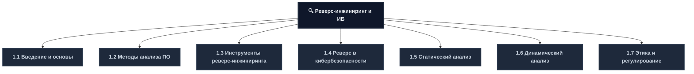
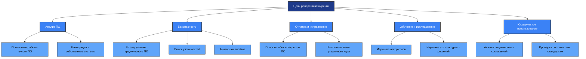
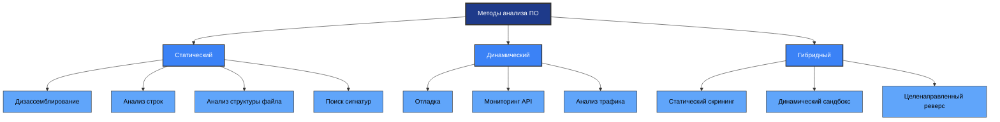
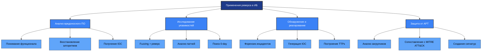
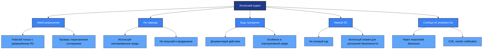
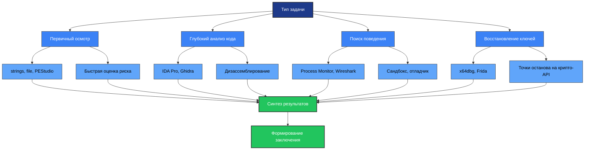

---
# 1.1 Введение в реверс-инжиниринг
## Определение и ключевые концепции
**Реверс-инжиниринг** — это процесс анализа готового программного обеспечения (обычно в виде исполняемого файла) с целью восстановления его исходной логики, архитектуры, алгоритмов и структуры без доступа к исходному коду.
## Обратный процесс разработки

| Направление | Процесс | Результат |
|------------|---------|-----------|
| **Прямая разработка** | Исходный код → Компиляция → Машинный код | Исполняемый файл |
| **Реверс-инжиниринг** | Машинный код → Дизассемблирование → Человекочитаемый код → Восстановление логики | Понимание работы программы |
## Классификация целей реверс-инжиниринга



## Почему реверс-инжиниринг важен в информационной безопасности?

| Причина | Описание | Практическое применение |
|---------|----------|----------------------|
| **Вредоносное ПО** | Часто поставляется в зашифрованном или обфусцированном виде | Понимание тактики и методов злоумышленников |
| **Сигнатуры** | Знание внутренней работы позволяет создавать детекты | Разработка сигнатур для IDS/IPS и антивирусов |
| **Контрмеры** | Понимание уязвимостей помогает создать защиту | Создание эффективных контрмер и патчей |
| **Расследование** | Анализ после инцидента | Проведение расследований (DFIR) |
| **Угрозы** | Идентификация новых векторов атак | Управление угрозами и Threat Hunting |

## Правовой статус реверс-инжиниринга

| Юрисдикция | Законность | Условия | Ограничения |
|-----------|-----------|---------|------------|
| **РФ** | Законен при условиях | Владелец ПО или лицензия с разрешением | Ст. 1259 ГК РФ, ст. 146 УК РФ |
| **США** | DMCA §1201(f) | Совместимость, безопасность, обучение | Запрет обхода DRM для копирования |
| **ЕС** | Директива 2009/24/EC | Декомпиляция для совместимости | Только необходимые части кода |
| **Международно** | Зависит от страны | Лицензионное соглашение | EULA может запрещать реверс |

---
# 1.2 Методы анализа программного обеспечения
## Классификация методов анализа

| Метод | Определение | Когда используется | Основные преимущества |
|-------|-----------|-------------------|---------------------|
| **Статический анализ** | Исследование кода без выполнения | На стадии разработки, первичный анализ вредоносов | Безопасность, полный охват кода |
| **Динамический анализ** | Изучение поведения во время выполнения | Когда нужна информация о реальном поведении | Видно реальное поведение, ключи |
| **Гибридный анализ** | Комбинация статического и динамического | Профессиональный анализ | Максимальная полнота информации |
## Сравнительная матрица методов


## Детальное сравнение статического и динамического анализа

| Критерий | Статический анализ | Динамический анализ |
|----------|-------------------|-------------------|
| **Выполнение кода** | Не требуется | Обязательно |
| **Безопасность** | Высокая (нет запуска) | Низкая (риск инфицирования) |
| **Полнота анализа** | Теоретически 100% кода | Только выполненные пути |
| **Обфускация** | Трудно анализировать | Обходится при выполнении |
| **Время анализа** | Быстрее для первичного осмотра | Медленнее, требует настройки среды |
| **Воспроизводимость** | Высокая | Зависит от условий выполнения |
| **Инструменты** | IDA Pro, Ghidra, strings | x64dbg, Process Monitor, Wireshark |
| **Результат** | Структура, логика, строки | Поведение, ключи, сетевая активность |
## Что анализируется в каждом методе
**Статический анализ:**
- Машинный код (бинарник)
- Дизассемблированный ассемблерный код
- Строки (текстовые константы, API-вызовы, URL, ключи)
- Структура PE/ELF-файлов (секции, импорты, экспорты, ресурсы)
- Контрольные суммы, магические числа, метаданные

**Динамический анализ:**
- Поток выполнения (последовательность вызовов функций)
- Состояние регистров и памяти в реальном времени
- Сетевой трафик, файловые операции, системные вызовы
- Криптографические операции (ключи, хеши, сессии)
- Анти-отладочные техники (проверки на отладчик, тайминги)
---
# 1.3 Инструменты реверс-инжиниринга
## Классификация инструментов по назначению

| Тип | Функция | Примеры | Когда использовать |
|-----|---------|---------|-------------------|
| **Дизассемблеры** | Перевод машинного кода в ассемблер | IDA Pro, Ghidra, Radare2, objdump | Глубокий анализ кода, восстановление логики |
| **Декомпиляторы** | Восстановление высокоуровневого кода | Hex-Rays, JD-GUI, FernFlower, JADX | Быстрое понимание логики, Java/.NET |
| **Отладчики** | Пошаговое выполнение, анализ памяти | x64dbg, WinDbg, GDB, OllyDbg | Динамический анализ, поиск ключей |
| **Анализаторы бинарников** | Структурный анализ PE/ELF/Mach-O | PEStudio, ExeInfo PE, pefile, lief | Первичная диагностика файлов |
| **Сандбоксы** | Изолированный запуск с мониторингом | Any.Run, Hybrid Analysis, Cuckoo | Безопасный запуск подозрительных файлов |
| **Мобильные инструменты** | Анализ APK/IPA, инструментирование | JEB, MobSF, Frida, apktool | Анализ мобильных приложений |
## IDA Pro — эталонный инструмент

**Возможности:**
- Глубокий анализ исполняемых файлов (Windows, Linux, macOS, embedded)
- Интерактивная графическая визуализация потока выполнения (Flow Chart)
- Автоматическое распознавание функций, строк, структур
- Плагин Hex-Rays: декомпиляция в псевдо-C (ключевой для быстрого понимания логики)
- Скрипты на Python (IDAPython) для автоматизации
- Поддержка отладки (Local/Remote debugger)

**Когда использовать:**
- Анализ сложных вредоносов (APT, ransomware)
- Исследование закрытых SDK и драйверов
- Восстановление алгоритмов шифрования/подписи
- Работа с firmware (через плагины типа ida-mips)
## Сравнение популярных инструментов

| Инструмент | Плюсы | Минусы | Лучшее применение |
|-----------|-------|--------|------------------|
| **IDA Pro** | Самый популярный, мощный декомпилятор, поддержка множества архитектур | Дорогой, проприетарный | Профессиональный анализ, коммерческие проекты |
| **Ghidra (NSA)** | Бесплатный, open-source, мощный декомпилятор | Интерфейс менее интуитивен, медленнее на больших файлах | Бюджетные проекты, обучение, исследования |
| **Radare2** | Лёгкий, CLI-ориентированный, идеален для автоматизации | Крутой порог входа, меньше GUI-возможностей | Скрипты, автоматизация, Linux-среда |
| **x64dbg** | Бесплатный, удобный отладчик для Windows, поддержка плагинов | Только для Windows, нет встроенного декомпилятора | Динамический анализ Windows-приложений |
## Дополнительные утилиты

| Утилита | Назначение | Пример использования |
|---------|-----------|---------------------|
| **strings** | Извлекает ASCII/Unicode строки из бинарника | Поиск URL, доменов, API-имён, ключей |
| **binwalk** | Анализ бинарных файлов на встроенные объекты | Обнаружение ZIP, PNG, ELF, firmware |
| **PEStudio** | Графический анализатор PE-файлов | Показ импортов/экспортов, секций, хешей |
| **ExifTool** | Анализ метаданных | Извлечение версии, автора из ресурсов EXE/DLL |

---
# 1.4 Реверс-инжиниринг в кибербезопасности
## Ключевые применения в ИБ


## Детальный разбор применений

| Область | Цель | Процесс | Результат |
|---------|------|---------|-----------|
| **Анализ вредоносного ПО** | Понять, что делает вредонос | Статический + динамический анализ | C2-серверы, методы персистента, шифрование |
| **Исследование уязвимостей** | Найти баги без исходного кода | Fuzzing + реверс, анализ патчей | Отчёт об уязвимости, PoC, рекомендация |
| **Обнаружение и реагирование** | Расследовать инцидент | Форензик, анализ процессов | IOC, TTPs, рекомендации по защите |
| **Защита от APT** | Противостоять целевым атакам | Анализ загрузчиков, сопоставление TTPs | Сигнатуры для SIEM/EDR, карта тактик |
## Пример: анализ ransomware LockBit

| Этап | Действия аналитика | Технические находки | MITRE ATT&CK |
|------|-------------------|-------------------|-------------|
| **Статический анализ** | Дизассемблирование, поиск строк | C2-домены, API-вызовы шифрования | T1486 (Data Encrypted) |
| **Динамический анализ** | Запуск в сандбоксе, мониторинг | Ключ шифрования, файлы-жертвы | T1486, T1078 (Valid Accounts) |
| **Реверс алгоритма** | Восстановление функции шифрования | Ключ из HardwareID, передача на C2 | T1573 (Encrypted Channel) |
| **Генерация IOC** | Извлечение индикаторов | Хеши, домены, пути файлов, ключи реестра | T1005 (Data from Local System) |
## Связь с другими компонентами ИБ

| Область | Как реверс помогает | Практический результат |
|---------|-------------------|---------------------|
| **Криптография** | Находит hard-coded ключи, реализацию алгоритмов, слабые RNG | Восстановление ключей, дешифрование данных |
| **Стеганография** | Обнаруживает встроенные изображения в ресурсах, декодеры | Извлечение скрытых данных из бинарников |
| **Сетевые атаки** | Раскрывает протоколы C2, методы обхода файрволов | Сигнатуры для сетевых IDS, блокировка C2 |
| **Управление угрозами** | Переход от обнаружения к пониманию | Основа для Threat Hunting и CTI |
| **SOC** | Обогащение инцидентов данными | Не просто «вредонос», а «вредонос с XOR-шифрованием, C2 на api.mal.ru» |

---
# 1.5 Статический анализ программного обеспечения
## Определение и принципы
**Статический анализ** исследует исходный код без его выполнения, выявляя уязвимости на стадии разработки программного обеспечения.
## Что анализируется при статическом анализе

| Объект анализа | Описание | Что можно обнаружить |
|---------------|----------|---------------------|
| **Машинный код** | Бинарный файл целиком | Структура, секции, точки входа |
| **Дизассемблированный код** | Ассемблерное представление | Логика программы, функции |
| **Строки** | Текстовые константы | URL, API-вызовы, ключи, сообщения |
| **Структура файла** | PE/ELF заголовки, секции | Импорт/экспорт, ресурсы, упаковщики |
| **Метаданные** | Контрольные суммы, сигнатуры | Время компиляции, автор, версия |
## Инструменты статического анализа

| Инструмент | Назначение | Ключевые функции |
|-----------|-----------|-----------------|
| **strings** | Извлечение печатных строк | Поиск URL, доменов, API, ключей |
| **objdump / readelf / pefile** | Анализ формата файла | Секции, импорты, экспорты |
| **IDA Pro / Ghidra / Radare2** | Дизассемблирование | Интерактивный анализ, графы вызовов |
| **Binwalk** | Обнаружение встроенных файлов | Архивы, изображения, прошивки |
| **ExifTool** | Анализ метаданных | Ресурсы DLL, версия, автор |
## Преимущества статического анализа

| Преимущество | Описание | Практическая ценность |
|-------------|----------|---------------------|
| **Безопасность** | Не требует запуска программы | Безопасно для анализа вредоносов |
| **Полнота** | Позволяет видеть всю логику сразу | Теоретический охват 100% кода |
| **Автоматизация** | Подходит для массового анализа | Интеграция в CI/CD, сканирование репозиториев |
| **Воспроизводимость** | Результаты не зависят от среды | Легко документировать и передавать |
## Недостатки и ограничения

| Недостаток | Описание | Мера компенсации |
|-----------|----------|-----------------|
| **Обфускация** | Трудно читать запутанный код | Деобфускация, динамический анализ |
| **Нет поведения** | Нет информации о динамике | Комбинировать с динамическим анализом |
| **Мусорный код** | Трудно отличить от реальной логики | Кросс-проверка с динамическими данными |
| **Условные переходы** | Не все пути выполняются | Символическое выполнение, fuzzing |

---
# 1.6 Динамический анализ программного обеспечения
## Определение и принципы
**Динамический анализ** изучает поведение программы во время выполнения, обнаруживая проблемы, проявляющиеся во время работы.
## Что анализируется при динамическом анализе

| Объект анализа | Описание | Инструменты мониторинга |
|---------------|----------|----------------------|
| **Поток выполнения** | Последовательность вызовов функций | Отладчики, трассировка |
| **Регистры и память** | Состояние в реальном времени | x64dbg, WinDbg, GDB |
| **Сетевой трафик** | Исходящие/входящие соединения | Wireshark, tcpdump |
| **Файловые операции** | Чтение/запись файлов | Process Monitor, strace |
| **Системные вызовы** | Взаимодействие с ОС | API Monitor, Frida |
| **Криптооперации** | Ключи, хеши, сессии | Отладчики, memory dump |
| **Анти-отладка** | Проверки на отладчик, тайминги | Специализированные плагины |
## Инструменты динамического анализа

| Инструмент | Назначение | Ключевые функции |
|-----------|-----------|-----------------|
| **Отладчики** | Пошаговое выполнение | Точки останова, просмотр памяти |
| **API Monitor / Process Monitor** | Перехват системных вызовов | I/O операции, реестр, файлы |
| **Wireshark / tcpdump** | Анализ сетевой активности | Перехват пакетов, протоколы |
| **Frida / QBDI** | Инструментирование на лету | Hooking, мобильные приложения |
| **Сандбоксы** | Изолированный запуск | Any.Run, Cuckoo, Hybrid Analysis |
## Преимущества динамического анализа

| Преимущество | Описание | Практическая ценность |
|-------------|----------|---------------------|
| **Реальное поведение** | Видно фактические действия программы | Обход обфускации и шифрования на лету |
| **Ключи и данные** | Можно восстановить генерируемые данные | Ключи шифрования, пароли, сессии |
| **Сетевая активность** | Фиксация C2-соединений | Блокировка доменов, IOC для SIEM |
| **Персистентность** | Обнаружение методов закрепления | Очистка системы, предотвращение повторного заражения |
## Недостатки и ограничения

| Недостаток | Описание | Мера компенсации |
|-----------|----------|-----------------|
| **Риск инфицирования** | Требует запуска программы | Изолированная среда (VM, сандбокс) |
| **Анти-отладка** | Может быть обнаружен программой | Скрытие отладчика, патчинг проверок |
| **Неполное покрытие** | Трудно воспроизвести все сценарии | Комбинирование со статическим анализом |
| **Время** | Медленнее статического анализа | Автоматизация сандбоксов |
## Комбинированный подход (Hybrid Analysis)

**Профессиональная методология:**
```
Шаг 1: Статический скрининг
• strings, binwalk, radare2
• Найти подозрительные строки, импорты, вложенные файлы

Шаг 2: Динамический сандбокс
• Запустить в изолированной среде
• Зафиксировать поведение

Шаг 3: Целенаправленный реверс
• Выбрать ключевые функции (CryptEncrypt, send, CreateFile)
• Анализировать в отладчике

Шаг 4: Кросс-проверка
• Сопоставить статические сигнатуры с динамическими событиями
```
---
# 1.7 Этика и регулирование в реверс-инжиниринге
## Этический кодекс реверс-инженера


## Правовые основы в различных юрисдикциях

| Юрисдикция | Закон | Разрешённые цели | Запрещённые действия |
|-----------|-------|-----------------|---------------------|
| **РФ** | ГК РФ ст. 1259, УК РФ ст. 146 | Безопасность, обучение, совместимость | Взлом, обход DRM для копирования |
| **США** | DMCA §1201(f) | Совместимость, безопасность, обучение | Обход защиты для нарушения авторских прав |
| **ЕС** | Директива 2009/24/EC | Декомпиляция для совместимости | Копирование функциональности |
| **Международно** | Зависит от страны | Лицензионное соглашение | Нарушение EULA |
## Матрица законности действий

| Действие | Цель | Законность | Требуемое разрешение |
|----------|------|-----------|---------------------|
| Анализ собственного ПО | Безопасность | ✅ Законно | Внутреннее |
| Анализ вредоносного ПО | Исследование | ✅ Законно | Изолированная среда |
| Декомпиляция для совместимости | Интеграция | ⚠️ Серая зона | Лицензия |
| Обход DRM для копирования | Копирование | ❌ Незаконно | — |
| Поиск уязвимостей в чужом ПО | Безопасность | ⚠️ Серая зона | Разрешение владельца |
| Публикация уязвимостей | Ответственное раскрытие | ✅ Законно | Через vendor/CVE |
## Responsible Disclosure (Ответственное раскрытие)

**Процесс этичного раскрытия уязвимостей:**
```
Шаг 1: Обнаружение
• Найти уязвимость
• Документировать воспроизведение

Шаг 2: Уведомление вендора
• Связаться с производителем
• Предоставить детали

Шаг 3: Ожидание патча
• Стандартный срок: 90 дней
• Возможность продления

Шаг 4: Публикация
• После выпуска патча
• Или по истечении срока

Шаг 5: CVE и документация
• Запросить CVE ID
• Опубликовать отчёт
```
---
# 📚 Приложения и ресурсы
## Рекомендуемая литература
**Книги и учебные пособия:**
- Олифер В.Г., Олифер Н.А. — Компьютерные сети. Принципы, технологии, протоколы. — СПб.: Питер, 2023.
- Таненбаум Э., Уэзеролл Д. — Компьютерные сети. — 5-е изд. — СПб.: Питер, 2022.
- Шаньгин В.Ф. — Информационная безопасность компьютерных систем и сетей. — М.: ФОРУМ, 2023.
- Баранов А.В. — Моделирование угроз информационной безопасности. — М.: Юрайт, 2024.
- Хоган Р. — Реверс-инжиниринг для начинающих. — М.: ДМК Пресс, 2023.
- Ельцов А. — Анализ вредоносного ПО. Практическое руководство. — СПб.: БХВ-Петербург, 2024.
**Нормативные документы:**
- ГОСТ Р ИСО/МЭК 27001-2021 — Системы менеджмента информационной безопасности.
- ГОСТ Р ИСО/МЭК 27005-2021 — Управление рисками информационной безопасности.
- Федеральный закон №152-ФЗ — О персональных данных.
- Федеральный закон №187-ФЗ — О безопасности критической информационной инфраструктуры РФ.
- Приказ ФСТЭК России №17 — Требования по защите информации в ГИС.
- Приказ ФСТЭК России №21 — Требования по защите ПДн.
- Приказ ФСТЭК России №31 — Требования по защите КИИ.
## Шпаргалка: выбор метода анализа


