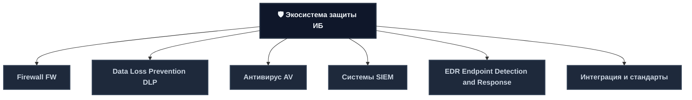
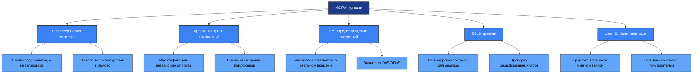
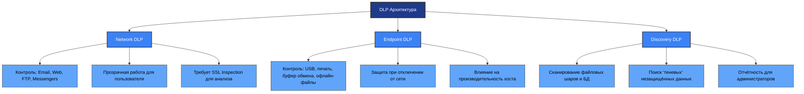
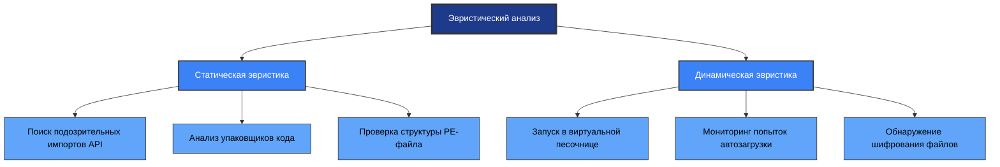
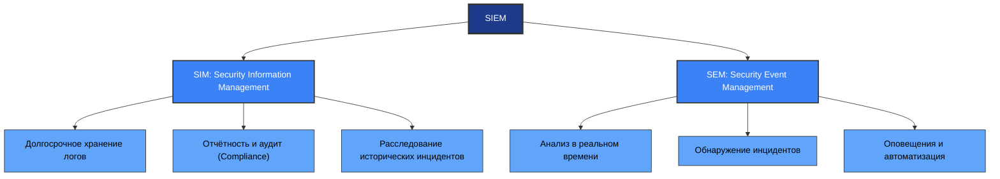
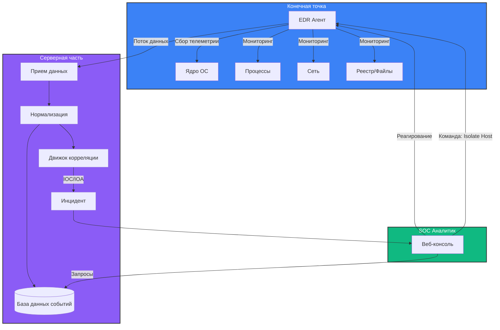
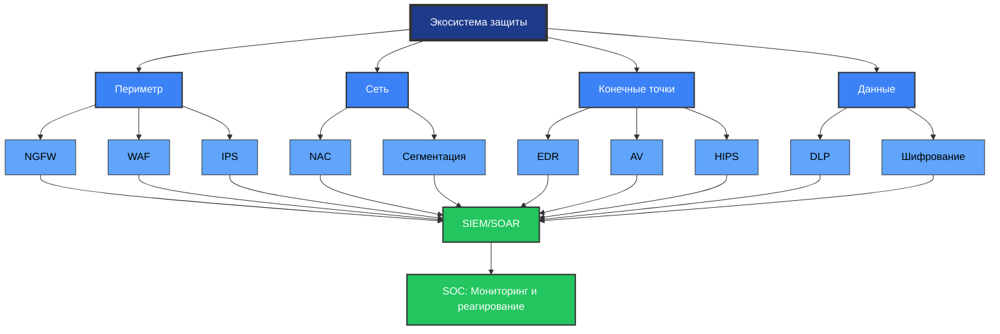
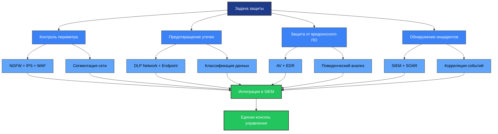

---
# Firewall FW
## Эволюция технологий фильтрации
**Межсетевой экран (МСЭ)** — это барьер между сетями с разным уровнем доверия (например, Интернет и локальная сеть).

| Поколение                     | Технология                     | Уровень OSI      | Принцип работы                                                                | Ограничения                                                                       |
| ----------------------------- | ------------------------------ | ---------------- | ----------------------------------------------------------------------------- | --------------------------------------------------------------------------------- |
| **1-е (Packet Filter)**       | Статическая фильтрация пакетов | L3 (Network)     | Проверка IP, портов, протоколов                                               | Не понимает контекст соединения. Уязвим для спуфинга                              |
| **2-е (Stateful Inspection)** | Инспекция состояний            | L3-L4            | Отслеживание таблиц состояний (ESTABLISHED, NEW). Помнит контекст сессии      | Не видит содержимое пакетов (payload). Пропускает атаки внутри разрешенных портов |
| **3-е (Application Proxy)**   | Прокси-фильтрация              | L7 (Application) | Полная реконструкция сессии. Понимает протоколы (HTTP, FTP)                   | Низкая производительность. Сложность настройки                                    |
| **4-е (NGFW)**                | Next-Generation Firewall       | L3-L7            | Объединяет Stateful Inspection + DPI + IPS + App Control + Identity Awareness | Высокая стоимость и требования к ресурсам                                         |
## Ключевые функции современного NGFW


### 1. Deep Packet Inspection (DPI)
- Глубокий анализ содержимого пакета, а не только заголовков
- Позволяет различать приложения, использующие нестандартные порты (например, Skype через порт 80)
- Выявляет сигнатуры атак внутри полезной нагрузки (payload)
### 2. Контроль приложений (App-ID)
- Идентификация приложения независимо от порта, протокола или шифрования (SSL Decryption)
- Пример политики: "Разрешить доступ к `Facebook` только для группы `Marketing`, но запретить `Facebook Games` и `Chat`"
### 3. Встроенная система предотвращения вторжений (IPS)
- Активная блокировка эксплойтов и сетевых атак в реальном времени на основе сигнатур и аномалий
- Защита от DoS/DDoS
- Блокировка сканирования уязвимостей
- Предотвращение эксплуатации CVE
### 4. Расшифровка SSL/TLS (SSL Inspection)
- До 80% трафика сейчас зашифровано. NGFW выступает в роли "Человек посередине" (MITM):
  - Расшифровывает входящий трафик своим сертификатом
  - Проверяет содержимое на вирусы и угрозы
  - Зашифровывает обратно и отправляет пользователю
- **Важно**: Для корректной работы требуется распространение корневого сертификата FW на все клиентские устройства через Group Policy
### 5. Идентификация пользователей (User-ID)
- Привязка сетевого трафика не к IP-адресу (который может меняться), а к конкретной учетной записи (Active Directory User)
- Политика: "Пользователь `Ivanov` может ходить в Интернет, а `Guest` — нет", вместо "Подсеть 192.168.1.0/24 имеет доступ"
## Типы развертывания

| Тип | Описание | Применение | Преимущества | Ограничения |
|-----|----------|-----------|--------------|-------------|
| **Периметральное (Gateway)** | На границе сети (Internet Edge) | Основной рубеж обороны | Централизованное управление, контроль всего трафика | Единая точка отказа, сложность масштабирования |
| **Сегментация (Internal)** | Внутри сети для разделения VLAN | Реализация Zero Trust, изоляция отделов | Ограничение латерального движения, защита критичных сегментов | Сложность настройки правил, нагрузка на сеть |
| **Виртуальное (vFW)** | В виртуальных средах и облаках | Защита ВМ, контейнеров, облачных сервисов | Гибкость, автоматизация, масштабируемость | Зависимость от гипервизора, требования к ресурсам |
| **Персональное (Host-based)** | Встроенный фаервол ОС | Последний рубеж на хосте | Защита при отключении от сети, индивидуальный контроль | Сложность централизованного управления, влияние на производительность |
## Пример логики правила (Policy Matrix)

| Source Zone | Source User | Dest Zone | Dest App | Action | Profile (Security) | Log |
|-------------|-------------|-----------|----------|--------|-------------------|-----|
| Trust (LAN) | Any | Untrust (WAN) | SSL, DNS | Allow | Antivirus, IPS | Session End |
| Trust (LAN) | HR_Group | Untrust (WAN) | Web-Browsing | Allow | URL-Filtering (Block Gambling) | Threat |
| Trust (LAN) | Guest_Group | Untrust (WAN) | Any | Deny | — | Session Start |
| Any | Any | DMZ (Servers) | SSH | Allow | Brute-Force Protection | Threat |
## Интеграция и автоматизация

| Интеграция | Назначение | Пример сценария |
|-----------|-----------|---------------|
| **SIEM** | Отправка логов трафика и угроз | Критически важно для расследования инцидентов |
| **SD-WAN** | Динамическое управление маршрутами | На основе качества каналов и политик безопасности |
| **Threat Intelligence** | Автоматическое обновление списков блокировки | Обновление IP, Domain, URL из внешних источников угроз |
| **SOAR** | Автоматическая блокировка атакующего | При алерте от SIEM — блокировка на всех фаерволах |

---
# Data Loss Prevention DLP
## Концепция защиты данных
**DLP-система** — это комплекс программно-аппаратных средств, предназначенный для предотвращения утечек конфиденциальной информации за пределы периметра организации или несанкционированного доступа внутри него.
## Три состояния данных, которые защищает DLP

| Состояние | Описание | Основные угрозы | Меры защиты |
|-----------|----------|---------------|-------------|
| **Data in Motion** | Данные в движении (email, веб-трафик, мессенджеры, FTP) | Перехват, MITM-атаки, сниффинг | Шифрование (TLS/IPSec), NGFW, IDS/IPS, DLP Network |
| **Data at Rest** | Данные в покое (файловые серверы, базы данных, рабочие станции) | Кража носителей, несанкционированный доступ | Шифрование дисков, DLP Discovery, контроль доступа |
| **Data in Use** | Данные в использовании (копирование в буфер обмена, печать, запись на USB) | Утечки через инсайдеров, вредоносное ПО | Endpoint DLP, HIPS, защита процессов |
## Методы классификации и обнаружения данных

| Метод | Описание | Эффективность | Пример использования |
|-------|----------|--------------|---------------------|
| **Регулярные выражения (Regex)** | Поиск по маске (шаблону) | Высокая для структурированных данных | Номера паспортов, кредитных карт, ИНН, СНИЛС |
| **Ключевые слова и словари** | Поиск конкретных фраз или списков терминов | Средняя (много ложных срабатываний) | "Коммерческая тайна", "Строго конфиденциально", список фамилий |
| **Точный отпечаток (Fingerprinting)** | Хэширование эталонных документов целиком или по блокам | Очень высокая | Защита конкретных договоров, чертежей, баз данных клиентов |
| **Статистический анализ (NLP/ML)** | Использование машинного обучения для понимания смысла текста | Высокая для неструктурированных данных | Автоматическое определение тональности письма, выявление резюме |
| **Метки (Watermarking/Tagging)** | Чтение встроенных меток (Microsoft AIP, права доступа) | Абсолютная (если метка проставлена) | Файл помечен как "Confidential" в Azure Information Protection |
## Архитектура и каналы контроля


### 1. Сетевой шлюз (Network DLP)
- Размещается на границе сети (в разрыв или в режиме зеркалирования трафика)
- Контроль: Email (SMTP), Веб (HTTP/HTTPS), FTP, Instant Messengers
- Особенность: Работает прозрачно для пользователя. Требует расшифровки SSL/TLS (MITM) для анализа защищенного трафика
### 2. Агент на рабочей станции (Endpoint DLP)
- Устанавливается на ПК сотрудников
- Контроль: USB-накопители, печать (виртуальный принтер), буфер обмена, скриншоты, работа с офлайн-файлами
- Особенность: Защищает данные даже когда ноутбук отключен от корпоративной сети
### 3. Серверное хранилище (Discovery)
- Сканер, который проверяет файловые шары и базы данных
- Задача: Найти, где хранятся незащищенные чувствительные данные ("теневые данные"), и сообщить администратору для перемещения или шифрования

## Сценарии реагирования (Policy Actions)

| Действие | Описание | Когда применять | Последствия для пользователя |
|----------|----------|---------------|----------------------------|
| **Block** | Полная блокировка передачи | Критичные нарушения, явные утечки | Сообщение об ошибке, невозможность выполнить действие |
| **Quarantine** | Помещение объекта в карантин | Подозрительные действия, требующие проверки | Задержка отправки, уведомление офицера ИБ |
| **Encrypt** | Автоматическое шифрование файла перед отправкой | Отправка конфиденциальных данных внешним получателям | Получатель должен иметь ключ/сертификат для доступа |
| **Mask/Redact** | Замена конфиденциальных данных на символы в потоке | Демонстрация, тестирование, частичная защита | Данные частично скрыты, контекст сохранён |
| **Notify User** | Всплывающее предупреждение сотруднику | Обучающий эффект, профилактика нарушений | Пользователь получает информацию о политике |
| **Log & Alert** | Тихая регистрация события и отправка алерта в SIEM | Расследование, профилирование поведения инсайдера | Действие выполняется, но фиксируется для анализа |
## Проблема шифрованного трафика

Современные мессенджеры (Telegram, WhatsApp Web) используют сквозное шифрование. Сетевая DLP не видит содержимое сообщений, только факт передачи данных.
**Решения:**
- Использование Endpoint-агентов (перехват ввода с клавиатуры или скриншоты)
- Внедрение корпоративных версий мессенджеров с контролем ключей
- Политики запрета использования несанкционированных каналов связи
## Регуляторное соответствие (Compliance)

| Регулятор | Область применения | Требования к DLP |
|-----------|-------------------|-----------------|
| **152-ФЗ (РФ)** | Защита персональных данных (ПДн) | Контроль обработки и передачи ПДн, логирование действий |
| **GDPR (ЕС)** | Штрафы за утечку данных граждан ЕС | Право на забвение, уведомление об утечках в 72 часа |
| **PCI DSS** | Защита данных банковских карт | Мониторинг передачи данных карт, шифрование, контроль доступа |
| **Коммерческая тайна** | Защита ноу-хау и интеллектуальной собственности | Классификация данных, контроль копирования и передачи |
## Интеграция

| Интеграция | Назначение | Пример сценария |
|-----------|-----------|---------------|
| **SIEM** | Передача всех попыток нарушений для построения профиля риска сотрудника | Корреляция утечек с другими событиями безопасности |
| **HR-системы** | Синхронизация списка увольняемых сотрудников для ужесточения политик контроля | Автоматическое усиление контроля в последний месяц работы |
| **Active Directory** | Групповые политики для автоматической установки агентов и применения настроек | Централизованное управление политиками по группам пользователей |

---
# Антивирус AV
## Определение и эволюция
**Антивирус (AV)** — это программное обеспечение, предназначенное для обнаружения, предотвращения и нейтрализации вредоносного ПО (malware).
## Эволюция подхода

| Период | Подход | Характеристика | Ограничения |
|--------|--------|---------------|-------------|
| **1980-1990** | Сигнатурный анализ | Поиск известных образцов | Бесполезен против новых угроз |
| **2000-2010** | Эвристика + HIPS | Проактивная защита, анализ поведения | Высокий процент ложных срабатываний |
| **2015-н.в.** | Гибридный (Cloud AI + Local) | Машинное обучение, облачные базы, поведенческий анализ | Требует постоянного соединения, сложность настройки |

**Ключевое отличие**: Антивирус фокусируется на объекте (файле), пытаясь ответить на вопрос: "Является ли этот файл вредоносным?".  
**EDR** фокусируется на процессе и поведении, отвечая на вопрос: "Что делает этот процесс и является ли его цепочка действий атакой?".
## Глубокий разбор методов детектирования
### 1. Сигнатурный анализ (Signature-Based)
Классический метод, основанный на сравнении кода файла с базой известных угроз.

| Тип сигнатуры | Описание | Плюсы | Минусы |
|--------------|----------|-------|--------|
| **Байтовая последовательность** | Уникальная цепочка байтов внутри файла | Высокая точность, низкий % ложных срабатываний | Бесполезна против полиморфных вирусов (меняющих код) |
| **Хэш-сумма** | MD5, SHA-1, SHA-256 всего файла | Мгновенная проверка | Любое изменение файла (даже 1 бит) меняет хэш и обходит защиту |
| **Нечёткий хэш (Fuzzy Hash)** | Алгоритмы типа ssdeep. Позволяют находить похожие файлы | Находит модификации известного малвари | Требует больше ресурсов на вычисление |
| **YARA-правила** | Гибкие правила поиска по строкам, HEX-паттернам и метаданным | Гибкость, возможность описания семейств малвари | Требует экспертизы для создания правил |
### 2. Эвристический анализ (Heuristics)

Анализ структуры и логики программы без её запуска (статический) или в эмуляторе.



**Статическая эвристика:**
- Поиск подозрительных импортов API (например, `WriteProcessMemory`, `SetWindowsHookEx`)
- Анализ упаковщиков кода (UPX, ASPack)
- Проверка странных секций в PE-файле

**Динамическая эвристика (Эмуляция):**
- Запуск кода в виртуальной "песочнице" внутри антивируса
- Если программа пытается прописать себя в автозагрузку или зашифровать файлы — она блокируется
### 3. Поведенческий анализ (Behavioral Monitoring)

Мониторинг активности в реальном времени.

| Объект мониторинга | Что отслеживается | Пример детекта |
|-------------------|------------------|---------------|
| **Файловая система** | Массовое переименование/шифрование | Блокировка ransomware-активности |
| **Реестр** | Изменение ключей автозапуска | Предотвращение персистентности |
| **Процессы** | Инъекции кода, подозрительные цепочки | Обнаружение Process Hollowing |
| **Сеть** | Подозрительные исходящие соединения | Блокировка C2-трафика |
## Ограничения классического AV

| Ограничение | Описание | Современное решение |
|------------|----------|-------------------|
| **Fileless-атаки** | Зловредный код живёт только в оперативной памяти (PowerShell, WMI, Macros) | EDR с мониторингом памяти и поведенческим анализом |
| **Zero-day** | Новые угрозы, сигнатуры которых еще не выпущены вендором | Облачный машинный интеллект, песочницы |
| **Отсутствие контекста** | AV видит факт заражения, но не видит цепочку атаки | Интеграция с SIEM, корреляция событий |
| **Уклонение от детекта** | Обфускация, полиморфизм, упаковка | Эвристика, анализ поведения, sandboxing |
## Интеграция в экосистему ИБ

Антивирус не работает в вакууме. В современной архитектуре он передает данные в:

| Интеграция | Назначение | Пример сценария |
|-----------|-----------|---------------|
| **SIEM** | Логи обнаружений и блокировок (Event ID, имя угрозы, путь к файлу) | Корреляция с сетевыми событиями для расследования |
| **EDR** | Современные AV-агенты часто являются легковесными сенсорами для EDR-платформ | Обогащение телеметрии поведенческими данными |
| **Sandbox** | Подозрительные файлы автоматически отправляются в изолированную среду для глубокого анализа | Автоматический анализ новых угроз без риска для инфраструктуры |

---
# Системы SIEM (Security Information and Event Management)

## Определение и роль в SOC
**SIEM** — это централизованная платформа для сбора, нормализации, корреляции и анализа логов безопасности со всей IT-инфраструктуры. Это "мозговой центр" службы информационной безопасности (SOC).
## Две основные функции


## Этапы обработки данных

| Этап | Описание | Результат |
|------|----------|-----------|
| **Сбор (Collection)** | Агентный или безагентный сбор логов с источников | Сырые события в едином формате |
| **Нормализация (Normalization)** | Приведение разношерстных логов к единой схеме (CEF, ECS) | Стандартизированные поля (src_ip, user, action) |
| **Обогащение (Enrichment)** | Добавление контекста: геолокация, владелец, репутация | События с дополнительной информацией для анализа |
| **Корреляция (Correlation)** | Связывание событий во времени и по логике атаки | Инциденты с уровнем критичности |
| **Хранение (Storage)** | Горячее (быстрый доступ) и холодное (архив) хранение | Долгосрочная аналитика и соответствие требованиям |
## Типы правил корреляции (Use Cases)

| Тип правила | Логика | Пример сценария |
|------------|--------|----------------|
| **Пороговое (Threshold)** | Количество событий > N за время T | 10 неудачных логинов за 1 минуту с одного IP (Brute Force) |
| **Последовательное (Sequence)** | Событие А → затем Б → затем В | Сканирование портов → Эксплойт → Успешный вход |
| **Аномальное (Behavioral)** | Отклонение от базовой линии (Baseline) | Пользователь скачал 50 ГБ данных ночью (обычно 100 МБ днём) |
| **Cross-Source** | События из разных источников | FW разрешил соединение + EDR зафиксировал запуск shell-скрипта |
| **Отсутствие событий** | Ожидание события, которое не пришло | Сервер перестал присылать логи (возможно, скомпрометирован) |
## Пример сложного правила (Kill Chain)

```
Recon: IDS зафиксировал сканирование уязвимости CVE-2023-XXXX
Exploitation: Web Server зафиксировал ошибку 500 с подозрительным payload в URL
Execution: EDR на сервере зафиксировал запуск cmd.exe от имени процесса веб-сервера (w3wp.exe)
Alert: Генерация инцидента критического уровня "Web Compromise"
```
## Компоненты интерфейса и аналитики

| Компонент | Назначение | Практическое применение |
|-----------|-----------|----------------------|
| **Дашборды (Dashboards)** | Визуализация текущего состояния | Top атакующих IP, Top целевых хостов, Статус агентов |
| **Investigation Workbench** | Инструмент для ручного расследования | Построение временной шкалы (timeline) по пользователю или хосту |
| **Отчетность (Reporting)** | Автоматическая генерация отчетов | Отчеты для регуляторов (ФСТЭК, ЦБ РФ, GDPR) и руководства |
## Проблемы внедрения

| Проблема | Описание | Мера снижения |
|----------|----------|--------------|
| **Шум (False Positives)** | Слишком много ложных срабатываний утомляет аналитиков | Тонкая настройка правил, машинное обучение, приоритизация |
| **Объем данных** | Хранение сырых логов требует огромных дисковых ресурсов | Горячее хранение (30 дней) + холодное архивирование (1 год+) |
| **Нехватка контекста** | Без обогащения данными об активах сложно понять критичность атаки | Интеграция с CMDB, Active Directory, системами инвентаризации |
| **Дефицит экспертизы** | Недостаток квалифицированных аналитиков | Автоматизация (SOAR), обучение, аутсорсинг SOC |
## Стандарты и форматы

| Стандарт | Описание | Применение |
|----------|----------|-----------|
| **CEF (Common Event Format)** | Стандарт от ArcSight/MicroFocus | Унификация формата логов от разных вендоров |
| **LEEF** | Стандарт от IBM QRadar | Альтернатива CEF для экосистемы IBM |
| **ECS (Elastic Common Schema)** | Схема от Elastic Stack | Для работы с ELK/Elasticsearch |
| **RFC 5424** | Стандарт протокола Syslog | Базовый протокол передачи логов |

---
# EDR (Endpoint Detection and Response)
## Концепция и отличия
**EDR** — это технология непрерывного мониторинга конечных точек (компьютеры, серверы), сбора телеметрии, выявления сложных угроз и автоматизированного реагирования.

 **Главная философия EDR**: "Мы предполагаем, что злоумышленник уже внутри периметра. Наша задача — найти его действия, остановить их и понять масштаб ущерба."
## Сравнение: AV vs EDR

| Характеристика | Антивирус (AV) | EDR |
|---------------|---------------|-----|
| **Фокус** | Известные угрозы (файлы) | Поведение, цепочки атак, память |
| **Данные** | Факт блокировки/лечения | Полная телеметрия (процессы, сеть, реестр, PowerShell) |
| **Реагирование** | Удалить/Карантин | Изоляция хоста, убийство процесса, откат изменений (Rollback) |
| **Расследование** | Минимальное (лог события) | Глубокое (Timeline атаки, визуализация графа процессов) |
| **Угрозы** | Массовый малварь, трояны | APT, Fileless, Lateral Movement, Ransomware |
## Архитектура и принцип работы


## Ключевые компоненты телеметрии
EDR-агент собирает данные в реальном времени:

| Компонент | Что собирается | Практическая ценность |
|-----------|---------------|---------------------|
| **Process Creation** | Кто запустил процесс, родительский процесс (PPID), командная строка | Обнаружение obfuscated PowerShell, аномальных цепочек запуска |
| **Network Connections** | Исходящие соединения, DNS-запросы, привязка процесса к порту | Выявление C2-трафика, подозрительных доменов |
| **File Operations** | Создание, изменение, удаление файлов (особенно в системных папках) | Обнаружение ransomware, дропперов, персистентности |
| **Registry Changes** | Мониторинг ключей автозагрузки и конфигурации безопасности | Предотвращение закрепления злоумышленника в системе |
| **Memory Scans** | Поиск инъекций кода (Process Hollowing, DLL Injection) в оперативной памяти | Обнаружение fileless-атак, скрытых процессов |
## Методы обнаружения: IOC vs IOA
### IOC (Indicators of Compromise)
Артефакты, указывающие на то, что взлом уже произошел.

| Тип | Примеры | Ограничение |
|-----|---------|------------|
| **Хэши файлов** | MD5/SHA256 вредоносных файлов | Легко меняются при перекомпиляции |
| **Вредоносные IP/домены** | Адреса C2-серверов | Быстро меняются, используют доменные генераторы |
| **Специфические имена файлов** | Пути, имена процессов | Просты для обфускации |
### IOA (Indicators of Attack)
Поведенческие паттерны, указывающие на процесс атаки, независимо от используемых инструментов.

| Паттерн | Описание | Пример детекта |
|---------|----------|---------------|
| **Living off the Land (LotL)** | Использование легитимных утилит (`powershell.exe`, `wmic.exe`, `psexec`) для вредоносных целей | PowerShell с флагом `-enc`, запущенный из Word |
| **Credential Dumping** | Попытка чтения памяти процесса `lsass.exe` | Доступ к LSASS от непроцесса системы |
| **Lateral Movement** | Аномальные RDP сессии или SMB-подключения между рабочими станциями | Рабочая станция подключается к другой рабочей станции по SMB |
| **Defense Evasion** | Отключение логов, очистка Event Logs, остановка служб безопасности | Процесс останавливает службу антивируса |
## Сценарий обнаружения (Use Case)
**Атака**: Злоумышленник использует PowerShell для загрузки полезной нагрузки из интернета.

**Детект EDR**:
1. Процесс `winword.exe` (Word) порождает `powershell.exe` (Аномалия родителя)
2. В командной строке PowerShell обнаружен флаг `-enc` (Base64 кодировка)
3. PowerShell устанавливает соединение с внешним IP, отсутствующим в белом списке

**Действие**: EDR автоматически убивает дерево процессов и изолирует хост от сети.
## Возможности реагирования (Response)

| Функция | Описание | Сценарий применения |
|---------|----------|-------------------|
| **Host Isolation** | Полное отключение зараженной машины от корпоративной сети (остается связь только с консолью управления) | Сдерживание распространения угрозы при обнаружении ransomware |
| **Process Kill** | Принудительное завершение вредоносного процесса и его потомков | Остановка вредоносной активности в реальном времени |
| **File Quarantine/Delete** | Перемещение файла в карантин или удаление | Устранение источника угрозы после анализа |
| **Remediation (Rollback)** | Откат изменений, сделанных зловредом (удаление созданных файлов, восстановление реестра, расшифровка файлов после ransomware-атаки) | Восстановление системы после атаки |
| **Remote Shell** | Безопасный доступ к консоли хоста для расследования | Глубокий анализ инцидента без физического доступа |
## Интеграция

| Интеграция | Назначение | Пример сценария |
|-----------|-----------|---------------|
| **SIEM** | EDR отправляет высокоуровневые алерты и сырые логи для долгосрочного хранения и корреляции | Корреляция с сетевыми событиями для полного расследования |
| **SOAR** | Автоматизация рутинных действий | При алерте "Ransomware" → SOAR через API EDR изолирует хост и создает тикет |
| **Threat Intelligence** | Автоматическая загрузка свежих IOC из платформ разведки угроз | Блокировка новых угроз до появления сигнатур |

---
## Интеграция и стандарты
## Архитектура интегрированной защиты


## Матрица стандартов и регуляторов

| Стандарт/Регулятор | Область применения | Требования к средствам защиты | Метод проверки |
|-------------------|-------------------|-----------------------------|---------------|
| **ФСТЭК №17** | ГИС | Межсетевое экранирование, антивирус, контроль доступа | Аттестация, испытания СЗИ |
| **ФСТЭК №21** | ПДн | Защита от НСД, антивирус, анализ защищённости | Аттестация, декларирование |
| **ФСТЭК №31** | КИИ | Сегментация, мониторинг, реагирование на инциденты | Категорирование, аттестация |
| **152-ФЗ** | ПДн (общие) | Технические и организационные меры защиты | Проверка Роскомнадзора |
| **187-ФЗ** | КИИ | Защита критической инфраструктуры | Категорирование, контроль ФСТЭК |
| **PCI DSS** | Платёжные данные | Фаерволы, шифрование, мониторинг, антивирус | Аудит, отчёт об оценке (ROC) |
| **ISO 27001** | СМИБ | Управление рисками, выбор мер защиты | Сертификация, внутренний аудит |
## Интеграция и автоматизация

| Интеграция | Назначение | Пример сценария |
|-----------|-----------|---------------|
| **SIEM ↔ NGFW** | Централизованный сбор логов, автоматическая блокировка | При алерте SIEM о сканировании — добавление правила на фаервол |
| **SIEM ↔ EDR** | Обогащение инцидентов, координация реагирования | EDR обнаруживает угрозу → алерт в SIEM → изоляция хоста |
| **SIEM ↔ DLP** | Корреляция утечек с другими событиями | Попытка отправки ПДн + аномальная активность пользователя = высокий риск |
| **SOAR ↔ Все системы** | Автоматизация рутинных действий | При алерте "Ransomware" → SOAR изолирует хост через EDR и блокирует IP на NGFW |
| **Threat Intelligence ↔ SIEM/EDR/NGFW** | Автоматическое обновление индикаторов угроз | Загрузка свежих IOC из платформы разведки во все системы защиты |
## Принципы построения эффективной экосистемы

| Принцип | Описание | Практическая реализация |
|---------|----------|----------------------|
| **Единая картина угроз** | Все системы должны обмениваться данными для формирования целостной картины | Интеграция через SIEM, использование стандартных форматов (CEF, ECS) |
| **Автоматизация реагирования** | Ручное реагирование слишком медленное для современных угроз | Внедрение SOAR, настройка playbooks для типовых инцидентов |
| **Масштабируемость** | Архитектура должна расти вместе с инфраструктурой | Облачные решения, микросервисная архитектура, горизонтальное масштабирование |
| **Соответствие регуляторам** | Защита должна соответствовать законодательным требованиям | Регулярный аудит, документирование процессов, сертификация компонентов |

---
# 📚 Приложения и ресурсы
## Рекомендуемая литература
**Учебные пособия и монографии:**
- Шаньгин В.Ф. — Информационная безопасность компьютерных систем и сетей. — М.: ФОРУМ, 2023.
- Девянин П.Н. — Теоретические основы компьютерной безопасности. — М.: Радио и связь, 2022.
- Молчанов А.А. — Практическое руководство по построению защищённой инфраструктуры. — М.: ДМК Пресс, 2024.
- Баранов А.В. — Моделирование угроз и выбор средств защиты. — М.: Юрайт, 2024.

**Нормативные документы:**
- Приказ ФСТЭК России №17 — Требования по защите информации в ГИС
- Приказ ФСТЭК России №21 — Требования по защите ПДн
- Приказ ФСТЭК России №31 — Требования по защите КИИ
- Федеральный закон №152-ФЗ — О персональных данных
- Федеральный закон №187-ФЗ — О безопасности критической информационной инфраструктуры РФ
- ГОСТ Р ИСО/МЭК 27001-2021 — Системы менеджмента информационной безопасности
---
# Шпаргалка: выбор средств защиты


