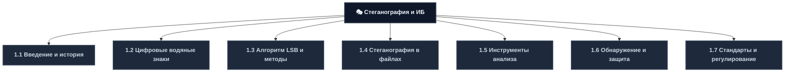
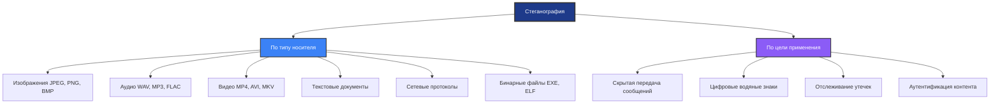
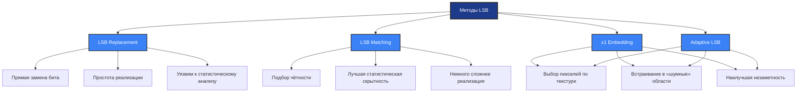
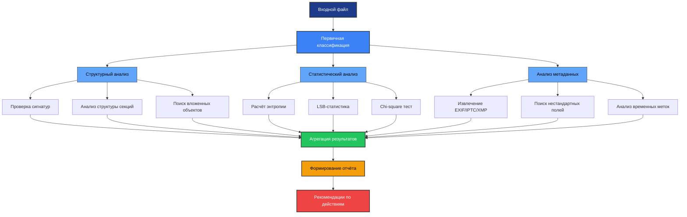
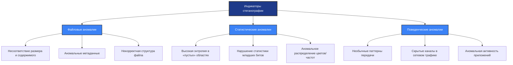
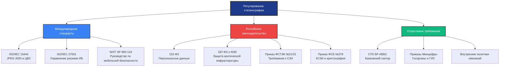
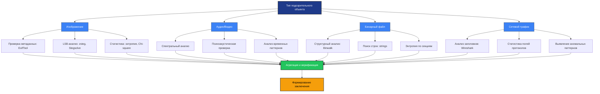

---
# 1.1 Введение в стеганографию и исторический контекст
## Определение и ключевые отличия

| Критерий | Криптография | Стеганография |
|----------|-------------|---------------|
| **Основная цель** | Скрыть содержание информации | Скрыть факт передачи информации |
| **Видимость** | Шифротекст очевиден | Наличие сообщения незаметно |
| **Защита от** | Перехвата и чтения | Обнаружения самого факта связи |
| **Применение** | Защита данных при передаче | Скрытая коммуникация, маркировка |
| **Уязвимость** | Криптоанализ | Стеганоанализ, статистические методы |

## Классификация стеганографических методов

## Историческая эволюция методов

| Период | Метод | Носитель | Принцип работы | Актуальность |
|--------|-------|----------|---------------|--------------|
| **Древность** | Восковые таблички | Воск на дереве | Сообщение под слоем воска | Исторический интерес |
| **V в. до н.э.** | Сцитала | Пергамент | Транспозиция при разворачивании | Образовательный |
| **Средневековье** | Невидимые чернила | Бумага | Химическая реакция при проявлении | Нишевое применение |
| **XX век** | Микроточки | Фотографии | Уменьшение изображения до точки | Устарело |
| **1990-е** | Цифровая стеганография | Изображения | Модификация битов пикселей | Активно используется |
| **2010-е** | Сетевая стеганография | Протоколы | Использование полей заголовков | Актуально для APT |
| **2020-е** | Гибридные методы | Мультимедиа + шифрование | Комбинация стеганографии и криптографии | Передовой край |

---
# 1.2 Цифровые водяные знаки (ЦВЗ)
## Определение и классификация ЦВЗ

| Тип ЦВЗ | Видимость | Устойчивость | Основное применение | Пример |
|---------|-----------|--------------|-------------------|--------|
| **Видимые** | Да (логотип, текст) | Высокая | Брендинг, предотвращение копирования | Водяной знак на фото в фотостоке |
| **Невидимые робастные** | Нет | Очень высокая | Защита авторских прав, отслеживание | ЦВЗ в кинопрокате для выявления утечек |
| **Невидимые хрупкие** | Нет | Низкая | Аутентификация, обнаружение изменений | Проверка целостности документа |
| **Полувидимые** | Частично | Средняя | Баланс между заметностью и защитой | Прозрачный логотип в углу видео |
## Технические требования к цифровым водяным знакам

```mermaid
graph TD
    A[Требования к ЦВЗ] --> B[Робастность]
    A --> C[Незаметность]
    A --> D[Ёмкость]
    A --> E[Безопасность]
    A --> F[Авторизация]
    
    B --> B1[Устойчивость к сжатию]
    B --> B2[Устойчивость к обрезке]
    B --> B3[Устойчивость к фильтрам]
    
    C --> C1[Отсутствие визуальных артефактов]
    C --> C2[Сохранение качества аудио]
    
    D --> D1[Объём встраиваемых данных]
    D --> D2[Эффективность кодирования]
    
    E --> E1[Защита от удаления]
    E --> E2[Криптостойкость схемы]
    
    F --> F1[Верификация без оригинала]
    F --> F2[Поддержка слепых детекторов]
    
    style A fill:#1e3a8a,color:#ffffff,stroke:#333333,stroke-width:3px
    style B fill:#3b82f6,color:#ffffff,stroke:#333333,stroke-width:2px
    style C fill:#3b82f6,color:#ffffff,stroke:#333333,stroke-width:2px
    style D fill:#3b82f6,color:#ffffff,stroke:#333333,stroke-width:2px
    style E fill:#3b82f6,color:#ffffff,stroke:#333333,stroke-width:2px
    style F fill:#3b82f6,color:#ffffff,stroke:#333333,stroke-width:2px
```

## Методы внедрения по типам контента

| Тип контента | Область внедрения | Метод | Преимущества | Ограничения |
|-------------|------------------|-------|--------------|-------------|
| **Изображения (пространственная)** | Пиксели | LSB, модификация яркости | Простота, высокая ёмкость | Уязвим к сжатию |
| **Изображения (частотная)** | DCT/DWT-коэффициенты | Встраивание в средние частоты | Устойчивость к JPEG | Сложнее реализация |
| **Аудио** | Временная/частотная область | Маскировка по психоакустике | Незаметность для слуха | Низкая ёмкость |
| **Видео** | I-кадры, движение | Распределение по кадрам | Высокая устойчивость | Вычислительная сложность |
| **Текст** | Форматирование, символы | Нулевая ширина, пробелы | Простота внедрения | Очень низкая ёмкость |
## Юридический статус и применение

| Юрисдикция | Признание ЦВЗ как доказательства | Требования к алгоритму | Сертификация |
|-----------|---------------------------------|----------------------|--------------|
| **РФ** | Да, при наличии документации | Открытость метода, воспроизводимость | Рекомендована |
| **ЕС** | Да, в рамках GDPR и авторского права | Соответствие стандартам | Добровольная |
| **США** | Да, в суде по авторским правам | Надёжность, тестирование | DMCA compliance |
| **Международно** | Зависит от страны | Соответствие ISO/IEC | ISO/IEC 15444 |

---
# 1.3 Алгоритм LSB и методы встраивания
## Принцип работы LSB (Least Significant Bit)
**Основная идея:** Замена наименее значащего бита в байте цветовой компоненты практически не влияет на визуальное восприятие изображения.

| Компонента | Исходное значение (биты) | После замены LSB | Изменение яркости | Визуальная заметность |
|-----------|-------------------------|-----------------|------------------|---------------------|
| Красный (R) | `00010111` (23) | `00010110` (22) | 1/255 ≈ 0.4% | Не различимо |
| Зелёный (G) | `01101101` (109) | `01101101` (109) | 0% | Не различимо |
| Синий (B) | `10101010` (170) | `10101011` (171) | 1/255 ≈ 0.4% | Не различимо |
## Расчёт ёмкости скрытия

**Формула:**  
`Макс. объём (байт) = (Ширина × Высота × Каналы) / 8`

| Разрешение | Формат | Каналы | Макс. объём | Практический объём* |
|-----------|--------|--------|-------------|-------------------|
| 640×480 | RGB | 3 | 112,5 КБ | ~70 КБ |
| 1920×1080 | RGB | 3 | 760 КБ | ~475 КБ |
| 3840×2160 (4K) | RGB | 3 | 3,0 МБ | ~1,9 МБ |
| 1920×1080 | RGBA | 4 | 1,0 МБ | ~630 КБ |
## Сравнение методов модификации

## Уязвимости и методы обнаружения

| Метод атаки | Принцип | Эффективность | Мера защиты |
|------------|---------|--------------|-------------|
| **Статистический анализ LSB** | Проверка равномерности распределения младших битов | Высокая для простого LSB | Использование LSB Matching, адаптивных методов |
| **Анализ пар значений (PoV)** | Поиск аномалий в парах значений пикселей | Средняя | Предварительное шифрование данных |
| **Сжатие с потерями** | Удаление младших битов при перекодировании | Очень высокая для LSB | Использование частотных методов (DCT) |
| **Геометрические преобразования** | Обрезка, поворот, масштабирование | Высокая | Встраивание с избыточностью, синхромаркеры |
| **Добавление шума** | Наложение случайных изменений | Средняя | Использование робастных схем, коррекция ошибок |

---
# 1.4 Стеганография в бинарных файлах и метаданных
## Магические числа и структура файлов
**Определение:** Магические числа (magic bytes) — последовательность байтов в начале файла, определяющая его тип.

| Тип файла | Магические числа (hex) | Описание | Возможность модификации |
|-----------|----------------------|----------|----------------------|
| **PNG** | `89 50 4E 47 0D 0A 1A 0A` | Сигнатура + контроль целостности | Низкая (нарушит валидацию) |
| **JPEG** | `FF D8 FF` | Start of Image | Низкая |
| **PDF** | `25 50 44 46 2D` (%PDF-) | Заголовок версии | Средняя (можно добавить после) |
| **ZIP** | `50 4B 03 04` (PK..) | Local file header | Высокая (в extra fields) |
| **PE (EXE)** | `4D 5A` (MZ) | DOS header | Средняя (в секциях заполнения) |
| **ELF** | `7F 45 4C 46` (.ELF) | Идентификатор формата | Средняя (в unused sections) |
## Методы встраивания в бинарные файлы

```mermaid
graph TD
    A[Методы в бинарных файлах] --> B[Использование служебных областей]
    A --> C[Модификация метаданных]
    A --> D[Добавление в конец файла]
    A --> E[Скрытие в неиспользуемых секциях]
    
    B --> B1[ZIP: extra fields, комментарии]
    B --> B2[PE: секции .rdata, заполнители]
    B --> B3[ELF: padding, unused headers]
    
    C --> C1[EXIF: GPS, пользовательские теги]
    C --> C2[ID3: приватные рамки, комментарии]
    C --> C3[PDF: XMP, закладки, скрытые слои]
    
    D --> D1[Добавление данных после EOF]
    D --> D2[Использование «хвоста» файла]
    D --> D3[Совместимость с парсерами]
    
    E --> E1[Поиск неиспользуемого пространства]
    E --> E2[Анализ выравнивания секций]
    E --> E3[Минимизация изменения размера]
    
    style A fill:#1e3a8a,color:#ffffff,stroke:#333333,stroke-width:3px
    style B fill:#3b82f6,color:#ffffff,stroke:#333333,stroke-width:2px
    style C fill:#3b82f6,color:#ffffff,stroke:#333333,stroke-width:2px
    style D fill:#3b82f6,color:#ffffff,stroke:#333333,stroke-width:2px
    style E fill:#3b82f6,color:#ffffff,stroke:#333333,stroke-width:2px
```

## Стеганография в сетевых протоколах

| Протокол | Поле для встраивания | Ёмкость | Устойчивость | Обнаруживаемость |
|----------|---------------------|---------|--------------|-----------------|
| **IP** | TTL, Fragment Offset, Options | Низкая | Низкая (маршрутизация) | Высокая (анализ заголовков) |
| **TCP** | Reserved bits, Sequence Number (частично) | Очень низкая | Низкая | Средняя |
| **HTTP** | Custom headers, Body padding | Средняя | Средняя (прокси) | Средняя |
| **DNS** | Поддомены, TXT-записи | Высокая | Низкая (логирование) | Высокая (анализ запросов) |
| **ICMP** | Payload поля Echo | Средняя | Низкая (фильтрация) | Высокая |
## Индикаторы компрометации файлов

| Индикатор | Описание | Метод обнаружения | Ложные срабатывания |
|-----------|----------|------------------|-------------------|
| **Аномальный размер** | Файл значительно больше ожидаемого для типа | Сравнение с эталонами | Сжатие, вложение метаданных |
| **Высокая энтропия** | Случайные данные в «пустых» областях | Расчёт энтропии по секциям | Шифрование, сжатие |
| **Несоответствие контрольной суммы** | CRC/MD5 не совпадает с ожидаемым | Пересчёт хешей | Повреждение при передаче |
| **Нестандартные строки** | Текстовые паттерны в бинарных секциях | Поиск строк (strings) | Отладочная информация |
| **Дублирование сигнатур** | Несколько заголовков одного типа | Анализ структуры файла | Вложенные архивы |

---
# 1.5 Инструменты анализа стеганографии
## Классификация инструментов

| Инструмент | Тип | Основные функции | Поддерживаемые форматы | Лицензия |
|-----------|-----|-----------------|----------------------|----------|
| **Aperisolve** | Онлайн-платформа | Автоматический анализ, интеграция инструментов | Изображения, аудио, видео, бинарные | Открытая |
| **Steghide** | Консольная утилита | Встраивание/извлечение с паролем | JPEG, BMP, WAV, AU | Открытая |
| **ExifTool** | Консольная/библиотека | Работа с метаданными (чтение/запись) | 200+ форматов (изображения, аудио, видео) | Открытая |
| **Binwalk** | Консольная утилита | Анализ бинарных файлов, поиск сигнатур | Любые бинарные файлы | Открытая |
| **zsteg** | Консольная утилита | Анализ LSB в PNG, статистические тесты | PNG, BMP | Открытая |
| **Stegsolve** | GUI (Java) | Визуальный анализ битовых плоскостей | Изображения | Открытая |
| **OpenStego** | GUI | Встраивание, извлечение, водяные знаки | Изображения | Открытая |
## Архитектура комплексного анализа

## Методология использования инструментов

| Этап анализа | Рекомендуемые инструменты | Ключевые параметры | Интерпретация результатов |
|-------------|--------------------------|-------------------|-------------------------|
| **Первичный осмотр** | `file`, `exiftool`, `strings` | `-a` для strings, `-G` для exiftool | Несоответствие типа, избыточные метаданные |
| **Статистический анализ** | `binwalk -E`, `zsteg`, `Stegsolve` | `-E` для энтропии, `-v` для детального вывода | Пики энтропии, аномалии в распределении битов |
| **Извлечение данных** | `steghide`, `binwalk -e`, `foremost` | `-p` пароль для steghide, `-d` для извлечения | Наличие извлечённых файлов, их тип |
| **Верификация** | Сравнение с эталоном, криптоанализ | — | Осмысленность данных, наличие шифрования |
## Безопасность использования инструментов

| Риск | Описание | Мера снижения |
|------|----------|--------------|
| **Исполнение вредоносного кода** | Файл может содержать эксплойты для инструментов | Запуск в изолированной среде (VM, Docker) |
| **Утечка анализируемых данных** | Онлайн-инструменты могут сохранять файлы | Использовать только локальные версии для конфиденциальных данных |
| **Ложные срабатывания** | Статистические методы могут давать ошибки | Перекрёстная проверка несколькими инструментами |
| **Зависимость от сигнатур** | Новые методы могут не детектироваться | Регулярное обновление баз сигнатур, мониторинг исследований |

---
# 1.6 Обнаружение и защита от стеганографии
## Методы стеганоанализа

| Метод | Принцип работы | Эффективность | Ограничения |
|-------|---------------|--------------|-------------|
| **Визуальный анализ** | Поиск артефактов, аномалий в изображении | Низкая (для современных методов) | Субъективность, низкая чувствительность |
| **Статистический анализ** | Проверка распределения значений пикселей/битов | Высокая для простых методов | Требует эталонных данных, уязвим к адаптивным методам |
| **Анализ энтропии** | Измерение случайности данных в областях файла | Средняя-высокая | Шифрование/сжатие также повышают энтропию |
| **Машинное обучение** | Классификация на основе обученных моделей | Высокая при качественной выборке | Требует больших данных для обучения, риск переобучения |
| **Сравнение с оригиналом** | Поиск различий между подозрительным и эталонным файлом | Очень высокая | Требует наличия оригинала (редко доступно) |
## Индикаторы компрометации (IoC) для стеганографии

## Стратегии защиты в корпоративной среде

| Уровень | Мера защиты | Реализация | Эффективность | Стоимость |
|---------|------------|-----------|--------------|-----------|
| **Базовый** | Блокировка загрузки файлов с метаданными | DLP-правила, прокси-фильтрация | Низкая (обходится) | Низкая |
| **Средний** | Статистический анализ входящих файлов | Интеграция steganalysis в почтовый шлюз | Средняя | Средняя |
| **Продвинутый** | Машинное обучение для классификации файлов | ML-модели в SIEM, поведенческий анализ | Высокая | Высокая |
| **Экспертный** | Глубокий форензик всех подозрительных объектов | Выделенная команда, песочницы, кастомные инструменты | Очень высокая | Очень высокая |
## Правовые и организационные меры

| Мера | Описание | Ответственный | Частота |
|------|----------|--------------|---------|
| Политика работы с внешними файлами | Запрет на загрузку файлов без предварительной проверки | ИБ-отдел | При внедрении + ежегодный пересмотр |
| Обучение персонала | Выявление подозрительных файлов, правила отчётности | Отдел обучения | При приёме + ежегодное обновление |
| Мониторинг инцидентов | Регистрация и анализ случаев подозрительной активности | SOC | Постоянно + ежеквартальные отчёты |
| Аудит эффективности | Оценка работы средств защиты, обновление правил | Внутренний аудит | Ежегодно |

---
# 1.7 Стандарты и регулирование в области стеганографии
## Матрица нормативных документов

## Правовой статус стеганографии

| Юрисдикция | Статус использования | Требования к раскрытию | Ответственность за злоупотребление |
|-----------|---------------------|----------------------|-----------------------------------|
| **РФ** | Не запрещена напрямую | При расследовании — обязанность предоставить ключи (ст. 51 УК РФ) | Ст. 272-274 УК РФ (неправомерный доступ), ст. 13.11 КоАП (ПДн) |
| **ЕС** | Разрешена в рамках GDPR | При судебном запросе | GDPR штрафы до 4% оборота, национальное уголовное право |
| **США** | Защищена Первой поправкой (частично) | В отдельных случаях по ордеру | Компьютерный закон о мошенничестве, законы о шпионаже |
| **Китай** | Жёсткий контроль, лицензирование | Обязательное раскрытие по требованию | Уголовная ответственность за обход контроля |
## Требования к системам защиты с учётом стеганографии

| Стандарт/Регулятор | Требование | Применимость к стеганографии | Метод проверки соответствия |
|-------------------|-----------|----------------------------|---------------------------|
| **ФСТЭК №21 (ПДн)** | Защита от НСД, контроль целостности | Детекция скрытых каналов утечки | Аудит СЗИ, тесты на проникновение |
| **ФСТЭК №31 (КИИ)** | Мониторинг инцидентов, анализ трафика | Обнаружение стегано-каналов в сети | Анализ логов, сетевой форензик |
| **ГОСТ Р 57580 (СЗИ)** | Средства контроля передаваемой информации | Фильтрация файлов с аномалиями | Сертификационные испытания |
| **PCI DSS** | Защита данных карт, мониторинг доступа | Предотвращение скрытой передачи данных | Сканирование уязвимостей, аудит |
| **ISO 27001** | Управление рисками, контроль активов | Включение стеганографии в модель угроз | Внутренний аудит, сертификация |

---
# 📚 Приложения и ресурсы
## Рекомендуемая литература
**Книги и учебные пособия:**
- Конахович Г.Ф., Пузыренко А.Ю. — Компьютерная стеганография: теория и практика. — М.: МК-Пресс, 2023.
- Молдовян Н.А. — Криптография и стеганография: современные методы. — СПб.: БХВ-Петербург, 2024.
- ФСТЭК России — Методические рекомендации по защите информации от утечки по стеганографическим каналам.
- Provos N., Honeyman P. — Hide and Seek: An Introduction to Steganography. — IEEE Security & Privacy, 2023.

**Онлайн-ресурсы:**
- Aperisolve.fr — Платформа для автоматического анализа стеганографии
- GitHub: steganography-tools — Коллекция открытых инструментов
- NIST Computer Security Resource Center — Публикации по стеганоанализу
- Habr / Habr Corporate — Статьи по практической стеганографии и защите

**Инструменты для практики:**
- Aperisolve — Онлайн-анализ файлов
- Steghide — Встраивание/извлечение данных
- ExifTool — Работа с метаданными
- Binwalk — Анализ бинарных файлов
- zsteg — LSB-анализ для PNG
- Stegsolve — Визуальный анализ изображений
## Шпаргалка: выбор метода анализа

