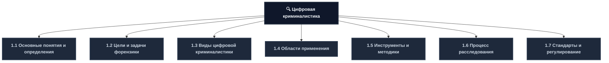
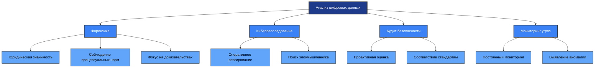
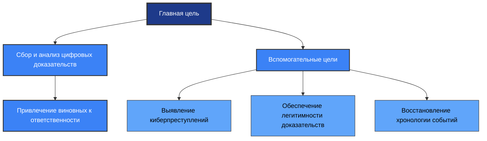
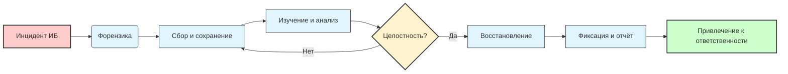
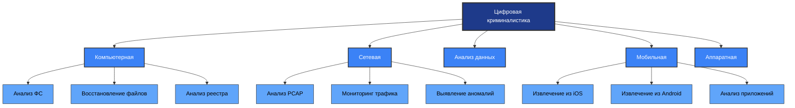
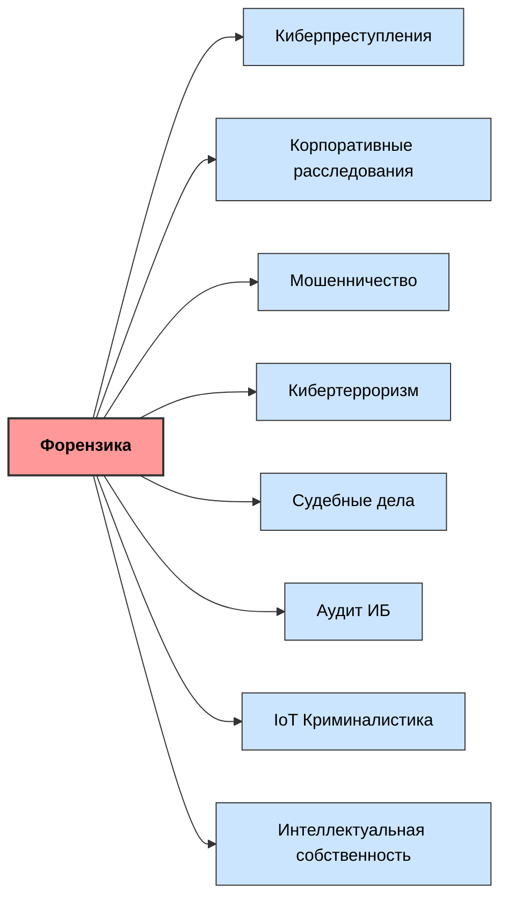
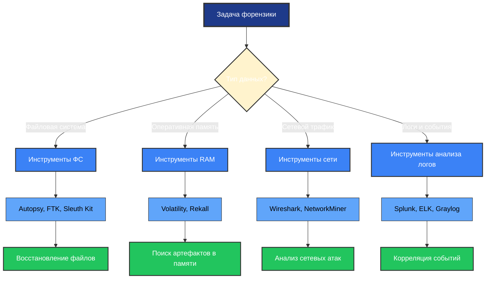
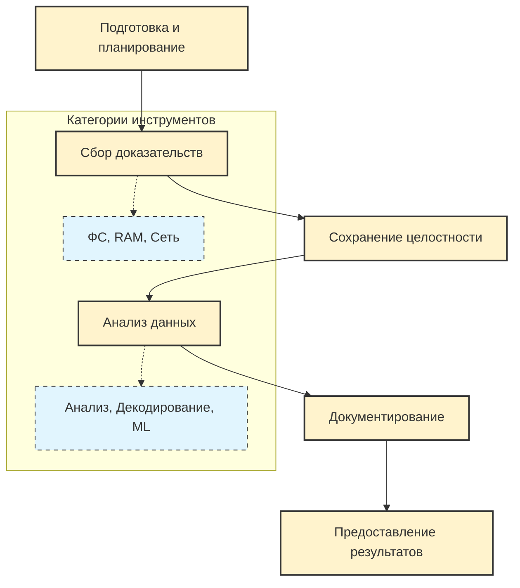
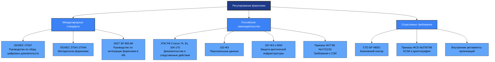
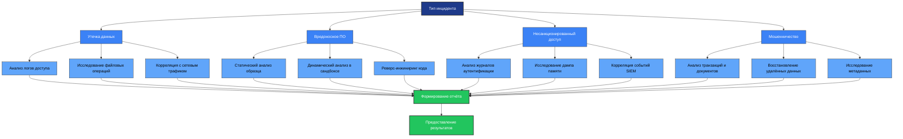

---
# 1.1 Основные понятия и определения
## Ключевые определения

| Термин | Определение | Значение в контексте ИБ |
|--------|------------|----------------------|
| **Инцидент информационной безопасности** | Событие, представляющее нарушение или угрозу нарушения политики безопасности, конфиденциальности данных или нормального функционирования информационных систем | Триггер для начала расследования |
| **Форензика (Computer Forensics)** | Область, занимающаяся анализом компьютерных данных и интернет-активности для расследования инцидентов с обеспечением юридической значимости доказательств | Методология сбора и анализа цифровых улик |
| **Цифровое доказательство** | Любая информация, хранящаяся или передаваемая в цифровой форме, которая может быть использована в суде | Основа для привлечения к ответственности |
| **Цепочка доказательств (Chain of Custody)** | Документированный процесс передачи и хранения доказательств, гарантирующий их неизменность | Юридическая защита доказательств |
## Отличия форензики от смежных дисциплин

## Принципы цифровой криминалистики

| Принцип | Описание | Практическое значение |
|---------|----------|---------------------|
| **Целостность данных** | Доказательства не должны изменяться в процессе сбора и анализа | Обеспечение допустимости в суде |
| **Документирование** | Все действия должны фиксироваться с указанием времени, исполнителя и метода | Воспроизводимость и прозрачность |
| **Законность** | Сбор доказательств должен осуществляться в рамках законодательства | Исключение риска признания доказательств недопустимыми |
| **Компетентность** | Анализ должны проводить квалифицированные специалисты | Качество и достоверность выводов |
| **Независимость** | Эксперт должен быть объективен и не заинтересован в результате | Доверие к заключению |

---
# 1.2 Цели и задачи форензики
## Иерархия целей

## Пять ключевых задач форензики

| № | Задача | Подробное описание | Результат |
|---|--------|-----------------|-----------|
| **1** | **Получение и сохранение** | Сбор всех возможных цифровых данных: логи системы, файлы пользователя, сетевые пакеты, данные с носителей | Полная копия исходных данных для анализа |
| **2** | **Изучение данных** | Глубокий анализ собранного массива информации для выявления следов деятельности злоумышленников | Выявленные индикаторы компрометации (IOC) |
| **3** | **Гарантирование целостности** | Обеспечение неизменности данных, соблюдение цепочки доказательств (Chain of Custody) | Юридически допустимые доказательства |
| **4** | **Восстановление данных** | Возврат удалённых, повреждённых или скрытых данных, содержащих критически важные доказательства | Восстановленные фрагменты информации |
| **5** | **Фиксация этапов** | Документирование всех этапов расследования и результатов анализа | Отчёт с неопровержимыми доказательствами |
## Процессный подход к форензике

---
# 1.3 Виды цифровой криминалистики
## Классификация по объектам исследования

| № | Вид форензики | Объект исследования | Основные задачи | Примеры использования |
|---|--------------|-------------------|----------------|---------------------|
| **1** | **Компьютерная криминалистика** | Компьютеры и серверы | Извлечение файлов, логов, настроек; восстановление удалённых данных; анализ жёстких дисков и ОС | Расследование взломов, сбор доказательств утечек, восстановление после форматирования |
| **2** | **Сетевая криминалистика** | Сетевой трафик и активность | Перехват и анализ пакетов; мониторинг активности; выявление атак и утечек | Расследование DDoS-атак, анализ несанкционированного доступа |
| **3** | **Криминалистический анализ данных** | Файлы и бинарные структуры | Сбор и интерпретация цифровых данных; поиск доказательств в структурах данных | Декомпиляция бинарных файлов, проверка конфигураций |
| **4** | **Мобильная криминалистика** | Смартфоны и планшеты | Сбор данных из приложений, сообщений, звонков; анализ геолокации; восстановление с мобильных ОС | Анализ мессенджеров, трекинг геолокации, изучение фотографий |
| **5** | **Аппаратная криминалистика** | Аппаратные компоненты | Исследование на низком уровне; анализ специфики работы оборудования | Анализ USB-накопителей, исследование скиммеров |
## Детализация видов форензики

## Специфика работы с разными типами носителей

| Тип носителя | Особенности сбора | Методы анализа | Типичные артефакты |
|-------------|-----------------|---------------|-------------------|
| **Жёсткий диск (HDD/SSD)** | Создание бит-в-бит образа, работа с bad sectors | Анализ MFT/FAT, восстановление удалённых файлов, поиск slack space | История браузера, файлы, логи, реестр |
| **Оперативная память (RAM)** | Дамп памяти через специализированные утилиты | Поиск паролей в открытом виде, ключей шифрования, следов вредоносного ПО | Процессы, сетевые соединения, инъекции кода |
| **Мобильное устройство** | Извлечение через специализированные адаптеры, обход блокировок | Анализ баз данных приложений, журналов вызовов, геолокации | Сообщения, контакты, фото, метаданные |
| **Сетевое оборудование** | Сбор логов, конфигураций, трафика | Корреляция событий, анализ правил фаервола, выявление аномалий | Журналы доступа, правила фильтрации, NetFlow |
| **Облачные сервисы** | Запрос данных у провайдера, сбор логов доступа | Анализ журналов аутентификации, действий пользователей, доступа к данным | Логи входа, изменения файлов, доступы к ресурсам |

---
# 1.4 Области применения форензики
## Детальная матрица областей применения

| Область применения | Задачи форензики | Примеры инцидентов | Типичные доказательства |
|-------------------|-----------------|-------------------|----------------------|
| **Киберпреступления** | Анализ данных для выявления следов злоумышленников; восстановление удалённой информации; получение доказательств для суда | Хакерские атаки, кража личных данных, взломы систем, распространение вредоносного ПО | Логи доступа, вредоносные файлы, сетевые соединения, дампы памяти |
| **Корпоративные расследования** | Выявление действий сотрудников при утечках; аудит действий в корпоративных системах | Утечки конфиденциальной информации, нарушения политик безопасности, инсайдерские атаки | История действий пользователя, логи приложений, копии отправленных файлов |
| **Расследование мошенничества** | Исследование цифровых доказательств; установление схем мошенничества | Финансовые махинации, подделка документов, отмывание денег | Транзакции, переписка, логи систем, метаданные документов |
| **Кибертерроризм** | Анализ атак на государственные системы; восстановление цепочек атак; предотвращение угроз | Атаки на критическую инфраструктуру, попытки подрыва общественных систем | Код вредоносного ПО, C2-серверы, методы проникновения |
| **Электронные доказательства в суде** | Сбор доказательств в форме цифровых данных, пригодных для суда | Дела о цифровых угрозах, кибератаках, преступлениях с использованием ИТ | Зафиксированные сообщения, файлы, транзакции с подтверждённой целостностью |
| **Аудит информационной безопасности** | Анализ инфраструктуры безопасности; выявление слабых мест; обеспечение соответствия | Оценка безопасности после инцидента, проверка соблюдения политик | Отчёты сканирования, логи доступа, конфигурации систем |
| **Криминалистика IoT** | Проверка данных умных устройств; документирование нарушений | Атаки на умные дома, взломы промышленных систем, несанкционированный доступ к IoT | Логи устройств, конфигурации, сетевая активность |
| **Нарушения прав на ИС** | Отслеживание незаконного распространения; восстановление цепочки распространения | Пиратство, незаконное использование патентов, подделка продуктов | Хеш-суммы файлов, метаданные, логи загрузки |
## Визуализация связей между областями

## Критерии выбора методики форензики

| Фактор | Влияние на выбор метода | Пример |
|--------|----------------------|--------|
| **Тип инцидента** | Определяет приоритетные источники данных | При утечке ПДн — анализ логов доступа и файловых операций |
| **Юрисдикция** | Влияет на процессуальные требования | В РФ — соблюдение 152-ФЗ и требований ФСТЭК |
| **Срочность** | Определяет глубину и скорость анализа | При активной атаке — приоритет динамического анализа |
| **Доступность данных** | Ограничивает возможные методы исследования | При удалённом доступе — только сетевой форензик |
| **Требования к доказательствам** | Влияет на методы сбора и документирования | Для суда — обязательное соблюдение Chain of Custody |

---
# 1.5 Инструменты и методики анализа
## Категории инструментов форензики

| Категория инструментов | Назначение | Что анализируется | Примеры инструментов |
|----------------------|-----------|-----------------|---------------------|
| **Анализ файловых систем** | Изучение структуры дисков, восстановление файлов, работа с метаданными | Жёсткие диски, SSD, разделы памяти, таблицы файлов (MFT, FAT) | Autopsy, FTK, Sleuth Kit, X-Ways |
| **Анализ оперативной памяти** | Извлечение данных из RAM (дамп памяти) | Пароли в открытом виде, ключи шифрования, следы вредоносного ПО, процессы | Volatility, Rekall, DumpIt |
| **Анализ сетевого трафика** | Перехват, сохранение и декодирование сетевых пакетов | PCAP-файлы, логи фаерволов, прокси-серверов, IDS/IPS | Wireshark, tcpdump, NetworkMiner |
| **Анализ логов** | Агрегация и корреляция журналов событий | Системные логи (Windows Event Log, Syslog), логи приложений, веб-серверов | Splunk, ELK Stack, Graylog |
| **Декодирование зашифрованных данных** | Работа с криптографией, расшифровка контейнеров | Зашифрованные архивы, базы данных, трафик SSL/TLS (при наличии ключей) | Hashcat, John the Ripper, VeraCrypt |
| **Анализ вредоносного ПО** | Реверс-инжиниринг, песочницы (sandbox) | Вирусы, трояны, руткиты, скрипты атак | IDA Pro, Ghidra, Cuckoo Sandbox, Any.Run |
| **Анализ цифровых следов** | Поиск артефактов деятельности пользователя | История браузера, кэш, временные файлы, реестр, recent-файлы | RegRipper, BrowserHistoryView, LECmd |
| **Анализ больших объёмов данных** | Обработка Big Data, машинное обучение для поиска аномалий | Огромные массивы логов, дампы баз данных, корпоративные хранилища | Apache Spark, Elasticsearch, ML-модели |
## Методология выбора инструментов

## Принципы работы с инструментами

| Принцип | Описание | Практическая реализация |
|---------|----------|----------------------|
| **Изоляция среды** | Анализ должен проводиться в контролируемой среде | Использование виртуальных машин, изолированных сетей |
| **Документирование** | Все действия с инструментами должны фиксироваться | Ведение журнала команд, скриншоты, автоматическое логирование |
| **Верификация результатов** | Результаты должны быть воспроизводимы | Использование хеш-сумм, перекрёстная проверка разными инструментами |
| **Минимизация воздействия** | Инструменты не должны изменять исходные данные | Работа с образами, режим только для чтения, использование write-blockers |
| **Соответствие стандартам** | Методики должны соответствовать нормативным требованиям | Использование сертифицированных инструментов, соблюдение процедур |

---
# 1.6 Процесс расследования инцидентов
## Этапы процесса форензики

## Детальное описание этапов

| Этап | Описание | Ключевые действия | Результат этапа |
|------|----------|-----------------|----------------|
| **1. Подготовка и планирование** | Определение границ расследования, выбор инструментов, получение разрешений | Формулировка целей, оценка ресурсов, получение юридических оснований | План расследования, список инструментов, разрешения |
| **2. Сбор доказательств (Acquisition)** | Создание бит-в-бит копий носителей, дамп памяти, сохранение сетевого трафика | Использование write-blockers, расчёт хеш-сумм, документирование процесса | Образы носителей, дампы памяти, сохранённый трафик с хешами |
| **3. Сохранение целостности** | Обеспечение неизменности данных на всём протяжении расследования | Хранение в защищённом месте, контроль доступа, регулярная верификация хешей | Гарантированная цепочка доказательств (Chain of Custody) |
| **4. Анализ (Examination & Analysis)** | Применение инструментов для поиска улик, восстановления данных и реконструкции событий | Статический и динамический анализ, корреляция данных, восстановление удалённого | Выявленные индикаторы, восстановленные данные, гипотезы |
| **5. Документирование и отчётность** | Фиксация всех шагов, создание понятного отчёта для технической команды и руководства/суда | Структурирование выводов, визуализация, подготовка приложений | Форензик-отчёт с выводами и рекомендациями |
| **6. Предоставление результатов** | Передача доказательств заказчику или в правоохранительные органы | Формальная передача, инструктаж, поддержка при судебных процедурах | Принятые доказательства, закрытие инцидента |
## Принципы обеспечения допустимости доказательств

| Принцип | Требование | Метод обеспечения |
|---------|-----------|-----------------|
| **Аутентичность** | Доказательство должно быть тем, за что себя выдаёт | Хеш-суммы (MD5, SHA-256), цифровые подписи, метаданные |
| **Надёжность** | Метод сбора и анализа должен быть научно обоснован | Использование сертифицированных инструментов, стандартных методик |
| **Полнота** | Должны быть представлены все релевантные данные | Комплексный сбор, документирование исключений |
| **Непредвзятость** | Анализ должен быть объективным | Независимость эксперта, перекрёстная проверка, рецензирование |
| **Понятность** | Выводы должны быть доступны для неспециалистов | Структурированный отчёт, визуализация, глоссарий терминов |

---
# 1.7 Стандарты и регулирование в форензике
## Матрица нормативных документов

## Сравнение стандартов форензики

| Стандарт/Регулятор | Область применения | Ключевые требования | Метод проверки соответствия |
|-------------------|-------------------|-------------------|---------------------------|
| **ISO/IEC 27037** | Сбор цифровых доказательств | Идентификация, сбор, приобретение, сохранение | Аудит процедур, документация процессов |
| **NIST SP 800-86** | Интеграция форензики в ИБ | Планирование, сбор, анализ, отчётность | Самооценка, внешняя проверка |
| **УПК РФ** | Уголовное судопроизводство | Процессуальный порядок получения доказательств | Судебная проверка, экспертиза |
| **152-ФЗ** | Обработка персональных данных | Законность сбора, обеспечение безопасности | Проверка Роскомнадзора, аудит |
| **ФСТЭК №21** | Защита ПДн в ИСПДн | Технические меры защиты, учёт и контроль | Аттестация, испытания СЗИ |
| **СТО БР ИББС** | Банковский сектор | Расследование инцидентов, сохранение доказательств | Внутренний аудит, проверка ЦБ РФ |
## Требования к экспертам и лабораториям

| Категория | Требования | Обоснование |
|----------|-----------|------------|
| **Квалификация эксперта** | Высшее образование, сертификация (EnCE, GCFA, CHFI), опыт работы | Обеспечение компетентности и качества анализа |
| **Оснащение лаборатории** | Сертифицированное оборудование, изолированная среда, средства защиты | Гарантия целостности данных и безопасности анализа |
| **Методологии** | Документированные процедуры, соответствие стандартам, регулярное обновление | Воспроизводимость результатов и соответствие законодательству |
| **Документирование** | Полное ведение журналов, цепочка доказательств, шаблоны отчётов | Юридическая допустимость доказательств в суде |
| **Независимость** | Отсутствие конфликта интересов, объективность выводов | Доверие к заключению со стороны суда и сторон процесса |
## Правовые основы сбора цифровых доказательств в РФ

| Нормативный акт | Положение | Применение в форензике |
|----------------|-----------|----------------------|
| **УПК РФ Статья 74** | Доказательства — любые сведения, на основе которых устанавливаются обстоятельства дела | Цифровые данные признаются доказательствами при соблюдении процедуры |
| **УПК РФ Статья 81** | Вещественные доказательства — предметы, которые служили орудиями преступления | Носители информации, изъятые в ходе расследования |
| **УПК РФ Статья 164-170** | Порядок производства следственных действий | Требования к осмотру, выемке, назначению экспертизы цифровых носителей |
| **Приказ СК РФ №20** | Методика назначения и производства судебных экспертиз | Требования к назначению компьютерно-технической экспертизы |
| **ГОСТ Р 57580.1-2017** | Безопасность финансовых операций | Требования к расследованию инцидентов в финансовом секторе |

---
# 📚 Приложения и ресурсы
## Рекомендуемая литература
**Учебные пособия и монографии:**
- Зегжда Д.П., Ивашко А.М. — Основы безопасности информационных систем. — М.: Горячая линия — Телеком, 2023.
- Девянин П.Н. — Теоретические основы компьютерной безопасности. — М.: Радио и связь, 2022.
- Шаньгин В.Ф. — Информационная безопасность компьютерных систем и сетей. — М.: ФОРУМ, 2023.
- Баранов А.В. — Цифровая криминалистика: теория и практика. — М.: Юрайт, 2024.
- Носов С.А. — Компьютерно-техническая экспертиза. — СПб.: Питер, 2023.
**Нормативные документы:**
- Уголовно-процессуальный кодекс РФ (ст. 74, 81, 164-170)
- Федеральный закон №152-ФЗ — О персональных данных
- Федеральный закон №187-ФЗ — О безопасности критической информационной инфраструктуры РФ
- Приказ ФСТЭК России №17 — Требования по защите информации в ГИС
- Приказ ФСТЭК России №21 — Требования по защите ПДн
- Приказ ФСТЭК России №31 — Требования по защите КИИ
- ГОСТ Р ИСО/МЭК 27037-2020 — Руководство по сбору цифровых доказательств
---
# Шпаргалка: выбор методики форензики

