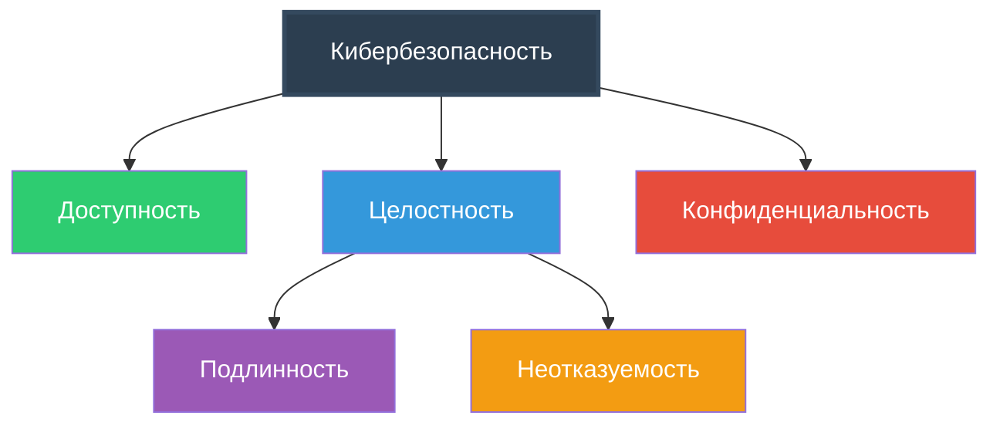
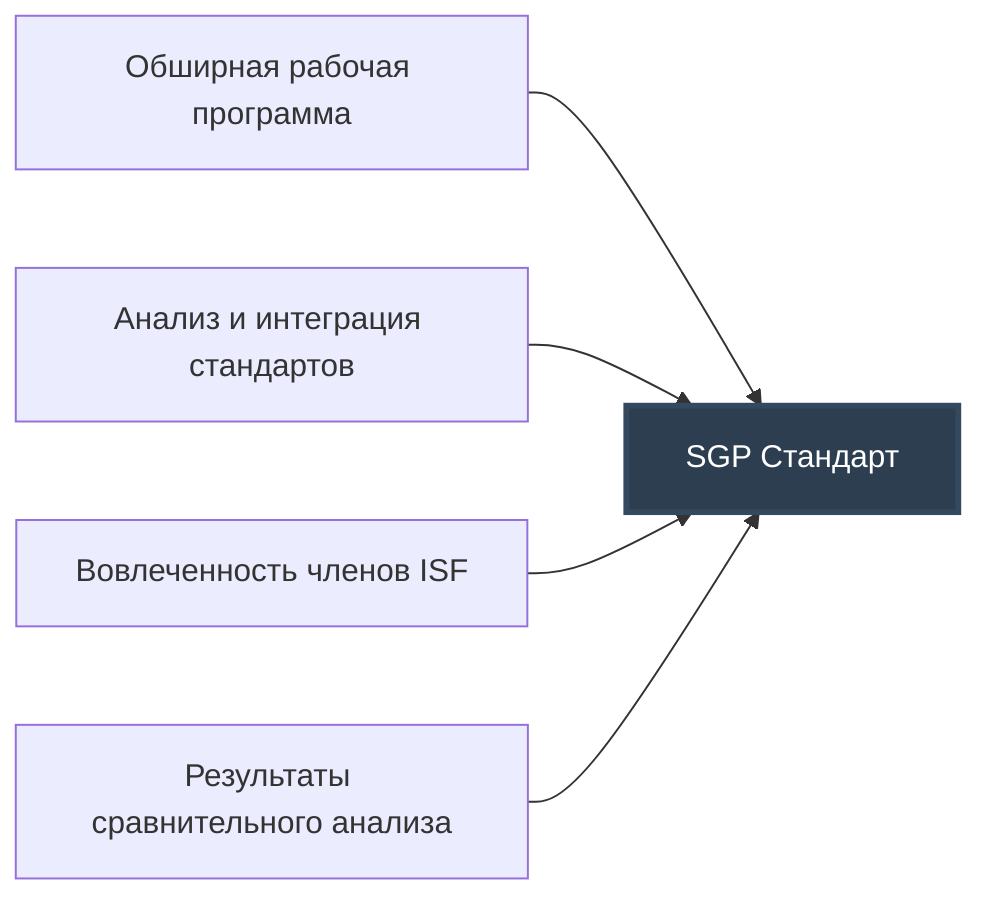
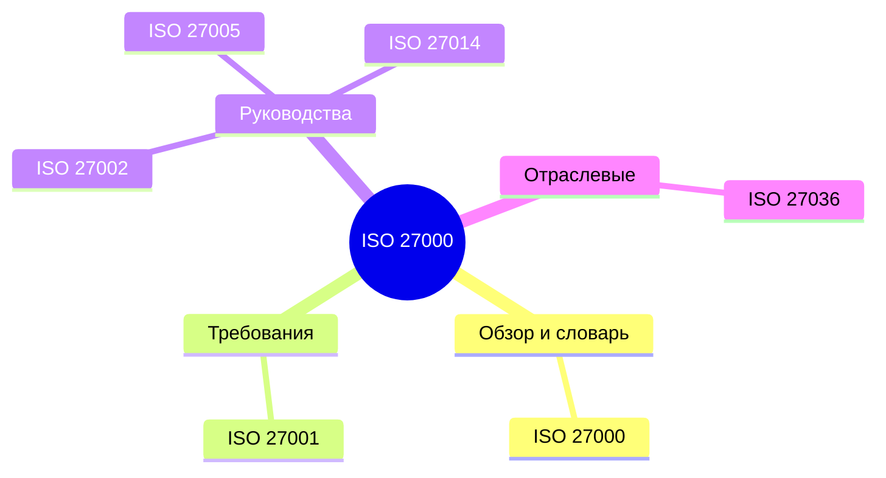
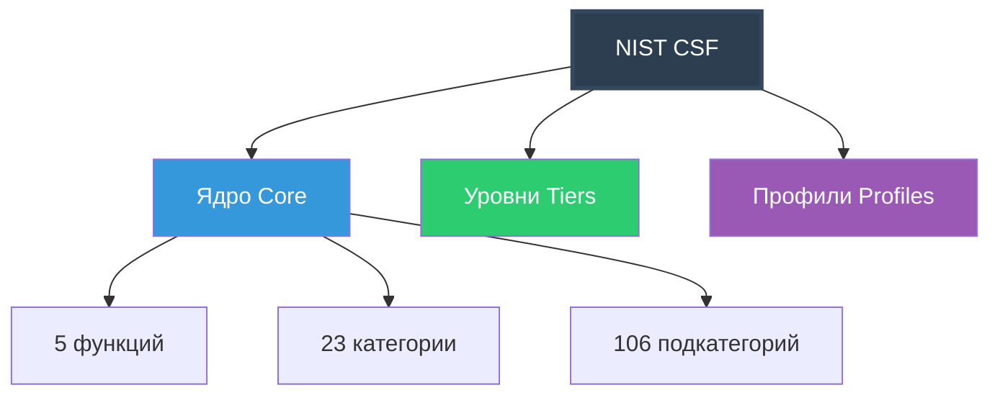
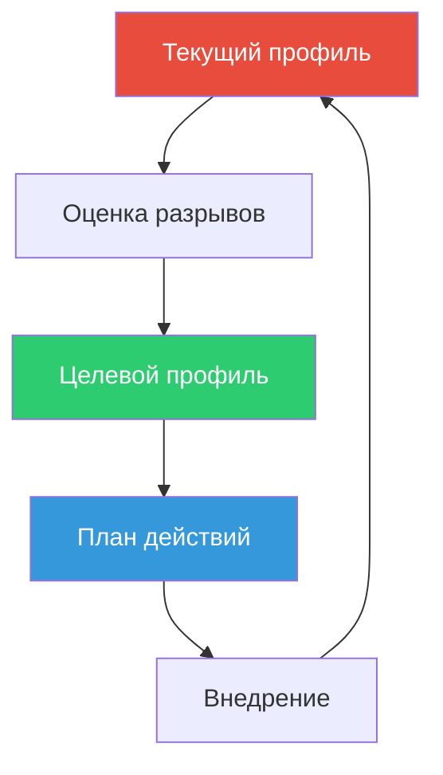
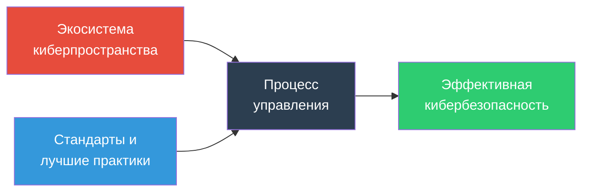

 *«Есть собаки, которые не станут нарушать то, что для них священно. Например, очень серьезная немецкая овчарка, с которой я работал, громко ворчала на других собак, когда те не слушались. Однажды, обучая её апортировке, я для интереса поставил гантель на торец. Она неодобрительно посмотрела на гантель и на меня, затем осторожно поставила её в правильное положение, взяла и принесла, довольно насупившись.»*
 — Вики Хирн, «Задача Адама: называя животных по имени»

---
# 🎯 Цели обучения

После изучения этой главы вы сможете:

| №   | Цель                                                                                                         | Уровень   |
| :-- | :----------------------------------------------------------------------------------------------------------- | :-------- |
| 1   | **Объяснить** необходимость использования документов со стандартами и лучшими практиками в кибербезопасности | Знание    |
| 2   | **Представить** обзор Стандарта надлежащей практики информационной безопасности (ISF SGP)                    | Понимание |
| 3   | **Объяснить** разницу между ISO 27001 и ISO 27002                                                            | Анализ    |
| 4   | **Обсудить** роль Рамочной структуры кибербезопасности NIST и её отличие от ISO 27002                        | Сравнение |
| 5   | **Объяснить** ценность Критических контрольных мер кибербезопасности CIS                                     | Понимание |
| 6 | **Применять** знания для выбора соответствующих стандартов под задачи организации | Применение |

---
# 📋 Содержание главы
| Раздел       | Название                                                           |
| ------------ | ------------------------------------------------------------------ |
| **Введение** | Цели обучения, назначение книги                                    |
| **1.1**      | Определение киберпространства и кибербезопасности                  |
| **1.2**      | Ценность документов со стандартами и лучшими практиками            |
| **1.3**      | Стандарт надлежащей практики информационной безопасности (ISF SGP) |
| **1.4**      | Комплекс стандартов информационной безопасности ISO/IEC 27000      |
| **1.5**      | Сопоставление серии ISO 27000 с ISF SGP                            |
| **1.6**      | Рамочная структура кибербезопасности NIST                          |
| **1.7**      | Критические контрольные меры кибербезопасности CIS                 |
| **1.8**      | COBIT 5 для информационной безопасности                            |
| **1.9**      | Стандарт безопасности данных индустрии платежных карт (PCI DSS)    |
| **1.10**     | Документы ITU-T по безопасности                                    |
| **1.11**     | Эффективная кибербезопасность (Процесс управления)                 |
| **1.12**     | Ключевые термины и контрольные вопросы                             |
| **Резюме**   | Ключевые выводы главы                                              |

---
# 1.1 Определение киберпространства и кибербезопасности

## 📚 Рабочие определения

Киберпространство (Национальный исследовательский совет, 2014)
 Киберпространство состоит из:
- **Артефактов**, основанных на компьютерных и коммуникационных технологиях или зависящих от них
- **Информации**, которую эти артефакты используют, хранят, обрабатывают или передают
- **Взаимосвязей** между этими различными элементами

Кибербезопасность (ITU-T X.1205, 2014)
**Кибербезопасность** — это совокупность инструментов, политик, концепций безопасности, мер защиты, руководств, подходов к управлению рисками, действий, обучения, передовых практик, подтверждения соответствия и технологий, которые используются для защиты среды киберпространства, а также активов организаций и пользователей.
## 🎯 Основные цели безопасности

| Свойство               | Определение                                                                                                                                                                |
| :--------------------- | :------------------------------------------------------------------------------------------------------------------------------------------------------------------------- |
| **Доступность**        | Свойство системы быть доступным, используемым или работоспособным по требованию авторизованного субъекта в соответствии с установленными спецификациями производительности |
| **Целостность**        | Свойство, заключающееся в том, что данные не были изменены, уничтожены или утрачены несанкционированным или случайным образом                                              |
| **Подлинность**        | Свойство быть подлинным и поддающимся проверке и доверию. Подтверждение того, что пользователи являются теми, за кого себя выдают                                          |
| **Неотказуемость**     | Гарантия того, что отправитель информации получает подтверждение доставки, а получатель — подтверждение личности отправителя                                               |
| **Конфиденциальность** | Свойство, заключающееся в том, что данные не раскрываются субъектам системы, если они не имеют права знать эти данные                                                      |
| **Подотчетность**      | Свойство системы, обеспечивающее возможность уникальной трассировки действий субъекта до этого субъекта                                                                    |
## ⚠️ Проблемы разработки эффективной системы

Четыре основные дилеммы кибербезопасности [CICE14]:
1. **Масштаб и сложность киберпространства** — мобильные устройства, рабочие станции, серверы, ЦОД, облака, IoT
2. **Природа угрозы** — вандалы, преступники, террористы, враждебные государства
3. **Потребности пользователей vs Безопасность** — конфликт между удобством и надёжной защитой
4. **Сложность оценки затрат и выгод** — трудно оценить общую стоимость нарушений
---
# 1.2 Ценность документов со стандартами и лучшими практиками

Критическое предупреждение
**Попытка разработать собственный подход «с нуля» — верный путь к неудаче.**
## 🏢 Ключевые организации-разработчики

| Организация | Документ | Год |
| :--- | :--- | :--- |
| **ISF** | Стандарт надлежащей практики информационной безопасности (SGP) | 2016 |
| **ISO/IEC** | ISO 27002: Свод правил по управлению информационной безопасностью | 2013 |
| **NIST** | Рамочная структура для повышения кибербезопасности критической инфраструктуры | 2017 |
| **CIS** | Критические контрольные меры кибербезопасности CIS, версия 7 | 2018 |
| **ISACA** | COBIT 5 для информационной безопасности | 2012 |
| **PCI SSC** | Стандарт безопасности данных индустрии платежных карт v3.2 | 2016 |

---
# 1.3 Стандарт надлежащей практики информационной безопасности (ISF SGP)

## 📊 О стандарте

| Параметр | Значение |
| :--- | :--- |
| **Организация** | Information Security Forum (ISF) |
| **Первый выпуск** | 1996 год |
| **Текущая версия** | 2016 год |
| **Объём** | ~300 страниц |
| **Категорий** | 17 |
| **Областей** | 34 |
| **Тем** | 132 |

## 🏗️ Основа стандарта

## 🔄 Три основные деятельности

| № | Деятельность | Описание |
| :--- | :--- | :--- |
| 1 | **Планирование** | Разработка подходов к управлению, определение требований, политики и процедуры |
| 2 | **Управление** | Развёртывание и управление средствами контроля безопасности |
| 3 | **Оценка** | Мониторинг, оценка, улучшение, обеспечение непрерывности бизнеса |

## 📑 17 Категорий SGP

| Код | Категория | Области |
| :--- | :--- | :--- |
| **SG** | Управление безопасностью | Подход к управлению, Компоненты управления |
| **IR** | Оценка информационных рисков | Структура оценки, Процесс оценки |
| **SM** | Управление безопасностью | Политика безопасности, Управление ИБ |
| **PM** | Управление персоналом | Безопасность HR, Осведомленность/Обучение |
| **IM** | Управление информацией | Классификация и конфиденциальность, Защита информации |
| **PA** | Управление физическими активами | Управление оборудованием, Мобильные вычисления |
| **SD** | Разработка систем | Управление разработкой, Жизненный цикл разработки |
| **BA** | Управление бизнес-приложениями | Корпоративные приложения, Пользовательские приложения |
| **SA** | Доступ к системе | Управление доступом, Доступ клиентов |
| **SY** | Управление системами | Конфигурация системы, Обслуживание системы |
| **NC** | Сети и коммуникации | Управление сетями, Электронные коммуникации |
| **SC** | Управление цепочкой поставок | Внешние поставщики, Облачные вычисления |
| **TS** | Управление технической безопасностью | Технические решения, Криптография |
| **TM** | Управление угрозами и инцидентами | Устойчивость к киберугрозам, Управление инцидентами |
| **LE** | Управление локальной средой | Локальные среды, Физическая и экологическая безопасность |
| **BC** | Непрерывность бизнеса | Структура непрерывности, Процесс непрерывности |
| **SI** | Мониторинг и улучшение безопасности | Аудит безопасности, Эффективность безопасности |

---
# 1.4 Комплекс стандартов информационной безопасности ISO/IEC 27000
## 🌐 Об организации

| Параметр | Описание |
| :--- | :--- |
| **Полное название** | International Organization for Standardization |
| **Год основания** | 1946 |
| **Выпущено стандартов** | Более 12 000 |
| **Совместно с** | IEC (International Electrotechnical Commission) |
## 📚 Семейство стандартов ISO 27000

| Стандарт      | Назначение                                    |
| :------------ | :-------------------------------------------- |
| **ISO 27000** | Обзор и словарь ISMS                          |
| **ISO 27001** | Требования к ISMS (сертификация организаций)  |
| **ISO 27002** | Свод правил контроля (выбор средств контроля) |
| **ISO 27005** | Управление рисками ИБ                         |
| **ISO 27014** | Управление ИБ для руководства                 |
| **ISO 27036** | Безопасность с поставщиками                   |

## ⚖️ ISO 27001 vs ISO 27002

| Аспект | ISO 27001 | ISO 27002 |
| :--- | :--- | :--- |
| **Тип документа** | Требования (что делать) | Контроли (как делать) |
| **Объём** | 9 страниц | 90 страниц |
| **Сертификация** | Да, для организаций | Нет, справочный |
| **Обязательность** | Обязательно для соответствия | Рекомендательный |
## ✅ Преимущества сертификации ISO 27001

1. ✅ Гарантия следования практикам, снижающим риск нарушений
2. ✅ Снижение влияния любого нарушения, которое произойдет
3. ✅ Снижение потенциальных штрафов от регуляторов
4. ✅ Доверие заинтересованных сторон
5. ✅ Независимая сторонняя проверка ISMS
6. ✅ Наиболее полный международно признанный стандарт

---
# 1.5 Сопоставление серии ISO 27000 с ISF SGP
## 📊 ISO 27001 ↔ ISF SGP

| Тема ISO 27001 | Категория ISF SGP |
| :--- | :--- |
| 4. Контекст организации | Управление безопасностью (SG) |
| 5. Лидерство | Управление безопасностью (SG/SM) |
| 6. Планирование (Риски) | Оценка информационных рисков (IR) |
| 7. Поддержка (Люди) | Управление персоналом (PM) |
| 8. Функционирование | Управление безопасностью / Оценка рисков |
| 9. Оценка результатов | Мониторинг и улучшение (SI) |
| 10. Улучшение | Мониторинг и улучшение (SI) |
## 🔍 Пример детализации: Управление инцидентами

| Стандарт | Страниц | Тем | Подтем |
| :--- | :--- | :--- | :--- |
| **ISO 27002 (Раздел 16)** | 4 | 7 | - |
| **ISF SGP** | 22 | 9 | **74** |

ISF SGP включает дополнительно: разведка угроз, судебные расследования, экстренные исправления, защита от кибератак

---
# 1.6 Рамочная структура кибербезопасности NIST 
## 🇺🇸 О NIST

| Параметр | Описание |
| :--- | :--- |
| **Полное название** | National Institute of Standards and Technology |
| **Тип** | Федеральное агентство США |
| **Область** | Наука об измерениях, стандартах и технологиях |
| **Центр** | CSRC (Computer Security Resource Center) |
| **Влияние** | Всемирное (несмотря на национальный масштаб) |
| **Документ** | Framework for Improving Critical Infrastructure Cybersecurity |
| **Версия** | 1.1 (2017) |

**Назначение структуры**
Рамочная структура кибербезопасности NIST была разработана в ответ на Исполнительный указ 13636 «Повышение кибербезопасности критической инфраструктуры». Хотя структура предназначена для федеральных агентств и критической инфраструктуры, она полезна и для негосударственных организаций любого размера.

---
## 🏗️ Три компонента структуры

| Компонент              | Описание                                  | Назначение                                                                  |
| :--------------------- | :---------------------------------------- | :-------------------------------------------------------------------------- |
| **Ядро (Core)**        | 5 функций, 23 категории, 106 подкатегорий | Предоставляет набор мероприятий по кибербезопасности и желаемых результатов |
| **Уровни (Tiers)**     | 4 уровня (Partial → Adaptive)             | Определяют степень строгости практик управления рисками                     |
| **Профили (Profiles)** | Текущий и целевой профиль                 | Сопоставление бизнес-потребностей с категориями Ядра                        |

---
## 🎯 5 Функций Ядра
### 1️⃣ IDENTIFY (Идентификация)

 **Описание функции**
Развитие организационного понимания управления рисками кибербезопасности для систем, активов, данных и возможностей.

| № | Категория | Описание | Подкатегории (примеры) |
| :--- | :--- | :--- | :--- |
| **ID.AM** | **Управление активами** (Asset Management) | Идентификация и инвентаризация физических и программных активов | ID.AM-1: Реестр физических устройств ID.AM-2: Реестр ПО ID.AM-3: Потоки данных ID.AM-4: Реестр внешних систем ID.AM-5: Ресурсы и приоритеты |
| **ID.BE** | **Бизнес-среда** (Business Environment) | Понимание миссии организации и контекста | ID.BE-1: Роль в цепочке поставок ID.BE-2: Критические функции ID.BE-3: Приоритеты функций ID.BE-4: Зависимости ID.BE-5: Устойчивость |
| **ID.GV** | **Управление** (Governance) | Политики, процедуры и процессы управления рисками | ID.GV-1: Политики ИБ ID.GV-2: Роли и обязанности ID.GV-3: Требования законодательства ID.GV-4: Процесс управления рисками ID.GV-5: Среда управления рисками |
| **ID.RA** | **Оценка рисков** (Risk Assessment) | Идентификация и оценка рисков | ID.RA-1: Идентификация угроз ID.RA-2: Оценка уязвимостей ID.RA-3: Анализ рисков ID.RA-4: Определение последствий ID.RA-5: Реакция на риски |
| **ID.RM** | **Стратегия управления рисками** (Risk Management Strategy) | Приоритизация и ограничения рисков | ID.RM-1: Приоритизация рисков ID.RM-2: Толерантность к риску ID.RM-3: Роли и обязанности ID.RM-4: Определение приемлемости риска |
| **ID.SC** | **Управление рисками в цепочке поставок** (Supply Chain Risk Management) | Управление рисками поставщиков | ID.SC-1: Идентификация поставщиков ID.SC-2: Оценка поставщиков ID.SC-3: Контракты с поставщиками ID.SC-4: Мониторинг поставщиков |

---
### 2️⃣ PROTECT (Защита)

**Описание функции**
Разработка и внедрение соответствующих мер защиты для обеспечения предоставления критически важных услуг инфраструктуры.

| № | Категория | Описание | Подкатегории (примеры) |
| :--- | :--- | :--- | :--- |
| **PR.AC** | **Контроль доступа** (Access Control) | Управление доступом к активам | PR.AC-1: Управление идентификаторами PR.AC-2: Физический доступ PR.AC-3: Удалённый доступ PR.AC-4: Принцип наименьших привилегий PR.AC-5: Сетевая целостность PR.AC-6: Механизмы аутентификации PR.AC-7: Пользователи и устройства |
| **PR.AT** | **Осведомленность и обучение** (Awareness and Training) | Обучение персонала | PR.AT-1: Обязанности персонала PR.AT-2: Руководители PR.AT-3: Специалисты по ИБ PR.AT-4: Повышение квалификации PR.AT-5: Тестирование эффективности |
| **PR.DS** | **Безопасность данных** (Data Security) | Защита информации | PR.DS-1: Данные в покое PR.DS-2: Данные в передаче PR.DS-3: Классификация данных PR.DS-4: Adequate protection PR.DS-5: Удаление данных PR.DS-6: Целостность ПО |
| **PR.IP** | **Защита информации** (Information Protection) | Политики и процедуры | PR.IP-1: Базовая конфигурация PR.IP-2: Конфигурация систем PR.IP-3: Управление изменениями PR.IP-4: Резервное копирование PR.IP-5: Защита информации PR.IP-6: Организационные политики PR.IP-7: Процессы защиты PR.IP-8: Механизмы защиты PR.IP-9: Реагирование на инциденты PR.IP-10: План восстановления PR.IP-11: Киберустойчивость PR.IP-12: Управление уязвимостями |
| **PR.MA** | **Обслуживание** (Maintenance) | Техническое обслуживание систем | PR.MA-1: План обслуживания PR.MA-2: Удалённое обслуживание PR.MA-3: Утверждение обслуживания PR.MA-4: Журналы обслуживания PR.MA-5: Удаление медианосителей |
| **PR.PT** | **Защитные технологии** (Protective Technology) | Технические средства защиты | PR.PT-1: Аудит/логирование PR.PT-2: Защита от вредоносного ПО PR.PT-3: Мобильные устройства PR.PT-4: Коммуникации PR.PT-5: Механизмы защиты |
| **PR.CC** | **Процессы и процедуры** (Processes and Procedures) | Операционные процессы | PR.CC-1: Операционные процедуры PR.CC-2: Координация процессов PR.CC-3: Тестирование процессов PR.CC-4: Непрерывность операций PR.CC-5: Восстановление после сбоев |

---
### 3️⃣ DETECT (Обнаружение)

**Описание функции**
Разработка и внедрение соответствующих мероприятий для выявления факта события кибербезопасности.

| № | Категория | Описание | Подкатегории (примеры) |
| :--- | :--- | :--- | :--- |
| **DE.AE** | **Аномалии и события** (Anomalies and Events) | Выявление отклонений | DE.AE-1: Базовая линия операций DE.AE-2: Мониторинг событий DE.AE-3: Анализ событий DE.AE-4: Корреляция событий DE.AE-5: Инциденты |
| **DE.CM** | **Непрерывный мониторинг** (Security Continuous Monitoring) | Постоянный контроль безопасности | DE.CM-1: Мониторинг сети DE.CM-2: Мониторинг физического окружения DE.CM-3: Мониторинг персонала DE.CM-4: Мониторинг внешних угроз DE.CM-5: Мониторинг уязвимостей DE.CM-6: Мониторинг активности пользователей DE.CM-7: Мониторинг целостности |
| **DE.DP** | **Процессы обнаружения** (Detection Processes) | Процедуры обнаружения | DE.DP-1: Роли и обязанности DE.DP-2: Координация обнаружения DE.DP-3: Анализ обнаружения DE.DP-4: Уведомление об обнаружении |

---
### 4️⃣ RESPOND (Реагирование)

**Описание функции**
Разработка и внедрение соответствующих мероприятий для принятия мер в отношении обнаруженного события кибербезопасности.

| № | Категория | Описание | Подкатегории (примеры) |
| :--- | :--- | :--- | :--- |
| **RS.RP** | **Планирование реагирования** (Response Planning) | План реагирования на инциденты | RS.RP-1: План реагирования RS.RP-2: Координация реагирования RS.RP-3: Анализ реагирования RS.RP-4: Уведомление о реагировании |
| **RS.CO** | **Коммуникация** (Communications) | Информирование о инцидентах | RS.CO-1: Внутренняя коммуникация RS.CO-2: Внешняя коммуникация RS.CO-3: Координация с партнёрами RS.CO-4: Уведомление регуляторов |
| **RS.AN** | **Анализ** (Analysis) | Исследование инцидента | RS.AN-1: Уведомление об анализе RS.AN-2: Анализ инцидента RS.AN-3: Форензика RS.AN-4: Категоризация инцидента |
| **RS.MI** | **Сдерживание** (Mitigation) | Предотвращение распространения | RS.MI-1: Сдерживание инцидента RS.MI-2: Устранение инцидента RS.MI-3: Сбор доказательств |
| **RS.IM** | **Улучшения** (Improvements) | Улучшение процесса реагирования | RS.IM-1: План улучшений RS.IM-2: Внедрение улучшений RS.IM-3: Коммуникация улучшений |

---
### 5️⃣ RECOVER (Восстановление)

**Описание функции**
Разработка и внедрение соответствующих мероприятий для поддержания планов устойчивости и восстановления любых возможностей или услуг, нарушенных в результате события кибербезопасности.

| № | Категория | Описание | Подкатегории (примеры) |
| :--- | :--- | :--- | :--- |
| **RC.RP** | **Планирование восстановления** (Recovery Planning) | План восстановления после инцидента | RC.RP-1: План восстановления RC.RP-2: Координация восстановления RC.RP-3: Коммуникация восстановления |
| **RC.IM** | **Улучшения** (Improvements) | Улучшение процесса восстановления | RC.IM-1: План улучшений RC.IM-2: Внедрение улучшений RC.IM-3: Коммуникация улучшений |
| **RC.CO** | **Коммуникация** (Communications) | Информирование о восстановлении | RC.CO-1: Внутренняя коммуникация RC.CO-2: Внешняя коммуникация RC.CO-3: Координация с партнёрами RC.CO-4: Уведомление регуляторов |

## 📊 Сводная таблица Ядра NIST CSF

| Функция      | Категорий | Подкатегорий | Процент  |
| :----------- | :-------: | :----------: | :------: |
| **Identify** |     6     |      23      |  21.7%   |
| **Protect**  |     7     |      40      |  37.7%   |
| **Detect**   |     3     |      16      |  15.1%   |
| **Respond**  |     5     |      18      |  17.0%   |
| **Recover**  |     3     |      10      |   9.4%   |

**Примечание**
Количество подкатегорий может незначительно отличаться в зависимости от версии документа (1.0 vs 1.1). В оригинальном PDF указано 106 подкатегорий.

## 📈 Уровни внедрения (Implementation Tiers)

**Назначение уровней**
Уровни внедрения помогают организации определить приоритет, который придается кибербезопасности, и уровень обязательств, которые организация намерена взять на себя.

| Уровень | Название | Процесс управления рисками | Интегрированная программа | Внешнее взаимодействие |
| :--- | :--- | :--- | :--- | :--- |
| **Tier 1** | **Частичный** (Partial) | Практики не формализованы, носят ситуационный характер. Приоритизация может не определяться целями риска | Ограниченная осведомленность о риске, отсутствие общеорганизационного подхода | Отсутствует координация с другими организациями |
| **Tier 2** | **Риск-информированный** (Risk Informed) | Практики утверждены руководством, но не установлены как общеорганизационная политика. Приоритизация определяется целями риска | Процессы определены, персонал имеет ресурсы. Общеорганизационного подхода нет | Отсутствует формальная координация |
| **Tier 3** | **Повторяемый** (Repeatable) | Практики официально утверждены в виде политики. Регулярно обновляются на основе изменений в требованиях и угрозах | Общеорганизационный подход. Политики определены, внедрены и анализируются | Сотрудничество с партнёрами позволяет принимать решения на основе внешних событий |
| **Tier 4** | **Адаптивный** (Adaptive) | Организация активно адаптируется к меняющемуся ландшафту кибербезопасности и своевременно реагирует на угрозы | Общеорганизационный подход с использованием политик для реагирования на потенциальные события | Активный обмен информацией с партнёрами для обеспечения распространения точной информации |

## 🔄 Профили (Profiles)

**Назначение профилей**
Профиль — это выбор категорий и подкатегорий из Ядра структуры, основанный на бизнес-потребностях организации.

| Тип профиля | Описание | Назначение |
| :--- | :--- | :--- |
| **Текущий профиль** | Отражает текущее состояние кибербезопасности организации | Базовая оценка |
| **Целевой профиль** | Отражает желаемое состояние на основе оценки рисков | Определение целей |
| **План действий** | Разрыв между текущим и целевым профилем | Приоритизация улучшений |
## 📚 Использование NIST CSF с другими стандартами

| Задача | Рекомендуемый документ | Роль NIST CSF |
| :--- | :--- | :--- |
| **Общее планирование** | NIST CSF | Основной фреймворк |
| **Набор средств контроля** | ISF SGP, ISO 27002 | Детализация контролей |
| **Выбор конкретных мер** | CIS Controls | Технические реализации |
| **Сертификация** | ISO 27001 | Формальное соответствие |
| **Учебные материалы** | NIST SP 800-серия, ITU-T | Углублённое изучение |
## Сопоставление NIST CSF с ISO 27001

| NIST CSF | ISO 27001 |
| :--- | :--- |
| Identify (ID) | Раздел 6 (Планирование) |
| Protect (PR) | Annex A (Контроли) |
| Detect (DE) | 8.16 (Мониторинг) |
| Respond (RS) | 16.1 (Инциденты) |
| Recover (RC) | 17.1 (Непрерывность) |

---
# 1.7 Критические контрольные меры кибербезопасности CIS

## 🛡️ О CIS

| Параметр | Описание |
| :--- | :--- |
| **Полное название** | Center for Internet Security |
| **Тип** | Некоммерческое сообщество организаций и частных лиц |
| **Документ** | CIS Critical Security Controls for Effective Cyber Defense (CSC) |
| **Версия** | 7 (2018) |
| **Контролей** | 20 |
| **Основа** | Реальные атаки и защита, доказавшая эффективность |

**Ценность CIS Controls**
CSC значим из-за практического, реалистичного характера его информации. Это не просто список средств контроля, которые могут быть полезны, а **источник, который можно использовать для руководства внедрением политики**. Контрольные меры были разработаны в результате опыта членов сообщества в реальных атаках и защиты, доказавшей свою эффективность.

## 🎯 Назначение документа

**Цель CIS Controls**
CSC фокусируется на **наиболее фундаментальных и ценных действиях**, которые должно предпринять каждое предприятие. Ценность здесь определяется знаниями и данными — способностью предотвращать, предупреждать и реагировать на атаки, которые беспокоят предприятия сегодня.

### Критерии разработки контрольных мер

| Критерий | Описание |
| :--- | :--- |
| **Понимание атак** | Делятся пониманием атак и злоумышленников, определяют основные причины и переводят их в классы защитных действий |
| **Документирование** | Документируют истории внедрения и делятся инструментами для решения проблем |
| **Отслеживание угроз** | Отслеживают эволюцию угроз, возможности злоумышленников и текущие векторы вторжений |
| **Сопоставление** | Сопоставляют контрольные меры CIS с нормативными и комплаенс-рамками |
| **Инструменты** | Делятся инструментами, рабочими материалами и переводами |
| **Решение проблем** | Выявляют общие проблемы и решают их как сообщество |
## 📊 20 Контрольных мер по группам (Подробно)

### 🟥 Группа 1: Базовые контрольные меры CIS (CSC 1-6)

**Приоритет**
Базовые контрольные меры являются **фундаментальными** и должны быть внедрены в первую очередь. Они обеспечивают базовую кибергигиену.

| № | Контроль | Подробное описание | Ключевые действия |
| :--- | :--- | :--- | :--- |
| **CSC 1** | **Инвентаризация и контроль аппаратных активов** | Активно управлять (отслеживать, исправлять, контролировать) всеми аппаратными устройствами в сети, чтобы неавторизованные устройства не получали доступ | • Реестр всех устройств • Адресное пространство • DHCP-контроль • Сканирование сети • Удаление неавторизованных устройств |
| **CSC 2** | **Инвентаризация и контроль программных активов** | Активно управлять всем программным обеспечением в сети, чтобы неавторизованное ПО не устанавливалось и не выполнялось | • Реестр всего ПО • Whitelist разрешённого ПО • Автоматическое отслеживание • Удаление неавторизованного ПО |
| **CSC 3** | **Непрерывное управление уязвимостями** | Постоянно приобретать, оценивать и применять обновления безопасности для устранения уязвимостей | • Автоматическое сканирование • Приоритизация исправлений • Тестирование патчей • Отслеживание уязвимостей |
| **CSC 4** | **Контролируемое использование административных привилегий** | Контролировать и ограничивать использование административных привилегий для минимизации риска компрометации | • Отдельные учётные записи для администрирования • MFA для привилегированного доступа • Журналирование действий • Ограничение времени привилегий |
| **CSC 5** | **Безопасная конфигурация аппаратного и программного обеспечения** | Устанавливать, поддерживать и проверять безопасные конфигурации на всех устройствах | • Стандартные образы конфигурации • Автоматическое применение настроек • Регулярная проверка соответствия • Блокировка небезопасных настроек |
| **CSC 6** | **Обслуживание, мониторинг и анализ журналов аудита** | Собирать, управлять и анализировать журналы событий безопасности для обнаружения и реагирования на инциденты | • Централизованный сбор логов • Синхронизация времени (NTP) • Анализ аномалий • Хранение журналов |
### 🟨 Группа 2: Основополагающие контрольные меры CIS (CSC 7-16)

**Рекомендуется**
Основополагающие контрольные меры должны быть внедрены после базовых. Они обеспечивают **техническую защиту** от распространённых атак.

| №          | Контроль                                                         | Подробное описание                                                                               | Ключевые действия                                                                                                                     |
| :--------- | :--------------------------------------------------------------- | :----------------------------------------------------------------------------------------------- | :------------------------------------------------------------------------------------------------------------------------------------ |
| **CSC 7**  | **Защита электронной почты и веб-браузеров**                     | Обеспечить полную защиту электронной почты и веб-браузеров от распространённых атак              | • Фильтрация вложений • URL-фильтрация • Защита от фишинга • Обновление браузеров                                            |
| **CSC 8**  | **Защита от вредоносных программ**                               | Постоянно обновлять и использовать антивирусное ПО для защиты от malware                         | • Антивирус на всех системах • Автоматические обновления • Сканирование в реальном времени • Анализ подозрительных файлов    |
| **CSC 9**  | **Ограничение и контроль сетевых портов, протоколов и сервисов** | Управлять и контролировать сетевые порты, протоколы и сервисы для минимизации поверхностей атаки | • Inventory портов • Блокировка ненужных портов • Контроль сервисов • Сегментация сети                                       |
| **CSC 10** | **Возможность восстановления данных**                            | Обеспечить процессы и инструменты для регулярного резервного копирования и восстановления данных | • Автоматическое резервное копирование • Тестирование восстановления • Изоляция бэкапов • Шифрование бэкапов                 |
| **CSC 11** | **Безопасная конфигурация сетевых устройств**                    | Устанавливать, поддерживать и проверять безопасные конфигурации на сетевых устройствах           | • Стандартные конфигурации • Отключение ненужных сервисов • Обновление прошивок • Аудит конфигураций                         |
| **CSC 12** | **Защита периметра**                                             | Обнаруживать и блокировать атаки на периметре сети                                               | • Фаерволы • IDS/IPS • DMZ • Мониторинг трафика                                                                              |
| **CSC 13** | **Защита данных**                                                | Предотвращать утечку данных и обеспечивать их защиту                                             | • Классификация данных • DLP-системы • Шифрование данных • Контроль передачи                                                 |
| **CSC 14** | **Контролируемый доступ на основе необходимости знания**         | Ограничивать доступ к данным и системам на основе принципа наименьших привилегий                 | • Ролевой доступ (RBAC) • Регулярный пересмотр прав • Своевременное удаление доступа • Сегментация доступа                   |
| **CSC 15** | **Контроль беспроводного доступа**                               | Обеспечить безопасность беспроводных сетей и устройств                                           | • WPA3/WPA2-Enterprise • Изоляция гостевых сетей • Мониторинг rogue AP • Контроль Bluetooth                                  |
| **CSC 16** | **Мониторинг и контроль учётных записей**                        | Отслеживать и контролировать все учётные записи в организации                                    | • Централизованное управление • Отключение неактивных аккаунтов • Мониторинг привилегированных аккаунтов • Alert на аномалии |
### 🟦 Группа 3: Организационные контрольные меры CIS (CSC 17-20)

**Продвинутый уровень**
Организационные контрольные меры требуют **зрелости процессов** и должны внедряться после базовых и основополагающих.

| № | Контроль | Подробное описание | Ключевые действия |
| :--- | :--- | :--- | :--- |
| **CSC 17** | **Внедрение программы повышения осведомлённости и обучения в области безопасности** | Обучать персонал распознаванию и реагированию на угрозы безопасности | • Регулярное обучение • Тестирование (фишинг) • Обновление материалов • Измерение эффективности |
| **CSC 18** | **Безопасность прикладного программного обеспечения** | Обеспечить безопасность всего ПО на всех этапах жизненного цикла | • Безопасное кодирование • Code review • Тестирование безопасности • Управление зависимостями |
| **CSC 19** | **Реагирование на инциденты и управление ими** | Разработать и поддерживать программу реагирования на инциденты безопасности | • План реагирования • Команда IR • Тестирование плана • Пост-инцидентный анализ |
| **CSC 20** | **Тесты на проникновение и упражнения «Красной команды»** | Регулярно тестировать эффективность средств контроля безопасности | • Внешние пентесты • Внутренние пентесты • Red Team упражнения • Исправление уязвимостей |
## 📋 Структура каждого контроля

**Детализация CIS Controls**
> Каждый раздел контрольной меры включает следующие компоненты:

| Компонент | Описание |
| :--- | :--- |
| **Описание важности контроля** | Объяснение важности контроля для блокирования или выявления присутствия атак и объяснение того, как злоумышленники активно используют отсутствие этого контроля |
| **Таблица подконтролей** | Таблица конкретных действий, называемых подконтролями, которые организации предпринимают для внедрения, автоматизации и измерения эффективности этого контроля |
| **Процедуры и инструменты** | Процедуры и инструменты, которые обеспечивают внедрение и автоматизацию |
| **Диаграммы связей объектов** | Примеры диаграмм связей объектов, показывающие компоненты внедрения |
| **Метрики эффективности** | В сопутствующем документе описываются методы измерения эффективности конкретного подконтроля |
## 📈 Измерение эффективности

**CIS Controls Companion Metrics**
В сопутствующем документе «Сопутствующее измерение Критических контрольных мер CIS» описываются методы измерения эффективности конкретного подконтроля.

### Пороговые значения риска

| Уровень | Описание | Действия |
| :--- | :--- | :--- |
| **Низкий** | Контроль внедрён полностью, эффективность подтверждена | Поддерживать текущий уровень |
| **Умеренный** | Контроль внедрён частично, есть пробелы | План устранения пробелов |
| **Высокий** | Контроль не внедрён или неэффективен | Приоритетное внедрение |

**Консенсус экспертов**
Пороговые значения риска отражают **консенсус опытных практиков** и основаны на реальных данных об атаках и защите.
## 🔗 Сопоставление с другими стандартами

### CIS Controls ↔ ISO 27002

| CIS Control | ISO 27002 Раздел |
| :--- | :--- |
| CSC 1-2 (Инвентаризация) | 8.1-8.3 (Управление активами) |
| CSC 3 (Уязвимости) | 12.6 (Управление техническими уязвимостями) |
| CSC 4 (Привилегии) | 9.2 (Управление доступом пользователей) |
| CSC 5 (Конфигурация) | 12.5 (Контроль операционного ПО) |
| CSC 6 (Журналы) | 12.4 (Регистрация и мониторинг) |
| CSC 8 (Malware) | 12.2 (Защита от вредоносных программ) |
| CSC 10 (Бэкапы) | 12.3 (Резервное копирование) |
| CSC 17 (Обучение) | 7.2-7.3 (Безопасность HR) |
| CSC 19 (Инциденты) | 16.1 (Управление инцидентами) |
### CIS Controls ↔ NIST CSF

| CIS Control | NIST CSF Функция |
| :--- | :--- |
| CSC 1-3 (Инвентаризация) | Identify (ID.AM) |
| CSC 4-6 (Конфигурация) | Protect (PR.AC, PR.IP) |
| CSC 7-9 (Защита) | Protect (PR.DS, PR.PT) |
| CSC 10-12 (Восстановление) | Recover (RC.RP) |
| CSC 13-16 (Доступ) | Protect (PR.AC) |
| CSC 17 (Обучение) | Protect (PR.AT) |
| CSC 18 (Приложения) | Protect (PR.IP) |
| CSC 19 (Инциденты) | Respond (RS) |
| CSC 20 (Пентесты) | Detect (DE.CM) |

---
# 1.8 COBIT 5 для информационной безопасности 
## 📊 О COBIT

| Параметр | Описание |
| :--- | :--- |
| **Полное название** | Control Objectives for Business and Related Technologies |
| **Организация** | ISACA (Information Systems Audit and Control Association) |
| **Версия** | 5 |
| **Год выпуска** | 2012 |
| **Тип** | Фреймворк для управления и контроля ИТ предприятия |
| **Доменов** | 5 |
| **Процессов** | 37 |
| **Фокус** | Выравнивание ИТ с бизнес-целями |

**О организации ISACA**
ISACA — независимая, некоммерческая, глобальная ассоциация, занимающаяся разработкой, внедрением и использованием общепризнанных, ведущих в отрасли знаний и практик для информационных систем. Основана в 1969 году, более 140 000 членов в 180+ странах.

## 🏗️ Структура COBIT 5
## Два уровня управления

| Уровень | Описание | Процессы |
| :--- | :--- | :--- |
| **GOVERNANCE (Управление)** | Обеспечивает достижение целей предприятия путем оценки потребностей заинтересованных сторон, условий и вариантов; установления направления через приоритизацию и принятие решений; и мониторинга эффективности | **EDM** — Оценивать, Направлять и Контролировать (5 процессов) |
| **MANAGEMENT (Менеджмент)** | Планирует, строит, управляет и контролирует деятельность в соответствии с направлением, установленным органом управления, для достижения целей предприятия | **APO, BAI, DSS, MEA** (32 процесса) |
## 📋 5 Доменов COBIT 5

### 1️⃣ EDM — Оценивать, Направлять и Контролировать

| Процесс | Название | Описание |
| :--- | :--- | :--- |
| **EDM01** | Обеспечение управления рамками | Установка и поддержание системы управления |
| **EDM02** | Обеспечение доставки преимуществ | Оптимизация ценности от ИТ-инвестиций |
| **EDM03** | Обеспечение оптимизации рисков | Балансирование рисков и преимуществ |
| **EDM04** | Обеспечение оптимизации ресурсов | Оптимальное использование ИТ-ресурсов |
| **EDM05** | Обеспечение прозрачности заинтересованных сторон | Отчётность перед заинтересованными сторонами |

### 2️⃣ APO — Align, Plan and Organize (Согласовывать, Планировать и Организовывать)

| Процесс | Название | Описание |
| :--- | :--- | :--- |
| **APO01** | Управление рамками ИТ-менеджмента | Определение стратегии ИТ |
| **APO02** | Управление стратегией | Выравнивание ИТ с бизнесом |
| **APO03** | Управление корпоративной архитектурой | Архитектура предприятия |
| **APO04** | Управление инновациями | Инновационные инициативы |
| **APO05** | Управление портфелем | Управление ИТ-портфелем |
| **APO06** | Управление бюджетом и затратами | Финансовое управление |
| **APO07** | Управление человеческими ресурсами | Кадры ИТ |
| **APO08** | Управление отношениями | Взаимодействие с бизнесом |
| **APO09** | Управление сервисными соглашениями | SLA управление |
| **APO10** | Управление поставщиками | Управление вендорами |
| **APO11** | Управление качеством | Контроль качества |
| **APO12** | Управление рисками | ИТ-риски |
| **APO13** | Управление безопасностью | **Информационная безопасность** |
**APO13 — Управление безопасностью**
Этот процесс напрямую связан с информационной безопасностью и включает:
- Управление ИТ-безопасностью
- Управление рисками безопасности
- Политики безопасности
- Контроль доступа

### 3️⃣ BAI — Строить, Приобретать и Внедрять

| Процесс | Название | Описание |
| :--- | :--- | :--- |
| **BAI01** | Управление программами и проектами | Управление проектами |
| **BAI02** | Управление требованиями | Сбор требований |
| **BAI03** | Управление решениями | Выбор решений |
| **BAI04** | Управление доступностью и возможностями | Планирование мощностей |
| **BAI05** | Управление организационными изменениями | Change management |
| **BAI06** | Управление изменениями ИТ | Технические изменения |
| **BAI07** | Управление принятием изменений | Переход на новые системы |
| **BAI08** | Управление знаниями | База знаний |
| **BAI09** | Управление активами | Инвентаризация активов |
| **BAI10** | Управление конфигурациями | Конфигурационное управление |
### 4️⃣ DSS — Предоставлять, Обслуживать и Поддерживать

| Процесс | Название | Описание |
| :--- | :--- | :--- |
| **DSS01** | Управление операциями | Операционное управление |
| **DSS02** | Управление запросами и инцидентами | Service desk |
| **DSS03** | Управление проблемами | Problem management |
| **DSS04** | Управление непрерывностью | Business continuity |
| **DSS05** | Управление сервисами безопасности | **Безопасность сервисов** |
| **DSS06** | Управление бизнес-процессами | Контроль бизнес-процессов |
**DSS05 — Управление сервисами безопасности**
Включает:
- Управление идентификацией и доступом
- Управление физическим доступом
 - Защита от вредоносного ПО
- Управление инцидентами безопасности
### 5️⃣ Мониторить, Оценивать и Анализировать

| Процесс | Название | Описание |
| :--- | :--- | :--- |
| **MEA01** | Мониторинг и оценка эффективности | Performance monitoring |
| **MEA02** | Мониторинг и оценка системы внутреннего контроля | Internal control |
| **MEA03** | Мониторинг и оценка соответствия | Compliance monitoring |
## 📋 Основные политики COBIT 5 для ИБ

| Политика | Ключевые функции |
| :--- | :--- |
| **Непрерывность бизнеса и аварийное восстановление** | • Анализ воздействия на бизнес (BIA) • Планы непрерывности бизнеса • Требования к восстановлению критических систем • Пороговые значения для чрезвычайных ситуаций • План аварийного восстановления (DRP) • Обучение и тестирование |
| **Управление активами** | • Классификация данных • Право собственности на данные • Классификация систем • Использование и приоритизация ресурсов • Управление жизненным циклом активов • Меры защиты активов |
| **Правила поведения (AUP)** | • Приемлемое поведение на работе • Приемлемое поведение за пределами офиса • Использование корпоративных ресурсов • Социальные медиа |
| **Приобретение и разработка систем** | • Безопасность в SDLC • Требования безопасности • Безопасное кодирование • Интеграция с управлением изменениями |
| **Управление поставщиками** | • Управление контрактами • Условия ИБ в контрактах • Оценка безопасности поставщиков • Мониторинг соответствия |
| **Управление рисками** | • План управления рисками • Профиль информационных рисков • Оценка рисков • Обработка рисков |

---
# 1.9 Стандарт безопасности данных индустрии платежных карт (PCI DSS)

## 💳 О стандарте

| Параметр | Описание |
| :--- | :--- |
| **Полное название** | Payment Card Industry Data Security Standard |
| **Организация** | PCI Security Standards Council (PCI SSC) |
| **Основан** | 2006 год (American Express, Discover, JCB, MasterCard, Visa) |
| **Версия** | 3.2 (на момент учебника), 4.0 (текущая) |
| **Год** | 2016 |
| **Область** | Среда данных о держателях карт (CDE) |
| **Применение** | Обязательно для всех участников платёжных операций |

**Область применения PCI DSS**
Требования PCI DSS применяются ко **всем компонентам системы**, включенным в **CDE (Cardholder Data Environment)** или связанным с ней:
- **Люди** — персонал с доступом к данным карт
- **Процессы** — процедуры обработки платежей
- **Технологии** — сетевые устройства, серверы, приложения
 - **Данные** — информация о держателях карт, конфиденциальные данные аутентификации
 
## 📋 6 Целей и 12 Требований (Детально)

### Цель 1: Создание и поддержание безопасной сети и систем

| Требование | Описание | Подтребования |
| :--- | :--- | :--- |
| **1. Фаерволы** | Установить и поддерживать конфигурацию брандмауэра для защиты данных о держателях карт | 1.1-1.5: Стандарты конфигурации, диаграммы потоков данных, ограничения трафика |
| **2. Пароли по умолчанию** | Не использовать предоставленные поставщиком пароли и другие параметры безопасности по умолчанию | 2.1-2.3: Изменение паролей, удаление ненужных учётных записей, безопасные конфигурации |

### Цель 2: Защита данных о держателях карт

| Требование | Описание | Подтребования |
| :--- | :--- | :--- |
| **3. Хранимые данные** | Защищать хранимые данные о держателях карт | 3.1-3.6: Минимизация данных, маскирование, шифрование, управление ключами |
| **4. Передача данных** | Шифровать передачу данных о держателях карт по открытым, общедоступным сетям | 4.1-4.2: Шифрование при передаче, защита ключей шифрования |

### Цель 3: Поддержание программы управления уязвимостями

| Требование | Описание | Подтребования |
| :--- | :--- | :--- |
| **5. Антивирус** | Защищать все системы от вредоносных программ и регулярно обновлять антивирусное ПО | 5.1-5.3: Антивирус на всех системах, обновления, логирование |
| **6. Безопасные системы** | Разрабатывать и поддерживать безопасные системы и приложения | 6.1-6.6: Патчи, SDLC, разделение разработки и продакшена, защита от атак |

### Цель 4: Внедрение строгих мер контроля доступа

| Требование | Описание | Подтребования |
| :--- | :--- | :--- |
| **7. Доступ по необходимости** | Ограничивать доступ к данным о держателях карт по принципу деловой необходимости | 7.1-7.3: Ограничение доступа, ролевой доступ, документирование |
| **8. Идентификация** | Идентифицировать и аутентифицировать доступ к компонентам системы | 8.1-8.3: Уникальные ID, MFA, управление паролями |
| **9. Физический доступ** | Ограничивать физический доступ к данным о держателях карт | 9.1-9.9: Физическая безопасность, контроль доступа, уничтожение носителей |

### Цель 5: Регулярный мониторинг и тестирование сетей

| Требование | Описание | Подтребования |
| :--- | :--- | :--- |
| **10. Логирование** | Отслеживать и контролировать весь доступ к сетевым ресурсам и данным о держателях карт | 10.1-10.7: Журналы аудита, синхронизация времени, защита логов, мониторинг |
| **11. Тестирование** | Регулярно тестировать системы и процессы безопасности | 11.1-11.5: Сканирование уязвимостей, пентесты, IDS/IPS, мониторинг файлов |

### Цель 6: Поддержание политики информационной безопасности

| Требование | Описание | Подтребования |
| :--- | :--- | :--- |
| **12. Политика ИБ** | Поддерживать политику, которая определяет информационную безопасность для всего персонала | 12.1-12.11: Политики, процедуры, скрининг персонала, обучение, инциденты, поставщики |

---
# 1.10 Документы ITU-T по безопасности

## 🌐 О ITU-T

| Параметр | Описание |
| :--- | :--- |
| **Полное название** | International Telecommunication Union — Telecommunication Standardization Sector |
| **Тип** | Специализированное учреждение ООН |
| **Год основания** | 1865 (ITU), ITU-T с 1993 |
| **Члены** | Правительства стран (193 государства-члена) |
| **Цель** | Стандартизация электросвязи во всемирном масштабе |
| **Серии рекомендаций** | 23 серии |
| **Представительство США** | Государственный департамент |

**О организации ITU**
Международный союз электросвязи (ITU) является специализированным учреждением Организации Объединенных Наций. В уставе ITU говорится, что он «отвечает за изучение технических, эксплуатационных и тарифных вопросов и подготовку рекомендаций по ним с целью стандартизации электросвязи во всемирном масштабе».

## 📋 23 Серии рекомендаций ITU-T

| Серия | Тема                                     |
| :---- | :--------------------------------------- |
| **A** | Организация работы ITU-T                 |
| **B** | Средства и услуги                        |
| **C** | Тарифы и принципы бухгалтерского учёта   |
| **D** | Общие тарифные принципы                  |
| **E** | Общая телефонная сеть и услуги ISDN      |
| **F** | Услуги передачи данных                   |
| **G** | Системы и среды передачи                 |
| **H** | Аудиовизуальные и мультимедийные системы |
| **I** | Интегрированные цифровые сети            |
| **J** | Кабельное телевидение                    |
| **K** | Защита от помех                          |
| **L** | Строительство и эксплуатация             |
| **M** | Управление и обслуживание                |
| **N** | Обслуживание                             |
| **O** | Спецификации измерительного оборудования |
| **P** | Телефонное качество                      |
| **Q** | Коммутация и сигнализация                |
| **R** | Телеграфная передача                     |
| **S** | Услуги телеграфа                         |
| **T** | Телематические услуги                    |
| **U** | Оптические сети                          |
| **V** | Передача данных по телефонной сети       |
| **X** | Информационная безопасность              |
| **Y** | Глобальная информационная инфраструктура |
| **Z** | Языки и методы                           |

## 📋 Ключевые темы по безопасности (Серия X)

| Тема | Подтемы | Рекомендации |
| :--- | :--- | :--- |
| **Требования безопасности** | Угрозы, риски, уязвимости Физическая безопасность Безопасность персонала | X.1050-X.1059 |
| **Архитектуры безопасности** | OSI архитектура Сервисы безопасности Сквозные коммуникации Одноранговые сети | X.800, X.1051 |
| **Управление безопасностью** | Управление ИБ Управление рисками Обработка инцидентов Управление активами | X.1052-X.1055 |
| **Роль каталога (Directory)** | Концепции каталога PKI механизмы Защита информации | X.500 серия |
| **Управление идентификацией** | Управление идентификацией Телебиометрия Аутентификация | X.1080-X.1089 |
| **Аутентификация и неотказуемость** | Протоколы аутентификации Одноразовые пароли Делегированная неотказуемость | X.1090-X.1099 |
| **Сетевая инфраструктура** | Сеть управления электросвязью Мониторинг и контроль Защита от электромагнитных угроз | X.1100-X.1199 |
| **Сетевая безопасность** | NGN безопасность Мобильная связь Домашние сети Сенсорные сети | X.1200-X.1299 |
| **Кибербезопасность** | Обмен информацией Обнаружение угроз Обработка инцидентов | X.1300-X.1399 |
| **Безопасность приложений** | VoIP, IPTV DRM Веб-сервисы | X.1400-X.1499 |
| **Противодействие угрозам** | Спам Malware Обновления ПО | X.1500-X.1599 |
| **Облачные вычисления** | Угрозы облаков Новые сервисы Вызовы безопасности | X.1600-X.1699 |

## 📚 Руководство ITU-T по безопасности

**Руководство ITU-T**
ITU-T поддерживает руководство **«Безопасность в электросвязи и информационных технологиях: обзор проблем и внедрение существующих рекомендаций ITU-T для безопасной электросвязи»** (последнее обновление 2015).

| Раздел | Описание |
| :--- | :--- |
| **Обзор проблем** | Анализ текущих угроз и вызовов безопасности |
| **Рекомендации** | Существующие рекомендации ITU-T для безопасной электросвязи |
| **Внедрение** | Практические руководства по внедрению |
| **Примеры** | Кейсы внедрения в различных организациях |

---
# 1.11 Эффективная кибербезопасность
## 📋 Детальный цикл управления

| Шаг | Действие | Подпункты | Документы |
| :--- | :--- | :--- | :--- |
| **1** | **Оценить риск** | a. Активы и их ценность b. Угрозы и уязвимости c. Риск воздействия d. Риски и воздействия | ISO 27005, NIST SP 800-30 |
| **1b** | **Обработать риск** | a. Идентификация вариантов b. Выбор предпочтительного варианта c. Окончательное решение | ISO 27001 §6.1, ISF SGP IR |
| **2** | **Реализовать решение** | a. Выбор средств контроля b. Распределение ресурсов c. Внедрение средств контроля | ISO 27002, CIS Controls |
| **3** | **Мониторить и сообщать** | a. Мониторинг ситуации b. Измерения рисков c. Анализ и переоценка d. Сообщение о рисках | NIST CSF Detect, ISO 27001 §9 |
| **4** | **Обновить и улучшить** | a. Обновление средств контроля b. Улучшение средств контроля | ISO 27001 §10, NIST CSF Recover |
## 📚 Использование документов с лучшими практиками

**Рекомендации по использованию документов**
Хотя документы имеют значительное пересечение, понимание их различий может сделать использование более эффективным.

| Задача | Рекомендуемый документ | Причина |
| :--- | :--- | :--- |
| **Общее планирование** | NIST Cybersecurity Framework | Чёткая методология для разработки профиля структуры |
| **Набор средств контроля** | ISF SGP и ISO 27002 | Наиболее полное руководство, детализировано до тщательного уровня |
| **Выбор конкретных мер** | CIS Critical Security Controls | Детализация основана на широком реальном опыте |
| **Сертификация** | ISO 27001 | Международный стандарт для сертификации организаций |
| **Платёжные данные** | PCI DSS | Обязательный стандарт для обработки карт |
| **Учебные материалы** | NIST SP, ITU-T рекомендации | Широкое освещение тем, учебные презентации |
| **Управление ИТ** | COBIT 5 | Выравнивание ИТ с бизнес-целями |
## 🔄 Эволюционирующий процесс

**Важное замечание**
На этот повторяющийся цикл влияет:
1. **Эволюционирующая экосистема киберпространства** — технологии, угрозы, приложения, ИТ-ресурсы, персонал
2. **Эволюционирующие стандарты и лучшие практики** — обновления документов, новые угрозы, новые контроли

---
# 1.12 Ключевые термины и контрольные вопросы

| №   | Термин (RU)              | Термин (EN)       | Определение                                                                                             |
| :-- | :----------------------- | :---------------- | :------------------------------------------------------------------------------------------------------ |
| 1   | подотчетность`           | accountability    | Свойство системы, обеспечивающее возможность уникальной трассировки действий субъекта до этого субъекта |
| 2   | атака                    | attack            | Попытка нарушения безопасности системы                                                                  |
| 3   | подлинность              | authenticity      | Свойство быть подлинным и поддающимся проверке и доверию                                                |
| 4   | доступность              | availability      | Свойство системы быть доступным по требованию авторизованного субъекта                                  |
| 5   | сертификация             | certification     | Независимая проверка соответствия стандартам                                                            |
| 6   | конфиденциальность       | confidentiality   | Свойство, что данные не раскрываются субъектам без права доступа                                        |
| 7   | средство противодействия | countermeasure    | Мера защиты от угроз                                                                                    |
| 8   | киберпространство        | cyberspace        | Артефакты на основе компьютерных технологий, информация и взаимосвязи                                   |
| 9   | кибербезопасность        | cybersecurity     | Совокупность инструментов и мер для защиты киберпространства                                            |
| 10  | целостность              | integrity         | Свойство, что данные не изменены несанкционированно                                                     |
| 11  | неотказуемость           | non-repudiation   | Гарантия подтверждения доставки и личности отправителя                                                  |
| 12  | риск                     | risk              | Вероятность и воздействие угрозы на активы                                                              |
| 13  | средство контроля        | security controls | Мера управления рисками безопасности                                                                    |
| 14  | политика                 | security policy   | Документы, определяющие требования ИБ                                                                   |
| 15  | угроза                   | threat            | Потенциальная причина инцидента безопасности                                                            |
| 16  | уязвимость               | vulnerability     | Слабость, которую может использовать угроза                                                             |

---
# 📝 Резюме главы
1. **Кибербезопасность** — это постоянный процесс, а не конечная цель
2. **Стандарты и лучшие практики** — основа эффективной системы безопасности
 3. **ISF SGP** — наиболее детальный документ (320 страниц, 17 категорий, 132 темы)
 4. **ISO 27001** — требования для сертификации, **ISO 27002** — свод правил контроля
 5. **NIST CSF** — 5 функций (Identify, Protect, Detect, Respond, Recover), 4 уровня внедрения
 6. **CIS Controls** — 20 контрольных мер, основанных на реальных атаках
 7. **PCI DSS** — обязательный стандарт для обработки платёжных данных
 8. **COBIT 5** — управление и контроль ИТ предприятия (5 доменов, 37 процессов)
 9. **ITU-T** — рекомендации по безопасности электросвязи (23 серии)
10. **Процесс управления** — циклический: оценка → обработка → реализация → мониторинг → улучшение
